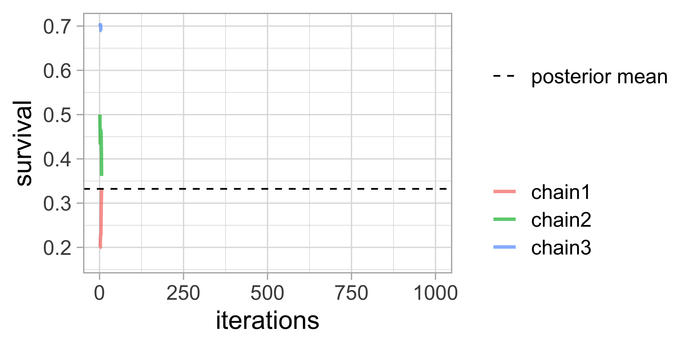

\mainmatter

# (PART) Theory {-}

# Bayesian statistics & MCMC {#crashcourse}

## Introduction

In this first chapter, you will learn what the Bayesian theory is, and how you may use it with a simple example. You will also see how to implement simulation algorithms to implement the Bayesian method for more complex analyses. This is not an exhaustive treatment of Bayesian statistics, but you should get what you need to navigate through the rest of the book. 

## Bayes' theorem

**Ajouter quelque chose sur la démarche scientifique?**

Let's not wait any longer and jump into it. Bayesian statistics relies on the Bayes' theorem named after Reverend Bayes. **expliquer avec des mots ce que fait ce théorème, puis donner la formule mathématique**

```{r, echo = FALSE, fig.align="center", out.width="70%", fig.cap = "Cartoon of Thomas Bayes with Bayes' theorem in background. Source: [James Kulich](https://www.elmhurst.edu/blog/thomas-bayes/)"}
knitr::include_graphics("images/amazing-thomas-bayes-illustration.jpg")
```

The Bayes' theorem states that for events $A$ and $B$, we have:
$$\Pr(A \mid B) = \displaystyle{\frac{ \Pr(B \mid A) \; \Pr(A)}{\Pr(B)}}$$
It is all about conditional probabilities, which are not that easy to understand. **What are conditional probabilities? Link towards nice videos**. 

```{r, echo = FALSE, fig.align="center", fig.cap = "Bayes' theorem spelt out in blue neon at the offices of Autonomy in Cambridge. Source: [Wikipedia](https://en.wikipedia.org/wiki/Bayes%27_theorem)"}
knitr::include_graphics("images/bayes_neon.jpeg")
```

I don't know about you, but I have a hard time not messing the letters around. It is easier to remember Bayes' theorem written like this:

$$ \Pr(\text{hypothesis} \mid \text{data}) = \frac{ \Pr(\text{data} \mid \text{hypothesis}) \; \Pr(\text{hypothesis})}{\Pr(\text{data})} $$
The *hypothesis* is what you want to learn about using the data. For capture-recapture models, the *hypothesis* is a parameter like detection probability, or regression parameters in a relationship between survival probability and a covariate. **Citer Taj Mahr comme source**. Bayes' theorem tells you the probability of the hypothesis given the data. This is great because think about it, what is doing science after all? We'd like to know how plausible is some hypothesis given the data? **dire des trucs sur les termes de droite** In that respect, the Bayesian reasoning matches the scientific reasoning. You might ask then, why is Bayesian statistics not the default in statistics? Clearly, until recently, there were practical problems to implement the Bayesian approach. Recent advances in computational power coupled with the development of new methodology have led to a great increase in the application of Bayesian methods within the last three decades. Also, because of futile wars between (male) statisticians, little progress was made for over two centuries. **en dire un peu plus sur ces guerres**

## What is the Bayesian approach?	

Typical statistical problems involve estimating parameter(s) $\theta$ with available data. To do so, you might be more used to the frequentist rather than the Bayesian method. The frequentist approach, and in particular maximum likelihood estimation (MLE), assumes that the parameters are fixed, and have unknown values to be estimated. Therefore classical estimates are generally point estimates of the parameters of interest. In contrast, the Bayesian approach assumes that the parameters are not fixed but have some fixed  unknown distribution -- a distribution for the parameter. **qu'entend-on par distribution?**

The Bayesian approach is based upon the idea that you, the experimenter, begin with some prior beliefs about the system. In other words, you never start from scratch. Then you collect data and update your prior beliefs on the basis of observations. These observations might arise from field or lab work. This updating process is based upon the Bayes' theorem which we've seen earlier: 

$$\Pr(A \mid B) = \frac{\Pr(B \mid A) \; \Pr(A)}{\Pr(B)}$$
Loosely, let's say $A = \theta$ and $B = \text{data}$, then the Bayes' theorem gives you a way to estimate parameter $\theta$ given the data you have. Indeed, the formula becomes:

$${\color{red}{\Pr(\theta \mid \text{data})}} = \frac{\color{blue}{\Pr(\text{data} \mid \theta)} \; \color{green}{\Pr(\theta)}}{\color{orange}{\Pr(\text{data})}}.$$
Let's spend some time going through each quantity in this formula. 

On the left-hand side, we have the $\color{red}{\text{posterior distribution}}$. It represents what you know after having seen the data. This is the basis for inference and clearly what you're after, a distribution, possibly multivariate if you have more than one parameter. 

On the right-hand side, there is the $\color{blue}{\text{likelihood}}$. This quantity is the same as in the MLE approach. It captures the information you have in your data, given a model parameterized with $\theta$. 

Then we have the $\color{green}{\text{prior distribution}}$. This quantity represents what you know before seeing the data. This is the source of much discussion about the Bayesian approach. We'll get back to it at length. 

Last, we have $\color{orange}{\Pr(\text{data}) = \int{L(\text{data} \mid \theta)\Pr(\theta) d\theta}}$ which is a $N$-dimensional integral if $\theta = \theta_1, \ldots, \theta_N$. This quantity is difficult, if not impossible, to calculate. This is one of the reasons why the Bayesian method wasn't used until recently. And this is the reason why we need simulation algorithms to estimate posterior distributions. **simulation ou stochastic algorithms? si stochastic, expliquer**

## Approximating posterior distributions via numerical integration

Let's take an example. Say we capture, mark and release $n = 57$ animals at the beginning of a winter, out of which we recapture $y = 19$ animals alive^[We used this example in King et al. 2009]. We'd like to estimate winter survival $\theta$.
```{r}
y <- 19 # nb of success
n <- 57 # nb of attempts
```

**Préciser quelque part qu'on prend formalisme McElreath pour présenter les modèles**. We build our model first. Assuming all animals are independent of each other and have the same survival probability, then the number of alive animals at the end of the winter is a binomial distribution:
  
\begin{align*}
y &\sim \text{Binomial}(n, \theta) &\text{[likelihood]}
\end{align*}

In the Bayesian approach, priors are part of the model. For parameters that are probabilities, we often go for the uniform distribution $U(0,1)$. **vague prior (or non-informative?), voir dans d'autres bouquins; expliquer equiprobabilité, et renvoyer à la section où on en dit plus**

\begin{align*}
\theta &\sim \text{Beta}(1, 1) &\text{[prior for }\theta \text{]}
\end{align*}

```{r, echo = FALSE}
a <- 1; b <- 1; grid <- seq(0,1,0.01); prior <- dbeta(grid,a,b)
dfprior <- data.frame(survival = grid, prior = prior) 
#dfprior %>%
#  ggplot() + 
#  geom_line(aes(x = p, y = prior), 
#            size = 1.5,
#            color = wesanderson::wes_palettes$Royal1[1])
#plot(p, dbeta(p,a,b), type='l', lwd=3)
```

Now we apply the Bayes' theorem. We write a function that computes the product of the likelihood times the prior, or the numerator in the formula of the Bayes' theorem: $\Pr(\text{data} \mid \theta) \; \Pr(\theta)$
```{r}
numerator <- function(p) dbinom(y,n,p) * dbeta(p,a,b)
```

We write another function that calculates the denominator, which we sometimes call the averaged likelihood: $\Pr(\text{data}) = \int{L(\theta \mid \text{data}) \; \Pr(\theta) d\theta}$
```{r}
denominator <- integrate(numerator,0,1)$value
```

Then we get the posterior via numerical integration. 
```{r, echo = TRUE, fig.cap = "Numerical approximation of winter survival posterior distribution."}
grid <- seq(0, 1, 0.01)
numerical_posterior <- data.frame(survival = grid, 
                                  posterior = numerator(grid)/denominator) 
numerical_posterior %>%
  ggplot() + 
  geom_line(aes(x = survival, y = posterior), 
            size = 1.5, 
            col = wes_palettes$Royal1[2], 
            alpha = 0.5)
```

When we use a binomial likelihood together with a uniform prior, the posterior distribution has an explicit form that we can calculate by hand^[**faire qqch sur conjugacy?**]. We superimpose the exact posterior and its numerical approximation to realise that the two distributions are indistinguishable, suggestion that the numerical approximation is more than fine. 
```{r, echo = FALSE, fig.cap = "Comparison of exact (dashed line) vs. numerical approximation (continuous line) of winter survival posterior distribution."}
explicit_posterior <- dbeta(grid, y + a, n - y + b)
dfexpposterior <- data.frame(survival = grid, explicit_posterior = explicit_posterior)
ggplot() + 
  geom_line(data = numerical_posterior, 
            aes(x = survival, y = posterior), 
            size = 1.5, 
            col = wesanderson::wes_palettes$Royal1[2],
            alpha = 0.5) + 
  geom_line(data = dfexpposterior, 
            aes(x = survival, y = explicit_posterior),
            size = 1.5, 
            col = wesanderson::wes_palettes$Royal1[3], 
            linetype = "dashed")
```

<!-- To finish up, let's add the prior.  -->
<!-- ```{r, echo = FALSE} -->
<!-- ggplot() +  -->
<!--   geom_line(data = numerical_posterior,  -->
<!--             aes(x = survival, y = posterior),  -->
<!--             size = 1.5,  -->
<!--             col = wesanderson::wes_palettes$Royal1[2],  -->
<!--             alpha = 0.5) +  -->
<!--   geom_line(data = dfexpposterior,  -->
<!--             aes(x = survival, y = explicit_posterior), -->
<!--             col = wesanderson::wes_palettes$Royal1[3],  -->
<!--             size = 1.5,  -->
<!--             linetype = "dashed") +  -->
<!--   geom_line(data = dfprior, -->
<!--             aes(x = survival, y = prior), -->
<!--             col = wesanderson::wes_palettes$Royal1[1], -->
<!--             size = 1.5) -->
<!-- ``` -->

In this example, we have a single parameter to estimate. This means dealing with a one-dimensional integral which is pretty easy with a quadrature scheme and the `R` function `integrate()`. Now what if we had multiple parameters? For example, let's imagine you'd like to fit a capture-recapture model with detection probability $p$ and regression parameters $\alpha$ and $\beta$ for the intercept and slope of a relationship between survival probability and a covariate, then Bayes' theorem gives you the posterior distribution of all three parameters together:

$$ P(\alpha, \beta, p \mid \text{data}) = \frac{ P(\text{data} \mid \alpha, \beta, p) \, P(\alpha, \beta, p)}{\iiint \, P(\text{data} \mid \alpha, \beta, p) \, P(\alpha, \beta, p) \,d\alpha \,d\beta \,dp} $$
There are two computational challenges with this formula. First, do we really wish to calculate a three-dimensional integral? The answer is no **dire pourquoi, et qu'on a rien dans R pour faire ça**. Second, we're more interested in a posterior distribution for each parameter separately than the joint posterior distribution. The so-called marginal distribution of $p$ for example is obtained by integrating over all the other parameters -- a two-dimensional integral in this example. Now imagine with tens or hundreds of parameters to estimate, these integrals become highly multi-dimensional and simply too difficult to calculate. In the next section, we introduce powerful simulation methods to circumvent this issue. 

## Bayesian computation with Markov chain Monte Carlo (MCMC)

In the early 1990s, statisticians rediscovered work from the 1950's in physics. In a famous paper that would lay the fundations of algorithms for implementing Bayes' theorem, the authors use simulations to approximate posterior distributions with some precision by drawing large samples. This is a neat trick to avoid explicit calculation of multi-dimensional integrals we struggle with when using Bayes' theorem. These simulation algorithms are called Markov chain Monte Carlo (MCMC), and they definitely gave a boost to Bayesian statistics. **simulation algorithm ou stochastic algorithms. Expliquer.**

```{r, echo = FALSE, fig.align='center', fig.cap = "MCMC article cover. Source: [The Journal of Chemical Physics](https://aip.scitation.org/doi/10.1063/1.1699114)"}
knitr::include_graphics("images/metropolis.png")
```

Why are MCMC methods so useful? Well to understand *why*, we need to better explain the *what*. MCMC are stochastic algorithms to produce sequence of dependent random numbers from a Markov chain. What is a Markov chain? A Markov chain is a discrete sequence of states, in which the probability of an event depends only on the state in the previous event. **donner example de la météo?** By construction, a Markov chain has an equilibrium (also know as stationary) distribution. **expliquer** The cool thing is that the equilibrium distribution is the desired posterior distribution. Yes, MCMC algorithms are used to construct a Markov chain with a given stationary distribution set to be the posterior distribution. This summarizes the core spirit of MCMC algorithms. 
**why is it so cool? plutôt que de simuler comme des dingues dans tous les snes, il suffit de tirer dans Markov chain, et eventuellement, on converge vers distribution statitionnaire qui est l'a posteriori! Also For the MCMC algorithm, the posterior distribution is only needed to be known up to proportionality.**

There are several ways of constructing these chains: e.g., Metropolis-Hastings, Gibbs sampler. Here I will illustrate the Metropolis algorithm and how to implement it in practice.

Let's go back to our example on animal survival estimation. We illustrate sampling from survival posterior distribution. We write functions for likelihood, prior and posterior.

```{r}
# 19 animals recaptured alive out of 57 captured, marked and released
survived <- 19
released <- 57

# binomial log-likelihood function
loglikelihood <- function(x, p){
  dbinom(x = x, size = released, prob = p, log = TRUE)
}

# uniform prior density
logprior <- function(p){
  dunif(x = p, min = 0, max = 1, log = TRUE)
}

# posterior density function (log scale)
posterior <- function(x, p){
  loglikelihood(x, p) + logprior(p) # - log(Pr(data))
}
```

The Metropolis algorithm works as follows: **pour chaque étape, donner l'intuition**
  
1. We start at any possible value of the parameter to be estimated. 

2. To decide where to visit next, we propose to move away from the current value of the parameter -- this is a *candidate* value. To do so, we add to the current value some random value from (say) a normal distribution with some variance.
  
3. We compute the ratio of the probabilities at the candidate and current locations $R = \text{posterior(candidate)/posterior(current)}$. This is where the magic of MCMC happens, in that $\Pr(\text{data})$, the denominator of the Bayes' theorem, cancels out and does not need to be calculated. 

4. We spin a continuous spinner that lands anywhere from 0 to 1 -- call it the random spin $X$. If $X$ is smaller than $R$, we move to the candidate location, otherwise we remain at the current location.
  
5. We repeat 2-4 a number of times -- or *steps* (many steps).

Enough of the theory, let's implement the Metropolis algorithm in `R`. Let's start by setting the scene. 
```{r}
steps <- 100 # number of steps
theta.post <- rep(NA, steps) # vector to store samples
set.seed(1234) # for reproducibility
```

Now we follow the 5 steps we've just described. First, we pick a starting value, and store it (step 1).
```{r}
inits <- 0.5
theta.post[1] <- inits
```

To go to the next steps, we'll need a function to propose a candidate value. 
```{r}
move <- function(x, away = .2){ 
  logitx <- log(x / (1 - x))
  logit_candidate <- logitx + rnorm(1, 0, away)
  candidate <- plogis(logit_candidate)
  return(candidate)
}
```

Now we're ready for steps 2, 3 and 4. Actually, we will write a look to take care of step 5 as well. Remember we start at initial value 0.5 and run the algorithm for $100$ iterations.
```{r}
for (t in 2:steps){ # repeat steps 2-4 (step 5)
  
  # propose candidate value for prob of success (step 2)
  theta_star <- move(theta.post[t-1])
  
  # calculate ratio R (step 3)
  pstar <- posterior(survived, p = theta_star)  
  pprev <- posterior(survived, p = theta.post[t-1])
  logR <- pstar - pprev
  R <- exp(logR)
  
  # accept candidate value or keep current value (step 4)
  accept <- rbinom(1, 1, prob = min(R, 1))
  theta.post[t] <- ifelse(accept == 1, theta_star, theta.post[t-1])
}
```

We get the following values. 
```{r}
head(theta.post) # first values
tail(theta.post) # last values
```

Visually, the chain looks like that. **introduire traceplot?**
```{r, echo = FALSE, fig.align='center', fig.cap = "Visualisation of a Markov chain, often called traceplot. Starting value is 0.5."}
df <- data.frame(x = 1:steps, y = theta.post)
df %>%
  ggplot() +
  geom_line(aes(x = x, y = y), size = 1.5, color = wesanderson::wes_palettes$Zissou1[1]) + 
  labs(x = "iterations", y = "samples") + 
  ylim(0.1, 0.6)
```

Can we run another chain and start at initial value 0.2 this time? Yes, just go through the same algorithm again. 
```{r, echo = FALSE, fig.align='center', fig.cap = "Visualisation of two Markov chains with starting values 0.2 (yellow) and 0.5 (blue)."}

# pick starting value (step 1)
inits <- 0.2
theta.post2 <- rep(NA, steps)
theta.post2[1] <- inits

for (t in 2:steps){ # repeat steps 2-4 (step 5)
  # propose candidate value for prob of success (step 2)
  theta_star <- move(theta.post2[t-1])
  # calculate ratio R (step 3)
  pstar <- posterior(survived, p = theta_star)  
  pprev <- posterior(survived, p = theta.post[t-1])
  logR <- pstar - pprev
  R <- exp(logR)
  
  # decide to accept candidate value or to keep current value (step 4)
  accept <- rbinom(1, 1, prob = min(R, 1))
  theta.post2[t] <- ifelse(accept == 1, theta_star, theta.post2[t-1])
}

df2 <- data.frame(x = 1:steps, y = theta.post2)
ggplot() +
  geom_line(data = df, aes(x = x, y = y), size = 1.5, color = wesanderson::wes_palettes$Zissou1[1]) + 
  geom_line(data = df2, aes(x = x, y = y), size = 1.5, color = wesanderson::wes_palettes$Zissou1[3]) + 
  labs(x = "iterations", y = "values from posterior distribution") + 
  ylim(0.1, 0.6)
```

Notice that we do not get the same exact results. **Stochasticity, mais on average, seems to reach same value and vary aournd it -- equilibrium? Stationary? posterior of winter survival** Now let's increase the number of steps and run a chain with 5000 iterations.
```{r, echo = FALSE, fig.align='center', fig.cap = "Visualisation of a Markov chains with 5000 iterations."}
# set up the scene
steps <- 5000
theta.post <- rep(NA, steps)
set.seed(1234)

# pick starting value (step 1)
inits <- 0.5
theta.post[1] <- inits

for (t in 2:steps){ # repeat steps 2-4 (step 5)
  
  # propose candidate value for prob of success (step 2)
  theta_star <- move(theta.post[t-1])
  
  # calculate ratio R (step 3)
  pstar <- posterior(survived, p = theta_star)  
  pprev <- posterior(survived, p = theta.post[t-1])
  logR <- pstar - pprev
  R <- exp(logR)
  
  # decide to accept candidate value or to keep current value (step 4)
  accept <- rbinom(1, 1, prob = min(R, 1))
  theta.post[t] <- ifelse(accept == 1, theta_star, theta.post[t-1])
}

df <- data.frame(x = 1:steps, y = theta.post)
df %>%
  ggplot() +
  geom_line(aes(x = x, y = y), size = 1, color = wesanderson::wes_palettes$Zissou1[1]) + 
  labs(x = "iterations", y = "values from posterior distribution") + 
  ylim(0.1, 0.6) + 
  geom_hline(aes(yintercept = mean(theta.post)), 
             color = wesanderson::wes_palettes$Zissou1[3],
             size = 1.2) + 
  geom_hline(aes(yintercept = 19/57), 
             color = wesanderson::wes_palettes$Zissou1[5],
             size = 1.2)
```

We also add two straight lines, one in yellow for the mean of the posterior distribution **dire comment c'est calculé**, and the other in red for the maximum likelihood estimate **c'est quoi ici?**. **expliquer pourquoi, et noter que ça donne la même chose**. 

I find it informative to look at the animated version of this figure, it helps understanding the iterative nature of the algorithm, and also to realise how the chains converge to their stationary distribution.

```{r echo = FALSE, eval = FALSE}
# load packages
library(tidyverse)
theme_set(theme_light(base_size = 16))
library(gganimate)
library(magick)

# deer data, 19 "success" out of 57 "attempts"
survived <- 19
released <- 57

# log-likelihood function
loglikelihood <- function(x, p){
  dbinom(x = x, size = released, prob = p, log = TRUE)
}

# prior density
logprior <- function(p){
  dunif(x = p, min = 0, max = 1, log = TRUE)
}

# posterior density function (log scale)
posterior <- function(x, p){
  loglikelihood(x, p) + logprior(p) # - log(Pr(data))
}

# propose candidate value
move <- function(x, away = .2){ 
  logitx <- log(x / (1 - x))
  logit_candidate <- logitx + rnorm(1, 0, away)
  candidate <- plogis(logit_candidate)
  return(candidate)
}

metropolis <- function(steps = 100, inits = 0.5){
  
  # pre-alloc memory
  theta.post <- rep(NA, steps)
  
  # start
  theta.post[1] <- inits
  
  for (t in 2:steps){
    
    # propose candidate value for prob of success
    theta_star <- move(theta.post[t-1])
    
    # calculate ratio R
    pstar <- posterior(survived, p = theta_star)  
    pprev <- posterior(survived, p = theta.post[t-1])
    logR <- pstar - pprev
    R <- exp(logR)
    
    # decide to accept candidate value or to keep current value
    accept <- rbinom(1, 1, prob = min(R, 1))
    theta.post[t] <- ifelse(accept == 1, theta_star, theta.post[t-1])
  }
  theta.post
}

#---------- apply Metropolis

steps <- 1000
chain1 <- metropolis(steps = steps, inits = 0.2)
chain2 <- metropolis(steps = steps, inits = 0.5)
chain3 <- metropolis(steps = steps, inits = 0.7)

df <- data.frame(iter = rep(1:steps, 3), 
                 value = c(chain1, chain2, chain3),
                 chain = c(rep("chain1", steps), 
                           rep("chain2", steps), 
                           rep("chain3", steps)))

#---------- time series
static_tsplot <- df %>%
  mutate(posterior_mean = mean(value)) %>%
  ggplot(aes(x = iter, y = value, group = chain, color = chain)) +
  geom_line(size = 1, alpha = 0.7) + 
  geom_hline(aes(yintercept = posterior_mean, linetype = "posterior mean")) + 
  scale_linetype_manual(name = "", values = c(2,2)) + 
  labs(color = "", x = "iterations", y = "survival")
static_tsplot  
  
# animate
animated_tsplot <- static_tsplot +
  transition_reveal(along = iter, 
                    range = as.integer(c(1, max(df$iter) + 50))) # trick to pause
animated_tsplot  

# save
a_gif <- animate(animated_tsplot,
                 width = 6, 
                 height = 3,
                 res = 600,
                 units = "in")

# get file in directory str(a_gif)

#---------- histogram

# histogram
static_hist <- df %>% 
  mutate(posterior_mean = mean(value)) %>%
  split(.$iter) %>% 
  accumulate(~ bind_rows(.x, .y)) %>% 
  bind_rows(.id = "frame") %>% 
  mutate(frame = as.integer(frame)) %>%
  ggplot(aes(x = value, fill = chain)) +
  geom_histogram(color = "white", bins = 15, alpha = 0.7, position = "identity") + 
  labs(x = "survival", y = "samples", fill = "") +
  geom_vline(aes(xintercept = posterior_mean), lty = 2)
static_hist

# animate
anim_hist <- static_hist + 
  transition_manual(frame) +
  ease_aes("linear") +
  enter_fade() +
  exit_fade()

anim_hist

# save
b_gif <- animate(anim_hist,
                 width = 6, 
                 height = 3,
                 res = 600,
                 units = "in")

# get file in directory str(b_gif)
```


```{r, echo = FALSE, out.width="100%", fig.align='center'}

```
```{r, echo = FALSE, out.width="100%", fig.align='center', fig.cap = "Sampling values in survival posterior distribution with a MCMC algorithm. Top panel: traceplot. Bottom panel: histogram."}
knitr::include_graphics("images/histMCMC.gif")
```

**Introduire l'idée de grass, note de bas de page vers Steve Brooks comm pers, et transition vers next section avec l'idée de comment on regarde la convergence** Once the stationary distribution is reached, we can regard the realisations of the chain as a (dependent) sample from the posterior distribution (and obtain Monte Carlo estimates). In the next section, we consider several important implementation issues. **coder Metropolis d'au-dessus dans Nimble**

## Assessing convergence

**Les principales questions on doit répondre pour check convergence. Noter qu'en freq c'est plus ou moins fait en backstage. En MCMC pas grand chose pour automatiser.**

### Mixing and autocorrelation
  
```{r, echo = FALSE}
# from https://bookdown.org/content/3686/markov-chain-monte-carlo.html
# specify the data, to be used in the likelihood function.
my_data <- c(rep(0, 38), rep(1, 19))

# define the Bernoulli likelihood function, p(D|theta).
# the argument theta could be a vector, not just a scalar
likelihood <- function(theta, data) {
  z <- sum(data)
  n <- length(data)
  p_data_given_theta <- theta^z * (1 - theta)^(n - z)
  # the theta values passed into this function are generated at random,
  # and therefore might be inadvertently greater than 1 or less than 0.
  # the likelihood for theta > 1 or for theta < 0 is zero
  p_data_given_theta[theta > 1 | theta < 0] <- 0
  return(p_data_given_theta)
}

# define the prior density function. 
prior_d <- function(theta) {
  p_theta <- dbeta(theta, 1, 1)
  # the theta values passed into this function are generated at random,
  # and therefore might be inadvertently greater than 1 or less than 0.
  # the prior for theta > 1 or for theta < 0 is zero
  p_theta[theta > 1 | theta < 0] = 0
  return(p_theta)
}

# define the relative probability of the target distribution, 
# as a function of vector theta. for our application, this
# target distribution is the unnormalized posterior distribution
target_rel_prob <- function(theta, data) {
  target_rel_prob <- likelihood(theta, data) * prior_d(theta)
  return(target_rel_prob)
}

# specify the length of the trajectory, i.e., the number of jumps to try:
traj_length <- 10000 # this is just an arbitrary large number

# initialize the vector that will store the results
trajectory <- rep(0, traj_length)

# specify where to start the trajectory:
trajectory[1] <- 0.01 # another arbitrary value

# specify the burn-in period
burn_in <- ceiling(0.0 * traj_length) # arbitrary number, less than `traj_length`

# initialize accepted, rejected counters, just to monitor performance:
n_accepted <- 0
n_rejected <- 0

my_metropolis <- function(proposal_sd) {
  
  # now generate the random walk. the 't' index is time or trial in the walk.
  # specify seed to reproduce same random walk
  set.seed(47405)
  
  
  ## I'm taking this section out and will replace it
  
  # # specify standard deviation of proposal distribution
  # proposal_sd <- c(0.02, 0.2, 2.0)[2]
  
  ## end of the section I took out
  
  
  for (t in 1:(traj_length - 1)) {
    current_position <- trajectory[t]
    # use the proposal distribution to generate a proposed jump
    proposed_jump <- rnorm(1, mean = 0, sd = proposal_sd)
    # compute the probability of accepting the proposed jump
    prob_accept <- min(1,
                       target_rel_prob(current_position + proposed_jump, my_data)
                       / target_rel_prob(current_position, my_data))
    # generate a random uniform value from the interval [0, 1] to
    # decide whether or not to accept the proposed jump
    if (runif(1) < prob_accept) {
      # accept the proposed jump
      trajectory[t + 1] <- current_position + proposed_jump
      # increment the accepted counter, just to monitor performance
      if (t > burn_in) {n_accepted <- n_accepted + 1}
    } else {
      # reject the proposed jump, stay at current position
      trajectory[t + 1] <- current_position
      # increment the rejected counter, just to monitor performance
      if (t > burn_in) {n_rejected <- n_rejected + 1}
    }
  }
  
  # extract the post-burn_in portion of the trajectory
  accepted_traj <- trajectory[(burn_in + 1) : length(trajectory)]
  
  tibble(accepted_traj = accepted_traj,
         n_accepted    = n_accepted, 
         n_rejected    = n_rejected)
  # end of Metropolis algorithm
  
}

d <-
  tibble(proposal_sd = c(0.02, 0.2, 2.0)) %>% 
  mutate(accepted_traj = map(proposal_sd, my_metropolis)) %>% 
  unnest(accepted_traj)

d <-
  d %>% 
  mutate(proposal_sd = str_c("Proposal SD = ", proposal_sd),
         iter        = rep(1:traj_length, times = 3))

trace <- d %>% 
  ggplot(aes(y = accepted_traj, x = iter)) +
  geom_path(size = 1/4, color = "steelblue") +
  geom_point(size = 1/2, alpha = 1/2, color = "steelblue") +
  scale_y_continuous(expression(theta), breaks = 0:5 * 0.1, limits = c(0.15, 0.5)) +
  scale_x_continuous("", breaks = seq(traj_length-traj_length*10/100,traj_length,by = 600), limits = c(traj_length-traj_length*10/100, traj_length)) +
  facet_wrap(~proposal_sd, ncol = 3) +
  theme_light(base_size = 14)
library(forecast)
plot1 <- ggAcf(x = d$accepted_traj[d$proposal_sd=="Proposal SD = 0.02"], main = "") + 
  theme_light(base_size = 14)
plot2 <- ggAcf(x = d$accepted_traj[d$proposal_sd=="Proposal SD = 0.2"], main = "") + 
  theme_light(base_size = 14)
plot3 <- ggAcf(x = d$accepted_traj[d$proposal_sd=="Proposal SD = 2"], main = "") + 
  theme_light(base_size = 14)
library(patchwork)
trace / (plot1 + plot2 + plot3)
```

+ The movement around the parameter space is often referred to as **mixing**.

+ Traceplots of for small and big moves provide (relatively) high correlations (known as autocorrelations) between successive observations of the Markov chain.

+ Strongly correlated observations require large sample sizes and therefore longer simulations.

+ Autocorrelation function (ACF) plots are a convenient way of displaying the strength of autocorrelation in the given sample values.

+ ACF plots provide the autocorrelation between successively sampled values separated by $k$ iterations, referred to as lag, (i.e. $\text{cor}(\theta_t, \theta_{t+k})$) for increasing values of $k$.

### How do good chains behave? 
  
+ Converge to same target distribution; discard some realisations of Markov chain before convergence is achieved.

+ Once there, explore efficiently: The post-convergence sample size required for suitable numerical summaries.

+ Therefore, we are looking to determine how long it takes for the Markov chain to converge to the stationary distribution.

+ In practice, we must discard observations from the start of the chain and just use observations from the chain once it has converged.

+ The initial observations that we discard are referred to as the **burn-in**.

+ Simplest method to determine length of burn-in period is to look at trace plots.

### Burn-in
  
```{r, echo = FALSE}

# set up the scene
steps <- 1000
theta.post <- rep(NA, steps)
set.seed(1234)

# pick starting value (step 1)
inits <- 0.99
theta.post[1] <- inits

for (t in 2:steps){ # repeat steps 2-4 (step 5)
  
  # propose candidate value for prob of success (step 2)
  theta_star <- move(theta.post[t-1], away = 0.1)
  
  # calculate ratio R (step 3)
  pstar <- posterior(survived, p = theta_star)  
  pprev <- posterior(survived, p = theta.post[t-1])
  logR <- pstar - pprev
  R <- exp(logR)
  
  # decide to accept candidate value or to keep current value (step 4)
  accept <- rbinom(1, 1, prob = min(R, 1))
  theta.post[t] <- ifelse(accept == 1, theta_star, theta.post[t-1])
}

df <- data.frame(x = 1:steps, y = theta.post)
df %>%
  ggplot() +
  geom_line(aes(x = x, y = y), size = 1.2, color = wesanderson::wes_palettes$Zissou1[1]) + 
  labs(x = "iterations", y = "values from posterior distribution") + 
  theme_light(base_size = 14) + 
  annotate("rect", 
           xmin = 0, 
           xmax = 500, 
           ymin = 0.1, 
           ymax = 1, 
           alpha = .3) +
  scale_y_continuous(expand = c(0,0))
```

If simulations cheap, be conservative.

### Effective sample size `n.eff`
  
* How long of a chain is needed to produce stable estimates ?
* Most MCMC chains are strongly autocorrelated.
* Successive steps are near each other, and are not independent. 
* The effective sample size (`n.eff`) measures chain length while taking into account the autocorrelation of the chain.
* `n.eff` is less than the number of MCMC iterations.
* Check the `n.eff` of every parameter of interest.
* Check the `n.eff` of any interesting parameter combinations.
* We need $\text{n.eff} \geq 100$ independent steps. 

### Potential scale reduction factor
  
+ Gelman-Rubin statistic $\hat{R}$
+ Measures the ratio of the total variability combining multiple chains (between-chain plus within-chain) to the within-chain variability. 
+ Asks the question is there a chain effect? Very much alike the $F$ test in an ANOVA. 
+ Values near $1$ indicates likely convergence, a value of $\leq 1.1$ is considered acceptable.
+ Necessary condition, not sufficient; In other words, these diagnostics cannot tell you that you have converged for sure, only that you have not. 

### What if you have issues of convergence?
  
+ Increase burn-in, sample more.
+	Use more informative priors.
+ Pick better initial values (good guess), using e.g. estimates from simpler models.
+ Reparameterize: 
+ Standardize covariates.
+ Non-centering: $\alpha \sim N(0,\sigma)$ becomes $\alpha = z \sigma$ with $z \sim N(0,1)$.
+	Something wrong with your model? 
+ Start with a simpler model (remove complexities). 
+ Use simulations. 
+ Change your sampler. More later on. 


## Summary
  
+ Run multiple chains from arbitrary starting places (initial values).
+ Assume convergence when all chains reach same regime
+ Discard initial burn-in phase.
+ Proceed with posterior inference. 
+ Use traceplot, effective sample size and $\hat{R}$.

**Takes some trainig**

## Further reading

+ McCarthy, M. (2007). [Bayesian Methods for Ecology](https://www.cambridge.org/core/books/bayesian-methods-for-ecology/9225F65B8A25D69B0B6C50B5A9A78201). Cambridge: Cambridge University Press.

+ McElreath, R. (2020). [Statistical Rethinking: A Bayesian Course with Examples in R and Stan (2nd ed.)](https://xcelab.net/rm/statistical-rethinking/). CRC Press.

+ Gelman, A. and Hill, J. (2006). [Data Analysis Using Regression and Multilevel/Hierarchical Models (Analytical Methods for Social Research)](https://www.cambridge.org/core/books/data-analysis-using-regression-and-multilevelhierarchical-models/32A29531C7FD730C3A68951A17C9D983). Cambridge: Cambridge University Press.

+ Animating MCMC - 2D example; Code [here](https://mbjoseph.github.io/posts/2018-12-25-animating-the-metropolis-algorithm/).
  
```{r}
knitr::include_graphics("images/create-gif.gif")
```

+ The MCMC Interactive Gallery (more [here](https://chi-feng.github.io/mcmc-demo/))
  
```{r}
knitr::include_graphics("images/galery.png")
```

