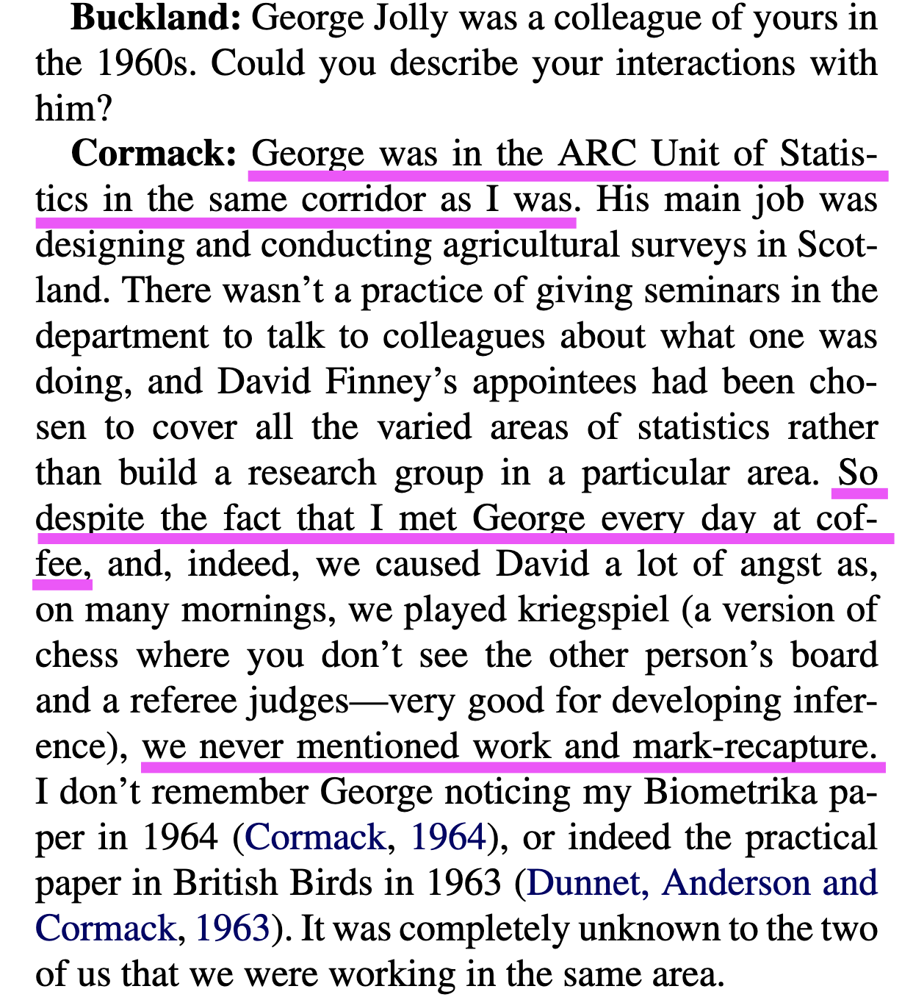
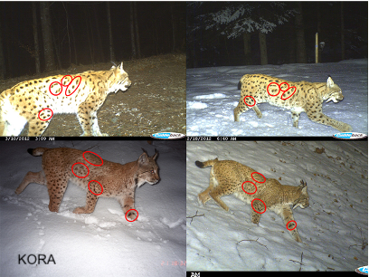

--- 
title: "Bayesian Analysis of Capture-Recapture Data with Hidden Markov Models"
subtitle: "Theory and Case Studies in R"
author: "Olivier Gimenez"
date: "`r Sys.Date()`"
documentclass: krantz
bibliography: [book.bib]
#biblio-style: apalike
link-citations: yes
colorlinks: yes
lot: yes
lof: yes
fontsize: 12pt
site: bookdown::bookdown_site
description: "This is a textbook on the analysis of capture-recapture data with hidden Markov models (HMM) implemented in the Bayesian framework with R."
url: 'https\://oliviergimenez.github.io/bayesian-cr-workshop/'
github-repo: oliviergimenez/banana-book
header-includes: 
  - \usepackage{tikz}
  - \usepackage{pgfplots}
  - \usepackage{blkarray}
---
```{r include=FALSE, cache=FALSE}
# packages
library(tidyverse)
theme_set(theme_light())
library(nimble)
library(MCMCvis)
library(magick)
library(pdftools)
library(wesanderson)
#library(basicMCMCplots)

# R options
options(width = 60)

# chunk options
knitr::opts_chunk$set(
  comment = "##",
  collapse = TRUE,
  warning = FALSE,
  message = FALSE
  )
```

<!-- bookdown::render_book("index.Rmd", "bookdown::pdf_book") -->

```{r setup, include=FALSE}
options(
#  htmltools.dir.version = FALSE, 
  formatR.indent = 2,
  width = 55, 
  digits = 4, 
  warnPartialMatchAttr = FALSE, 
  warnPartialMatchDollar = FALSE
)
```

# Welcome {-}

Welcome to the online version of the book *Bayesian Analysis of Capture-Recapture Data with Hidden Markov Models – Theory and Case Studies in R*. <!-- The book is also available in [PDF format](https://github.com/oliviergimenez/banana-book/raw/master/docs/bayesHMMcapturerecapture.pdf). -->

The HMM framework has gained much attention in the ecological literature over the last decade, and has been suggested as a general modelling framework for the demography of plant and animal populations. In particular, HMMs are increasingly used to analyse capture-recapture data and estimate key population parameters (e.g., survival, dispersal, recruitment or abundance) with applications in all fields of ecology. 

In parallel, Bayesian statistics is well established and fast growing in ecology and related disciplines, because it resonates with scientific reasoning and allows accommodating uncertainty smoothly. The popularity of Bayesian statistics also comes from the availability of free pieces of software (WinBUGS, OpenBUGS, JAGS, Stan, NIMBLE) that allow practitioners to code their own analyses.

This book offers a Bayesian treatment of HMMs applied to capture-recapture data. You will learn to use the R package NIMBLE which is seen by many as the future of Bayesian statistical ecology to deal with complex models and/or big data. An important part of the book consists in case studies presented in a tutorial style to abide by the “learning by doing” philosophy.

I'm currently writing this book, and I welcome any feedback. You may raise an issue [here](https://github.com/oliviergimenez/banana-book/issues), amend directly the R Markdown file that generated the page you're reading by clicking on the 'Edit this page' icon in the right panel, or [email me](mailto:olivier.gimenez@cefe.cnrs.fr). Many thanks!

Olivier Gimenez, Montpellier, France  
Last updated: `r Sys.setlocale("LC_TIME", "C"); format(Sys.Date(), "%B %d, %Y")`

## License {-}

The online version of this book is licensed under the [Creative Commons Attribution-NonCommercial-NoDerivatives 4.0 International License](http://creativecommons.org/licenses/by-nc-nd/4.0/). 

The code is public domain, licensed under [Creative Commons CC0 1.0 Universal (CC0 1.0)](https://creativecommons.org/publicdomain/zero/1.0/).


<!--chapter:end:index.Rmd-->

```{r include=FALSE, cache=FALSE}
# packages
library(tidyverse)
theme_set(theme_light())
library(nimble)
library(MCMCvis)
library(magick)
library(pdftools)
library(wesanderson)
#library(basicMCMCplots)

# R options
options(width = 60)

# chunk options
knitr::opts_chunk$set(
  comment = "##",
  collapse = TRUE,
  warning = FALSE,
  message = FALSE
  )
```
# Preface {-}

## Why this book? {-}

**To be completed.** Why and what of capture-recapture data and models, with fields of application.^[Watch out nice Johnny Ball's video https://www.youtube.com/watch?v=tyX79mPm2xY.] Brief history of capture-recapture, with switch to state-space/hidden Markov model (HMM) formulation. Flexibility of HMM to decompose complex problems in smaller pieces that are easier to understand, model and analyse. From satellite guidance to conservation of endangered species. Why Bayes? Also three of my fav research topics -- capture-recapture, HMM and Bayes statistics -- let's enjoy this great cocktail together. 

## Who should read this book? {-}

This book is aimed at beginners who're comfortable using R and write basic code (including loops), as well as connoisseurs of capture-recapture who'd like to tap into the power of the Bayesian side of statistics. For both audiences, thinking in the HMM framework will help you in confidently building models and make the most of your capture-recapture data. 

## What will you learn? {-}

The book is divided into five parts. The first part is aimed at getting you up-to-speed with Bayesian statistics, NIMBLE, and hidden Markov models. The second part will teach you all about capture-recapture models for open populations, with reproducible R code to ease the learning process. In the third part, we will focus on issues in inferring states (dealing with uncertainty in assignment, modelling waiting time distribution). The fourth part provides real-world case studies from the scientific literature that you can reproduce using material covered in previous chapters. These problems can either i) be used to cement and deepen your understanding of methods and models, ii) be adapted for your own purpose, or iii) serve as teaching projects. The fifth and last chapter closes the book with take-home messages and recommendations, a list of frequently asked questions and references cited in the book. **Likely to be amended after feedbacks.**

## What won't you learn? {-}

There is hardly any maths in this book. The equations I use are either simple enough to be understood without a background in maths, or can be skipped without prejudice. I do not cover Bayesian statistics or even hidden Markov models fully, I provide just what you need to work with capture-recapture data. If you are interested in knowing more about these topics, hopefully the section Suggested reading at the end of each chapter will put you in the right direction. There are also a number of important topics specific to capture-recapture that I do not cover, including closed-population capture-recapture models [@WilliamsEtAl2002], and spatial capture-recapture models [@RoyleEtAl2013book]. These models can be treated as HMMs, but for now the usual formulation is just fine.  **There will be spatial considerations in the Covariates chapter w/ splines and CAR. I'm not sure yet about SCR models (R. Glennie's Biometrics paper on HMMs and open pop SCR will not be easy to Bayes transform and implement in NIMBLE).**

## Prerequisites {-}

This book uses primarily the R package NIMBLE, so you need to install at least R and NIMBLE. A bunch of other R packages are used. You can install them all at once by running:

```{r, echo = FALSE, cache = FALSE}
deps <- desc::desc_get_deps()
pkgs <- sort(deps$package[deps$type == "Imports"])
pkgs2 <- strwrap(paste(encodeString(pkgs, quote = '"'), collapse = ", "), exdent = 2)
install <- paste0(
  "install.packages(c(\n  ", 
  paste(pkgs2, "\n", collapse = ""), 
  "))"
)
```

```{r code = install, eval = FALSE}
```

## Acknowledgements {-}

**To be completed.**

## How this book was written {-}

I am writing this book in [RStudio](http://www.rstudio.com/ide/) using [bookdown](http://bookdown.org/). The [book website](https://oliviergimenez.github.io/banana-book) is hosted with [GitHub Pages](https://pages.github.com/), and automatically updated after every push by [Github Actions](https://github.com/features/actions). The source is available from [GitHub](https://github.com/oliviergimenez/banana-book).

The version of the book you're reading was built with `r R.version.string` and the following packages:

```{r, echo = FALSE, results="asis"}
pkgs <- sessioninfo::package_info(pkgs, dependencies = FALSE)
df <- tibble(
  package = pkgs$package,
  version = pkgs$ondiskversion,
  source = gsub("@", "\\\\@", pkgs$source)
)
knitr::kable(df, format = "markdown")
```

```{r, echo = FALSE}
ruler <- function(width = getOption("width")) {
  x <- seq_len(width)
  y <- dplyr::case_when(
    x %% 10 == 0 ~ as.character((x %/% 10) %% 10),
    x %% 5 == 0  ~ "+",
    TRUE         ~ "-"
  )
  cat(y, "\n", sep = "")
  cat(x %% 10, "\n", sep = "")
}
```

```{r, include = FALSE}
ruler()
```

<!--chapter:end:preface.Rmd-->

```{r include=FALSE, cache=FALSE}
# packages
library(tidyverse)
theme_set(theme_light())
library(nimble)
library(MCMCvis)
library(magick)
library(pdftools)
library(wesanderson)
#library(basicMCMCplots)

# R options
options(width = 60)

# chunk options
knitr::opts_chunk$set(
  comment = "##",
  collapse = TRUE,
  warning = FALSE,
  message = FALSE
  )
```
# About the author {-}

My name is Olivier Gimenez (https://oliviergimenez.github.io/). I am a senior (euphemism for not so young anymore) scientist at the National Centre for Scientific Research (CNRS) in the beautiful city of Montpellier, France. 

I struggled studying maths, obtained a PhD in applied statistics a long time ago in a galaxy of wine and cheese. I was awarded my habilitation (https://en.wikipedia.org/wiki/Habilitation) in ecology and evolution so that I could stop pretending to understand what my colleagues were talking about. More recently I embarked in sociology studies because hey, why not. 

Lost somewhere at the interface of animal ecology, statistical modeling and social sciences, my so-called expertise lies in population dynamics and species distribution modeling to address questions in ecology and conservation biology about the impact of human activities and the management of large carnivores. I would be nothing without the students and colleagues who are kind enough to bear with me.

You may find me on Twitter (https://twitter.com/oaggimenez), GitHub (https://github.com/oliviergimenez), or get in touch [by email](mailto:olivier.gimenez@cefe.cnrs.fr).

<!--chapter:end:author.Rmd-->

```{r include=FALSE, cache=FALSE}
# packages
library(tidyverse)
theme_set(theme_light())
library(nimble)
library(MCMCvis)
library(magick)
library(pdftools)
library(wesanderson)
#library(basicMCMCplots)

# R options
options(width = 60)

# chunk options
knitr::opts_chunk$set(
  comment = "##",
  collapse = TRUE,
  warning = FALSE,
  message = FALSE
  )
```
\mainmatter

# (PART) I. Fundations {-}

# Introduction {-}


<!--chapter:end:introductionpartone.Rmd-->

```{r include=FALSE, cache=FALSE}
# packages
library(tidyverse)
theme_set(theme_light())
library(nimble)
library(MCMCvis)
library(magick)
library(pdftools)
library(wesanderson)
#library(basicMCMCplots)

# R options
options(width = 60)

# chunk options
knitr::opts_chunk$set(
  comment = "##",
  collapse = TRUE,
  warning = FALSE,
  message = FALSE
  )
```
# Bayesian statistics & MCMC {#crashcourse}

**Add visual explanation of credible intervals, plus histogram and density plot for posterior distribution**

## Introduction

In this first chapter, you will learn what the Bayesian theory is, and how you may use it with a simple example. You will also see how to implement simulation algorithms to implement the Bayesian method for more complex analyses. This is not an exhaustive treatment of Bayesian statistics, but you should get what you need to navigate through the rest of the book. 

## Bayes' theorem

Let's not wait any longer and jump into it. Bayesian statistics relies on the Bayes' theorem (or law, or rule, whatever you prefer) named after Reverend Thomas Bayes (Figure \@ref(fig:revbayes)). This theorem was published in 1763 two years after Bayes' death thanks to his friend's efforts Richard Price, and was independently discovered by Pierre-Simon Laplace [@mcgrayne2011]. 

```{r revbayes, echo = FALSE, fig.align="center", out.width="100%", fig.cap = "Cartoon of Thomas Bayes with Bayes' theorem in background. Source: [James Kulich](https://www.elmhurst.edu/blog/thomas-bayes/)"}
knitr::include_graphics("images/amazing-thomas-bayes-illustration.jpg")
```

As we will see in a minute, Bayes' theorem is all about conditional probabilities, which are somehow tricky to understand. Conditional probability of outcome or event A given event B, which we denote $\Pr(A \mid B)$, is the probability that A occurs, revised by considering the additional information that event B has occurred.^[For example, a friend of yours rolls a fair dice and asks you the probability that the outcome was a six (event A). Your answer is 1/6 because each side of the dice is equally likely to come up. Now imagine that you're told the number rolled was even (event B) before you answer your friend's question. Because there are only three even numbers, one of which is six, you may revise your answer for the probability that a six was rolled from 1/6 to $\Pr(A \mid B) = 1/3$.] The order in which A and B appear is important, make sure you do not confuse $\Pr(A \mid B)$ and $\Pr(B \mid A)$.

Bayes' theorem (Figure \@ref(fig:bayestheorem)) gives you $\Pr(A \mid B)$ using marginal probabilities $\Pr(A)$ and $\Pr(B)$ and $\Pr(B \mid A)$:
$$\Pr(A \mid B) = \displaystyle{\frac{ \Pr(B \mid A) \; \Pr(A)}{\Pr(B)}}.$$
Originally, Bayes' theorem was seen as a way to infer an unkown cause A of a particular effect B, knowing the probability of effect B given cause A. Think for example of a situation where a medical diagnosis is needed, with A an unkown disease and B symptoms, the doctor knows P(symptoms|disease) and wants to derive P(disease|symptoms). This way of reversing $\Pr(B \mid A)$ into $\Pr(A \mid B)$ explains why Bayesian thinking used to be referred to as 'inverse probability'. 

```{r bayestheorem, echo = FALSE, fig.align="center", fig.cap = "Bayes' theorem spelt out in blue neon. Source: [Wikipedia](https://en.wikipedia.org/wiki/Bayes%27_theorem)"}
knitr::include_graphics("images/bayes_neon.jpeg")
```

I don't know about you, but I need to think twice for not messing the letters around. I find it easier to remember Bayes' theorem written like this^[When teaching Bayes' theorem, I am very much inspired by Tristan Mahr's slides from his introduction to Bayesian regression https://www.tjmahr.com/bayes-intro-lecture-slides-2017/]:

$$ \Pr(\text{hypothesis} \mid \text{data}) = \frac{ \Pr(\text{data} \mid \text{hypothesis}) \; \Pr(\text{hypothesis})}{\Pr(\text{data})} $$
```{block2 bayes, type='rmdnote'}
The *hypothesis* is a working assumption about which you want to learn using *data*. In capture--recapture analyses, the hypothesis might be a parameter like detection probability, or regression parameters in a relationship between survival probability and a covariate. Bayes' theorem tells us how to obtain the probability of a hypothesis given the data we have. 
```

This is great because think about it, this is exactly what the scientific method is! We'd like to know how plausible some hypothesis is based on some data we collected, and possibly compare several hypotheses among them. In that respect, the Bayesian reasoning matches the scientific reasoning, which probably explains why the Bayesian framework is so natural for doing and understanding statistics. 

You might ask then, why is Bayesian statistics not the default in statistics? Clearly, because of futile wars between male statisticians (including Ronald Fisher, Jerzy Neyman and Egon Sharpe Pearson among others), little progress was made for over two centuries. Also, until recently, there were practical problems to implement Bayes' theorem. Recent advances in computational power coupled with the development of new algorithms have led to a great increase in the application of Bayesian methods within the last three decades.

## What is the Bayesian approach?	

Typical statistical problems involve estimating a parameter (or several parameters) $\theta$ with available data. To do so, you might be more used to the frequentist rather than the Bayesian method. The frequentist approach, and in particular maximum likelihood estimation (MLE), assumes that the parameters are fixed, and have unknown values to be estimated. Therefore classical estimates are generally point estimates of the parameters of interest. In contrast, the Bayesian approach assumes that the parameters are not fixed, and have some unknown distribution^[A probability distribution is a mathematical expression that gives the probability for a random variable to take particular values. A probability distribution may be either discrete (e.g., the Bernoulli, Binomial or Poisson distribution) or continuous (e.g., the Gaussian distribution also known as the normal distribution)].

The Bayesian approach is based upon the idea that you, as an experimenter, begin with some prior beliefs about the system. Then you collect data and update your prior beliefs on the basis of observations. These observations might arise from field work, lab work or from expertise of your esteemed colleagues. This updating process is based upon Bayes' theorem. Loosely, let's say $A = \theta$ and $B = \text{data}$, then Bayes' theorem gives you a way to estimate parameter $\theta$ given the data you have:

$${\color{red}{\Pr(\theta \mid \text{data})}} = \frac{\color{blue}{\Pr(\text{data} \mid \theta)} \times \color{green}{\Pr(\theta)}}{\color{orange}{\Pr(\text{data})}}.$$
Let's spend some time going through each quantity in this formula. 

On the left-hand side is the $\color{red}{\text{posterior distribution}}$. It represents what you know after having seen the data. This is the basis for inference and clearly what you're after, a distribution, possibly multivariate if you have more than one parameter. 

On the right-hand side, there is the $\color{blue}{\text{likelihood}}$. This quantity is the same as in the MLE approach. Yes, the Bayesian and frequentist approaches have the same likelihood at their core, which mostly explains why results often do not differ much. The likelihood captures the information you have in your data, given a model parameterized with $\theta$. 

Then we have the $\color{green}{\text{prior distribution}}$. This quantity represents what you know before seeing the data. This is the source of much discussion about the Bayesian approach. It may be vague if you don't know anything about $\theta$. Usually however, you never start from scratch, and you'd like your prior to reflect the information you have^[Shall I include a section on sensitivity analyses in this chapter or later in the book? Cross-reference section in Survival chapter where prior elicitation is covered.].

Last, we have $\color{orange}{\Pr(\text{data})}$ which is sometimes called the average likelihood because it is obtained by integrating the likelihood with respect to the prior $\color{orange}{\Pr(\text{data}) = \int{L(\text{data} \mid \theta)\Pr(\theta) d\theta}}$ so that the posterior is standardized, that is it integrates to one for the posterior to be a distribution. The average likelihood is an integral with dimension the number of parameters $\theta$ you need to estimate. This quantity is difficult, if not impossible, to calculate in general. This is one of the reasons why the Bayesian method wasn't used until recently, and why we need algorithms to estimate posterior distributions as I illustrate in the next section.

## Approximating posteriors via numerical integration {#numerical-approx}

Let's take an example to illustrate Bayes' theorem. Say we capture, mark and release $n = 57$ animals at the beginning of a winter, out of which we recapture $y = 19$ animals alive^[We used a similar example in @king_bayesian_2009]. We'd like to estimate winter survival $\theta$.
```{r}
y <- 19 # nb of success
n <- 57 # nb of attempts
```

We build our model first. Assuming all animals are independent of each other and have the same survival probability, then $y$ the number of alive animals at the end of the winter is a binomial distribution^[I follow @mcelreathbook and use labels on the right to help remember what each line is about.] with $n$ trials and $\theta$ the probability of success:
  
\begin{align*}
y &\sim \text{Binomial}(n, \theta) &\text{[likelihood]}
\end{align*}

This likelihood can be visualised in `R`: 
```{r binlik, echo = TRUE, fig.cap = "Binomial likelihood with $n = 57$ released animals and $y = 19$ survivors after winter. The value of survival (on the x-axis) that corresponds to the maximum of the likelihood function (on the y-axis) is the MLE, or the proportion of success in this example, close to 0.33."}
grid <- seq(0, 1, 0.01) # grid of values for survival
likelihood <- dbinom(y, n, grid) # compute binomial likelihood
df <- data.frame(survival = grid, likelihood = likelihood) 
df %>%
  ggplot() + 
  aes(x = survival, y = likelihood) + 
  geom_line(size = 1.5)
```

Besides the likelihood, priors are another component of the model in the Bayesian approach. For a parameter that is a probability, the one thing we know is that the prior should be a continuous random variable that lies between 0 and 1. To reflect that, we often go for the uniform distribution $U(0,1)$ to imply *vague* priors. Here vague means that survival has, before we see the data, the same probability of falling between 0.1 and 0.2 and between 0.8 and 0.9, for example. 

\begin{align*}
\theta &\sim \text{Uniform}(0, 1) &\text{[prior for }\theta \text{]}
\end{align*}

```{r, echo = FALSE}
a <- 1; b <- 1; grid <- seq(0,1,0.01); prior <- dbeta(grid,a,b)
dfprior <- data.frame(survival = grid, prior = prior) 
#dfprior %>%
#  ggplot() + 
#  geom_line(aes(x = p, y = prior), 
#            size = 1.5,
#            color = wesanderson::wes_palettes$Royal1[1])
#plot(p, dbeta(p,a,b), type='l', lwd=3)
```

Now we apply Bayes' theorem. We write a `R` function that computes the product of the likelihood times the prior, or the numerator in Bayes' theorem: $\Pr(\text{data} \mid \theta) \times \Pr(\theta)$
```{r}
numerator <- function(theta) dbinom(y, n, theta) * dunif(theta, 0, 1)
```

We write another function that calculates the denominator, the average likelihood: $\Pr(\text{data}) = \int{L(\theta \mid \text{data}) \Pr(\theta) d\theta}$
```{r}
denominator <- integrate(numerator,0,1)$value
```

We use the `R` function `integrate` to calculate the integral in the denominator, which implements quadrature techniques to divide in little squares the area underneath the curve delimited by the function to integrate (here the numerator), and count them.

Then we get a numerical approximation of the posterior in Figure \@ref(fig:numapprox) by applying Bayes' theorem. 
```{r numapprox, echo = TRUE, fig.cap = "Winter survival posterior distribution obtained by numerical integration."}
grid <- seq(0, 1, 0.01) # grid of values for theta
numerical_posterior <- data.frame(survival = grid, 
                                  posterior = numerator(grid)/denominator) # Bayes' theorem
numerical_posterior %>%
  ggplot() +
  aes(x = survival, y = posterior) + 
  geom_line(size = 1.5)
```

How good is our numerical approximation of survival posterior distribution? Ideally, we would want to compare the approximation to the true posterior distribution. Although a closed-form expression for the posterior distribution is in general intractable, when you combine a binomial likelihood together with a beta distribution as a prior, then the posterior distribution is also a beta distribution, which makes it amenable to all sorts of exact calculations^[We say that the beta distribution is the conjugate prior distribution for the binomial distribution.]. The beta distribution is continuous between 0 and 1, and extends the uniform distribution to situations where not all outcomes are equally likely. It has two parameters $a$ and $b$ that control its shape (Figure \@ref(fig:betadistribution)).

(ref:captionbeta) The distribution beta($a$,$b$) for different values of $a$ and $b$. Note that for $a = b = 1$, we get the uniform distribution between 0 and 1 in the top left panel. When $a$ and $b$ are equal, the distribution is symmetric, and the bigger $a$ and $b$, the more peaked the distribution or the smaller the variance. 

```{r betadistribution, echo = FALSE, fig.cap='(ref:captionbeta)'}
x <- seq(0, 1, length=200)
par(mfrow = c(2,3))
# distribution a posteriori beta
plot(x,dbeta(x, 1, 1),type='l',xlab='',ylab='Density',main='beta(1,1)',lwd=3,col='black',ylim=c(0,1.5))
plot(x,dbeta(x, 2, 1),type='l',xlab='',ylab='',main='beta(2,1)',lwd=3,col='black',ylim=c(0,2))
plot(x,dbeta(x, 1, 2),type='l',xlab='',ylab='',main='beta(1,2)',lwd=3,col='black',ylim=c(0,2))
plot(x,dbeta(x, 2, 2),type='l',xlab='',ylab='Density',main='beta(2,2)',lwd=3,col='black',ylim=c(0,1.5))
plot(x,dbeta(x, 10, 10),type='l',xlab='',ylab='',main='beta(10,10)',lwd=3,col='black',ylim=c(0,3.5))
plot(x,dbeta(x, 0.8, 0.8),type='l',xlab='',ylab='',main='beta(0.8,0.8)',lwd=3,col='black',ylim=c(0.5,2.5))
```

If the likelihood of the data $y$ is binomial with $n$ trials and probability of success $\theta$, and the prior is a beta distribution with parameters $a$ and $b$, then the posterior is a beta distribution with parameters $a + y$ and $b + n - y$^[**provide a sketch of the proof**]. In our example, we have $n = 57$ trials and $y = 19$ animals that survived and a uniform prior between 0 and 1 or a beta distribution with parameters $a = b = 1$, therefore survival has a beta posterior distribution with parameters 20 and 39. In Figure \@ref(fig:compar), we superimpose the exact posterior and the numerical approximation. Clearly, the two distributions are indistinguishable, suggesting that the numerical approximation is more than fine. 
```{r compar, echo = FALSE, fig.cap = "Comparison of exact (dashed line) vs. numerical approximation (continuous line) of winter survival posterior distribution."}
explicit_posterior <- dbeta(grid, y + a, n - y + b)
dfexpposterior <- data.frame(survival = grid, explicit_posterior = explicit_posterior)
ggplot() + 
  geom_line(data = numerical_posterior, 
            aes(x = survival, y = posterior), 
            size = 1.5, 
            col = wesanderson::wes_palettes$Royal1[2],
            alpha = 0.5) + 
  geom_line(data = dfexpposterior, 
            aes(x = survival, y = explicit_posterior),
            size = 1.5, 
            col = wesanderson::wes_palettes$Royal1[3], 
            linetype = "dashed")
```

<!-- To finish up, let's add the prior.  -->
<!-- ```{r, echo = FALSE} -->
<!-- ggplot() +  -->
<!--   geom_line(data = numerical_posterior,  -->
<!--             aes(x = survival, y = posterior),  -->
<!--             size = 1.5,  -->
<!--             col = wesanderson::wes_palettes$Royal1[2],  -->
<!--             alpha = 0.5) +  -->
<!--   geom_line(data = dfexpposterior,  -->
<!--             aes(x = survival, y = explicit_posterior), -->
<!--             col = wesanderson::wes_palettes$Royal1[3],  -->
<!--             size = 1.5,  -->
<!--             linetype = "dashed") +  -->
<!--   geom_line(data = dfprior, -->
<!--             aes(x = survival, y = prior), -->
<!--             col = wesanderson::wes_palettes$Royal1[1], -->
<!--             size = 1.5) -->
<!-- ``` -->

In our example, we have a single parameter to estimate, winter survival. This means dealing with a one-dimensional integral in the denominator which is pretty easy with quadrature techniques and the `R` function `integrate()`. Now what if we had multiple parameters? For example, imagine you'd like to fit a capture-recapture model with detection probability $p$ and regression parameters $\alpha$ and $\beta$ for the intercept and slope of a relationship between survival probability and a covariate, then Bayes' theorem gives you the posterior distribution of all three parameters together:

$$ \Pr(\alpha, \beta, p \mid \text{data}) = \frac{ \Pr(\text{data} \mid \alpha, \beta, p) \times \Pr(\alpha, \beta, p)}{\iiint \, \Pr(\text{data} \mid \alpha, \beta, p) \Pr(\alpha, \beta, p) d\alpha d\beta dp} $$
There are two computational challenges with this formula. First, do we really wish to calculate a three-dimensional integral? The answer is no, one-dimensional and two-dimensional integrals are so much further we can go with standard methods. Second, we're more interested in a posterior distribution for each parameter separately than the joint posterior distribution. The so-called marginal distribution of $p$ for example is obtained by integrating over all the other parameters -- a two-dimensional integral in this example. Now imagine with tens or hundreds of parameters to estimate, these integrals become highly multi-dimensional and simply intractable. In the next section, I introduce powerful simulation methods to circumvent this issue. 

## Markov chain Monte Carlo (MCMC)

In the early 1990s, statisticians rediscovered work from the 1950's in physics. In a famous paper that would lay the fundations of modern Bayesian statistics (Figure \@ref(fig:mcmcpaper)), the authors use simulations to approximate posterior distributions with some precision by drawing large samples. This is a neat trick to avoid explicit calculation of the multi-dimensional integrals we struggle with when using Bayes' theorem. 

```{r mcmcpaper, echo = FALSE, fig.align='center', fig.cap = "MCMC article cover. Source: [The Journal of Chemical Physics](https://aip.scitation.org/doi/10.1063/1.1699114)"}
knitr::include_graphics("images/metropolis.png")
```

These simulation algorithms are called Markov chain Monte Carlo (MCMC), and they definitely gave a boost to Bayesian statistics. There are two parts in MCMC, Markov chain and Monte Carlo, let's try and make sense of these terms. 

### Monte Carlo integration

What does Monte Carlo stand for? Monte Carlo integration is a simulation technique to calculate integrals of any function $f$ of random variable $X$ with distribution $\Pr(X)$ say $\int f(X) \Pr(X)dX$. You draw values $X_1,\ldots,X_k$ from $\Pr(X)$ the distribution of $X$, apply function $f$ to these values, then calculate the mean of these new values $\displaystyle{\frac{1}{k}}\sum_{i=1}^k{f(X_i)}$ to approximate the integral. How is Monte Carlo integration used in a Bayesian context? The posterior distribution contains all the information we need about the parameter to be estimated. When dealing with many parameters however, you may want to summarise posterior results by calculating numerical summaries. The simplest numerical summary is the mean of the posterior distribution, $E(\theta) = \int \theta \Pr(\theta|\text{data})$, where $X$ is $\theta$ now and $f$ is the identity function. Posterior mean can be calculated with Monte Carlo integration:
```{r}
sample_from_posterior <- rbeta(1000, 20, 39) # draw 1000 values from posterior survival beta(20,39)
mean(sample_from_posterior) # compute mean with Monte Carlo integration
```

You may check that the mean we have just calculated matches closely the expectation of a beta distribution^[If $X$ is a random variable with distribution $\text{beta}(a, b)$, then $E(X) = \displaystyle{\frac{a}{a + b}}$]:
```{r}
20/(20+39) # expectation of beta(20,39)
```

Another useful numerical summary is the credible interval within which our parameter falls with some probability, usually 0.95 hence a 95$\%$ credible interval. Finding the bounds of a credible interval requires calculating quantiles, which in turn involves integrals and the use of Monte Carlo integration. A 95$\%$ credible interval for winter survival can be obtained in `R` with:
```{r}
quantile(sample_from_posterior, probs = c(2.5/100, 97.5/100))
```

### Markov chains

What is a Markov chain? A Markov chain is a random sequence of numbers, in which each number depends only on the previous number. An example is the weather in my home town in Southern France, Montpellier, in which a sunny day is most likely to be followed by another sunny day, say with probability 0.8, and a rainy day is rarely followed by another rainy day, say with probability 0.1. The dynamic of this Markov chain is captured by the transition matrix $\mathbf{\Gamma}$:
$$
\begin{matrix}
& \\
\mathbf{\Gamma} = 
    \left ( \vphantom{ \begin{matrix} 12 \\ 12 \end{matrix} } \right .
\end{matrix}
\hspace{-1.2em}
\begin{matrix}
    \text{sunny tomorrow} & \text{rainy tomorrow} \\ 
0.8 & 0.2 \\ 
0.9 & 0.1 \\ 
\end{matrix}
\hspace{-0.2em}
\begin{matrix}
& \\
\left . \vphantom{ \begin{matrix} 12 \\ 12 \\ 12 \end{matrix} } \right )
    \begin{matrix}
    \text{sunny today} \\ \text{rainy today}
    \end{matrix}
\end{matrix}
$$
In rows the weather today, and in columns the weather tomorrow. The cells give the probability of a sunny or rainy day tomorrow, given the day is sunny or rainy today. Under certain conditions^[The Markov chain is irreducible and aperiodic.], a Markov chain will converge to a unique stationary distribution. In our weather example, let's run the Markov chain for 20 steps:
```{r}
weather <- matrix(c(0.8, 0.2, 0.9, 0.1), nrow = 2, byrow = T) # transition matrix
steps <- 20
for (i in 1:steps){
  weather <- weather %*% weather # matrix multiplication
}
round(weather, 2) # matrix product after 20 steps
```

Each row of the transition matrix converges to the same distribution $(0.82, 0.18)$ as the number of steps increases. Convergence happens no matter which state you start in, and you always have probability 0.82 of the day being sunny and 0.18 of the day being rainy. 

Back to MCMC, the core idea is that you can build a Markov chain with a given stationary distribution set to be the desired posterior distribution. 

```{block2 mcmc, type='rmdnote'}
Putting Monte Carlo and Markov chains together, MCMC allows us to generate a sample of values (Markov chain) whose distribution converges to the posterior distribution, and we can use this sample of values to calculate any posterior summaries (Monte Carlo), such as posterior means and credible intervals. 
```

### Metropolis algorithm {#metropolis-algorithm}

There are several ways of constructing Markov chains for Bayesian inference^[You might have heard about the Metropolis-Hastings or the Gibbs sampler. Have a look to <https://github.com/chi-feng/mcmc-demo> for an interactive gallery of MCMC algorithms.]. Here I illustrate the Metropolis algorithm and how to implement it in practice^[This presentation is largely inspired by @alberthu2019].

Let's go back to our example on animal survival estimation. We illustrate sampling from survival posterior distribution. We write functions for likelihood, prior and posterior.

```{r}
# 19 animals recaptured alive out of 57 captured, marked and released
survived <- 19
released <- 57

# binomial log-likelihood function
loglikelihood <- function(x, p){
  dbinom(x = x, size = released, prob = p, log = TRUE)
}

# uniform prior density
logprior <- function(p){
  dunif(x = p, min = 0, max = 1, log = TRUE)
}

# posterior density function (log scale)
posterior <- function(x, p){
  loglikelihood(x, p) + logprior(p) # - log(Pr(data))
}
```

The Metropolis algorithm works as follows: 
  
1. We pick a value of the parameter to be estimated. This is where we start our Markov chain -- this is a *starting* value. 

2. To decide where to go next, we propose to move away from the current value of the parameter -- this is a *candidate* value. To do so, we add to the current value some random value from e.g. a normal distribution with some variance -- this is a *proposal* distribution. The Metropolis algorithm is a particular case of the Metropolis-Hastings algorithm with symmetric proposals.
  
3. We compute the ratio of the probabilities at the candidate and current locations $R=\displaystyle{\frac{{\Pr(\text{candidate}|\text{data})}}{{\Pr(\text{current}|\text{data})}}}$. This is where the magic of MCMC happens, in that $\Pr(\text{data})$, the denominator in the Bayes' theorem, appears in both the numerator and the denominator in $R$ therefore cancels out and does not need to be calculated. 

<!-- -- *the Hastings ratio* -->

4. If the posterior at the candidate location $\Pr(\text{candidate}|\text{data})$ is higher than at the current location $\Pr(\text{current}|\text{data})$, in other words when the candidate value is more plausible than the current value, we definitely accept the candidate value. If not, then we accept the candidate value with probability $R$ and reject with probability $1-R$. For example, if the candidate value is ten times less plausible than the current value, then we accept with probability 0.1 and reject with probability 0.9. How does it work in practice? We use a continuous spinner that lands somewhere between 0 and 1 -- call the random spin $X$. If $X$ is smaller than $R$, we move to the candidate location, otherwise we remain at the current location.  We do not want to accept or reject too often. In practice, the Metropolis algorithm should have an acceptance probability between 0.2 and 0.4, which can be achieved by *tuning* the variance of the normal proposal distribution. 
  
5. We repeat 2-4 a number of times -- or *steps*.

Enough of the theory, let's implement the Metropolis algorithm in `R`. Let's start by setting the scene. 
```{r}
steps <- 100 # number of steps
theta.post <- rep(NA, steps) # vector to store samples
accept <- rep(NA, steps) # keep track of accept/reject
set.seed(1234) # for reproducibility
```

Now follow the 5 steps we've just described. First, we pick a starting value, and store it (step 1).
```{r}
inits <- 0.5
theta.post[1] <- inits
accept[1] <- 1
```

Then, we need a function to propose a candidate value. We add a value taken from a normal distribution with mean zero and standard deviation we call *away*. We work on the logit scale to make sure the candidate value for survival lies between 0 and 1. 
```{r}
move <- function(x, away = 1){ # by default, standard deviation of the proposal distribution is 1
  logitx <- log(x / (1 - x)) # apply logit transform (-infinity,+infinity)
  logit_candidate <- logitx + rnorm(1, 0, away) # add a value taken from N(0,sd=away) to current value
  candidate <- plogis(logit_candidate) # back-transform (0,1)
  return(candidate)
}
```

Now we're ready for steps 2, 3 and 4. We write a loop to take care of step 5. We start at initial value 0.5 and run the algorithm for 100 steps or iterations. 
```{r}
for (t in 2:steps){ # repeat steps 2-4 (step 5)
  
  # propose candidate value for survival (step 2)
  theta_star <- move(theta.post[t-1])
  
  # calculate ratio R (step 3)
  pstar <- posterior(survived, p = theta_star)  
  pprev <- posterior(survived, p = theta.post[t-1])
  logR <- pstar - pprev # likelihood and prior are on the log scale
  R <- exp(logR)
  
  # accept candidate value or keep current value (step 4)
  X <- runif(1, 0, 1) # spin continuous spinner
  if (X < R){
    theta.post[t] <- theta_star # accept candidate value
    accept[t] <- 1 # accept
  }
  else{
    theta.post[t] <- theta.post[t-1] # keep current value
    accept[t] <- 0 # reject
  }
}
```

We get the following values. 
```{r}
head(theta.post) # first values
tail(theta.post) # last values
```

Visually, you may look at the chain in Figure \@ref(fig:chain) called a trace plot.
```{r chain, echo = FALSE, fig.align='center', fig.cap = "Visualisation of a Markov chain starting at value 0.5, with steps or iterations on the x-axis, and samples on the y-axis. This graphical representation is called a trace plot."}
df <- data.frame(x = 1:steps, y = theta.post)
df %>%
  ggplot() +
  geom_line(aes(x = x, y = y), size = 1.5, color = wesanderson::wes_palettes$Zissou1[1]) + 
  labs(x = "iterations", y = "samples") + 
  ylim(0.1, 0.6)
```

The acceptance probability is the average number of times we accepted a candidated value, which is `r mean(accept)` and almost satisfying. 

```{r echo = FALSE}
# log-likelihood function
loglikelihood <- function(x, p){
  dbinom(x = x, size = released, prob = p, log = TRUE)
}

# prior density
logprior <- function(p){
  dunif(x = p, min = 0, max = 1, log = TRUE)
}

# posterior density function (log scale)
posterior <- function(x, p){
  loglikelihood(x, p) + logprior(p) # - log(Pr(data))
}

# propose candidate value
move <- function(x, away = .2){ 
  logitx <- log(x / (1 - x))
  logit_candidate <- logitx + rnorm(1, 0, away)
  candidate <- plogis(logit_candidate)
  return(candidate)
}

metropolis <- function(steps = 100, inits = 0.5, away = 1){
  
  # pre-alloc memory
  theta.post <- rep(NA, steps)
  
  # start
  theta.post[1] <- inits
  
  for (t in 2:steps){
    
    # propose candidate value for prob of success
    theta_star <- move(theta.post[t-1], away = away)
    
    # calculate ratio R
    pstar <- posterior(survived, p = theta_star)  
    pprev <- posterior(survived, p = theta.post[t-1])
    logR <- pstar - pprev
    R <- exp(logR)
    
    # accept candidate value or keep current value (step 4)
    X <- runif(1, 0, 1) # spin continuous spinner
    if (X < R){
      theta.post[t] <- theta_star
    }
    else{
      theta.post[t] <- theta.post[t-1]
    }
  }
  theta.post
}

```


Can we run another chain and start at initial value 0.2 this time? Yes, just go through the same algorithm again, and visualise the results in Figure \@ref(fig:twochains). 
```{r twochains, echo = FALSE, fig.align='center', fig.cap = "Trace plot of survival for two chains starting at 0.2 (yellow) and 0.5 (blue) run for 100 steps."}
theta.post2 <- metropolis(steps = 100, inits = 0.2)
df2 <- data.frame(x = 1:steps, y = theta.post2)
ggplot() +
  geom_line(data = df, aes(x = x, y = y), size = 1.5, color = wesanderson::wes_palettes$Zissou1[1]) + 
  geom_line(data = df2, aes(x = x, y = y), size = 1.5, color = wesanderson::wes_palettes$Zissou1[3]) + 
  labs(x = "iterations", y = "values from posterior distribution") + 
  ylim(0.1, 0.6)
```

Notice that we do not get the exact same results because the algorithm is stochastic. The question is to know whether we have reached the stationary distribution. Let's increase the number of steps and run a chain with 5000 iterations as in Figure \@ref(fig:longchain).
```{r longchain, echo = FALSE, fig.align='center', fig.cap = "Trace plot of survival for a chain starting at 0.5 and 1000 steps."}
steps <- 5000
set.seed(1234)
theta.post <- metropolis(steps = steps, inits = 0.5)
df <- data.frame(x = 1:steps, y = theta.post)
df %>%
  ggplot() +
  geom_line(aes(x = x, y = y), size = 1, color = wesanderson::wes_palettes$Zissou1[1]) + 
  labs(x = "iterations", y = "values from posterior distribution") + 
  ylim(0.1, 0.6) + 
  geom_hline(aes(yintercept = mean(theta.post), linetype = "posterior mean")) + 
  scale_linetype_manual(name = "", values = c(2,2)) 
```

This is what we're after, a trace plot that looks like a beautiful lawn, see Section \@ref(convergence-diag). I find it informative to look at the animated version of Figure \@ref(fig:longchain), it helps understanding the stochastic behavior of the algorithm, and also to realise how the chains converge to their stationary distribution, see Figure \@ref(fig:animlongchain).

```{r echo = FALSE, eval = FALSE}
# load packages
library(tidyverse)
theme_set(theme_light(base_size = 16))
library(gganimate)
library(magick)

# deer data, 19 "success" out of 57 "attempts"
survived <- 19
released <- 57

#---------- apply Metropolis

steps <- 1000
chain1 <- metropolis(steps = steps, inits = 0.2)
chain2 <- metropolis(steps = steps, inits = 0.5)
chain3 <- metropolis(steps = steps, inits = 0.7)

df <- data.frame(iter = rep(1:steps, 3), 
                 value = c(chain1, chain2, chain3),
                 chain = c(rep("chain1", steps), 
                           rep("chain2", steps), 
                           rep("chain3", steps)))

#---------- time series
static_tsplot <- df %>%
  mutate(posterior_mean = mean(value)) %>%
  ggplot(aes(x = iter, y = value, group = chain, color = chain)) +
  geom_line(size = 1, alpha = 0.5) + 
  geom_hline(aes(yintercept = posterior_mean, linetype = "posterior mean")) + 
  scale_linetype_manual(name = "", values = c(2,2)) + 
  labs(color = "", x = "iterations", y = "survival")
static_tsplot  
  
# animate
animated_tsplot <- static_tsplot +
  transition_reveal(along = iter, 
                    range = as.integer(c(1, max(df$iter) + 50))) # trick to pause
animated_tsplot  

# save
a_gif <- animate(animated_tsplot,
                 width = 6, 
                 height = 3,
                 res = 600,
                 units = "in")

# get file in directory str(a_gif)
```
```{r animlongchain, echo = FALSE, out.width="100%", fig.align='center', fig.cap = "Animated trace plot of survival with three chains starting at 0.2, 0.5 and 0.7 run for 1000 steps."}
knitr::include_graphics("images/traceplotMCMC.gif")
```

Once the stationary distribution is reached, you may regard the realisations of the Markov chain as a sample from the posterior distribution, and obtain numerical summaries. In the next section, we consider several important implementation issues. 

## Assessing convergence {#convergence-diag}

```{block2 convergence, type='rmdnote'}
When implementing MCMC, we need to determine how long it takes for our Markov chain to converge to the target distribution, and the number of iterations we need after achieving convergence to get reasonable Monte Carlo estimates of numerical summaries (posterior means and credible intervals).
```

### Burn-in
  
In practice, we discard observations from the start of the Markov chain and just use observations from the chain once it has converged. The initial observations that we discard are usually referred to as the *burn-in*. 

The simplest method to determine the length of the burn-in period is to look at trace plots. Going back to our example, we see from the trace plot in Figure \@ref(fig:burnin) that we need at least 100 iterations to achieve convergence toward an average survival around 0.3. It is always better to be conservative when specifying the length of the burn-in period, and in this example, we would use 250 or even 500 iterations as a burn-in. The length of the burn-in period can be determined by performing preliminary MCMC short runs. 

```{r burnin, echo = FALSE, fig.cap = "Determining the length of the burn-in period. The chain starts at value 0.99 and rapidly stabilises, with values bouncing back and forth around 0.3 from the 100th iteration onwards. You may choose the shaded area as the burn-in, and discard the corresponding values."}

# set up the scene
steps <- 1000
theta.post <- metropolis(steps = steps, inits = 0.99)
df <- data.frame(x = 1:steps, y = theta.post)
df %>%
  ggplot() +
  geom_line(aes(x = x, y = y), size = 1.2, color = wesanderson::wes_palettes$Zissou1[1]) + 
  labs(x = "iterations", y = "survival") + 
  theme_light(base_size = 14) + 
  annotate("rect", 
           xmin = 0, 
           xmax = 100, 
           ymin = 0.1, 
           ymax = 1, 
           alpha = .3) +
  scale_y_continuous(expand = c(0,0))
```

Inspecting the trace plot for a single run of the Markov chain is useful. However, we usually run the Markov chain several times, starting from different over-dispersed points, to check that all runs achieve the same stationary distribution. This approach is formalised by using the Brooks-Gelman-Rubin (BGR) statistic $\hat{R}$ which measures the ratio of the total variability combining multiple chains (between-chain plus within-chain) to the within-chain variability. The BGR statistic asks whether there is a chain effect, and is very much alike the $F$ test in an analysis of variance. Values below 1.1 indicate likely convergence.

```{r, echo = FALSE, cache = TRUE}
simul.bgr <- function(steps, inits){
  
  nb.replicates <- length(inits)
  theta.post <- matrix(NA, nrow = nb.replicates, ncol = steps)
  for (i in 1:nb.replicates){
    theta.post[i,1:steps] <- metropolis(steps = steps, inits = inits[i])
  }
  
  df <- data.frame(x = rep(1:steps, nb.replicates), 
                   y = c(t(theta.post)), 
                   chain = paste0("chain ",gl(nb.replicates, steps))) %>%
    filter(x > round(steps/2)) # apply burnin (half number of iterations)

  # compute BGR (R-hat)
  num <- quantile(df$y, probs = c(20/100, 80/100))[2] - quantile(df$y, probs = c(20/100, 80/100))[1]
  den <- df %>%
    group_by(chain) %>%
    summarise(ci = quantile(y, probs = c(20/100, 80/100))) %>%
    mutate(diff = ci - lag(ci, default = ci[1])) %>%
    filter(diff != 0) %>%
    pull(diff) %>%
    mean()
  
  bgr <- round(num / den, 3)
  return(bgr)
}

set.seed(1234)
steps <- seq(100, 5000, 100)
bgr <- rep(NA, length(steps))
for (i in 1:length(steps)){
  bgr[i] <- simul.bgr(steps = steps[i], inits = c(0.2, 0.8))
}
df <- data.frame(iterations = steps, bgr = bgr)
```

Back to our example, we run two Markov chains with starting values 0.2 and 0.8 using 100 up to 5000 iterations, and calculate the BGR statistic using half the number of iterations as the length of the burn-in. From Figure \@ref(fig:bgr), we get a value of the BGR statistic near 1 by up to 2000 iterations, which suggests that with 2000 iterations as a burn-in, there is no evidence of a lack of convergence. 

```{r bgr, echo=FALSE, fig.cap = "Brooks-Gelman-Rubin statistic as a function of the number of iterations."}
df %>%
  ggplot() + 
  geom_line(aes(x = iterations, y = bgr), size = 1.2) +
  labs(y = "BGR statistic")
```

It is important to bear in mind that a value near 1 for the BGR statistic is only a necessary *but not sufficient* condition for convergence. In other words, this diagnostic cannot tell you for sure that the Markov chain has achieved convergence, only that it has not.^[Cross-reference sections on local minima and parameter redundancy for pathological cases.]

### Chain length
  
```{r, echo = FALSE}
# inspired from https://bookdown.org/content/3686/markov-chain-monte-carlo.html

n_steps <- 10000

d <-
  tibble(away = c(0.1, 1, 10)) %>% 
  mutate(accepted_traj = map(away, metropolis, steps = n_steps, inits = 0.1)) %>% 
  unnest(accepted_traj)

d <-
  d %>% 
  mutate(proposal_sd = str_c("Proposal SD = ", away),
         iter        = rep(1:n_steps, times = 3))

trace <- d %>% 
  ggplot(aes(y = accepted_traj, x = iter)) +
  geom_path(size = 1/4, color = "steelblue") +
  geom_point(size = 1/2, alpha = 1/2, color = "steelblue") +
  scale_y_continuous("survival", breaks = 0:5 * 0.1, limits = c(0.15, 0.5)) +
  scale_x_continuous("iterations", 
                     breaks = seq(n_steps-n_steps*10/100,n_steps,by = 600), 
                     limits = c(n_steps-n_steps*10/100, n_steps)) +
  facet_wrap(~proposal_sd, ncol = 3) +
  theme_light(base_size = 14)

library(forecast)
plot1 <- ggAcf(x = d$accepted_traj[d$proposal_sd=="Proposal SD = 0.1"]) + ggtitle("Proposal SD = 0.1")
plot2 <- ggAcf(x = d$accepted_traj[d$proposal_sd=="Proposal SD = 1"]) + ggtitle("Proposal SD = 1")
plot3 <- ggAcf(x = d$accepted_traj[d$proposal_sd=="Proposal SD = 10"]) + ggtitle("Proposal SD = 10")
```

How long of a chain is needed to produce reliable parameter estimates? To answer this question, you need to keep in mind that successive steps in a Markov chain are not independent -- this is usually referred to as *autocorrelation*. Ideally, we would like to keep autocorrelation as low as possible. Here again, trace plots are useful to diagnose issues with autocorrelation. Let's get back to our survival example. Figure \@ref(fig:tracechainlength) shows trace plots for different values of the standard deviation (parameter *away*) of the (normal) proposal distribution we use to propose a candidate value (Section \@ref(metropolis-algorithm)). Small and big moves provide high correlations between successive observations of the Markov chain, whereas a standard deviation of 1 allows efficient exploration of the parameter space. The movement around the parameter space is referred to as *mixing*. Mixing is bad when the chain makes small and big moves, and good otherwise. 

```{r tracechainlength, echo=FALSE, fig.cap = "Trace plots for different values of the standard deviation (SD) of the proposal distribution. Left: The chain exhibits small moves and mixing is bad. Right: The chain exhibits big moves and mixing is bad. Middle: The chain exhibits adequate moves and mixing is good. Only the thousand last iterations are shown."}
trace
```

In addition to trace plots, autocorrelation function (ACF) plots are a convenient way of displaying the strength of autocorrelation in a given sample values. ACF plots provide the autocorrelation between successively sampled values separated by an increasing number of iterations, or *lag* (Figure \@ref(fig:acfchainlength)).

```{r acfchainlength, echo=FALSE, fig.cap = "Autocorrelation function plots for different values of the standard deviation (SD) of the proposal distribution. Left and right: Autocorrelation is strong, decreases slowly with increasing lag and mixing is bad. Middle: Autocorrelation is weak, decreases rapidly with increasing lag and mixing is good."}
library(patchwork)
(plot1 + plot2 + plot3)
```

Autocorrelation is not necessarily a big issue. Strongly correlated observations just require large sample sizes and therefore longer simulations. But how many iterations exactly? The effective sample size (`n.eff`) measures chain length while taking into account chain autocorrelation. You should check the `n.eff` of every parameter of interest, and of any interesting parameter combinations. In general, we need $\text{n.eff} \geq 1000$ independent steps to get reasonable Monte Carlo estimates of model parameters. In the animal survival example, `n.eff` can be calculated with the R `coda::effectiveSize()` function.
```{r neff, echo = FALSE}
neff1 <- coda::effectiveSize(d$accepted_traj[d$proposal_sd=="Proposal SD = 0.1"])
neff2 <- coda::effectiveSize(d$accepted_traj[d$proposal_sd=="Proposal SD = 1"])
neff3 <- coda::effectiveSize(d$accepted_traj[d$proposal_sd=="Proposal SD = 10"])
df <- tibble("Proposal SD" = c(0.1, 1, 10),
                 "n.eff" = round(c(neff1, neff2, neff3)))
knitr::kable(df, format = "markdown")
```

As expected, `n.eff` is less than the number of MCMC iterations because of autocorrelation. Only when the standard deviation of the proposal distribution is 1 and mixing is good (Figures \@ref(fig:tracechainlength) and \@ref(fig:acfchainlength)) we get a satisfying effective sample size. 

### What if you have issues of convergence?
  
When diagnosing MCMC convergence, you will (very) often run into troubles. In this section you will find some helpful tips I hope. 

When mixing is bad and effective sample size is small, you may just need to increase burn-in and/or sample more. Using more informative priors might also make Markov chains converge faster by helping your MCMC sampler (e.g. the Metropolis algorithm) navigating more efficiently the parameter space. In the same spirit, picking better initial values for starting the chain does not harm. For doing that, a strategy consists in using estimates from a simpler model for which your MCMC chains do converge. 

If convergence issues persist, often there is a problem with your model^[The quote 'When you have computational problems, often there's a problem with your model' is the folk theorem of statistical computing stated by Andrew Gelman in 2008, see https://statmodeling.stat.columbia.edu/2008/05/13/the_folk_theore/]. A bug in the code? A typo somewhere? A mistake in your maths? As often when coding is involved, the issue can be identified by removing complexities, and start with a simpler model until you find what the problem is. 

A general advice is to see your model as a data generating tool in the first place, simulate data from it using some realistic values for the parameters, and try to recover these parameter values by fitting the model to the simulated data. Simulating from a model will help you understanding how it works, what it does not do, and the data you need to get reasonable parameter estimates. 

We will see other strategies to improve convergence in the next chapters.^[Cross reference relevant chapters. Option 1. Change your sampler. Option 2. Reparameterize (standardize covariates, plus non-centering: $\alpha \sim N(0,\sigma)$ becomes $\alpha = z \sigma$ with $z \sim N(0,1)$).]

## Summary

+ With the Bayes' theorem, you update your beliefs (prior) with new data (likelihood) to get posterior beliefs (posterior): posterior $\propto$ likelihood $\times$ prior.

+ The idea of Markov chain Monte Carlo (MCMC) is to simulate values from a Markov chain which has a stationary distribution equal to the posterior distribution you're after. 

+ In practice, you run a Markov chain multiple times starting from over-dispersed initial values. 

+ You discard iterations in an initial burn-in phase and achieve convergence when all chains reach the same regime. 

+ From there, you run the chains long enough and proceed with calculating Monte Carlo estimates of numerical summaries (e.g. posterior means and credible intervals) for parameters.

## Suggested reading

+ Gelman, A. and Hill, J. (2006). [Data Analysis Using Regression and Multilevel/Hierarchical Models (Analytical Methods for Social Research)](https://www.cambridge.org/core/books/data-analysis-using-regression-and-multilevelhierarchical-models/32A29531C7FD730C3A68951A17C9D983). Cambridge: Cambridge University Press.

+ Gelman, A. and colleagues (2020). [Bayesian workflow](https://arxiv.org/pdf/2011.01808.pdf). arXiv preprint. 

+ McCarthy, M. (2007). [Bayesian Methods for Ecology](https://www.cambridge.org/core/books/bayesian-methods-for-ecology/9225F65B8A25D69B0B6C50B5A9A78201). Cambridge: Cambridge University Press.

+ McElreath, R. (2020). [Statistical Rethinking: A Bayesian Course with Examples in R and Stan (2nd ed.)](https://xcelab.net/rm/statistical-rethinking/). CRC Press.


<!--chapter:end:bayesmcmc.Rmd-->

```{r include=FALSE, cache=FALSE}
# packages
library(tidyverse)
theme_set(theme_light())
library(nimble)
library(MCMCvis)
library(magick)
library(pdftools)
library(wesanderson)
#library(basicMCMCplots)

# R options
options(width = 60)

# chunk options
knitr::opts_chunk$set(
  comment = "##",
  collapse = TRUE,
  warning = FALSE,
  message = FALSE
  )
```
# NIMBLE tutorial {#intronimble}

## Introduction

In this second chapter, you will get familiar with NIMBLE, an R package that implements up-to-date MCMC algorithms for fitting complex models. NIMBLE spares you from coding the MCMC algorithms by hand, and requires only the specification of a likelihood and priors for model parameters. We will illustrate NIMBLE main features with a simple example, but the ideas hold for other problems.

## What is NIMBLE?

NIMBLE stands for **N**umerical **I**nference for statistical **M**odels using **B**ayesian and **L**ikelihood **E**stimation. Briefly speaking, NIMBLE is an R package that implements for you MCMC algorithms to generate samples from the posterior distribution of model parameters. Freed from the burden of coding your own MCMC algorithms, you only have to specify a likelihood and priors to apply the Bayes theorem. To do so, NIMBLE uses a syntax very similar to the R syntax, which should make your life easier. This so-called BUGS language is also used by other programs like WinBUGS, OpenBUGS, and JAGS. 

So why use NIMBLE you may ask? The short answer is that NIMBLE is capable of so much more than just running MCMC algorithms! First, you will work from within R, but in the background NIMBLE will translate your code in C++ for (in general) faster computation. Second, NIMBLE extends the BUGS language for writing new functions and distributions of your own, or borrow those written by others. Third, NIMBLE gives you full control of the MCMC samplers, and you may pick other algorithms than the defaults. Fourth, NIMBLE comes with a library of numerical methods other than MCMC algorithms, including sequential Monte Carlo (for particle filtering) and Monte Carlo Expectation Maximization (for maximum likelihood). Last but not least, the development team is friendly and helpful, and based on users' feedbacks, NIMBLE folks work constantly at improving the package capabilities. 

```{r nimblelogo, echo = FALSE, fig.align="center", out.width="50%", fig.cap = "Logo of the NIMBLE R package designed by Luke Larson. **Ask Perry for context and meaning.**"}
knitr::include_graphics("images/nimble-icon.png")
```

## Getting started

```{block2 nimble_workflow, type='rmdnote', eval = FALSE}
To run NIMBLE, you will need to:  
1. Build a model consisting of a likelihood and priors.   
2. Read in some data.   
3. Specify parameters you want to make inference about.   
4. Pick initial values for parameters to be estimated (for each chain).   
5. Provide MCMC details namely the number of chains, the length of the burn-in period and the number of iterations following burn-in.
```

First things first, let's not forget to load the `nimble` package:
```{r}
library(nimble)
```

Note that before you can install `nimble` like any other R package, Windows users will need to install `Rtools`, and Mac users will need to install `Xcode`. More at <https://r-nimble.org/download>. 

Now let's go back to our example on animal survival from the previous chapter. First step is to build our model by specifying the binomial likelihood and a uniform prior on survival probability `theta`. We use the `nimbleCode()` function and wrap code within curly brackets:
```{r}
model <- nimbleCode({
  # likelihood
  survived ~ dbinom(theta, released)
  # prior
  theta ~ dunif(0, 1)
  # derived quantity
  lifespan <- -1/log(theta)
})
```

You can check that the `model` R object contains your code:
```{r}
model
```

In the code above, `survived` and `released` are known, only `theta` needs to be estimated. The line `survived ~ dbinom(theta, released)` states that the number of successes or animals that have survived over winter  `survived` is distributed as (that's the `~`) as a binomial with `released` trials and probability of success or survival `theta`. Then the line `theta ~ dunif(0, 1)` assigns a uniform between 0 and 1 as a prior distribution to the survival probability. This is all you need, a likelihood and priors for model parameters, NIMBLE knows the Bayes theorem. The last line `lifespan <- - 1/log(theta)` calculates a quantity derived from `theta`, which is the expected lifespan assuming constant survival^[Cook LM, Brower LP, Croze HJ (1967) The accuracy of a population estimation from multiple recapture data. J Anim Ecol 36:57–60].

A few comments:    

+ The most common distributions are available in NIMBLE. Among others, we will use later in the book `dbeta`, `dmultinom` and `dnorm`. If you cannot find what you need in NIMBLE, you can write your own distribution as illustrated in Section \@ref(functions-in-nimble).

+ It does not matter in what order you write each line of code, NIMBLE uses what is called a declarative language for building models. In brief, you write code that tells NIMBLE what you want to achieve, and not how to get there. In contrast, an imperative language requires that you write what you want your program to do step by step.

+ You can think of models in NIMBLE as graphs as in Figure \@ref(fig:dag-survival). A graph is made of relations (or edges) that can be of two types. A stochastic relation is signaled by a `~` sign and defines a random variable in the model, such as `survived` or `theta`. A deterministic relation is signaled by a `<-` sign, like `lifespan`. Relations define nodes on the left - the children - in terms of other nodes on the right - the parents, and relations are directed edges from parents to children. Such graphs are called directed acyclic graph or DAG.
```{r dag-survival, echo = FALSE, fig.cap = "Graph of the animal survival model. Survived is a stochastic node defined by its parents `released` and `theta`, while `lifespan` is a deterministic node the value of which is defined exactly by the value of its parent `theta`."}
mc <- nimbleModel(model, data = list(released = 57, survived = 19))
#mc$getVarNames()
#mc$getNodeNames()
#mc$getNodeNames(determOnly = TRUE)
#mc$getNodeNames(stochOnly = TRUE)
#mc$getNodeNames(dataOnly = TRUE)
#mc$getDependencies("theta")
mc$plotGraph()
```

Second step in our workflow is to read in some data. We use a list in which each component corresponds to a known quantity in the model:
```{r}
my.data <- list(released = 57, survived = 19)
```

You can proceed with data passed this way, but you should know a little more about how NIMBLE sees data. NIMBLE distinguishes data and constants. Constants are values that do not change, e.g. vectors of known index values or the indices used to define for-loops. Data are values that you might want to change, basically anything that only appears on the left of a `~`. Declaring relevant values as constants is better for computational efficiency, but it is easy to forget, and fortunately NIMBLE will by itself distinguish data and constants. I will not use the distinction between data and constants in this chapter, but in the next chapters it will become important. 

<!-- In passing say that full indexing is needed, you cannot let NIMBLE guess dimensions. -->
<!-- Ici on reprend le modèle simple du dessus, et on l'exprime un peu différemment pour illustrer qqs autres features de NIMBLE: i) loops, ii) distinction between constants and data. The binomial is a sum of independent Bernoulli outcomes with same probability. the Like flipping a coin for each individual and get a survivor with prob theta. Here survived is. Going back to our animal survival example, it means that the likelihood can be written as a Bernoulli random variable taking value 1 if animal survived, and 0 otherwise. **Voir dans annexe Hobbs**. E.g. `survived[1] ~ dbern(theta)` up to `survived[59] ~ dbern(theta)`. Likelihood contribution of individuals. Loops is the product. Iid. Instead of duplicating the same line of code `survived[i] ~ dbern(theta)` we use a loop. -->
<!-- ```{r} -->
<!-- model <- nimbleCode({ -->
<!--   # likelihood -->
<!--   for (i in 1:released){ -->
<!--     survived[i] ~ dbern(theta) -->
<!--   } -->
<!--   # prior -->
<!--   theta ~ dunif(0, 1) -->
<!-- }) -->
<!-- ``` -->

<!-- **If you try nimbleMCMC it won't work. This is because we ned to distinguish data from constants. Uncomment code.** -->

<!-- Distinguih constants and data. To Nimble, not all "data" is data... -->
<!-- ```{r} -->
<!-- my.constants <- list(released = 57) -->
<!-- my.data <- list(survived = 19) -->
<!-- ``` -->
<!-- ```{r, eval = FALSE} -->
<!-- mcmc.output <- nimbleMCMC(code = model, -->
<!--                           data = my.data, -->
<!--                           constants = my.constants, -->
<!--                           inits = initial.values, -->
<!--                           monitors = parameters.to.save, -->
<!--                           niter = n.iter, -->
<!--                           nburnin = n.burnin, -->
<!--                           nchains = n.chains) -->
<!-- ``` -->


<!-- ```{r} -->
<!-- my.data <- list(survived = c(rep(1,19), rep(0,57-19))) -->
<!-- my.constants <- list(released = 57) -->
<!-- ``` -->

<!-- The rest is the same. Steps 3, 4 and 5. -->
<!-- ```{r} -->
<!-- parameters.to.save <- c("theta", "life_expectancy") -->
<!-- initial.values <- function() list(theta = runif(1,0,1)) -->
<!-- n.iter <- 5000 -->
<!-- n.burnin <- 1000 -->
<!-- n.chains <- 3 -->
<!-- ``` -->

<!-- Run model, add argument `constants = my.constants`. -->
<!-- ```{r} -->
<!-- mcmc.output <- nimbleMCMC(code = model, -->
<!--                           data = my.data, -->
<!--                           constants = my.constants, -->
<!--                           inits = initial.values, -->
<!--                           monitors = parameters.to.save, -->
<!--                           niter = n.iter, -->
<!--                           nburnin = n.burnin, -->
<!--                           nchains = n.chains) -->
<!-- ``` -->

Third step is to tell NIMBLE which nodes in your model you would like to keep track of, in other words the quantities you'd like to do inference about. In our model we want survival `theta` and `lifespan`:
```{r}
parameters.to.save <- c("theta", "lifespan")
```

In general you have many quantities in your model, including some of little interest that are not worth monitoring, and having full control on verbosity will prove handy.

Fourth step is to specify initial values for all model parameters. To make sure that the MCMC algorithm explores the posterior distribution, we start different chains with different parameter values. You can specify initial values for each chain in a list and put them in yet another list:
```{r}
init1 <- list(theta = 0.1)
init2 <- list(theta = 0.5)
init3 <- list(theta = 0.9)
initial.values <- list(init1, init2, init3)
initial.values
```

Alternatively, you can write a simple R function that generates random initial values:
```{r}
initial.values <- function() list(theta = runif(1,0,1))
initial.values()
```

Firth and last step, you need to tell NIMBLE the number of chains to run, say `n.chain`, how long the burn-in period should be, say `n.burnin`, and the number of iterations following the burn-in period to be used for posterior inference. In NIMBLE, you specify the total number of iterations, say `n.iter`, so that the number of posterior samples per chain is `n.iter - n.burnin`. NIMBLE also allows discarding samples after burn-in, a procedure known as thinning, which I will not use in this book^[Link, W.A. and Eaton, M.J. (2012), On thinning of chains in MCMC. Methods in Ecology and Evolution, 3: 112-115.].
```{r}
n.iter <- 5000
n.burnin <- 1000
n.chains <- 3
```

We now have all the ingredients to run model, that is to sample in the posterior distribution of model parameters using MCMC simulations. This is accomplished using function `nimbleMCMC()`: 
```{r, cache = TRUE}
mcmc.output <- nimbleMCMC(code = model,
                          data = my.data,
                          inits = initial.values,
                          monitors = parameters.to.save,
                          niter = n.iter,
                          nburnin = n.burnin,
                          nchains = n.chains)
```

NIMBLE goes through several steps that we will explain in Section \@ref(under-the-hood). Function `nimbleMCMC()` takes other arguments that you might find useful. For example, you can suppress the progress bar if you find it to depressing when running long simulations with `progressBar = FALSE`. You can also get a summary of the outputs by specifying `summary = TRUE`. Check `?nimbleMCMC` for more details. 

Now let's inspect what we have in `mcmc.output`. 
```{r}
str(mcmc.output)
```

The R object `mcmc.output` is a list with three components, one for each MCMC chain. Let's have a look to `chain1` for example.
```{r}
dim(mcmc.output$chain1)
head(mcmc.output$chain1)
```

Each component of the list is a matrix. In rows, you have `r dim(mcmc.output$chain1)[1]` samples from the posterior distribution of `theta`, which corresponds to `n.iter - n.burnin` iterations. In columns, you have the quantities we monitor, `theta` and `lifespan`. From there, you can compute the posterior mean of `theta`:
```{r}
mean(mcmc.output$chain1[,'theta'])
```

You can also obtain the 95% credible interval for `theta`:
```{r}
quantile(mcmc.output$chain1[,'theta'], probs = c(2.5, 97.5)/100)
```

Let's visualise the posterior distribution of `theta` with a histogram: 
```{r}
mcmc.output %>%
  as_tibble() %>%
  ggplot() +
  geom_histogram(aes(x = chain1[,"theta"]), color = "white") +
  labs(x = "survival probability")
```

There are less painful ways of doing posterior inference. In this book, I will use the R package `MCMCvis`^[https://github.com/caseyyoungflesh/MCMCvis] to summarise and visualize MCMC outputs, but there are other perfectly valid options out there like `ggmcmc`^[Fernández-i-Marín, X. (2016). ggmcmc: Analysis of MCMC Samples and Bayesian Inference. Journal of Statistical Software, 70(9), 1–20] and `basicMCMCplots`^[https://cran.r-project.org/web/packages/basicMCMCplots/index.html]. **Shall I demonstrate these other options?**

<!-- Finally we want to look at our samples. NIMBLE returns samples as a simple matrix with named columns. There are numerous packages for processing MCMC output. If you want to use the coda package, you can convert a matrix to a coda mcmc object like this: -->
<!-- library(coda) -->
<!-- coda.samples <- as.mcmc(samples) -->
<!-- Alternatively, if you call nimbleMCMC with the argument samplesAsCodaMCMC = TRUE, the samples will be returned as a coda object. -->

Let's load the package `MCMCvis`:
```{r}
library(MCMCvis)
```

To get the most common numerical summaries, the function `MCMCsummary()` does the job:
```{r}
MCMCsummary(object = mcmc.output, round = 2)
```

You can use a caterpillar plot to visualise the posterior distributions of `theta` with `MCMCplot()`:
```{r}
MCMCplot(object = mcmc.output, 
         params = 'theta')
```

The point represents the posterior median, the thick line is the 50% credible interval and the thin line the 95% credible interval. 

The trace and posterior density of theta can be obtained with `MCMCtrace()`:
```{r}
MCMCtrace(object = mcmc.output,
          pdf = FALSE, # no export to PDF
          ind = TRUE, # separate density lines per chain
          params = "theta")
```

You can also add the diagnostics of convergence we discussed in the previous chapter:
```{r}
MCMCtrace(object = mcmc.output,
          pdf = FALSE,
          ind = TRUE,
          Rhat = TRUE, # add Rhat
          n.eff = TRUE, # add eff sample size
          params = "theta")
```

We calculated lifespan directly in our model with `lifespan <- -1/log(theta)`. But you can also calculate this quantity from outside NIMBLE. This is a nice by-product of using MCMC simulations: you can obtain the posterior distribution of any quantity that is function of your model parameters by applying this function to samples from the posterior distribution of these parameters. In our example, all you need is samples from the posterior distribution of `theta`, which we pool between the three chains with:
```{r}
theta_samples <- c(mcmc.output$chain1[,'theta'], 
                   mcmc.output$chain2[,'theta'],
                   mcmc.output$chain3[,'theta'])
```

To get samples from the posterior distribution of lifespan, we apply the function to calculate lifespan to the samples from the posterior distribution of survival:
```{r}
lifespan <- -1/log(theta_samples)
```

As usual then, you can calculate the posterior mean and 95% credible interval:
```{r}
mean(lifespan)
quantile(lifespan, probs = c(2.5, 97.5)/100)
```

You can also visualise the posterior distribution of lifespan:
```{r}
lifespan %>%
  as_tibble() %>%
  ggplot() +
  geom_histogram(aes(x = value), color = "white") +
  labs(x = "lifespan")
```

Now you're good to go. The NIMBLE workflow provided with `nimbleMCMC()` allows you to build models and make inference. This is what you can achieve with other software like WinBUGS or JAGS. 

But NIMBLE is more than just another MCMC engine. It provides a programming environment so that you have full control when building models and estimating parameters. NIMBLE allows you to write your own functions and distributions to build models, and to choose alternative MCMC samplers or code new ones. This flexibility often comes with faster convergence. 

I have to be honest, learning these improvements over other software takes some reading and experimentation, and it might well be that you do not need to use any of these features. And it's fine. In the next sections, I cover some of this advanced material. You may skip these sections and go back to this material later if you need it.

## Functions in NIMBLE {#functions-in-nimble}

In NIMBLE you can write and use your own functions, or use existing R or C/C++ functions. This allows you to customize models the way you want. 

### Write nimbleFunctions

NIMBLE provides `nimbleFunctions` for programming. A `nimbleFunction` is like an R function, plus it can be compiled for faster computation. Going back to our animal survival example, we can write a `nimbleFunction` to compute lifespan:
```{r}
computeLifespan <- nimbleFunction(
    run = function(theta = double(0)) { # type declarations
        ans <- -1/log(theta)
        return(ans)
        returnType(double(0))  # return type declaration
    } )
```

Within the nimbleFunction, the `run` section gives the function to be executed. It is written in the NIMBLE language. The `theta = double(0)` and `returnType(double(0))` arguments tell NIMBLE that the input and output are single numeric values (scalars). Alternatively, `double(1)` and `double(2)` are for vectors and matrices, while `logical()`, `integer()` and `character()` are for logical, integer and character values. 

You can use your `nimbleFunction` in R:
```{r}
computeLifespan(0.8)
```

You can compile it and use the C++ code for faster computation: 
```{r}
CcomputeLifespan <- compileNimble(computeLifespan)
CcomputeLifespan(0.8)
```

You can also use your `nimbleFunction` in a model:
```{r}
model <- nimbleCode({
  # likelihood
  survived ~ dbinom(theta, released)
  # prior
  theta ~ dunif(0, 1)
  # derived quantity
  lifespan <- computeLifespan(theta)
})
```

The rest of the workflow remains the same: 
```{r}
my.data <- list(survived = 19, released = 57)
parameters.to.save <- c("theta", "lifespan")
initial.values <- function() list(theta = runif(1,0,1))
n.iter <- 5000
n.burnin <- 1000
n.chains <- 3
mcmc.output <- nimbleMCMC(code = model,
                          data = my.data,
                          inits = initial.values,
                          monitors = parameters.to.save,
                          niter = n.iter,
                          nburnin = n.burnin,
                          nchains = n.chains)
MCMCsummary(object = mcmc.output, round = 2)
```

With `nimbleFunctions`, you can mimic basic R syntax, do linear algebra (e.g. compute eigenvalues), operate on vectors and matrices (e.g. inverse a matrix), use logical operators (e.g. and/or) and flow control (e.g. if-else). There is also a long list of common and less common distributions that can be used with `nimbleFunctions`. 

To learn everything you need to know on writing `nimbleFunctions`, make sure to read chapter 11 of the NIMBLE manual at <https://r-nimble.org/html_manual/cha-RCfunctions.html#cha-RCfunctions>. 

### Call existing R/C++ functions from NIMBLE

If you're like me, and too lazy to write your own functions, you can rely on the scientific community and use existing C, C++ or R code. The trick is to write a `nimbleFunction` that wraps access to that code which can then be used by NIMBLE. As an example, imagine you'd like to use an R function `myfunction()`, either a function you wrote yourself, or a function available in your favorite R package:
```{r}
myfunction <- function(x) {
  -1/log(x)
}
```

Now wrap this function using `nimbleRcall()` or `nimbleExternalCall()` for a C or C++ function:
```{r}
Rmyfunction <- nimbleRcall(prototype = function(x = double(0)){}, 
                           Rfun = 'myfunction',
                           returnType = double(0))
```

In the call to `nimbleRcall()` above, the argument `prototype` specifies inputs (a single numeric value `double(0)`) of the R function `Rfun` that generates outputs `returnType` (a single numeric value `double(0)`).  

Now you can call your R function from a model (or any `nimbleFunctions`):
```{r}
model <- nimbleCode({
  # likelihood
  survived ~ dbinom(theta, released)
  # prior
  theta ~ dunif(0, 1)
  lifespan <- Rmyfunction(theta)
})
```

The rest of the workflow remains the same: 
```{r}
my.data <- list(survived = 19, released = 57)
parameters.to.save <- c("theta", "lifespan")
initial.values <- function() list(theta = runif(1,0,1))
n.iter <- 5000
n.burnin <- 1000
n.chains <- 3
mcmc.output <- nimbleMCMC(code = model,
                          data = my.data,
                          inits = initial.values,
                          monitors = parameters.to.save,
                          niter = n.iter,
                          nburnin = n.burnin,
                          nchains = n.chains)
MCMCsummary(object = mcmc.output, round = 2)
```

Evaluating an R function from within NIMBLE slows MCMC sampling down, but if you can live with it, the cost is easily offset by the convenience of being able to use existing R functions. 

Another advantage of using `nimbleRcall()` (or `nimbleExternalCall()`) is that you can keep large objects out of your model, so that NIMBLE does not have to handle them in MCMC sampling. These objects should be constants and not change when you run NIMBLE. Letting R manipulating these objects will save you time, usually more than the time you lose by calling R from within NIMBLE.

Having `nimbleFunctions` offer infinite possibilities which I do not cover exhaustively here. Worth mentioning is that you can write your own distributions and use them in your model with NIMBLE. See the NIMBLE manual at <https://r-nimble.org/html_manual/cha-user-defined.html#sec:user-distributions> for details and examples. Another possibility worth mentioning is that you can write your own samplers. We will see an example in a minute, but I first need to tell you more about the NIMBLE workflow. 

## Under the hood {#under-the-hood}

So far, you have used `nimbleMCMC()` which runs the default MCMC workflow. This is perfecly fine for most applications. However, in some situations you need to customize the MCMC samplers to improve or fasten convergence. NIMBLE allows you to look under the hood by using a detailed workflow in several steps: `nimbleModel()`, `configureMCMC()`, `buildMCMC()`, `compileNimble()` and `runMCMC()`. Note that `nimbleMCMC()` does all of this at once.

We write the model code, read in data and pick initial values as before:
```{r}
model <- nimbleCode({
  # likelihood
  survived ~ dbinom(theta, released)
  # prior
  theta ~ dunif(0, 1)
  # derived quantity
  lifespan <- -1/log(theta)
})
my.data <- list(survived = 19, released = 57)
initial.values <- list(theta = 0.5)
```

First step is to create the model as an R object (uncompiled model) with `nimbleModel()`:
```{r}
survival <- nimbleModel(code = model,
                        data = my.data,
                        inits = initial.values)
```

You can look at its nodes:
```{r}
survival$getNodeNames()
```

You can look at the values stored at each node:
```{r}
survival$theta
survival$survived
survival$lifespan 
# this is -1/log(0.5)
```

We can also calculate the log-likelihood at the initial value for `theta`:
```{r}
survival$calculate()
# this is dbinom(x = 19, size = 57, prob = 0.5, log = TRUE)
```

The ability in NIMBLE to access the nodes of your model and to evaluate the model likelihood can help you in identifying bugs in your code. **Give example? Provide negative initial value for theta, or released in data < survived.**

You can obtain the graph of the model as in Figure \@ref(fig:dag-survival) with:
```{r}
survival$plotGraph()
```

Second we compile the model with `compileNimble()`:
```{r}
Csurvival <- compileNimble(survival)
```

With `compileNimble()`, the C++ code is generated, compiled and loaded back into R so that it can be used in R (compiled model):
```{r}
Csurvival$theta
```

Now you have two versions of the model, `survival` is in R and `Csurvival` in C++. Being able to separate the steps of model building and parameter estimation is a strength of NIMBLE. This gives you a lot of flexibility at both steps. For example, imagine you would like to fit your model with maximum likelihood, then you can do it by wrapping your model in an R function that gets the likelihood and maximise this function. Using the C version of the model, you can write:
```{r}
# function for negative log-likelihood to minimize
f <- function(par) {
    Csurvival[['theta']] <- par # assign par to theta 
    ll <- Csurvival$calculate() # update log-likelihood with par value
    return(-ll) # return negative log-likelihood
}
# evaluate function at 0.5 and 0.9
f(0.5)
f(0.9)
# minimize function
out <- optimize(f, interval = c(0,1))
round(out$minimum, 2)
```

By maximising the likelihood (or minimising the negative log-likelihood), you obtain the maximum likelihood estimate of animal survival, which is exactly 19 surviving animals over 57 released animals or `r round(19/57, 2)`.

Third we create a MCMC configuration for our model with `configureMCMC()`:
```{r}
survivalConf <- configureMCMC(survival)
```

This steps tells you the nodes that are monitored by default, and the MCMC samplers than have been assigned to them. Here `theta` is monitored, and samples from its posterior distribution are simulated with a random walk sampler similar to the Metropolis sampler we coded in the previous chapter in Section \@ref(metropolis-algorithm). 

To monitor `lifespan` in addition to `theta`, you write:
```{r}
survivalConf$addMonitors(c("lifespan"))
survivalConf
```

Third, we create a MCMC function with `buildMCMC()` and compile it with `compileNimble()`:
```{r}
survivalMCMC <- buildMCMC(survivalConf)
CsurvivalMCMC <- compileNimble(survivalMCMC, project = survival)
```

Note that models and `nimbleFunctions` need to be compiled before they can be used to specify a project.

Fourth, we run NIMBLE with `runMCMC()`:
```{r}
n.iter <- 5000
n.burnin <- 1000
samples <- runMCMC(mcmc = CsurvivalMCMC, 
                   niter = n.iter,
                   nburnin = n.burnin)
```

We run a single chain but `runMCMC()` allows you to use multiple chains as with `nimbleMCMC()`. 

You can look into `samples` which contains values simulated from the posterior distribution of the parameters we monitor:
```{r}
head(samples)
```

From here, you can obtain numerical summaries with `samplesSummary()`:
```{r}
samplesSummary(samples)
```

At first glance, using several steps instead of doing all these at once with `nimbleMCMC()` seems odds. Why is it useful? Mastering the whole sequence of steps allows you to play around with samplers, by changing the samplers NIMBLE picks by default, or even writing your own samplers.

## Playing around with MCMC samplers

### Changing default sampler {#change-sampler}

What is the default sampler used by NIMBLE in our example? You can answer this question by inspecting the MCMC configuration obtained with `configureMCMC()`:
```{r}
#survivalConf <- configureMCMC(survival)
survivalConf$printSamplers()
```

Now that we have control on the MCMC configuration, let's mess it up. We start by removing the default sampler:
```{r}
survivalConf$removeSamplers(c('theta'))
survivalConf$printSamplers()
```

And we change it for a slice sampler:
```{r}
survivalConf$addSampler(target = c('theta'),
                        type = 'slice')
survivalConf$printSamplers()
```

Now you can resume the workflow:
```{r}
# create a new MCMC function and compile it:
survivalMCMC2 <- buildMCMC(survivalConf)
CsurvivalMCMC2 <- compileNimble(survivalMCMC2, 
                                project = survival,
                                resetFunctions = TRUE) # to compile new functions 
                                                       # into existing project, 
                                                       # need to reset nimbleFunctions
# run NIMBLE:
samples2 <- runMCMC(mcmc = CsurvivalMCMC2, 
                    niter = n.iter,
                    nburnin = n.burnin)
# obtain numerical summaries:
samplesSummary(samples2)
```

NIMBLE implements many samplers, and a list is available with `?samplers`. For example, high correlation in (regression) parameters can make independent samplers inefficient. In that situation, block sampling might help which consists in proposing candidate values from a multivariate distribution that acknowledges correlation between parameters. **Say something on how default samplers are chosen by NIMBLE?**

### Coding your own sampler

Allowing you to code your own sampler is another topic on which NIMBLE thrives. As an example, we focus on the Metropolis algorithm of Section \@ref(metropolis-algorithm) which we coded in R. In this section, we make it a `nimbleFunction` so that we can use it within our model: 
```{r}
my_metropolis <- nimbleFunction(
  name = 'my_metropolis', # fancy name for our MCMC sampler
  contains = sampler_BASE,
  setup = function(model, mvSaved, target, control) {
    # i) get dependencies for 'target' in 'model'
    calcNodes <- model$getDependencies(target) 
    # ii) get sd of proposal distribution
    scale <- control$scale 
  },
  run = function() {
    # (1) log-lik at current value
    initialLP <- model$getLogProb(calcNodes) 
    # (2) current parameter value
    current <- model[[target]] 
    # (3) logit transform
    lcurrent <- log(current / (1 - current))
    # (4) propose candidate value
    lproposal <- lcurrent  + rnorm(1, mean = 0, scale) 
    # (5) back-transform
    proposal <- plogis(lproposal)
    # (6) plug candidate value in model 
    model[[target]] <<- proposal 
    # (7) log-lik at candidate value
    proposalLP <- model$calculate(calcNodes)
    # (8) compute lik ratio on log scale
    lMHR <- proposalLP - initialLP 
    # (9) spin continuous spinner and compare to ratio
    if(runif(1,0,1) < exp(lMHR)) { 
      # (10) if candidate value is accepted, update current value
      copy(from = model, to = mvSaved, nodes = calcNodes, logProb = TRUE, row = 1)
    } else {
      ## (11) if candidate value is accepted, keep current value
      copy(from = mvSaved, to = model, nodes = calcNodes, logProb = TRUE, row = 1)
    }
  },
  methods = list(
    reset = function() {}
  )
)
```

Compared to `nimbleFunctions` we wrote earlier, `my_metropolis()` contains a `setup` function which i) gets the dependencies of the parameter to update in the `run` function with Metropolis, the target node, that would be `theta` in our example and ii) extracts control parameters, that would be `scale` the standard deviation of the proposal distribution in our example. Then the `run` function implements the steps of the Metropolis algorithm: (1) get the log-likelihood function evaluated at the current value, (2) get the current value, (3) apply the logit transform to it, (4) propose a candidate value by perturbing the current value with some normal noise controled by the standard deviation `scale`, (5) back-transform the candidate value and (6) plug it in the model, (7) calculate the log-likelihood function at the candidate value, (8) compute the Metropolis ratio on the log scale, (9) compare output of a spinner and the Metropolis ratio to decide whether to (10) accept the candidate value and copy from the model to `mvSaved` or (11) reject it and keep the current value by copying from `mvSaved` to the model. Because this `nimbleFunction` is to be used as a MCMC sampler, several constraints need to be respected like having a `contains = sampler_BASE` statement or using the four arguments `model`, `mvSaved`, `target` and `control` in the `setup` function. Of course, NIMBLE implements a more advanced and efficient version of the Metropolis algorithm, you can look into it at <https://github.com/cran/nimble/blob/master/R/MCMC_samplers.R#L184>. 

Now that we have our user-defined MCMC algorithm, we can change the default sampler for our new sampler as in Section \@ref(change-sampler). We start from scratch:
```{r}
model <- nimbleCode({
  # likelihood
  survived ~ dbinom(theta, released)
  # prior
  theta ~ dunif(0, 1)
})
my.data <- list(survived = 19, released = 57)
initial.values <- function() list(theta = runif(1,0,1))
survival <- nimbleModel(code = model, 
                        data = my.data, 
                        inits = initial.values())
Csurvival <- compileNimble(survival)
survivalConf <- configureMCMC(survival)
```

We print the samplers used by default, remove the default sampler for `theta`, replace it with our `my_metropolis()` sampler with the standard deviation of the proposal distribution set to 0.1, and print again to make sure NIMBLE now uses our new sampler:
```{r}
survivalConf$printSamplers()
survivalConf$removeSamplers(c('theta'))
survivalConf$addSampler(target = 'theta', 
                        type = 'my_metropolis', 
                        control = list(scale = 0.1)) # standard deviation
                                                     # of proposal distribution
survivalConf$printSamplers()
```

The rest of the workflow is unchanged:
```{r}
survivalMCMC <- buildMCMC(survivalConf)
CsurvivalMCMC <- compileNimble(survivalMCMC, 
                               project = survival)
samples <- runMCMC(mcmc = CsurvivalMCMC, 
                   niter = 5000, 
                   nburnin = 1000)
samplesSummary(samples)
```

You can re-run the analysis by setting the standard deviation of the proposal to different values, say 1 and 10, and compare Figure \@ref(fig:traceown) to traceplots we obtained with our R implementation of the Metropolis algorithm in the previous chapter at Figure \@ref(fig:tracechainlength):
```{r traceown, echo = FALSE, fig.align="center", out.width="100%", fig.cap = "Trace plots for different values of the standard deviation (scale) of the proposal distribution."}
scale <- 0.1
Rmodel <- nimbleModel(code = model, data = my.data, inits = initial.values())
conf <- configureMCMC(Rmodel, monitors = c('theta'), print = FALSE)
conf$removeSamplers(c('theta'))
conf$addSampler(target = 'theta', type = 'my_metropolis', control = list(scale = scale))
Rmcmc <- buildMCMC(conf)
out <- compileNimble(list(model = Rmodel, mcmc = Rmcmc))
Cmcmc <- out$mcmc
samples_sd01 <- runMCMC(Cmcmc, niter = 10000, nburnin = 9000, progressBar = FALSE)
scale <- 1
Rmodel <- nimbleModel(code = model, data = my.data, inits = initial.values())
conf <- configureMCMC(Rmodel, monitors = c('theta'), print = FALSE)
conf$removeSamplers(c('theta'))
conf$addSampler(target = 'theta', type = 'my_metropolis', control = list(scale = scale))
Rmcmc <- buildMCMC(conf)
out <- compileNimble(list(model = Rmodel, mcmc = Rmcmc))
Cmcmc <- out$mcmc
samples_sd1 <- runMCMC(Cmcmc, niter = 10000, nburnin = 9000, progressBar = FALSE)
scale <- 10
Rmodel <- nimbleModel(code = model, data = my.data, inits = initial.values())
conf <- configureMCMC(Rmodel, monitors = c('theta'), print = FALSE)
conf$removeSamplers(c('theta'))
conf$addSampler(target = 'theta', type = 'my_metropolis', control = list(scale = scale))
Rmcmc <- buildMCMC(conf)
out <- compileNimble(list(model = Rmodel, mcmc = Rmcmc))
Cmcmc <- out$mcmc
samples_sd10 <- runMCMC(Cmcmc, niter = 10000, nburnin = 9000, progressBar = FALSE)
plot01 <- samples_sd01 %>%
  as_tibble() %>%
  ggplot() + 
  aes(x = 9001:10000, y = theta) +
  geom_line() + 
  labs(x = "iterations", title = "scale = 0.1")
plot1 <- samples_sd1 %>%
  as_tibble() %>%
  ggplot() + 
  aes(x = 9001:10000, y = theta) +
  geom_line() + 
  labs(x = "iterations", title = "scale = 1")
plot10 <- samples_sd10 %>%
  as_tibble() %>%
  ggplot() + 
  aes(x = 9001:10000, y = theta) +
  geom_line() + 
  labs(x = "iterations", title = "scale = 10")
library(patchwork)
plot01 + plot1 + plot10
```

## Tips and tricks

Before closing this chapter on NIMBLE, I thought it'd be useful to have a section gathering a few tips and tricks that would make your life easier. **These are my tips and tricks, NIMBLE users, I'd be happy to hear yours: [email me](mailto:olivier.gimenez@cefe.cnrs.fr), [edit the chapter](https://github.com/oliviergimenez/banana-book/edit/master/nimble.Rmd) or [file an issue](https://github.com/oliviergimenez/banana-book/issues) on GitHub.**

### Flexible specification of distributions

In other sotware like JAGS, the normal distribution is parameterized with mean `mu` and a parameter called precision, often denoted `tau`, the inverse of the variance you are used to. Say we use a normal prior on some parameter `epsilon` with `epsilon ~ dnorm(mu, tau)`. We'd like this prior to be vague, therefore `tau` should be small, say 0.01 so that the variance of the normal distribution is large, 1/0.01 = 100 here. This subtlety is the source of problems (and frustration) when you forget that the second parameter is precision and use `epsilon ~ dnorm(mu, 100)`, because then the variance is actually 1/100 = 0.01 and the prior is very informative, and peaked on `mu`. In NIMBLE you can use this parameterisation as well as the more natural parameterisation `epsilon ~ dnorm(mu, sd = 100)`. 

### The end of empty indices

NIMBLE does not guess the dimensions of objects. In other software like JAGS you can write `sum.x <- sum(x[])` to calculate the sum over all components of `x`. In NIMBLE you need to write `sum.x <- sum(x[1:n])` the sum the components of `x` from 1 up to n. Specifying dimensions can be annoying, but it forces me to think of what I am doing and keep my code self-explaining. 

### Faster compilation

You might have noticed that compilation in NIMBLE takes time. When you have large models (with lots of nodes), compilation can take forever. You can set `calculate = FALSE` in `nimbleModel()` to disable the calculation of all deterministic nodes and log-likelihood. You can also use `useConjugacy = FALSE` in `configureMCMC()` to disable the search for conjugate samplers. With the animal survival example, you would do:
```{r}
model <- nimbleCode({
  # likelihood
  survived ~ dbinom(theta, released)
  # prior
  theta ~ dunif(0, 1)
})
my.data <- list(survived = 19, released = 57)
initial.values <- function() list(theta = runif(1,0,1))
survival <- nimbleModel(code = model, 
                        data = my.data, 
                        inits = initial.values(),
                        calculate = FALSE) # first tip
Csurvival <- compileNimble(survival)
survivalConf <- configureMCMC(survival)
survivalMCMC <- buildMCMC(survivalConf, useConjugacy = FALSE) # second tip
CsurvivalMCMC <- compileNimble(survivalMCMC, 
                               project = survival)
samples <- runMCMC(mcmc = CsurvivalMCMC, 
                   niter = 5000, 
                   nburnin = 1000)
samplesSummary(samples)
```

### Running NIMBLE a little bit longer

Sometimes it is useful to run your MCMC chains a little bit longer to improve convergence. Re-starting from the run in previous section, you can use:
```{r}
niter_ad <- 6000
CsurvivalMCMC$run(niter_ad, reset = FALSE)
```

Then you can extract the matrix of previous MCMC samples augmented with new ones and obtain numerical summaries:
```{r}
more_samples <- as.matrix(CsurvivalMCMC$mvSamples)
samplesSummary(more_samples)
```

You can check that `more_samples` contains `r length(more_samples)` samples, 4000 from the call to `runMCMC()` plus `r niter_ad` additional samples. 

### Reproducibility

```{r echo = FALSE}
model <- nimbleCode({
  # likelihood
  survived ~ dbinom(theta, released)
  # prior
  theta ~ dunif(0, 1)
})
my.data <- list(survived = 19, released = 57)
initial.values <- list(list(theta = 0.1),
                       list(theta = 0.5),
                       list(theta = 0.9))
```

If you want your results to be reproducible, you can control the state of R the random number generator with the `setSeed` argument in function `nimbleMCMC()` and `runMCMC()`. Going back to the animal survival example, you can check that two calls to `nimbleMCMC()` give the same results when `setSeed` is set to the same value:
```{r}
# first call to nimbleMCMC()
mcmc.output1 <- nimbleMCMC(code = model,
                          data = my.data,
                          inits = initial.values,
                          niter = 5000,
                          nburnin = 1000,
                          nchains = 3,
                          summary = TRUE,
                          setSeed = 123)
# second call to nimbleMCMC()
mcmc.output2 <- nimbleMCMC(code = model,
                          data = my.data,
                          inits = initial.values,
                          niter = 5000,
                          nburnin = 1000,
                          nchains = 3,
                          summary = TRUE,
                          setSeed = 123)
# outputs from both calls are the same
mcmc.output1$summary$all.chains
mcmc.output2$summary$all.chains
```

## Thoughts

+ Something on parallelization à la jagsUI? https://r-nimble.org/nimbleExamples/parallelizing_NIMBLE.html

<!-- Parallelization https://r-nimble.org/nimbleExamples/parallelizing_NIMBLE.html When you follow the code in that example of running chains in parallel, one is simply setting a different seed for each chain. This is similar to JAGS once JAGS gets to a fifth chain (after using different generators for the first four). -->
<!-- By default, runMCMC and nimbleMCMC just have the random number generation for each chain pick up where the previous chain left off, which of course guarantees independence. But if you use setSeed, then that will also set different seeds for each chain. -->


+ Something on initialization and the NA (or NaN) messages. 

<!-- If you run MCMC with incomplete initial values, it might work or it might not.  You may get those warnings from a full calculation at the start and then it might run fine.  The MCMC will try to initialize a node that is NA by drawing from its prior.  In some models, that value can make something that depends on it invalid, with a log probability of -Inf, if the value of one node determines the valid range of values for another.  Sometimes the MCMC will successfully mix its way out of invalid initial states, sometimes not.  In summary, if you get a slew of warnings, and then they stop, and then you get reasonable MCMC results, you are probably fine.  Either way, many people find it helpful to achieve full initialization.  The nodes that need to be initialized are stochastic nodes.  A related issue is that even if drawing initial values from priors does not give warnings or errors, those are often not very good initial values. -->

<!-- First step, not the problem: after you build the model (nimbleModel), Rmodel$calculate() returns NA.  This is not necessarily an error but indicates incomplete initialization, which may later be filled in manually or by the MCMC drawing from priors. -->
<!-- # I explored like this: -->
<!-- Rmodel$calculate() #NA -->
<!-- for(v in Rmodel$getVarNames()) -->
<!--   print(paste(v, Rmodel$calculate(v))) -->
<!-- for(node in Rmodel$expandNodeNames("state")) -->
<!--   print(paste(node, Rmodel$calculate(node))) -->
<!-- Rmodel$gamma_Matrix -->
<!-- Rmodel$temp -->


<!-- ### Initialization -->

<!-- The NA or NaN messages are saying that the log probability calculation for a node is not valid. That usually means not that the input data for the node is invalid but that some initial values for its parent nodes are giving an invalid probability. This may or may not be a problem. The MCMC does try to initialize everything. A good way to diagnose issues is to run the MCMC for 0 iterations (which will trigger the initialization) and then inspect the compiled model object. For example, if it is called Cmodel, you can do: -->
<!-- ```{r} -->
<!-- samples <- runMCMC(mcmc = CsurvivalMCMC,  -->
<!--                    niter = 0) -->

<!-- ``` -->

<!-- Cmodel$calculate("y[5, 10]") # perhaps this is NA -->
<!-- Then inspect parent nodes to see how this is happening: -->
<!-- Cmodel$beta1[5, 10] # etc. -->

<!-- # Create Model -->
<!-- m <- nimbleModel(code, const, data, init, check = FALSE, calculate = FALSE) -->
<!-- m$calculate() -->

<!-- # Inits simulation -->
<!-- simNodes <- c('J2_s', 'J3_s', 'J4_J3_s', 'J4_NB_s', 'F1_s', 'J4_alive_s', 'B_alive_s', 'NB_alive_s', 'B_B_s', 'NB_B_i_s', 'J4_B_s', 'B_SB_s', 'NB_SB_s', 'B_SB2_s', 'NB_SB2_s','J2_p', 'J3_p', 'J4_J3_p', 'J4_NB_p', 'F1_p', 'J4_alive_p', 'B_alive_p', 'NB_alive_p', 'B_B_p', 'NB_B_i_p', 'J4_B_p', 'B_SH_p', 'NB_SH_p', 'B_SB1_p', 'NB_SB1_p') -->

<!-- simNodeScalar <- m$expandNodeNames(simNodes) -->

<!-- allNodes <- m$getNodeNames() -->

<!-- nodesSorted <- allNodes[allNodes %in% simNodeScalar] -->

<!-- for(n in nodesSorted) { -->
<!--   m$simulate(n) -->
<!--   depNodes <- m$getDependencies(n) -->
<!--   m$calculate(depNodes) -->
<!-- } -->

<!-- m$calculate() -->

+ Something on vectorization?

+ Something on how to use NIMBLE to simulate data? Example with generate initial values for complex models? <https://r-nimble.org/nimbleExamples/simulation_from_model.html>. Then pbs with initial values. 

+ Why NIMBLE over Stan? i) The BUGS language is cool, ii) discrete latent states easier to deal with NIMBLE, no need to marginalise like with Stan (ref forward to relevant section of the book for marginalization in NIMBLE), iii) also HMC is on its way in NIMBLE, so NIMBLE includes STAN and has so much more to offer the users. 

+ Introduce MCMC efficiency?

## Summary

+ NIMBLE is an R package that implements for you MCMC algorithms to generate samples from the posterior distribution of model parameters. You only have to specify a likelihood and priors using the BUGS language to apply the Bayes theorem.

+ NIMBLE is more than just another MCMC engine. It provides a programming environment so that you have full control when building models and estimating parameters. 

+ At the core of NIMBLE are `nimbleFunctions` which you can write and compile for faster computation. With `nimbleFunctions` you can mimic basic R syntax, work with vectors and matrices, use logical operators and flow control, and specify many distributions.

+ There are two workflows to run NIMBLE. In most situations, `nimbleMCMC()` will serve you well. When you need more control, you can adopt a detailed workflow with `nimbleModel()`, `configureMCMC()`, `buildMCMC()`, `compileNimble()` and `runMCMC()`.

+ By having full control of the workflow, you can change default MCMC samplers and even write your own samplers.

## Suggested reading

In this chapter, I have only scratched the surface of what NIMBLE is capable of. Below is a list of pointers that should help you going further with NIMBLE. 

- The NIMBLE folks make a lot of useful resources available through the official website [https://r-nimble.org](https://r-nimble.org). 

- The NIMBLE manual [https://r-nimble.org/html_manual/cha-welcome-nimble.html](https://r-nimble.org/html_manual/cha-welcome-nimble.html) reads like a book with clear explanations and relevant examples. 

- You can learn a lot by going through examples at [https://r-nimble.org/examples](https://r-nimble.org/examples) and training material from NIMBLE workshops at [https://github.com/nimble-training](https://github.com/nimble-training).

- You can keep the NIMBLE cheatsheet [https://r-nimble.org/cheatsheets/NimbleCheatSheet.pdf](https://r-nimble.org/cheatsheets/NimbleCheatSheet.pdf) near you to remind yourself of the workflow, how to write and use models, or which functions and distributions are available.

- The motivation to write this book comes from a workshop I co-teach with colleagues, including Perry de Valpine and Daniel Turek from the NIMBLE development team. The material (slides and videos) is available at [https://github.com/oliviergimenez/bayesian-cr-workshop](https://github.com/oliviergimenez/bayesian-cr-workshop). 

- If you have questions, feel free to get in touch with the community of NIMBLE users by emailing the discussion group [https://groups.google.com/forum/#!forum/nimble-users](https://groups.google.com/forum/#!forum/nimble-users). This is a great place to learn, and folks who take the time to answer questions are kind and provide constructive answers. When possible, make sure to provide a reproducible example illustrating your problem. 

- Last, you can cite the following reference when using NIMBLE in a publication:

> de Valpine, P., D. Turek, C. J. Paciorek, C. Anderson-Bergman, D. Temple Lang, and R. Bodik (2017). [Programming With Models: Writing Statistical Algorithms for General Model Structures With NIMBLE](https://arxiv.org/pdf/1505.05093.pdf). *Journal of Computational and Graphical Statistics* **26** (2): 403–13.

<!--chapter:end:nimble.Rmd-->

```{r include=FALSE, cache=FALSE}
# packages
library(tidyverse)
theme_set(theme_light())
library(nimble)
library(MCMCvis)
library(magick)
library(pdftools)
library(wesanderson)
#library(basicMCMCplots)

# R options
options(width = 60)

# chunk options
knitr::opts_chunk$set(
  comment = "##",
  collapse = TRUE,
  warning = FALSE,
  message = FALSE
  )
```
# Hidden Markov models {#hmmcapturerecapture}

<!-- ## Back to our survival example -->

<!-- + We have $z$ survivors out of $n$ released animals with winter survival probability $\phi$ -->

<!-- + Let's get back to our survival example. -->

<!-- + Our model so far: -->

<!-- \begin{align*} -->
<!--    z &\sim \text{Binomial}(n, \phi) &\text{[likelihood]} -->
<!--    \\ -->
<!--   \phi &\sim \text{Beta}(1, 1) &\text{[prior for }\phi \text{]} \\ -->
<!-- \end{align*} -->

<!-- + Our model so far has been a combination -->
<!-- + Of a binomial likelihood -->
<!-- + And a Beta prior with param 1 and 1, which is a uniform between 0 and 1. -->

<!-- + This is also: -->

<!-- \begin{align*} -->
<!--    z_i &\sim \text{Bernoulli}(\phi), \; i = 1, \ldots, N &\text{[likelihood]} -->
<!--    \\ -->
<!--   \phi &\sim \text{Beta}(1, 1) &\text{[prior for }\phi \text{]} \\ -->
<!-- \end{align*} -->

<!-- + The binomial is just a sum of Bernoulli outcomes -->
<!-- + Like flipping a coin for each individual and get a survivor with prob phi. -->

<!-- + What if we had several winters? Say $T = 5$ winters. -->

<!-- + In this design, we have a single winter. -->
<!-- But for many species, we'll need to collect data on the long term to get a representative estimate of survival. -->
<!-- + Therefore what if we had say big T five winters? -->

<!-- ## Longitudinal data -->

<!-- + $z_{i,t} = 1$ if individual $i$ alive at winter $t$, and $z_{i,t} = 2$ if dead. -->

<!-- ```{r echo = FALSE} -->
<!-- library(tidyverse) -->
<!-- nind <- 57 -->
<!-- nocc <- 5 -->
<!-- first <- rep(1, nind) # single cohort -->
<!-- z <- matrix(NA, nrow = nind, ncol = nocc) -->
<!-- phi <- 0.8 -->
<!-- for (i in 1:nind){ -->
<!--   z[i,first[i]] <- 1 -->
<!--   for (t in (first[i]+1):nocc){ -->
<!--     z[i,t] <- rbinom(1, 1, phi * z[i,t-1]) # once you're dead z = 0, you remain dead -->
<!--   } -->
<!-- } -->
<!-- z[z==0] <- 2 # 2 = dead, 1 = alive -->
<!-- colnames(z) <- paste0("winter ", 1:nocc) -->
<!-- z %>% -->
<!--   as_tibble() %>% -->
<!--   add_column(id = 1:nind, .before = "winter 1") %>% -->
<!--   kableExtra::kable() %>% -->
<!--   kableExtra::scroll_box(width = "100%", height = "400px") -->
<!-- #  kableExtra::kable_styling(font_size = 8, -->
<!-- #                            latex_options = "scale_down") -->
<!-- ``` -->

<!-- + This is what we call longitudinal data. -->
<!-- + Each row is an individual i, and columns are for winters t, or sampling occasions. -->
<!-- + z is indexed by both i and t, and takes value 1 if ind i is alive in winter t, and 2 otherwise. -->

<!-- ## A model for longitudinal survival data -->

<!-- + A model relies on assumptions. -->

<!-- + Let's think of a model for these data. -->
<!-- + The objective remains the same, estimating survival. -->
<!-- + To build this model, we'll make assumptions. -->

<!-- + The state of an animal at a given winter, alive or dead, is only dependent on its state the winter before. -->

<!-- + First, we assume that the state of an animal in a given winter, alive or dead, is only dependent on its state the winter before. -->

<!-- + The future depends only on the present, not the past: Markov process. -->

<!-- + In others words, he future depends only on the present, not the past -->
<!-- + This is a Markov process. -->

<!-- + If an animal is alive in a given winter, the probability it survives to the next winter is $\phi$. -->

<!-- + If an animal is alive in a given winter, the probability it survives to the next winter is $\phi$. -->

<!-- + The probability it dies is $1 - \phi$. -->

<!-- + The probability it dies is $1 - \phi$. -->

<!-- + If an animal is dead a winter, it remains dead, unless you believe in zombies. -->

<!-- + If an animal is dead a winter, it remains dead, unless you believe in zombies. -->

<!-- ## Markov process -->

<!-- ```{r, engine = 'tikz', echo = FALSE} -->
<!-- \usetikzlibrary{arrows, fit, positioning, automata} -->
<!-- \begin{tikzpicture}[node distance = 2cm] -->
<!-- \tikzset{state/.style = {circle, draw, minimum size = 30pt, scale = 3, line width=1pt}} -->
<!-- \node [state,fill=lightgray!75] (6) [] {$z_{t}$}; -->
<!-- \node [state,fill=lightgray!75] (5) [left = 20mm of 6] {$z_{t-1}$}; -->
<!-- \node [state,fill=lightgray!75] (4) [left = 20mm of 5] {$z_{t-2}$}; -->
<!-- \node [state,fill=lightgray!75] (3) [left = 20mm of 4] {$\cdots$}; -->
<!-- \node [state,fill=lightgray!75] (7) [right = 20mm of 6] {$z_{t+1}$}; -->
<!-- \node [state,fill=lightgray!75] (8) [right = 20mm of 7] {$z_{t+2}$}; -->
<!-- \node [state,fill=lightgray!75] (9) [right = 20mm of 8] {$\cdots$}; -->
<!-- \draw[->,black, line width=0.25mm,-latex] (3) to (4); -->
<!-- \draw[->,black, line width=0.25mm,-latex] (4) to (5); -->
<!-- \draw[->,black, line width=0.25mm,-latex] (5) to (6); -->
<!-- \draw[->,black, line width=0.25mm,-latex] (6) to (7); -->
<!-- \draw[->,black, line width=0.25mm,-latex] (7) to (8); -->
<!-- \draw[->,black, line width=0.25mm,-latex] (8) to (9); -->
<!-- \end{tikzpicture} -->
<!-- ``` -->

<!-- + A markov process can be represented this way. -->
<!-- + The state at t+1 only depends on the state at t. -->

<!-- ```{r, engine = 'tikz', echo = FALSE} -->
<!-- \usetikzlibrary{arrows, fit, positioning, automata} -->
<!-- \begin{tikzpicture}[node distance = 2cm] -->
<!-- \tikzset{state/.style = {circle, draw, minimum size = 30pt, scale = 3, line width=1pt}} -->
<!-- \node [state,fill=lightgray!75] (6) [] {$1$}; -->
<!-- \node [state,fill=lightgray!75] (5) [left = 20mm of 6] {$1$}; -->
<!-- \node [state,fill=lightgray!75] (4) [left = 20mm of 5] {$1$}; -->
<!-- \node [state,fill=lightgray!75] (3) [left = 20mm of 4] {$1$}; -->
<!-- \node [state,fill=lightgray!75] (7) [right = 20mm of 6] {$2$}; -->
<!-- \node [state,fill=lightgray!75] (8) [right = 20mm of 7] {$2$}; -->
<!-- \node [state,fill=lightgray!75] (9) [right = 20mm of 8] {$\cdots$}; -->
<!-- \draw[->,black, line width=0.25mm,-latex] (3) -- node[above=3mm, align=center] {\huge $\varphi$} (4); -->
<!-- \draw[->,black, line width=0.25mm,-latex] (4) -- node[above=3mm, align=center] {\huge $\varphi$} (5); -->
<!-- \draw[->,black, line width=0.25mm,-latex] (5) -- node[above=3mm, align=center] {\huge $\varphi$} (6); -->
<!-- \draw[->,black, line width=0.25mm,-latex] (6) -- node[above=3mm, align=center] {\huge $1 - \varphi$} (7); -->
<!-- \draw[->,black, line width=0.25mm,-latex] (7) -- node[above=3mm, align=center] {\huge 1} (8); -->
<!-- \draw[->,black, line width=0.25mm,-latex] (8) -- node[above=3mm, align=center] {\huge 1} (9); -->
<!-- \end{tikzpicture} -->
<!-- ``` -->

<!-- + In our model, going from a winter to the next is driven by survival and mortality processes. -->
<!-- + The probability of going from alive or 1 to alive or 1 is phi. -->
<!-- + Then from alive 1 to dead 2 is 1 - phi. -->
<!-- + And the probability to remain dead is 1, that is to go from state 2 dead to state 2 for dead. -->

<!-- ## Transition matrix -->

<!-- + The core of the Markov process is made of the transition probabilities. -->

<!-- + The engine of a Markov model is the transition matrix. -->
<!-- + This matrix or table gathers the probabilities of transition between states from one occasion to the next. -->

<!-- + For example, the probability of transitioning from state alive at $t-1$ to state alive at $t$ is $\Pr(z_t = 1 | z_{t-1} = 1) = \gamma_{1,1}$. It is the survival probability $\phi$. -->

<!-- + For example, the probability of transitioning from state alive at $t-1$ to state alive at $t$ is $\Pr(z_t = 1 | z_{t-1} = 1) = \gamma_{1,1}$. It is the survival probability $\phi$. -->

<!-- + The probability of dying over the interval $(t-1, t)$ is $\Pr(z_t = 2 | z_{t-1} = 1) = \gamma_{1,2} = 1 - \phi$. -->

<!-- + The probability of dying over the interval $(t-1, t)$ is $\Pr(z_t = 2 | z_{t-1} = 1) = \gamma_{1,2} = 1 - \phi$. -->

<!-- + Now if an animal is dead at $t-1$, then $\Pr(z_t = 1 | z_{t-1} = 2) = 0$ and $\Pr(z_t = 2 | z_{t-1} = 2) = 1$. -->

<!-- + Now if an animal is dead at $t-1$, then $\Pr(z_t = 1 | z_{t-1} = 2) = 0$ and $\Pr(z_t = 2 | z_{t-1} = 2) = 1$. -->


<!-- + These probabilities can be packed in a transition matrix $\mathbf{\Gamma}$: -->

<!-- \begin{align*} -->
<!-- \mathbf{\Gamma} = -->
<!-- \left(\begin{array}{cc} -->
<!-- \gamma_{1,1} & \gamma_{1,2}\\ -->
<!-- \gamma_{2,1} & \gamma_{2,2} -->
<!-- \end{array}\right) = -->
<!-- \left(\begin{array}{cc} -->
<!-- \phi & 1 - \phi\\ -->
<!-- 0 & 1 -->
<!-- \end{array}\right) -->
<!-- \end{align*} -->

<!-- + These probabilities can be packed in a transition matrix $\mathbf{\Gamma}$: -->

<!-- Transition matrix: -->

<!-- $$ -->
<!-- \begin{matrix} -->
<!-- & \\ -->
<!-- \mathbf{\Gamma} = -->
<!--     \left ( \vphantom{ \begin{matrix} 12 \\ 12 \end{matrix} } \right . -->
<!-- \end{matrix} -->
<!-- \hspace{-1.2em} -->
<!-- \begin{matrix} -->
<!--     z_t=A & z_t=D \\ \hdashline -->
<!-- \phi & 1-\phi \\ -->
<!-- 0 & 1 -->
<!-- \end{matrix} -->
<!-- \hspace{-0.2em} -->
<!-- \begin{matrix} -->
<!-- & \\ -->
<!-- \left . \vphantom{ \begin{matrix} 12 \\ 12 \end{matrix} } \right ) -->
<!--     \begin{matrix} -->
<!--     z_{t-1}=A \\ z_{t-1}=D -->
<!--     \end{matrix} -->
<!-- \end{matrix} -->
<!-- $$ -->
<!-- + Take some time to navigate through this matrix. -->
<!-- + From in rows, the origin, to in columns, the destination. -->
<!-- + For example... -->

<!-- ## Initial states -->

<!-- + A Markov process has to start somewhere. -->

<!-- + We need the probabilities of initial states, i.e. states at $t = 1$. -->

<!-- + In other words, we need the probabilities of initial states -->
<!-- + i.e. states at $t = 1$. -->

<!-- + We will use $\mathbf{\delta} = \left(\Pr(z_1 = 1), \Pr(z_1 = 2)\right)$. -->

<!-- + We will denote delta this vector. -->
<!-- + It gathers the probability of being in each initial states. -->
<!-- + Here alive 1 and dead 2. -->

<!-- + Here we assume that all animals are alive at first winter, i.e. $\Pr(z_1 = 1) = 1$ and $\Pr(z_1 = 2) = 0$. -->

<!-- + All individuals are marked and release in first winter. -->
<!-- + Therefore alive when first captured. -->
<!-- + Which means that they are all in state 1 alive for sure. -->

<!-- ## Likelihood -->

<!-- \begin{align*} -->
<!-- \Pr(\mathbf{z}) &= \Pr(z_T, z_{T-1}, z_{T-2}, \ldots, z_1) \color{white}{\Pr(z_{T-1}, z_{T-2},\ldots, z_1) \Pr(z_{T-2}, \ldots, z_1)} \\ -->
<!-- \end{align*} -->

<!-- + OK now that we've defined a Markov model, we need its likelihood to apply the Bayes theorem. -->
<!-- + The likelihood is the probability of the data, given the model. Here the data are the z. -->

<!-- \begin{align*} -->
<!-- \Pr(\mathbf{z}) &= \Pr(z_T, z_{T-1}, z_{T-2}, \ldots, z_1) \color{white}{\Pr(z_{T-1}, z_{T-2},\ldots, z_1) \Pr(z_{T-2}, \ldots, z_1)}\\ -->
<!--                 &= \Pr(z_T | z_{T-1}, z_{T-2},\ldots, z_1) \Pr(z_{T-1}, z_{T-2},\ldots, z_1) \\ -->
<!-- \end{align*} -->

<!-- + We're gonna work backward, starting from the last sampling occasion. -->
<!-- + Now the likelihood can be written as the product of the probability of zT ie you're alive or not on the last occasion given your past history, that is the states at previous occasions, times the prob of your past history, y definition of cond prob. -->

<!-- \begin{align*} -->
<!-- \Pr(\mathbf{z}) &= \Pr(z_T, z_{T-1}, z_{T-2}, \ldots, z_1) \color{white}{\Pr(z_{T-1}, z_{T-2},\ldots, z_1) \Pr(z_{T-2}, \ldots, z_1)}\\ -->
<!--                 &= \Pr(z_T | z_{T-1}, z_{T-2},\ldots, z_1) \Pr(z_{T-1}, z_{T-2},\ldots, z_1) \\ -->
<!--                 &= \Pr(z_T | z_{T-1}) \Pr(z_{T-1}, z_{T-2},\ldots, z_1) \\ -->
<!-- \end{align*} -->

<!-- + Then because we have a Markov model, we're memory less, that is prob of next state, here zT, depends only on the current state, that is zT-1, and not the previous states. -->

<!-- \begin{align*} -->
<!-- \Pr(\mathbf{z}) &= \Pr(z_T, z_{T-1}, z_{T-2}, \ldots, z_1) \color{white}{\Pr(z_{T-1}, z_{T-2},\ldots, z_1) \Pr(z_{T-2}, \ldots, z_1)}\\ -->
<!--                 &= \Pr(z_T | z_{T-1}, z_{T-2},\ldots, z_1) \Pr(z_{T-1}, z_{T-2},\ldots, z_1) \\ -->
<!--                 &= \Pr(z_T | z_{T-1}) \Pr(z_{T-1}, z_{T-2},\ldots, z_1) \\ -->
<!--                 &= \Pr(z_T | z_{T-1}) \Pr(z_{T-1} | z_{T-2}, \ldots, z_1) \Pr(z_{T-2}, \ldots, z_1)\\ -->
<!-- \end{align*} -->

<!-- + You can apply the same reasoning to T-1. -->
<!-- + First conditional prob. -->

<!-- \begin{align*} -->
<!-- \Pr(\mathbf{z}) &= \Pr(z_T, z_{T-1}, z_{T-2}, \ldots, z_1) \color{white}{\Pr(z_{T-1}, z_{T-2},\ldots, z_1) \Pr(z_{T-2}, \ldots, z_1)}\\ -->
<!--                 &= \Pr(z_T | z_{T-1}, z_{T-2},\ldots, z_1) \Pr(z_{T-1}, z_{T-2},\ldots, z_1) \\ -->
<!--                 &= \Pr(z_T | z_{T-1}) \Pr(z_{T-1}, z_{T-2},\ldots, z_1) \\ -->
<!--                 &= \Pr(z_T | z_{T-1}) \Pr(z_{T-1} | z_{T-2}, \ldots, z_1) \Pr(z_{T-2}, \ldots, z_1)\\ -->
<!--                 &= \Pr(z_T | z_{T-1}) \Pr(z_{T-1} | z_{T-2}) \Pr(z_{T-2}, \ldots, z_1)\\ -->
<!-- \end{align*} -->

<!-- + Then markovian property. -->

<!-- \begin{align*} -->
<!-- \Pr(\mathbf{z}) &= \Pr(z_T, z_{T-1}, z_{T-2}, \ldots, z_1) \color{white}{\Pr(z_{T-1}, z_{T-2},\ldots, z_1) \Pr(z_{T-2}, \ldots, z_1)}\\ -->
<!--                 &= \Pr(z_T | z_{T-1}, z_{T-2},\ldots, z_1) \Pr(z_{T-1}, z_{T-2},\ldots, z_1) \\ -->
<!--                 &= \Pr(z_T | z_{T-1}) \Pr(z_{T-1}, z_{T-2},\ldots, z_1) \\ -->
<!--                 &= \Pr(z_T | z_{T-1}) \Pr(z_{T-1} | z_{T-2}, \ldots, z_1) \Pr(z_{T-2}, \ldots, z_1)\\ -->
<!--                 &= \Pr(z_T | z_{T-1}) \Pr(z_{T-1} | z_{T-2}) \Pr(z_{T-2}, \ldots, z_1)\\ -->
<!--                 &= \ldots \\ -->
<!-- \end{align*} -->

<!-- + And so on. -->

<!-- \begin{align*} -->
<!-- \Pr(\mathbf{z}) &= \Pr(z_T, z_{T-1}, z_{T-2}, \ldots, z_1) \color{white}{\Pr(z_{T-1}, z_{T-2},\ldots, z_1) \Pr(z_{T-2}, \ldots, z_1)}\\ -->
<!--                 &= \Pr(z_T | z_{T-1}, z_{T-2},\ldots, z_1) \Pr(z_{T-1}, z_{T-2},\ldots, z_1) \\ -->
<!--                 &= \Pr(z_T | z_{T-1}) \Pr(z_{T-1}, z_{T-2},\ldots, z_1) \\ -->
<!--                 &= \Pr(z_T | z_{T-1}) \Pr(z_{T-1} | z_{T-2}, \ldots, z_1) \Pr(z_{T-2}, \ldots, z_1)\\ -->
<!--                 &= \Pr(z_T | z_{T-1}) \Pr(z_{T-1} | z_{T-2}) \Pr(z_{T-2}, \ldots, z_1)\\ -->
<!--                 &= \ldots \\ -->
<!--                 &= \Pr(z_T | z_{T-1}) \Pr(z_{T-1} | z_{T-2}) \ldots \Pr(z_{2} | z_{1}) \Pr(z_{1})\\ -->
<!-- \end{align*} -->

<!-- + You end up with this expression for the likelihood. -->


<!-- \begin{align*} -->
<!-- \Pr(\mathbf{z}) &= \Pr(z_T, z_{T-1}, z_{T-2}, \ldots, z_1) \color{white}{\Pr(z_{T-1}, z_{T-2},\ldots, z_1) \Pr(z_{T-2}, \ldots, z_1)}\\ -->
<!--                 &= \Pr(z_T | z_{T-1}, z_{T-2},\ldots, z_1) \Pr(z_{T-1}, z_{T-2},\ldots, z_1) \\ -->
<!--                 &= \Pr(z_T | z_{T-1}) \Pr(z_{T-1}, z_{T-2},\ldots, z_1) \\ -->
<!--                 &= \Pr(z_T | z_{T-1}) \Pr(z_{T-1} | z_{T-2}, \ldots, z_1) \Pr(z_{T-2}, \ldots, z_1)\\ -->
<!--                 &= \Pr(z_T | z_{T-1}) \Pr(z_{T-1} | z_{T-2}) \Pr(z_{T-2}, \ldots, z_1)\\ -->
<!--                 &= \ldots \\ -->
<!--                 &= \Pr(z_T | z_{T-1}) \Pr(z_{T-1} | z_{T-2}) \ldots \Pr(z_{2} | z_{1}) \Pr(z_{1})\\ -->
<!--                 &= \Pr(z_{1}) \prod_{t=2}^T{\Pr(z_{t} | z_{t-1})}\\ -->
<!-- \end{align*} -->

<!-- + A product of cond probabilities. And the prob of initial states Pr(z1). -->

<!-- \begin{align*} -->
<!-- \Pr(\mathbf{z}) &= \Pr(z_T, z_{T-1}, z_{T-2}, \ldots, z_1) \color{white}{\Pr(z_{T-1}, z_{T-2},\ldots, z_1) \Pr(z_{T-2}, \ldots, z_1)}\\ -->
<!--                 &= \Pr(z_T | z_{T-1}, z_{T-2},\ldots, z_1) \Pr(z_{T-1}, z_{T-2},\ldots, z_1) \\ -->
<!--                 &= \Pr(z_T | z_{T-1}) \Pr(z_{T-1}, z_{T-2},\ldots, z_1) \\ -->
<!--                 &= \Pr(z_T | z_{T-1}) \Pr(z_{T-1} | z_{T-2}, \ldots, z_1) \Pr(z_{T-2}, \ldots, z_1)\\ -->
<!--                 &= \Pr(z_T | z_{T-1}) \Pr(z_{T-1} | z_{T-2}) \Pr(z_{T-2}, \ldots, z_1)\\ -->
<!--                 &= \ldots \\ -->
<!--                 &= \Pr(z_T | z_{T-1}) \Pr(z_{T-1} | z_{T-2}) \ldots \Pr(z_{2} | z_{1}) \Pr(z_{1})\\ -->
<!--                 &= \Pr(z_{1}) \prod_{t=2}^T{\Pr(z_{t} | z_{t-1})}\\ -->
<!--                 &= \Pr(z_{1}) \prod_{t=2}^T{\gamma_{z_{t-1},z_{t}}}\\ -->
<!-- \end{align*} -->

<!-- + We recognize the gammas we defined earlier. -->
<!-- + The transition probabilities. -->


<!-- <!-- --- --> -->
<!-- <!-- # Matrix formulation of the likelihood --> -->

<!-- <!-- \begin{align*} --> -->
<!-- <!-- \Pr(\mathbf{z}) &= \Pr(z_T, z_{T-1}, z_{T-2}, \ldots, z_1) \color{white}{\Pr(z_{T-1}, z_{T-2},\ldots, z_1) \Pr(z_{T-2}, \ldots, z_1)}\\ --> -->
<!-- <!--                 &= \Pr(z_{1}) \prod_{t=2}^T{\gamma_{z_{t-1},z_{t}}}\\ --> -->
<!-- <!--                 &= \mathbf{\delta} \; \mathbf{\Gamma} \cdots \mathbf{\Gamma} --> -->
<!-- <!-- \end{align*} --> -->


<!-- ## Example -->

<!-- + Let's assume an animal is alive, alive then dies. -->

<!-- + I realise these calculations are a bit difficult to follow. -->
<!-- + Let's take an example. -->

<!-- + We have $\mathbf{z} = (1, 1, 2)$. What is the contribution of this animal to the likelihood? -->

<!-- + We have $\mathbf{z} = (1, 1, 2)$. What is the contribution of this animal to the likelihood? -->
<!-- + Let's apply the formula we have just derived. -->

<!-- \begin{align*} -->
<!-- \Pr(\mathbf{z} = (1, 1, 2)) &= \Pr(z_1 = 1) \; \gamma_{z_{1} = 1, z_{2} = 1} \; \gamma_{z_{2} = 1, z_{3} = 2}\\ -->
<!--                             &= 1 \; \phi \; (1 - \phi). -->
<!-- \end{align*} -->

<!-- + The prob of having the sequence alive, alive and dead is -->
<!-- + The prob of being alive first, the to stay alive, then to die. -->
<!-- + The prob of being alive at first occasion being 1, we have that the contribution of this individual to the likelihood is phi times 1 - phi. -->

<!-- + Remember: -->

<!-- \begin{align*} -->
<!-- \mathbf{\Gamma} = -->
<!-- \left(\begin{array}{cc} -->
<!-- \gamma_{1,1} & \gamma_{1,2}\\ -->
<!-- \gamma_{2,1} & \gamma_{2,2} -->
<!-- \end{array}\right) = -->
<!-- \left(\begin{array}{cc} -->
<!-- \phi & 1 - \phi\\ -->
<!-- 0 & 1 -->
<!-- \end{array}\right) -->
<!-- \end{align*} -->

<!-- ## Our model -->

<!-- \begin{align*} -->
<!--    z_1 &\sim \text{Multinomial}(1, \delta) &\text{[likelihood, }t = 1 \text{]}\\ -->
<!--    \color{white}{z_t | z_{t-1}} & \color{white}{\sim} \color{white}{\text{Multinomial}(1, \gamma_{z_{t-1},z_{t}})} & \color{white}{\text{[likelihood, }t > 1 \text{]}}\\ -->
<!--   \color{white}{\phi} & \color{white}{\sim} \color{white}{\text{Beta}(1, 1)} & \color{white}{\text{[prior for }\phi \text{]}} \\ -->
<!-- \end{align*} -->

<!-- + OK let's wrap it up. -->
<!-- + Our model so far is that one. -->

<!-- + Initial state is multinomial with one trial, and probability delta. -->
<!-- + That is you have a dice with two faces, a coin, and you have some prob to be alive, and 1 - that prob to be dead. + Of course, it you want your Markov chain to start, you'd better say it's alive so that delta is just (1,0). -->

<!-- ## Our model -->

<!-- \begin{align*} -->
<!--    z_1 &\sim \text{Multinomial}(1, \delta) &\text{[likelihood, }t = 1 \text{]}\\ -->
<!--    \color{white}{z_t | z_{t-1}} & \color{white}{\sim} \color{white}{\text{Multinomial}(1, \gamma_{z_{t-1},z_{t}})} & \color{white}{\text{[likelihood, }t > 1 \text{]}}\\ -->
<!--   \phi &\sim \text{Beta}(1, 1) &\text{[prior for }\phi \text{]} \\ -->
<!-- \end{align*} -->

<!-- + We also need a prior on survival. -->
<!-- + As usual we take a uniform distribution between 0 and 1, or a beta with parameters 1 and 1. -->

<!-- \begin{align*} -->
<!--    z_1 &\sim \text{Multinomial}(1, \delta) &\text{[likelihood, }t = 1 \text{]}\\ -->
<!--    z_t | z_{t-1} &\sim \text{Multinomial}(1, \gamma_{z_{t-1},z_{t}}) &\text{[likelihood, }t > 1 \text{]}\\ -->
<!--   \phi &\sim \text{Beta}(1, 1) &\text{[prior for }\phi \text{]} \\ -->
<!-- \end{align*} -->


<!-- + Now the main part is the dynamic of the states. -->
<!-- + Our state at t depends only on your state at t-1, and it is a multinomial random variable, with one trial. -->
<!-- + And the probabilities are given by the rows of the transition matrix. -->

<!-- \begin{align*} -->
<!--    z_1 &\sim \text{Multinomial}(1, \delta) &\text{[likelihood, }t = 1 \text{]}\\ -->
<!--    z_t | z_{t-1} &\sim \text{Multinomial}(1, \gamma_{z_{t-1},z_{t}}) &\text{[likelihood, }t > 1 \text{]}\\ -->
<!--   \phi &\sim \text{Beta}(1, 1) &\text{[prior for }\phi \text{]} \\ -->
<!-- \end{align*} -->

<!-- \begin{align*} -->
<!-- \mathbf{\Gamma} = -->
<!-- \left(\begin{array}{cc} -->
<!-- \color{blue}{\phi} & \color{blue}{1 - \phi}\\ -->
<!-- 0 & 1 -->
<!-- \end{array}\right) -->
<!-- \end{align*} -->

<!-- $$\color{blue}{\gamma_{z_{t-1} = 1,z_{t}} = (\phi, 1-\phi)}$$ -->

<!-- + If z at t-1 is alive, it is the first row, that is phi and 1-phi. -->

<!-- \begin{align*} -->
<!--    z_1 &\sim \text{Multinomial}(1, \delta) &\text{[likelihood, }t = 1 \text{]}\\ -->
<!--    z_t | z_{t-1} &\sim \text{Multinomial}(1, \gamma_{z_{t-1},z_{t}}) &\text{[likelihood, }t > 1 \text{]}\\ -->
<!--   \phi &\sim \text{Beta}(1, 1) &\text{[prior for }\phi \text{]} \\ -->
<!-- \end{align*} -->

<!-- \begin{align*} -->
<!-- \mathbf{\Gamma} = -->
<!-- \left(\begin{array}{cc} -->
<!-- \phi & 1 - \phi\\ -->
<!-- \color{blue}{0} & \color{blue}{1} -->
<!-- \end{array}\right) -->
<!-- \end{align*} -->

<!-- $$\color{blue}{\gamma_{z_{t-1} = 2,z_{t}} = (0, 1)}$$ -->

<!-- + Otherwise, if z at t-1 is dead that is 2, then it is the second row of gamma, 0 and 1. -->
<!-- + If dead you remain dead. -->

<!-- ## Nimble implementation -->

<!-- + In Nimble, we will use the categorical distribution `dcat()`. -->

<!-- + The categorical distribution is a multinomial distribution with a single draw. -->


<!-- ```{r} -->
<!-- nimble::rcat(n = 20, prob = c(0.1, 0.3, 0.6)) -->
<!-- ``` -->

<!-- ```{r} -->
<!-- nimble::rcat(n = 20, prob = c(0.1, 0.1, 0.4, 0.2, 0.2)) -->
<!-- ``` -->

<!-- https://en.wikipedia.org/wiki/Categorical_distribution -->

<!-- The categorical distribution is the generalization of the Bernoulli distribution for a categorical random variable, i.e. for a discrete variable with more than two possible outcomes, such as the roll of a dice. On the other hand, the categorical distribution is a special case of the multinomial distribution, in that it gives the probabilities of potential outcomes of a single drawing rather than multiple drawings. -->

<!-- ## Nimble code -->

<!-- ```{r} -->
<!-- markov.survival <- nimbleCode({ -->
<!--   phi ~ dunif(0, 1) # prior -->
<!--   gamma[1,1] <- phi      # Pr(alive t -> alive t+1) -->
<!--   gamma[1,2] <- 1 - phi  # Pr(alive t -> dead t+1) -->
<!--   gamma[2,1] <- 0        # Pr(dead t -> alive t+1) -->
<!--   gamma[2,2] <- 1        # Pr(dead t -> dead t+1) -->
<!--   delta[1] <- 1          # Pr(alive t = 1) = 1 -->
<!--   delta[2] <- 0          # Pr(dead t = 1) = 0 -->
<!--   # likelihood -->
<!--   for (i in 1:N){ -->
<!--     z[i,1] ~ dcat(delta[1:2]) -->
<!--     for (j in 2:T){ -->
<!--       z[i,j] ~ dcat(gamma[z[i,j-1], 1:2]) -->
<!--     } -->
<!--   }}) -->
<!-- ``` -->

<!-- ```{r} -->
<!-- markov.survival <- nimbleCode({ -->
<!--   phi ~ dunif(0, 1) # prior #<< -->
<!--   gamma[1,1] <- phi      # Pr(alive t -> alive t+1) -->
<!--   gamma[1,2] <- 1 - phi  # Pr(alive t -> dead t+1) -->
<!--   gamma[2,1] <- 0        # Pr(dead t -> alive t+1) -->
<!--   gamma[2,2] <- 1        # Pr(dead t -> dead t+1) -->
<!--   delta[1] <- 1          # Pr(alive t = 1) = 1 -->
<!--   delta[2] <- 0          # Pr(dead t = 1) = 0 -->
<!--   # likelihood -->
<!--   for (i in 1:N){ -->
<!--     z[i,1] ~ dcat(delta[1:2]) -->
<!--     for (j in 2:T){ -->
<!--       z[i,j] ~ dcat(gamma[z[i,j-1], 1:2]) -->
<!--     } -->
<!--   }}) -->
<!-- ``` -->

<!-- ```{r} -->
<!-- markov.survival <- nimbleCode({ -->
<!--   phi ~ dunif(0, 1) # prior -->
<!--   gamma[1,1] <- phi      # Pr(alive t -> alive t+1) #<< -->
<!--   gamma[1,2] <- 1 - phi  # Pr(alive t -> dead t+1) #<< -->
<!--   gamma[2,1] <- 0        # Pr(dead t -> alive t+1) #<< -->
<!--   gamma[2,2] <- 1        # Pr(dead t -> dead t+1) #<< -->
<!--   delta[1] <- 1          # Pr(alive t = 1) = 1 -->
<!--   delta[2] <- 0          # Pr(dead t = 1) = 0 -->
<!--   # likelihood -->
<!--   for (i in 1:N){ -->
<!--     z[i,1] ~ dcat(delta[1:2]) -->
<!--     for (j in 2:T){ -->
<!--       z[i,j] ~ dcat(gamma[z[i,j-1], 1:2]) -->
<!--     } -->
<!--   }}) -->
<!-- ``` -->
<!-- ] -->


<!-- ```{r} -->
<!-- markov.survival <- nimbleCode({ -->
<!--   phi ~ dunif(0, 1) # prior -->
<!--   gamma[1,1] <- phi      # Pr(alive t -> alive t+1) -->
<!--   gamma[1,2] <- 1 - phi  # Pr(alive t -> dead t+1) -->
<!--   gamma[2,1] <- 0        # Pr(dead t -> alive t+1) -->
<!--   gamma[2,2] <- 1        # Pr(dead t -> dead t+1) -->
<!--   delta[1] <- 1          # Pr(alive t = 1) = 1 #<< -->
<!--   delta[2] <- 0          # Pr(dead t = 1) = 0 #<< -->
<!--   # likelihood -->
<!--   for (i in 1:N){ -->
<!--     z[i,1] ~ dcat(delta[1:2]) -->
<!--     for (j in 2:T){ -->
<!--       z[i,j] ~ dcat(gamma[z[i,j-1], 1:2]) -->
<!--     } -->
<!--   }}) -->
<!-- ``` -->


<!-- ```{r} -->
<!-- markov.survival <- nimbleCode({ -->
<!--   phi ~ dunif(0, 1) # prior -->
<!--   gamma[1,1] <- phi      # Pr(alive t -> alive t+1) -->
<!--   gamma[1,2] <- 1 - phi  # Pr(alive t -> dead t+1) -->
<!--   gamma[2,1] <- 0        # Pr(dead t -> alive t+1) -->
<!--   gamma[2,2] <- 1        # Pr(dead t -> dead t+1) -->
<!--   delta[1] <- 1          # Pr(alive t = 1) = 1 -->
<!--   delta[2] <- 0          # Pr(dead t = 1) = 0 -->
<!--   # likelihood -->
<!--   for (i in 1:N){ #<< -->
<!--     z[i,1] ~ dcat(delta[1:2]) -->
<!--     for (j in 2:T){ -->
<!--       z[i,j] ~ dcat(gamma[z[i,j-1], 1:2]) -->
<!--     } -->
<!--   } #<< -->
<!--   }) -->
<!-- ``` -->


<!-- ```{r} -->
<!-- markov.survival <- nimbleCode({ -->
<!--   phi ~ dunif(0, 1) # prior -->
<!--   gamma[1,1] <- phi      # Pr(alive t -> alive t+1) -->
<!--   gamma[1,2] <- 1 - phi  # Pr(alive t -> dead t+1) -->
<!--   gamma[2,1] <- 0        # Pr(dead t -> alive t+1) -->
<!--   gamma[2,2] <- 1        # Pr(dead t -> dead t+1) -->
<!--   delta[1] <- 1          # Pr(alive t = 1) = 1 -->
<!--   delta[2] <- 0          # Pr(dead t = 1) = 0 -->
<!--   # likelihood -->
<!--   for (i in 1:N){ -->
<!--     z[i,1] ~ dcat(delta[1:2]) #<< -->
<!--     for (j in 2:T){ -->
<!--       z[i,j] ~ dcat(gamma[z[i,j-1], 1:2]) -->
<!--     } -->
<!--   }}) -->
<!-- ``` -->

<!-- ```{r} -->
<!-- markov.survival <- nimbleCode({ -->
<!--   phi ~ dunif(0, 1) # prior -->
<!--   gamma[1,1] <- phi      # Pr(alive t -> alive t+1) -->
<!--   gamma[1,2] <- 1 - phi  # Pr(alive t -> dead t+1) -->
<!--   gamma[2,1] <- 0        # Pr(dead t -> alive t+1) -->
<!--   gamma[2,2] <- 1        # Pr(dead t -> dead t+1) -->
<!--   delta[1] <- 1          # Pr(alive t = 1) = 1 -->
<!--   delta[2] <- 0          # Pr(dead t = 1) = 0 -->
<!--   # likelihood -->
<!--   for (i in 1:N){ -->
<!--     z[i,1] ~ dcat(delta[1:2]) -->
<!--     for (j in 2:T){ #<< -->
<!--       z[i,j] ~ dcat(gamma[z[i,j-1], 1:2]) -->
<!--     } #<< -->
<!--   }}) -->
<!-- ``` -->

<!-- ```{r} -->
<!-- markov.survival <- nimbleCode({ -->
<!--   phi ~ dunif(0, 1) # prior -->
<!--   gamma[1,1] <- phi      # Pr(alive t -> alive t+1) -->
<!--   gamma[1,2] <- 1 - phi  # Pr(alive t -> dead t+1) -->
<!--   gamma[2,1] <- 0        # Pr(dead t -> alive t+1) -->
<!--   gamma[2,2] <- 1        # Pr(dead t -> dead t+1) -->
<!--   delta[1] <- 1          # Pr(alive t = 1) = 1 -->
<!--   delta[2] <- 0          # Pr(dead t = 1) = 0 -->
<!--   # likelihood -->
<!--   for (i in 1:N){ -->
<!--     z[i,1] ~ dcat(delta[1:2]) -->
<!--     for (j in 2:T){ -->
<!--       z[i,j] ~ dcat(gamma[z[i,j-1], 1:2]) #<< -->
<!--     } -->
<!--   }}) -->
<!-- ``` -->

<!-- ## Note -->

<!-- + Vector $\delta$ is used as a placeholder for more complex models to come in Class 7. -->

<!-- + Here, you could write `z[i,1] <- 1`. -->

<!-- ## Nimble awesomness -->

<!-- You should be able to define vectors and matrices like you do in `R`. -->

<!-- ```{r, eval = FALSE} -->
<!-- markov.survival <- nimbleCode({ -->
<!--   phi ~ dunif(0, 1) # prior -->
<!--   gamma[1:2,1:2] <- matrix( c(phi, 0, 1 - phi, 1), nrow = 2) #<< -->
<!--   delta[1:2] <- c(1, 0) #<< -->
<!--   # likelihood -->
<!--   for (i in 1:N){ -->
<!--     z[i,1] ~ dcat(delta[1:2]) -->
<!--     for (j in 2:T){ -->
<!--       z[i,j] ~ dcat(gamma[z[i,j-1], 1:2]) -->
<!--     } -->
<!--   }}) -->
<!-- ``` -->

<!-- ## Converting to Nimble from Jags, OpenBUGS or WinBUGS -->

<!-- + Main difference is that Nimble does not guess. -->

<!-- + We need to specify dimensions of vectors and matrices. -->

<!-- + You cannot write `x[]` or `x[i,]`. Just provide index ranges `x[1:n]` or `x[i,1:m]`. -->

<!-- + More tips [here](https://r-nimble.org/quick-guide-for-converting-from-jags-or-bugs-to-nimble). -->

<!-- ## Constants and data -->

<!-- ```{r} -->
<!-- my.constants <- list(N = 57, T = 5) -->
<!-- my.constants -->

<!-- my.data <- list(z = z) -->
<!-- ``` -->

<!-- ## Initial values -->

<!-- ```{r} -->
<!-- initial.values <- function() list(phi = runif(1,0,1)) -->
<!-- initial.values() -->
<!-- ``` -->

<!-- ## Parameters to monitor -->

<!-- ```{r} -->
<!-- parameters.to.save <- c("phi") -->
<!-- parameters.to.save -->
<!-- ``` -->

<!-- ## MCMC details -->

<!-- ```{r} -->
<!-- n.iter <- 5000 -->
<!-- n.burnin <- 1000 -->
<!-- n.chains <- 2 -->
<!-- ``` -->

<!-- ## Run Nimble -->
<!-- ```{r, message=FALSE, cache = TRUE} -->
<!-- mcmc.output <- nimbleMCMC(code = markov.survival, -->
<!--                           constants = my.constants, -->
<!--                           data = my.data, -->
<!--                           inits = initial.values, -->
<!--                           monitors = parameters.to.save, -->
<!--                           niter = n.iter, -->
<!--                           nburnin = n.burnin, -->
<!--                           nchains = n.chains) -->
<!-- ``` -->

<!-- ```{r, message=FALSE, echo = FALSE, cache = TRUE} -->
<!-- mcmc.output <- nimbleMCMC(code = markov.survival, -->
<!--                           constants = my.constants, -->
<!--                           data = my.data, -->
<!--                           inits = initial.values, -->
<!--                           monitors = parameters.to.save, -->
<!--                           niter = n.iter, -->
<!--                           nburnin = n.burnin, -->
<!--                           nchains = n.chains, -->
<!--                           progressBar = FALSE) -->
<!-- ``` -->

<!-- ## Posterior distribution of survival -->

<!-- ```{r} -->
<!-- library(MCMCvis) -->
<!-- MCMCsummary(mcmc.output, round = 2) -->
<!-- ``` -->

<!-- + Posterior mean and median are close to $0.8$. -->

<!-- + Cool! The data was simulated, with (true) survival $\phi = 0.8$. -->

<!-- ## Unfortunately, this is the data we wish we had. -->

<!-- ## In real life -->

<!-- + Animals cannot be monitored exhaustively, like humans in a medical trial. -->

<!-- + Animals are captured, marked or identified then released alive. -->

<!-- + Then, these animals may be detected again, or go undetected <span>&#8212;</span> **capture-recapture** -->

<!-- + Whenever animals go undetected, it might be that they were alive but missed, or because they were dead and therefore could not be detected <span>&#8212;</span> **imperfect detection**. -->

<!-- <https://www.youtube.com/embed/tyX79mPm2xY> -->

<!-- + Whenever animals go undetected, it might be that they were alive but missed, or because they were dead and therefore could not be detected <span>&#8212;</span> **imperfect detection**. -->

<!-- + The Markov process for survival is only partially observed <span>&#8212;</span> **hidden Markov models**. -->

<!-- ## The truth is in $z$ -->

<!-- ```{r echo = FALSE} -->
<!-- z %>% -->
<!--   as_tibble() %>% -->
<!--   add_column(id = 1:nind, .before = "winter 1") %>% -->
<!--   kableExtra::kable() %>% -->
<!--   kableExtra::scroll_box(width = "100%", height = "300px") -->
<!-- ``` -->

<!-- + Unfortunately, we have only partial access to $z$. -->

<!-- + We do observe $y$ the detections and non-detections. -->

<!-- + How are $z$ and $y$ connected? -->

<!-- ## Dead animals go undetected -->

<!-- + When an animal is dead i.e. $z = 2$, it cannot be detected, therefore $y = 0$. -->

<!-- ```{r echo = FALSE} -->
<!-- z %>% -->
<!--   as_tibble() %>% -->
<!--   replace(. == 2, 0) %>% -->
<!--   add_column(id = 1:nind, .before = "winter 1") %>% -->
<!--   kableExtra::kable() %>% -->
<!--   kableExtra::scroll_box(width = "100%", height = "300px") -->
<!-- ``` -->

<!-- ## Alive animals may be detected or not -->

<!-- + If animal is alive $z = 1$, it is detected $y = 1$ w/ prob $p$ or not $y = 0$ w/ prob $1-p$. -->

<!-- + Before **first** detection, we know nothing, and we proceed conditional on it. -->

<!-- ```{r echo = FALSE} -->
<!-- p <- 0.6 -->
<!-- y <- z -->
<!-- y[z==2] <- 0 -->
<!-- y[y==1] <- rbinom(n = sum(y==1), 1, p) -->
<!-- nobs <- sum(apply(y,1,sum) != 0) -->
<!-- y <- y[apply(y,1,sum) !=0, ] -->
<!-- first <- apply(y, 1, function(x) min(which(x !=0))) -->
<!-- for (i in 1:nobs){ -->
<!--   if(first[i] > 1) y[i, 1:(first[i]-1)] <- NA -->
<!-- } -->
<!-- y %>% -->
<!--   as_tibble() %>% -->
<!--   add_column(id = 1:nobs, .before = "winter 1") %>% -->
<!--   kableExtra::kable() %>% -->
<!--   kableExtra::scroll_box(width = "100%", height = "300px") -->
<!-- ``` -->

<!-- + Compare with previous table -->
<!-- + Some 1s have become 0s. -->

<!-- + This table $y$ is what we observe in real life. -->

<!-- + To make the connection between the observations, the y, and the true states, the z -->
<!-- + We need to describe how observations are made from the states -->

<!-- ## Observation matrix -->

<!-- + The observation probabilities can be packed in an observation matrix $\mathbf{\Omega}$. -->

<!-- + In rows: the states alive $z = 1$ and dead $z = 2$. -->

<!-- + In columns: the observations non-detected $y = 1$ and detected $y = 2$ (previously coded 0 and 1 respectively). -->

<!-- \begin{align*} -->
<!-- \mathbf{\Omega} = -->
<!-- \left(\begin{array}{cc} -->
<!-- \omega_{1,1} & \omega_{1,2}\\ -->
<!-- \omega_{2,1} & \omega_{2,2} -->
<!-- \end{array}\right) = -->
<!-- \left(\begin{array}{cc} -->
<!-- 1 - p & p\\ -->
<!-- 1 & 0 -->
<!-- \end{array}\right) -->
<!-- \end{align*} -->

<!-- Observation matrix: -->

<!-- $$ -->
<!-- \begin{matrix} -->
<!-- & \\ -->
<!-- \mathbf{\Omega} = -->
<!--     \left ( \vphantom{ \begin{matrix} 12 \\ 12 \end{matrix} } \right . -->
<!-- \end{matrix} -->
<!-- \hspace{-1.2em} -->
<!-- \begin{matrix} -->
<!--     y_t=1 & y_t=2 \\ \hdashline -->
<!-- 1 - p & p\\ -->
<!-- 1 & 0\\ -->
<!-- \end{matrix} -->
<!-- \hspace{-0.2em} -->
<!-- \begin{matrix} -->
<!-- & \\ -->
<!-- \left . \vphantom{ \begin{matrix} 12 \\ 12 \end{matrix} } \right ) -->
<!--     \begin{matrix} -->
<!--     z_{t}=A \\ z_{t}=D -->
<!--     \end{matrix} -->
<!-- \end{matrix} -->
<!-- $$ -->

<!-- ## Markov model -->

<!-- ```{r, engine = 'tikz', echo = FALSE} -->
<!-- \usetikzlibrary{arrows, fit, positioning, automata} -->
<!-- \begin{tikzpicture}[node distance = 2cm] -->
<!-- \tikzset{state/.style = {circle, draw, minimum size = 30pt, scale = 3, line width=1pt}} -->
<!-- \node [state,fill=lightgray!75] (6) [] {$z_{t}$}; -->
<!-- \node [state,fill=lightgray!75] (5) [left = 20mm of 6] {$z_{t-1}$}; -->
<!-- \node [state,fill=lightgray!75] (4) [left = 20mm of 5] {$z_{t-2}$}; -->
<!-- \node [state,fill=lightgray!75] (3) [left = 20mm of 4] {$\cdots$}; -->
<!-- \node [state,fill=lightgray!75] (7) [right = 20mm of 6] {$z_{t+1}$}; -->
<!-- \node [state,fill=lightgray!75] (8) [right = 20mm of 7] {$z_{t+2}$}; -->
<!-- \node [state,fill=lightgray!75] (9) [right = 20mm of 8] {$\cdots$}; -->
<!-- \draw[->,black, line width=0.25mm,-latex] (3) to (4); -->
<!-- \draw[->,black, line width=0.25mm,-latex] (4) to (5); -->
<!-- \draw[->,black, line width=0.25mm,-latex] (5) to (6); -->
<!-- \draw[->,black, line width=0.25mm,-latex] (6) to (7); -->
<!-- \draw[->,black, line width=0.25mm,-latex] (7) to (8); -->
<!-- \draw[->,black, line width=0.25mm,-latex] (8) to (9); -->
<!-- \end{tikzpicture} -->
<!-- ``` -->

<!-- + States $z$ are in gray. -->

<!-- + Remember the graphical repres of a Markov model. -->

<!-- ## Hidden Markov model -->

<!-- ```{r, engine = 'tikz', echo = FALSE} -->
<!-- \usetikzlibrary{arrows, fit, positioning, automata} -->
<!-- \begin{tikzpicture}[node distance = 2cm] -->
<!-- \tikzset{state/.style = {circle, draw, minimum size = 30pt, scale = 3, line width=1pt}} -->
<!-- \node [state,fill=lightgray!75] (6) [] {$z_{t}$}; -->
<!-- \node [state,fill=lightgray!75] (5) [left = 20mm of 6] {$z_{t-1}$}; -->
<!-- \node [state,fill=lightgray!75] (4) [left = 20mm of 5] {$z_{t-2}$}; -->
<!-- \node [state,fill=lightgray!75] (3) [left = 20mm of 4] {$\cdots$}; -->
<!-- \node [state,fill=lightgray!75] (7) [right = 20mm of 6] {$z_{t+1}$}; -->
<!-- \node [state,fill=lightgray!75] (8) [right = 20mm of 7] {$z_{t+2}$}; -->
<!-- \node [state,fill=lightgray!75] (9) [right = 20mm of 8] {$\cdots$}; -->
<!-- \node [state,fill=white] (16) [above = 20mm of 6] {$y_{t}$}; -->
<!-- \node [state,fill=white] (15) [above = 20mm of 5] {$y_{t-1}$}; -->
<!-- \node [state,fill=white] (14) [above = 20mm of 4] {$y_{t-2}$}; -->
<!-- \node [state,fill=white] (17) [above = 20mm of 7] {$y_{t+1}$}; -->
<!-- \node [state,fill=white] (18) [above = 20mm of 8] {$y_{t+2}$}; -->
<!-- \draw[->,black, line width=0.25mm,-latex] (3) to (4); -->
<!-- \draw[->,black, line width=0.25mm,-latex] (4) to (5); -->
<!-- \draw[->,black, line width=0.25mm,-latex] (5) to (6); -->
<!-- \draw[->,black, line width=0.25mm,-latex] (6) to (7); -->
<!-- \draw[->,black, line width=0.25mm,-latex] (7) to (8); -->
<!-- \draw[->,black, line width=0.25mm,-latex] (8) to (9); -->
<!-- \draw[->,black, line width=0.25mm,-latex] (4) to (14); -->
<!-- \draw[->,black, line width=0.25mm,-latex] (5) to (15); -->
<!-- \draw[->,black, line width=0.25mm,-latex] (6) to (16); -->
<!-- \draw[->,black, line width=0.25mm,-latex] (7) to (17); -->
<!-- \draw[->,black, line width=0.25mm,-latex] (8) to (18); -->
<!-- \end{tikzpicture} -->
<!-- ``` -->

<!-- + States $z$ are in gray. -->

<!-- + Observations $y$ are in white. -->

<!-- + A hidden Markov model is just two time series. -->
<!-- + One for the states with a Markovian property. -->
<!-- + The other of observations generated from the states. -->
<!-- + Run in parallel. -->

<!-- ## Hidden Markov model for survival -->

<!-- ```{r, engine = 'tikz', echo = FALSE} -->
<!-- \usetikzlibrary{arrows, fit, positioning, automata} -->
<!-- \begin{tikzpicture}[node distance = 2cm] -->
<!-- \tikzset{state/.style = {circle, draw, minimum size = 30pt, scale = 3, line width=1pt}} -->
<!-- \node [state,fill=lightgray!75] (6) [] {$1$}; -->
<!-- \node [state,fill=lightgray!75] (5) [left = 20mm of 6] {$1$}; -->
<!-- \node [state,fill=lightgray!75] (4) [left = 20mm of 5] {$1$}; -->
<!-- \node [state,fill=lightgray!75] (3) [left = 20mm of 4] {$1$}; -->
<!-- \node [state,fill=lightgray!75] (7) [right = 20mm of 6] {$2$}; -->
<!-- \node [state,fill=lightgray!75] (8) [right = 20mm of 7] {$2$}; -->
<!-- \node [state,fill=lightgray!75] (9) [right = 20mm of 8] {$\cdots$}; -->
<!-- \node [state,fill=white] (16) [above = 20mm of 6] {$1$}; -->
<!-- \node [state,fill=white] (15) [above = 20mm of 5] {$2$}; -->
<!-- \node [state,fill=white] (14) [above = 20mm of 4] {$1$}; -->
<!-- \node [state,fill=white] (17) [above = 20mm of 7] {$1$}; -->
<!-- \node [state,fill=white] (18) [above = 20mm of 8] {$1$}; -->
<!-- \draw[->,black, line width=0.25mm,-latex] (3) -- node[above=3mm, align=center] {\huge $\varphi$} (4); -->
<!-- \draw[->,black, line width=0.25mm,-latex] (4) -- node[above=3mm, align=center] {\huge $\varphi$} (5); -->
<!-- \draw[->,black, line width=0.25mm,-latex] (5) -- node[above=3mm, align=center] {\huge $\varphi$} (6); -->
<!-- \draw[->,black, line width=0.25mm,-latex] (6) -- node[above=3mm, align=center] {\huge $1 - \varphi$} (7); -->
<!-- \draw[->,black, line width=0.25mm,-latex] (7) -- node[above=3mm, align=center] {\huge $1$} (8); -->
<!-- \draw[->,black, line width=0.25mm,-latex] (8) -- node[above=3mm, align=center] {\huge $1$} (9); -->
<!-- \draw[->,black, line width=0.25mm,-latex] (4) -- node[left=3mm, align=center] {\huge $1 - p$} (14); -->
<!-- \draw[->,black, line width=0.25mm,-latex] (5) -- node[left=3mm, align=center] {\huge $p$} (15); -->
<!-- \draw[->,black, line width=0.25mm,-latex] (6) -- node[left=3mm, align=center] {\huge $1 - p$} (16); -->
<!-- \draw[->,black, line width=0.25mm,-latex] (7) -- node[left=3mm, align=center] {\huge $1$} (17); -->
<!-- \draw[->,black, line width=0.25mm,-latex] (8) -- node[left=3mm, align=center] {\huge $1$} (18); -->
<!-- \end{tikzpicture} -->
<!-- ``` -->

<!-- + For states (in gray), $z = 1$ is alive, $z = 2$ is dead. -->

<!-- + For observations (in white), $y = 1$ is non-detected, $y = 2$ is detected -->

<!-- + Now add the states alive and dead, 1 and 2s. -->
<!-- + The observations, non-detected and detected, 1 and 2s. -->
<!-- + And the parameters, phi for transition from 1 to 1. -->
<!-- + And p for prob of y being 2 detected given z is 1 alive. -->

<!-- ## HMM likelihood -->

<!-- + Using the formula of total probability, then the likelihood of a Markov chain: -->

<!-- \begin{align*} -->
<!-- \Pr(\mathbf{y}) &= \Pr(y_1, y_{2}, \ldots, y_T)\\ -->
<!--                 &= \sum_{z_1} \cdots \sum_{z_T} \Pr(y_1, y_{2}, \ldots, y_T | z_1, z_{2}, \ldots, z_T) \Pr(z_1, z_{2}, \ldots, z_T)\\ -->
<!--                 &= \sum_{z_1} \cdots \sum_{z_T} \left(\prod_{t=1}^T{\omega_{z_{t}, y_t}}\right) \left(\Pr(z_{1}) \prod_{t=2}^T{\gamma_{z_{t-1},z_{t}}}\right)\\ -->
<!-- \end{align*} -->

<!-- + What is the likelihood of a HMM. -->
<!-- + The thing here is that we don't know the states. -->
<!-- + So we have to go through all possibilities, and sum over the possible states. -->
<!-- + Hence these sums here. -->
<!-- + Then this term is the likelihood of a Markov chain, we saw that before. -->
<!-- + And this component are the elements of the observation matrix. -->
<!-- + The likelihood has a matrix formulation that can be useful. -->
<!-- + It is delta, initial states, then observation, then transitions, and so on. There is a vector of ones at the end to get the sum all the terms. -->

<!-- + It has a matrix formulation: -->
<!-- \begin{align*} -->
<!-- \Pr(\mathbf{y}) &= \mathbf{\delta} \; \mathbf{\Omega} \; \mathbf{\Gamma} \cdots \mathbf{\Omega} \; \mathbf{\Gamma} \; \mathbf{\Omega} \; \mathbb{1} -->
<!-- \end{align*} -->

<!-- ## Example -->

<!-- + Let assume an animal is detected, then missed. -->

<!-- + We have $\mathbf{y} = (2, 1)$. What is the contribution of this animal to the likelihood? -->

<!-- \begin{align*} -->
<!-- \Pr(\mathbf{y} = (2, 1)) &= \sum_{z_1 = 1}^2 \; \sum_{z_2 = 1}^2 w_{z_1, y_1 = 2} w_{z_2, y_2 = 1} \Pr(z_1) \gamma_{z_1, z_2} \color{white}{\Pr(z_{T-1}, z_{T-2},\ldots, z_1, z_1, z_1, z_1)}\\ -->
<!-- \end{align*} -->

<!-- ## Example -->

<!-- + Let assume an animal is detected, then missed. -->

<!-- + We have $\mathbf{y} = (2, 1)$. What is the contribution of this animal to the likelihood? -->

<!-- \begin{align*} -->
<!-- \Pr(\mathbf{y} = (2, 1)) &= \sum_{z_1 = 1}^2 \; \sum_{z_2 = 1}^2 w_{z_1, y_1 = 2} w_{z_2, y_2 = 1} \Pr(z_1) \gamma_{z_1, z_2} \color{white}{\Pr(z_{T-1}, z_{T-2},\ldots, z_1, z_1, z_1, z_1)}\\ -->
<!-- &= \sum_{z_1 = 1}^2 \left( w_{z_1, y_1 = 2} w_{z_2 = 1, y_2 = 1} \Pr(z_1) \gamma_{z_1, z_2 = 1} + w_{z_1, y_1 = 2} w_{z_2 = 2, y_2 = 1} \Pr(z_1) \gamma_{z_1, z_2 = 2} \right) \\ -->
<!-- \end{align*} -->

<!-- + Let assume an animal is detected, then missed. -->

<!-- + We have $\mathbf{y} = (2, 1)$. What is the contribution of this animal to the likelihood? -->

<!-- \begin{align*} -->
<!-- \Pr(\mathbf{y} = (2, 1)) &= \sum_{z_1 = 1}^2 \; \sum_{z_2 = 1}^2 w_{z_1, y_1 = 2} w_{z_2, y_2 = 1} \Pr(z_1) \gamma_{z_1, z_2} \color{white}{\Pr(z_{T-1}, z_{T-2},\ldots, z_1, z_1, z_1, z_1)}\\ -->
<!-- &= \sum_{z_1 = 1}^2 \left( w_{z_1, y_1 = 2} w_{z_2 = 1, y_2 = 1} \Pr(z_1) \gamma_{z_1, z_2 = 1} + w_{z_1, y_1 = 2} w_{z_2 = 2, y_2 = 1} \Pr(z_1) \gamma_{z_1, z_2 = 2} \right) \\ -->
<!-- &= w_{z_1 = 1, y_1 = 2} w_{z_2 = 1, y_2 = 1}\delta_1 \gamma_{z_1 = 1, z_2 = 1} + w_{z_1 = 1, y_1 = 2} w_{z_2 = 2, y_2 = 1} \delta_1 \gamma_{z_1 = 1, z_2 = 2} -->
<!-- \end{align*} -->

<!-- Note: $\Pr(z_1 = 1) = \delta_1 = 1$ and $\Pr(z_1 = 2) = 0$. -->

<!-- + Let assume an animal is detected, then missed. -->

<!-- + We have $\mathbf{y} = (2, 1)$. What is the contribution of this animal to the likelihood? -->

<!-- \begin{align*} -->
<!-- \Pr(\mathbf{y} = (2, 1)) &= \sum_{z_1 = 1}^2 \; \sum_{z_2 = 1}^2 w_{z_1, y_1 = 2} w_{z_2, y_2 = 1} \Pr(z_1) \gamma_{z_1, z_2} \color{white}{\Pr(z_{T-1}, z_{T-2},\ldots, z_1, z_1, z_1, z_1)}\\ -->
<!-- &= \sum_{z_1 = 1}^2 \left( w_{z_1, y_1 = 2} w_{z_2 = 1, y_2 = 1} \Pr(z_1) \gamma_{z_1, z_2 = 1} + w_{z_1, y_1 = 2} w_{z_2 = 2, y_2 = 1} \Pr(z_1) \gamma_{z_1, z_2 = 2} \right) \\ -->
<!-- &= w_{z_1 = 1, y_1 = 2} w_{z_2 = 1, y_2 = 1} \delta_1 \gamma_{z_1 = 1, z_2 = 1} + w_{z_1 = 1, y_1 = 2} w_{z_2 = 2, y_2 = 1} \delta_1 \gamma_{z_1 = 1, z_2 = 2}\\ -->
<!-- &= (1 - p) \phi + (1-\phi) -->
<!-- \end{align*} -->

<!-- Note: $w_{z_1 = 1, y_1 = 2} = \Pr(y_1 = 2 | z_1 = 1) = 1$ because we condition on first capture. -->

<!-- ## Estimating the latent states $z$ or not? -->

<!-- + Next question is, shall we estimate the latent states or not? -->

<!-- + In previous example, we got rid of the states, so that likelihood was a function of $\phi$ and $p$ only. This is the function we would maximize in a Frequentist approach. -->

<!-- + The Bayesian approach with MCMC methods allows treating the latent states as if they were parameters, and to be estimated as such. -->

<!-- + Infering the latent states $z$ can be useful to estimate prevalence, e.g. in animal epidemiology with [prevalence of a disease](https://veterinaryresearch.biomedcentral.com/articles/10.1186/1297-9716-45-39), in evolutionary ecology with [sex ratio](https://onlinelibrary.wiley.com/doi/abs/10.1002/cjs.5550360105) or in conservation biology with [prevalence of hybrids](https://onlinelibrary.wiley.com/doi/full/10.1002/ece3.4819?af=R). -->

<!-- + Estimating the latent states is costly though, and if not required, marginalisation may speed up computations. Actually, you can estimate the states afterwards (Viterbi). -->

<!-- + More about so-called marginalisation in [Yackulic et al. (2020)](https://esajournals.onlinelibrary.wiley.com/doi/abs/10.1002/eap.2112). -->

<!-- + The neat thing with Nimble is that it provides marginalised models through nimbleEcology, we'll get back to it in Class 8. -->

<!-- ## Our model -->

<!-- \begin{align*} -->
<!--    z_{\text{first}} &\sim \text{Multinomial}(1, \delta) &\text{[likelihood]}\\ -->
<!--    z_t | z_{t-1} &\sim \text{Multinomial}(1, \gamma_{z_{t-1},z_{t}}) &\text{[likelihood]}\\ -->
<!--    y_t | z_{t} &\sim \text{Multinomial}(1, \omega_{z_{t}}) &\text{[likelihood]}\\ -->
<!--   \phi &\sim \text{Beta}(1, 1) &\text{[prior for }\phi \text{]} \\ -->
<!--   p &\sim \text{Beta}(1, 1) &\text{[prior for }p \text{]} \\ -->
<!-- \end{align*} -->

<!-- + Now our model has an observation layer for the ys, conditional on the z. -->
<!-- + And we need a prior for the detection probability. -->

<!-- ## Nimble implementation -->

<!-- + How to implement this model in Nimble? -->

<!-- ## Priors -->

<!-- ```{r, echo=FALSE} -->
<!-- hmm.survival <- nimbleCode({ -->
<!--   phi ~ dunif(0, 1) # prior survival -->
<!--   p ~ dunif(0, 1) # prior detection -->
<!--   # likelihood -->
<!--   gamma[1,1] <- phi      # Pr(alive t -> alive t+1) -->
<!--   gamma[1,2] <- 1 - phi  # Pr(alive t -> dead t+1) -->
<!--   gamma[2,1] <- 0        # Pr(dead t -> alive t+1) -->
<!--   gamma[2,2] <- 1        # Pr(dead t -> dead t+1) -->
<!--   delta[1] <- 1          # Pr(alive t = 1) = 1 -->
<!--   delta[2] <- 0          # Pr(dead t = 1) = 0 -->
<!--   omega[1,1] <- 1 - p    # Pr(alive t -> non-detected t) -->
<!--   omega[1,2] <- p        # Pr(alive t -> detected t) -->
<!--   omega[2,1] <- 1        # Pr(dead t -> non-detected t) -->
<!--   omega[2,2] <- 0        # Pr(dead t -> detected t) -->
<!--   for (i in 1:N){ -->
<!--     z[i,first[i]] ~ dcat(delta[1:2]) -->
<!--     for (j in (first[i]+1):T){ -->
<!--       z[i,j] ~ dcat(gamma[z[i,j-1], 1:2]) -->
<!--       y[i,j] ~ dcat(omega[z[i,j], 1:2]) -->
<!--     } -->
<!--   } -->
<!-- }) -->
<!-- ``` -->

<!-- ```{r eval=FALSE} -->
<!-- hmm.survival <- nimbleCode({ -->
<!--   phi ~ dunif(0, 1) # prior survival -->
<!--   p ~ dunif(0, 1) # prior detection -->
<!-- ... -->
<!-- ``` -->

<!-- ## HMM ingredients -->

<!-- ```{r eval=FALSE} -->
<!-- ... -->
<!--   # parameters -->
<!--   gamma[1,1] <- phi      # Pr(alive t -> alive t+1) -->
<!--   gamma[1,2] <- 1 - phi  # Pr(alive t -> dead t+1) -->
<!--   gamma[2,1] <- 0        # Pr(dead t -> alive t+1) -->
<!--   gamma[2,2] <- 1        # Pr(dead t -> dead t+1) -->
<!--   delta[1] <- 1          # Pr(alive t = 1) = 1 -->
<!--   delta[2] <- 0          # Pr(dead t = 1) = 0 -->
<!--   omega[1,1] <- 1 - p    # Pr(alive t -> non-detected t) -->
<!--   omega[1,2] <- p        # Pr(alive t -> detected t) -->
<!--   omega[2,1] <- 1        # Pr(dead t -> non-detected t) -->
<!--   omega[2,2] <- 0        # Pr(dead t -> detected t) -->
<!-- ... -->
<!-- ``` -->

<!-- ## Likelihood -->

<!-- ```{r eval=FALSE} -->
<!-- ... -->
<!--     # likelihood -->
<!--     for (i in 1:N){ -->
<!--     z[i,first[i]] ~ dcat(delta[1:2]) -->
<!--     for (j in (first[i]+1):T){ -->
<!--       z[i,j] ~ dcat(gamma[z[i,j-1], 1:2]) -->
<!--       y[i,j] ~ dcat(omega[z[i,j], 1:2]) -->
<!--     } -->
<!--   } -->
<!-- }) -->
<!-- ``` -->

<!-- ## Constants -->

<!-- ```{r} -->
<!-- first <- apply(y, 1, function(x) min(which(x !=0))) -->
<!-- my.constants <- list(N = nrow(y), T = 5, first = first) -->
<!-- my.constants -->
<!-- ``` -->

<!-- ## Data -->

<!-- + The data are made of 0s for non-detections and 1s for detections. -->

<!-- + To use the categorical distribution, we need to code 1, 2, etc. Value 0 is not accepted. -->

<!-- + Add 1 to get the correct format $y=1$ for non-detection and $y = 2$ for detection. -->

<!-- ```{r} -->
<!-- my.data <- list(y = y + 1) -->
<!-- ``` -->

<!-- ## Initial values -->

<!-- ```{r} -->
<!-- zinits <- y + 1 # non-detection -> alive -->
<!-- zinits[zinits == 2] <- 1 # dead -> alive -->
<!-- initial.values <- function() list(phi = runif(1,0,1), -->
<!--                                   p = runif(1,0,1), -->
<!--                                   z = zinits) -->
<!-- ``` -->

<!-- ## Parameters to monitor -->

<!-- ```{r} -->
<!-- parameters.to.save <- c("phi", "p") -->
<!-- parameters.to.save -->
<!-- ``` -->

<!-- ## MCMC details -->

<!-- ```{r} -->
<!-- n.iter <- 5000 -->
<!-- n.burnin <- 1000 -->
<!-- n.chains <- 2 -->
<!-- ``` -->

<!-- ## Run Nimble -->
<!-- ```{r, message=FALSE} -->
<!-- mcmc.output <- nimbleMCMC(code = hmm.survival, -->
<!--                           constants = my.constants, -->
<!--                           data = my.data, -->
<!--                           inits = initial.values, -->
<!--                           monitors = parameters.to.save, -->
<!--                           niter = n.iter, -->
<!--                           nburnin = n.burnin, -->
<!--                           nchains = n.chains) -->
<!-- ``` -->

<!-- ```{r, message=FALSE, cache = TRUE} -->
<!-- mcmc.output <- nimbleMCMC(code = hmm.survival, -->
<!--                           constants = my.constants, -->
<!--                           data = my.data, -->
<!--                           inits = initial.values, -->
<!--                           monitors = parameters.to.save, -->
<!--                           niter = n.iter, -->
<!--                           nburnin = n.burnin, -->
<!--                           nchains = n.chains, -->
<!--                           progressBar = FALSE) -->
<!-- ``` -->

<!-- ## Posterior distribution of survival -->

<!-- ```{r} -->
<!-- library(MCMCvis) -->
<!-- MCMCsummary(mcmc.output, round = 2) -->
<!-- ``` -->

<!-- The data is simulated, with true survival $\phi = 0.8$ and detection $p = 0.6$. -->

<!-- <!-- heller_novel_2021 --> -->

<!-- ## Further reading -->

<!-- + Zucchini, MacDonald and Langrock (2016) [Hidden Markov Models for Time Series: An Introduction Using R (2nd ed)](https://www.routledge.com/Hidden-Markov-Models-for-Time-Series-An-Introduction-Using-R-Second-Edition/Zucchini-MacDonald-Langrock/p/book/9781482253832). Chapman and Hall/CRC. -->

<!-- + McClintock, B.T., Langrock, R., Gimenez, O., Cam, E., Borchers, D.L., Glennie, R. and Patterson, T.A. (2020), [Uncovering ecological state dynamics with hidden Markov models](https://onlinelibrary.wiley.com/doi/full/10.1111/ele.13610). Ecology Letters, 23: 1878-1903. -->

<!-- +  Yackulic, C. B. Dodrill, M., Dzul, M., Sanderlin, J. S., and Reid, J. A.. (2020). [A need for speed in Bayesian population models: a practical guide to marginalizing and recovering discrete latent states](https://esajournals.onlinelibrary.wiley.com/doi/abs/10.1002/eap.2112). Ecological Applications 30:e02112. -->

<!-- + L. R. Rabiner (1989). [A tutorial on hidden Markov models and selected applications in speech recognition](https://web.ece.ucsb.edu/Faculty/Rabiner/ece259/Reprints/tutorial%20on%20hmm%20and%20applications.pdf). Proceedings of the IEEE, 77:257-286. -->


<!--chapter:end:hmm.Rmd-->

```{r include=FALSE, cache=FALSE}
# packages
library(tidyverse)
theme_set(theme_light())
library(nimble)
library(MCMCvis)
library(magick)
library(pdftools)
library(wesanderson)
#library(basicMCMCplots)

# R options
options(width = 60)

# chunk options
knitr::opts_chunk$set(
  comment = "##",
  collapse = TRUE,
  warning = FALSE,
  message = FALSE
  )
```
# (PART) II. Transitions {-}

# Introduction {-}


<!--chapter:end:introductionparttwo.Rmd-->

```{r include=FALSE, cache=FALSE}
# packages
library(tidyverse)
theme_set(theme_light())
library(nimble)
library(MCMCvis)
library(magick)
library(pdftools)
library(wesanderson)
#library(basicMCMCplots)

# R options
options(width = 60)

# chunk options
knitr::opts_chunk$set(
  comment = "##",
  collapse = TRUE,
  warning = FALSE,
  message = FALSE
  )
```
# Survival {#survival}

<!-- ```{r} -->
<!-- knitr::include_graphics("images/lebreton.png") -->
<!-- ``` -->

<!-- ## History of the Cormack-Jolly-Seber (CJS) model -->

<!-- S.T. Buckland (2016). A Conversation with Richard M. Cormack. Statistical Science 31: 142-150. -->

<!-- ```{r, echo=FALSE, out.width="80%"} -->
<!--  -->

<!-- ```{r, echo=FALSE, out.width="80%"} -->
<!-- knitr::include_graphics("images/cormack-right.png") -->
<!-- ``` -->

<!-- ```{r, echo=FALSE, out.width="70%"} -->
<!-- knitr::include_graphics("images/king.png") -->
<!-- ``` -->

<!-- Bayesian uptake -->

<!-- ## What we've seen so far  -->

<!-- ```{r, engine = 'tikz', echo = FALSE} -->
<!-- \usetikzlibrary{arrows, fit, positioning, automata} -->
<!-- \begin{tikzpicture}[node distance = 2cm] -->
<!-- \tikzset{state/.style = {circle, draw, minimum size = 30pt, scale = 3, line width=1pt}} -->
<!-- \node [state,fill=lightgray!75] (6) [] {$1$}; -->
<!-- \node [state,fill=lightgray!75] (5) [left = 20mm of 6] {$1$}; -->
<!-- \node [state,fill=lightgray!75] (4) [left = 20mm of 5] {$1$}; -->
<!-- \node [state,fill=lightgray!75] (3) [left = 20mm of 4] {$1$}; -->
<!-- \node [state,fill=lightgray!75] (7) [right = 20mm of 6] {$2$}; -->
<!-- \node [state,fill=lightgray!75] (8) [right = 20mm of 7] {$2$}; -->
<!-- \node [state,fill=lightgray!75] (9) [right = 20mm of 8] {$\cdots$}; -->
<!-- \node [state,fill=white] (16) [above = 20mm of 6] {$1$}; -->
<!-- \node [state,fill=white] (15) [above = 20mm of 5] {$2$}; -->
<!-- \node [state,fill=white] (14) [above = 20mm of 4] {$1$}; -->
<!-- \node [state,fill=white] (17) [above = 20mm of 7] {$1$}; -->
<!-- \node [state,fill=white] (18) [above = 20mm of 8] {$1$}; -->
<!-- \draw[->,black, line width=0.25mm,-latex] (3) -- node[above=3mm, align=center] {\huge $\varphi$} (4); -->
<!-- \draw[->,black, line width=0.25mm,-latex] (4) -- node[above=3mm, align=center] {\huge $\varphi$} (5); -->
<!-- \draw[->,black, line width=0.25mm,-latex] (5) -- node[above=3mm, align=center] {\huge $\varphi$} (6); -->
<!-- \draw[->,black, line width=0.25mm,-latex] (6) -- node[above=3mm, align=center] {\huge $1 - \varphi$} (7); -->
<!-- \draw[->,black, line width=0.25mm,-latex] (7) -- node[above=3mm, align=center] {\huge $1$} (8); -->
<!-- \draw[->,black, line width=0.25mm,-latex] (8) -- node[above=3mm, align=center] {\huge $1$} (9); -->
<!-- \draw[->,black, line width=0.25mm,-latex] (4) -- node[left=3mm, align=center] {\huge $1 - p$} (14); -->
<!-- \draw[->,black, line width=0.25mm,-latex] (5) -- node[left=3mm, align=center] {\huge $p$} (15); -->
<!-- \draw[->,black, line width=0.25mm,-latex] (6) -- node[left=3mm, align=center] {\huge $1 - p$} (16); -->
<!-- \draw[->,black, line width=0.25mm,-latex] (7) -- node[left=3mm, align=center] {\huge $1$} (17); -->
<!-- \draw[->,black, line width=0.25mm,-latex] (8) -- node[left=3mm, align=center] {\huge $1$} (18); -->
<!-- \end{tikzpicture} -->
<!-- ``` -->

<!-- + For states (in gray), $z = 1$ is alive, $z = 2$ is dead. -->

<!-- + For observations (in white), $y = 1$ is non-detected, $y = 2$ is detected -->

<!-- ## In the CJS model, survival and recapture are time-varying -->

<!-- ```{r, engine = 'tikz', echo = FALSE} -->
<!-- \usetikzlibrary{arrows, fit, positioning, automata} -->
<!-- \begin{tikzpicture}[node distance = 2cm] -->
<!-- \tikzset{state/.style = {circle, draw, minimum size = 30pt, scale = 3, line width=1pt}} -->
<!-- \node [state,fill=lightgray!75] (6) [] {$1$}; -->
<!-- \node [state,fill=lightgray!75] (5) [left = 20mm of 6] {$1$}; -->
<!-- \node [state,fill=lightgray!75] (4) [left = 20mm of 5] {$1$}; -->
<!-- \node [state,fill=lightgray!75] (3) [left = 20mm of 4] {$1$}; -->
<!-- \node [state,fill=lightgray!75] (7) [right = 20mm of 6] {$2$}; -->
<!-- \node [state,fill=lightgray!75] (8) [right = 20mm of 7] {$2$}; -->
<!-- \node [state,fill=lightgray!75] (9) [right = 20mm of 8] {$\cdots$}; -->
<!-- \node [state,fill=white] (16) [above = 20mm of 6] {$1$}; -->
<!-- \node [state,fill=white] (15) [above = 20mm of 5] {$2$}; -->
<!-- \node [state,fill=white] (14) [above = 20mm of 4] {$1$}; -->
<!-- \node [state,fill=white] (17) [above = 20mm of 7] {$1$}; -->
<!-- \node [state,fill=white] (18) [above = 20mm of 8] {$1$}; -->
<!-- \draw[->,black, line width=0.25mm,-latex] (3) -- node[above=3mm, align=center] {\huge $\varphi_1$} (4); -->
<!-- \draw[->,black, line width=0.25mm,-latex] (4) -- node[above=3mm, align=center] {\huge $\varphi_2$} (5); -->
<!-- \draw[->,black, line width=0.25mm,-latex] (5) -- node[above=3mm, align=center] {\huge $\varphi_3$} (6); -->
<!-- \draw[->,black, line width=0.25mm,-latex] (6) -- node[above=3mm, align=center] {\huge $1 - \varphi_4$} (7); -->
<!-- \draw[->,black, line width=0.25mm,-latex] (7) -- node[above=3mm, align=center] {\huge $1$} (8); -->
<!-- \draw[->,black, line width=0.25mm,-latex] (8) -- node[above=3mm, align=center] {\huge $1$} (9); -->
<!-- \draw[->,black, line width=0.25mm,-latex] (4) -- node[left=3mm, align=center] {\huge $1 - p_2$} (14); -->
<!-- \draw[->,black, line width=0.25mm,-latex] (5) -- node[left=3mm, align=center] {\huge $p_3$} (15); -->
<!-- \draw[->,black, line width=0.25mm,-latex] (6) -- node[left=3mm, align=center] {\huge $1 - p_4$} (16); -->
<!-- \draw[->,black, line width=0.25mm,-latex] (7) -- node[left=3mm, align=center] {\huge $1$} (17); -->
<!-- \draw[->,black, line width=0.25mm,-latex] (8) -- node[left=3mm, align=center] {\huge $1$} (18); -->
<!-- \end{tikzpicture} -->
<!-- ``` -->

<!-- + Survival probability is $\phi_t = \Pr(z_{t+1} = 1 | z_t = 1)$. -->

<!-- + Recapture (detection) probability is $p_t = \Pr(y_{t} = 1 | z_t = 1)$. -->

<!-- + Accounts for variation in e.g. environmental conditions (survival) or sampling effort (detection).  -->

<!-- ## Capture, mark and recapture -->

<!-- ```{r, echo=FALSE, out.width="90%"} -->
<!--  -->
<!-- ``` -->

<!-- ```{r, echo=FALSE, out.width="110%"} -->
<!-- knitr::include_graphics("images/bighorn.png") -->
<!-- ``` -->

<!-- Artificial marks -->

<!-- ## Capture, mark and recapture -->

<!-- ```{r, echo=FALSE, out.width="90%"} -->
<!--  -->
<!-- ``` -->

<!-- ```{r, echo=FALSE, out.width="120%"} -->
<!-- knitr::include_graphics("images/bearscat.png") -->
<!-- ``` -->

<!-- Natural marks -->

<!-- ## The famous Dipper example -->

<!-- ```{r, echo=FALSE, out.width="60%", fig.cap="White-throated Dipper (Cinclus cinclus)"} -->
<!-- knitr::include_graphics("images/Marzo_BaguesMance.jpg") -->
<!-- ``` -->

<!-- ```{r, echo=FALSE, fig.cap="Gilbert Marzolin", out.width="60%"} -->
<!-- knitr::include_graphics("images/Marzocuissardes.jpg") -->
<!-- ``` -->

<!-- ## 294 dippers captured and recaptured between 1981 and 1987 with known sex and wing length -->

<!-- ```{r echo = FALSE} -->
<!-- dipper <- read_csv(here::here("dat", "dipper.csv")) -->
<!-- dipper %>%   -->
<!--   kableExtra::kable() %>% -->
<!--   kableExtra::scroll_box(width = "100%", height = "400px") -->
<!-- y <- dipper %>% -->
<!--   select(year_1981:year_1987) %>% -->
<!--   as.matrix() -->
<!-- ``` -->

<!-- ## Back to Nimble.  -->

<!-- ### Our model so far $(\phi, p)$ -->

<!-- ```{r eval = FALSE} -->
<!-- hmm.phip <- nimbleCode({ -->
<!--   phi ~ dunif(0, 1) # prior survival -->
<!--   p ~ dunif(0, 1) # prior detection -->
<!--   # likelihood -->
<!--   gamma[1,1] <- phi      # Pr(alive t -> alive t+1) -->
<!--   gamma[1,2] <- 1 - phi  # Pr(alive t -> dead t+1) -->
<!--   gamma[2,1] <- 0        # Pr(dead t -> alive t+1) -->
<!--   gamma[2,2] <- 1        # Pr(dead t -> dead t+1) -->
<!--   delta[1] <- 1          # Pr(alive t = 1) = 1 -->
<!--   delta[2] <- 0          # Pr(dead t = 1) = 0 -->
<!--   omega[1,1] <- 1 - p    # Pr(alive t -> non-detected t) -->
<!--   omega[1,2] <- p        # Pr(alive t -> detected t) -->
<!--   omega[2,1] <- 1        # Pr(dead t -> non-detected t) -->
<!--   omega[2,2] <- 0        # Pr(dead t -> detected t) -->
<!--   for (i in 1:N){ -->
<!--     z[i,first[i]] ~ dcat(delta[1:2]) -->
<!--     for (j in (first[i]+1):T){ -->
<!--       z[i,j] ~ dcat(gamma[z[i,j-1], 1:2]) -->
<!--       y[i,j] ~ dcat(omega[z[i,j], 1:2]) -->
<!--     } -->
<!--   } -->
<!-- }) -->
<!-- ``` -->

<!-- ### Our model so far $(\phi, p)$ -->

<!-- ```{r echo = FALSE} -->
<!-- load(here::here("dat","dipper.RData")) -->
<!-- MCMCsummary(object = mcmc.phip, params = c("phi","p"), round = 2) -->
<!-- ``` -->

<!-- ### The CJS model $(\phi_t, p_t)$ -->

<!-- ```{r eval=FALSE} -->
<!-- hmm.phitpt <- nimbleCode({ -->
<!--   delta[1] <- 1          # Pr(alive t = 1) = 1 -->
<!--   delta[2] <- 0          # Pr(dead t = 1) = 0 -->
<!--   for (t in 1:(T-1)){ -->
<!--     phi[t] ~ dunif(0, 1) # prior survival #<< -->
<!--     gamma[1,1,t] <- phi[t]      # Pr(alive t -> alive t+1) -->
<!--     gamma[1,2,t] <- 1 - phi[t]  # Pr(alive t -> dead t+1) -->
<!--     gamma[2,1,t] <- 0        # Pr(dead t -> alive t+1) -->
<!--     gamma[2,2,t] <- 1        # Pr(dead t -> dead t+1) -->
<!--     p[t] ~ dunif(0, 1) # prior detection #<< -->
<!--     omega[1,1,t] <- 1 - p[t]    # Pr(alive t -> non-detected t) -->
<!--     omega[1,2,t] <- p[t]        # Pr(alive t -> detected t) -->
<!--     omega[2,1,t] <- 1        # Pr(dead t -> non-detected t) -->
<!--     omega[2,2,t] <- 0        # Pr(dead t -> detected t) -->
<!--   } -->
<!--   # likelihood -->
<!--   for (i in 1:N){ -->
<!--     z[i,first[i]] ~ dcat(delta[1:2]) -->
<!--     for (j in (first[i]+1):T){ -->
<!--       z[i,j] ~ dcat(gamma[z[i,j-1], 1:2, j-1]) -->
<!--       y[i,j] ~ dcat(omega[z[i,j], 1:2, j-1]) -->
<!--     } -->
<!--   } -->
<!-- }) -->
<!-- ``` -->

<!-- ### The CJS model $(\phi_t, p_t)$ -->


<!-- ```{r eval=FALSE} -->
<!-- hmm.phitpt <- nimbleCode({ -->
<!--   delta[1] <- 1          # Pr(alive t = 1) = 1 -->
<!--   delta[2] <- 0          # Pr(dead t = 1) = 0 -->
<!--   for (t in 1:(T-1)){ #<< -->
<!--     phi[t] ~ dunif(0, 1) # prior survival -->
<!--     gamma[1,1,t] <- phi[t]      # Pr(alive t -> alive t+1) -->
<!--     gamma[1,2,t] <- 1 - phi[t]  # Pr(alive t -> dead t+1) -->
<!--     gamma[2,1,t] <- 0        # Pr(dead t -> alive t+1) -->
<!--     gamma[2,2,t] <- 1        # Pr(dead t -> dead t+1) -->
<!--     p[t] ~ dunif(0, 1) # prior detection -->
<!--     omega[1,1,t] <- 1 - p[t]    # Pr(alive t -> non-detected t) -->
<!--     omega[1,2,t] <- p[t]        # Pr(alive t -> detected t) -->
<!--     omega[2,1,t] <- 1        # Pr(dead t -> non-detected t) -->
<!--     omega[2,2,t] <- 0        # Pr(dead t -> detected t) -->
<!--   } #<< -->
<!--   # likelihood -->
<!--   for (i in 1:N){ -->
<!--     z[i,first[i]] ~ dcat(delta[1:2]) -->
<!--     for (j in (first[i]+1):T){ -->
<!--       z[i,j] ~ dcat(gamma[z[i,j-1], 1:2, j-1]) -->
<!--       y[i,j] ~ dcat(omega[z[i,j], 1:2, j-1]) -->
<!--     } -->
<!--   } -->
<!-- }) -->
<!-- ``` -->

<!-- ### The CJS model $(\phi_t, p_t)$ -->

<!-- ```{r eval=FALSE} -->
<!-- hmm.phitpt <- nimbleCode({ -->
<!--   delta[1] <- 1          # Pr(alive t = 1) = 1 -->
<!--   delta[2] <- 0          # Pr(dead t = 1) = 0 -->
<!--   for (t in 1:(T-1)){ -->
<!--     phi[t] ~ dunif(0, 1) # prior survival -->
<!--     gamma[1,1,t] <- phi[t]      # Pr(alive t -> alive t+1) #<< -->
<!--     gamma[1,2,t] <- 1 - phi[t]  # Pr(alive t -> dead t+1) #<< -->
<!--     gamma[2,1,t] <- 0        # Pr(dead t -> alive t+1) #<< -->
<!--     gamma[2,2,t] <- 1        # Pr(dead t -> dead t+1) #<< -->
<!--     p[t] ~ dunif(0, 1) # prior detection -->
<!--     omega[1,1,t] <- 1 - p[t]    # Pr(alive t -> non-detected t) -->
<!--     omega[1,2,t] <- p[t]        # Pr(alive t -> detected t) -->
<!--     omega[2,1,t] <- 1        # Pr(dead t -> non-detected t) -->
<!--     omega[2,2,t] <- 0        # Pr(dead t -> detected t) -->
<!--   } -->
<!--   # likelihood -->
<!--   for (i in 1:N){ -->
<!--     z[i,first[i]] ~ dcat(delta[1:2]) -->
<!--     for (j in (first[i]+1):T){ -->
<!--       z[i,j] ~ dcat(gamma[z[i,j-1], 1:2, j-1]) -->
<!--       y[i,j] ~ dcat(omega[z[i,j], 1:2, j-1]) -->
<!--     } -->
<!--   } -->
<!-- }) -->
<!-- ``` -->

<!-- ### The CJS model $(\phi_t, p_t)$ -->

<!-- ```{r eval=FALSE} -->
<!-- hmm.phitpt <- nimbleCode({ -->
<!--   delta[1] <- 1          # Pr(alive t = 1) = 1 -->
<!--   delta[2] <- 0          # Pr(dead t = 1) = 0 -->
<!--   for (t in 1:(T-1)){ -->
<!--     phi[t] ~ dunif(0, 1) # prior survival -->
<!--     gamma[1,1,t] <- phi[t]      # Pr(alive t -> alive t+1) -->
<!--     gamma[1,2,t] <- 1 - phi[t]  # Pr(alive t -> dead t+1) -->
<!--     gamma[2,1,t] <- 0        # Pr(dead t -> alive t+1) -->
<!--     gamma[2,2,t] <- 1        # Pr(dead t -> dead t+1)  -->
<!--     p[t] ~ dunif(0, 1) # prior detection -->
<!--     omega[1,1,t] <- 1 - p[t]    # Pr(alive t -> non-detected t) #<< -->
<!--     omega[1,2,t] <- p[t]        # Pr(alive t -> detected t) #<< -->
<!--     omega[2,1,t] <- 1        # Pr(dead t -> non-detected t) #<< -->
<!--     omega[2,2,t] <- 0        # Pr(dead t -> detected t) #<< -->
<!--   } -->
<!--   # likelihood -->
<!--   for (i in 1:N){ -->
<!--     z[i,first[i]] ~ dcat(delta[1:2]) -->
<!--     for (j in (first[i]+1):T){ -->
<!--       z[i,j] ~ dcat(gamma[z[i,j-1], 1:2, j-1]) -->
<!--       y[i,j] ~ dcat(omega[z[i,j], 1:2, j-1]) -->
<!--     } -->
<!--   } -->
<!-- }) -->
<!-- ``` -->

<!-- ### The CJS model $(\phi_t, p_t)$ -->

<!-- ```{r eval=FALSE} -->
<!-- hmm.phitpt <- nimbleCode({ -->
<!--   delta[1] <- 1          # Pr(alive t = 1) = 1 -->
<!--   delta[2] <- 0          # Pr(dead t = 1) = 0 -->
<!--   for (t in 1:(T-1)){ -->
<!--     phi[t] ~ dunif(0, 1) # prior survival -->
<!--     gamma[1,1,t] <- phi[t]      # Pr(alive t -> alive t+1) -->
<!--     gamma[1,2,t] <- 1 - phi[t]  # Pr(alive t -> dead t+1) -->
<!--     gamma[2,1,t] <- 0        # Pr(dead t -> alive t+1) -->
<!--     gamma[2,2,t] <- 1        # Pr(dead t -> dead t+1)  -->
<!--     p[t] ~ dunif(0, 1) # prior detection -->
<!--     omega[1,1,t] <- 1 - p[t]    # Pr(alive t -> non-detected t) -->
<!--     omega[1,2,t] <- p[t]        # Pr(alive t -> detected t) -->
<!--     omega[2,1,t] <- 1        # Pr(dead t -> non-detected t) -->
<!--     omega[2,2,t] <- 0        # Pr(dead t -> detected t) -->
<!--   } -->
<!--   # likelihood -->
<!--   for (i in 1:N){ -->
<!--     z[i,first[i]] ~ dcat(delta[1:2]) -->
<!--     for (j in (first[i]+1):T){ -->
<!--       z[i,j] ~ dcat(gamma[z[i,j-1], 1:2, j-1]) #<< -->
<!--       y[i,j] ~ dcat(omega[z[i,j], 1:2, j-1]) #<< -->
<!--     } -->
<!--   } -->
<!-- }) -->
<!-- ``` -->

<!-- ### The CJS model $(\phi_t, p_t)$ -->

<!-- ```{r echo = FALSE} -->
<!-- load(here::here("dat","dipper.RData")) -->
<!-- MCMCsummary(object = mcmc.phitpt, params = c("phi","p"), round = 2) -->
<!-- ``` -->

<!-- ### Time-varying survival $(\phi_t, p)$ -->

<!-- ```{r eval=FALSE} -->
<!-- hmm.phitp <- nimbleCode({ -->
<!--   for (t in 1:(T-1)){ -->
<!--     phi[t] ~ dunif(0, 1) # prior survival -->
<!--     gamma[1,1,t] <- phi[t]      # Pr(alive t -> alive t+1) -->
<!--     gamma[1,2,t] <- 1 - phi[t]  # Pr(alive t -> dead t+1) -->
<!--     gamma[2,1,t] <- 0        # Pr(dead t -> alive t+1) -->
<!--     gamma[2,2,t] <- 1        # Pr(dead t -> dead t+1) -->
<!--   } -->
<!--   p ~ dunif(0, 1) # prior detection -->
<!--   delta[1] <- 1          # Pr(alive t = 1) = 1 -->
<!--   delta[2] <- 0          # Pr(dead t = 1) = 0 -->
<!--   omega[1,1] <- 1 - p    # Pr(alive t -> non-detected t) -->
<!--   omega[1,2] <- p        # Pr(alive t -> detected t) -->
<!--   omega[2,1] <- 1        # Pr(dead t -> non-detected t) -->
<!--   omega[2,2] <- 0        # Pr(dead t -> detected t) -->
<!--   # likelihood -->
<!--   for (i in 1:N){ -->
<!--     z[i,first[i]] ~ dcat(delta[1:2]) -->
<!--     for (j in (first[i]+1):T){ -->
<!--       z[i,j] ~ dcat(gamma[z[i,j-1], 1:2, j-1]) -->
<!--       y[i,j] ~ dcat(omega[z[i,j], 1:2]) -->
<!--     } -->
<!--   } -->
<!-- }) -->
<!-- ``` -->
<!-- ] -->

<!-- ### Time-varying survival $(\phi_t, p)$ -->

<!-- ```{r echo = FALSE} -->
<!-- load(here::here("dat","dipper.RData")) -->
<!-- MCMCsummary(object = mcmc.phitp, params = c("phi","p"), round = 2) -->
<!-- ``` -->

<!-- ### Time-varying detection $(\phi, p_t)$ -->

<!-- ```{r eval=FALSE} -->
<!-- hmm.phipt <- nimbleCode({ -->
<!--   phi ~ dunif(0, 1) # prior survival -->
<!--   gamma[1,1] <- phi      # Pr(alive t -> alive t+1) -->
<!--   gamma[1,2] <- 1 - phi  # Pr(alive t -> dead t+1) -->
<!--   gamma[2,1] <- 0        # Pr(dead t -> alive t+1) -->
<!--   gamma[2,2] <- 1        # Pr(dead t -> dead t+1) -->
<!--   delta[1] <- 1          # Pr(alive t = 1) = 1 -->
<!--   delta[2] <- 0          # Pr(dead t = 1) = 0 -->
<!--   for (t in 1:(T-1)){ -->
<!--     p[t] ~ dunif(0, 1) # prior detection -->
<!--     omega[1,1,t] <- 1 - p[t]    # Pr(alive t -> non-detected t) -->
<!--     omega[1,2,t] <- p[t]        # Pr(alive t -> detected t) -->
<!--     omega[2,1,t] <- 1        # Pr(dead t -> non-detected t) -->
<!--     omega[2,2,t] <- 0        # Pr(dead t -> detected t) -->
<!--   } -->
<!--   # likelihood -->
<!--   for (i in 1:N){ -->
<!--     z[i,first[i]] ~ dcat(delta[1:2]) -->
<!--     for (j in (first[i]+1):T){ -->
<!--       z[i,j] ~ dcat(gamma[z[i,j-1], 1:2]) -->
<!--       y[i,j] ~ dcat(omega[z[i,j], 1:2, j-1]) -->
<!--     } -->
<!--   } -->
<!-- }) -->
<!-- ``` -->

<!-- ### Time-varying detection $(\phi, p_t)$ -->

<!-- ```{r echo = FALSE} -->
<!-- load(here::here("dat","dipper.RData")) -->
<!-- MCMCsummary(object = mcmc.phipt, params = c("phi","p"), round = 2) -->
<!-- ``` -->

<!-- ## How to select a best model? Model selection -->

<!-- + Which of the four models above is best supported by the data? -->

<!-- + The proportion of explained variance $R^2$ is problematic, because the more variables you have, the bigger $R^2$ is. -->

<!-- + The idea is to penalize models with too many parameters. -->

<!-- ## Akaike information criterion (AIC) -->

<!-- $$AIC = - 2 \log(L(\hat{\theta}_1,\ldots,\hat{\theta}_K)) + 2 K$$ -->

<!-- with $L$ the likelihood and $K$ the number of parameters $\theta_i$. -->

<!-- $$\text{AIC} = {\color{purple}{- 2 \log(L(\hat{\theta}_1,\ldots,\hat{\theta}_K))}} + 2 K$$ -->

<!-- <span style="color: purple;">A measure of goodness-of-fit of the model to the data</span>: the more parameters you have, the smaller the deviance is (or the bigger the likelihood is). -->

<!-- $$\text{AIC} = - 2 \log(L(\hat{\theta}_1,\ldots,\hat{\theta}_K)) + {\color{purple}{2 K}}$$ -->

<!-- <span style="color: purple;">A penalty</span>: twice the number of parameters $K$ -->

<!-- + AIC makes the balance between *quality of fit* and *complexity* of a model. -->

<!-- + Best model is the one with lowest AIC value. -->

<!-- + Two models are difficult to distinguish if $\Delta \text{AIC} < 2$. -->

<!-- ## Bayesian version -->

<!-- + Watanabe-Akaike (Widely-Applicable) Information Criteria or WAIC: -->

<!-- $$\textrm{WAIC} = -2 \sum_{i = 1}^n \log E[\Pr(y_i \mid \theta)] +  -->
<!--                   2 p_\text{WAIC}$$ -->

<!-- + where $E[p(y_i \mid \theta)]$ is the posterior mean of the likelihood evaluated pointwise at each $i$th observation. -->

<!-- + $p_\text{WAIC}$ is a penalty computed using the posterior variance of the likelihood.  -->

<!-- + More in this video <https://www.youtube.com/watch?v=vSjL2Zc-gEQ> by R. McElreath. -->

<!-- + Nimble provides the conditional WAIC, where all parameters directly involved in the likelihood are considered. If you would want to calculate the marginal WAIC, integrating over latent variables, you could monitor the relevant nodes and carry out the calculations yourself based on the MCMC output. -->

<!-- ## How to compute WAIC in Nimble? -->

<!-- ```{r eval = FALSE} -->
<!-- parameters.to.save <- c("phi", "p") -->
<!-- mcmc.phitpt <- nimbleMCMC(code = hmm.phitpt,  -->
<!--                           constants = my.constants, -->
<!--                           data = my.data,               -->
<!--                           inits = initial.values, -->
<!--                           monitors = parameters.to.save, -->
<!--                           niter = n.iter, -->
<!--                           nburnin = n.burnin,  -->
<!--                           nchains = n.chains) -->
<!-- ``` -->

<!-- ```{r eval = FALSE} -->
<!-- parameters.to.save <- c("phi", "p", "z") #<< -->
<!-- mcmc.phitpt <- nimbleMCMC(code = hmm.phitpt,  -->
<!--                           constants = my.constants, -->
<!--                           data = my.data,               -->
<!--                           inits = initial.values, -->
<!--                           monitors = parameters.to.save, -->
<!--                           niter = n.iter, -->
<!--                           nburnin = n.burnin,  -->
<!--                           nchains = n.chains, -->
<!--                           WAIC = TRUE) #<< -->
<!-- ``` -->

<!-- ## Dipper example - continued -->

<!-- ```{r echo = FALSE} -->
<!-- load(here::here("dat","dipper_waic.RData")) -->
<!-- data.frame(model = c("(phi,p)", -->
<!--                      "(phit,p)", -->
<!--                      "(phi,pt)", -->
<!--                      "(phit,pt)"), -->
<!--            WAIC = c(mcmc.phip$WAIC,  -->
<!--              mcmc.phitp$WAIC,  -->
<!--              mcmc.phipt$WAIC,  -->
<!--              mcmc.phitpt$WAIC)) -->
<!-- ``` -->

<!-- ## Can we explain time variation? Embrace heterogeneity -->

<!-- + Include temporal covariates, say $x_t$. -->

<!-- + $\text{logit}(\phi_t) = \beta_1 + \beta_2 x_t$. -->

<!-- + Let's investigate the effect of water flow on dipper survival ([Marzolin 2002](https://doi.org/10.2307/3802934)). -->

<!-- ```{r eval = FALSE} -->
<!-- hmm.phiflowp <- nimbleCode({ -->
<!--   delta[1] <- 1          # Pr(alive t = 1) = 1 -->
<!--   delta[2] <- 0          # Pr(dead t = 1) = 0 -->
<!--   for (t in 1:(T-1)){ -->
<!--     logit(phi[t]) <- beta[1] + beta[2] * flow[t] #<< -->
<!--     gamma[1,1,t] <- phi[t]      # Pr(alive t -> alive t+1) -->
<!--     gamma[1,2,t] <- 1 - phi[t]  # Pr(alive t -> dead t+1) -->
<!--     gamma[2,1,t] <- 0        # Pr(dead t -> alive t+1) -->
<!--     gamma[2,2,t] <- 1        # Pr(dead t -> dead t+1) -->
<!--   } -->
<!--   p ~ dunif(0, 1) # prior detection -->
<!--   omega[1,1] <- 1 - p    # Pr(alive t -> non-detected t) -->
<!--   omega[1,2] <- p        # Pr(alive t -> detected t) -->
<!--   omega[2,1] <- 1        # Pr(dead t -> non-detected t) -->
<!--   omega[2,2] <- 0        # Pr(dead t -> detected t) -->
<!--   beta[1] ~ dnorm(0, 1.5) # prior intercept #<< -->
<!--   beta[2] ~ dnorm(0, 1.5) # prior slope #<< -->
<!--   # likelihood -->
<!--   for (i in 1:N){ -->
<!--     z[i,first[i]] ~ dcat(delta[1:2]) -->
<!--     for (j in (first[i]+1):T){ -->
<!--       z[i,j] ~ dcat(gamma[z[i,j-1], 1:2, j-1]) -->
<!--       y[i,j] ~ dcat(omega[z[i,j], 1:2]) -->
<!--     } -->
<!--   } -->
<!-- }) -->
<!-- ``` -->

<!-- ```{r eval = FALSE} -->
<!-- # water flow in L/s -->
<!-- water_flow <- c(443, 1114, 529, 434, 627, 466) # 1981, 1982, ..., 1987 -->
<!-- water_flow_st <- (water_flow - mean(water_flow))/sd(water_flow) #<< -->
<!-- ``` -->
<!-- ] -->

<!-- ```{r eval = FALSE} -->
<!-- my.constants <- list(N = nrow(y),  -->
<!--                      T = ncol(y),  -->
<!--                      first = first,  -->
<!--                      flow = water_flow_st) #<< -->

<!-- initial.values <- function() list(beta = rnorm(2,0,1), -->
<!--                                   p = runif(1,0,1), -->
<!--                                   z = zinits) -->

<!-- parameters.to.save <- c("beta", "p", "phi") -->
<!-- ``` -->

<!-- ### Regression intercept and slope -->

<!-- ```{r, echo = FALSE} -->
<!-- load(here::here("dat/dipperflow.RData")) -->
<!-- MCMCplot(object = mcmc.phiflowp, params = "beta", ISB = TRUE) -->
<!-- ``` -->

<!-- ### Time-dependent (covariate constrained) survival probability estimates -->

<!-- ```{r, echo = FALSE} -->
<!-- load(here::here("dat/dipperflow.RData")) -->
<!-- MCMCplot(object = mcmc.phiflowp, params = "phi", ISB = TRUE) -->
<!-- ``` -->

<!-- ## Embrace heterogeneity -->

<!-- + Include temporal covariates, say $x_t$ -->

<!-- + $\text{logit}(\phi_t) = \beta_1 + \beta_2 x_t$ -->

<!-- + If temporal variation not fully explained by covariates, add random effects -->

<!-- + $\text{logit}(\phi_t) = \beta_1 + \beta_2 x_t + \varepsilon_t, \; \varepsilon_t \sim N(0,\sigma^2)$ -->

<!-- ```{r eval = FALSE} -->
<!-- hmm.phiflowREp <- nimbleCode({ -->
<!--   for (t in 1:(T-1)){ -->
<!--     logit(phi[t]) <- beta[1] + beta[2] * flow[t] + eps[t]  -->
<!--     eps[t] ~ dnorm(0, sd = sdeps)  -->
<!--     ...   -->
<!--   } -->
<!--   sdeps ~ dunif(0,10)  -->
<!--   ... -->
<!-- ``` -->

<!-- ## What about individual heterogeneity? -->

<!-- + Discrete covariate like, e.g., sex -->

<!-- + Continuous covariate like, e.g., mass or size -->

<!-- ## Sex and wing length in Dipper -->

<!-- ```{r echo = FALSE} -->
<!-- dipper %>%   -->
<!--   kableExtra::kable() %>% -->
<!--   kableExtra::scroll_box(width = "100%", height = "400px") -->
<!-- ``` -->

<!-- ## Sex effect -->

<!-- + Let's use a covariate $\text{sex}$ that takes value 0 if male, and 1 if female -->

<!-- + And write $\text{logit}(\phi_i) = \beta_1 + \beta_2 \; \text{sex}_i$ for bird $i$ -->

<!-- + Then male survival is  -->

<!-- $$\text{logit}(\phi_i) = \beta_1$$ -->

<!-- + And female survival is  -->

<!-- $$\text{logit}(\phi_i) = \beta_1 + \beta_2$$ -->

<!-- ### Nimble implementation with sex as a covariate -->

<!-- ```{r eval = FALSE} -->
<!-- hmm.phisexp <- nimbleCode({ -->
<!-- ... -->
<!--   for (i in 1:N){ #<< -->
<!--     logit(phi[i]) <- beta[1] + beta[2] * sex[i] #<< -->
<!--     gamma[1,1,i] <- phi[i]      # Pr(alive t -> alive t+1) -->
<!--     gamma[1,2,i] <- 1 - phi[i]  # Pr(alive t -> dead t+1) -->
<!--     gamma[2,1,i] <- 0        # Pr(dead t -> alive t+1) -->
<!--     gamma[2,2,i] <- 1        # Pr(dead t -> dead t+1) -->
<!--   } #<< -->
<!--   beta[1] ~ dnorm(mean = 0, sd = 1.5) #<< -->
<!--   beta[2] ~ dnorm(mean = 0, sd = 1.5) #<< -->
<!--   phi_male <- 1/(1+exp(-beta[1])) #<< -->
<!--   phi_female <- 1/(1+exp(-(beta[1]+beta[2]))) #<< -->
<!-- ... -->
<!--   # likelihood -->
<!--   for (i in 1:N){ -->
<!--     z[i,first[i]] ~ dcat(delta[1:2]) -->
<!--     for (j in (first[i]+1):T){ -->
<!--       z[i,j] ~ dcat(gamma[z[i,j-1], 1:2, i]) #<< -->
<!--       y[i,j] ~ dcat(omega[z[i,j], 1:2]) -->
<!--     } -->
<!--   } -->
<!-- }) -->
<!-- ``` -->

<!-- ```{r echo = FALSE} -->
<!-- load(here::here("dat/phisexp.RData")) -->
<!-- MCMCsummary(object = mcmc.phisexp, round = 2) -->
<!-- ``` -->


<!-- ### Nimble implementation with nested indexing -->

<!-- + Let's use a covariate $\text{sex}$ that contains 1s and 2s, indicating the sex of each individual: 1 if male, and 2 if female -->

<!-- ```{r eval = FALSE} -->
<!-- ... -->
<!-- for (i in 1:N){ -->
<!--   phi[i] <- beta[sex[i]] #<< -->
<!--   gamma[1,1,i] <- phi[i]      # Pr(alive t -> alive t+1) -->
<!--   gamma[1,2,i] <- 1 - phi[i]  # Pr(alive t -> dead t+1) -->
<!--   gamma[2,1,i] <- 0           # Pr(dead t -> alive t+1) -->
<!--   gamma[2,2,i] <- 1           # Pr(dead t -> dead t+1) -->
<!-- } -->
<!-- beta[1] ~ dunif(0,1) # male survival #<< -->
<!-- beta[2] ~ dunif(0,1) # female survival #<< -->
<!-- ... -->
<!-- ``` -->

<!-- + E.g. for individual $i = 2$, `beta[sex[i]]` gives `beta[sex[2]]` which will be `beta[1]` or `beta[2]` depending on whether sex[2] is 1 or 2. -->

<!-- ```{r echo = FALSE} -->
<!-- load(here::here("dat/phisexpni.RData")) -->
<!-- MCMCsummary(object = mcmc.phisexp.ni, round = 2) -->
<!-- ``` -->

<!-- ### What about wing length? -->

<!-- ```{r eval = FALSE} -->
<!-- ...   -->
<!--   for (i in 1:N){ #<< -->
<!--     logit(phi[i]) <- beta[1] + beta[2] * winglength[i] #<< -->
<!--     gamma[1,1,i] <- phi[i]      # Pr(alive t -> alive t+1) -->
<!--     gamma[1,2,i] <- 1 - phi[i]  # Pr(alive t -> dead t+1) -->
<!--     gamma[2,1,i] <- 0        # Pr(dead t -> alive t+1) -->
<!--     gamma[2,2,i] <- 1        # Pr(dead t -> dead t+1) -->
<!--   } -->
<!--   beta[1] ~ dnorm(mean = 0, sd = 1.5) # intercept #<< -->
<!--   beta[2] ~ dnorm(mean = 0, sd = 1.5) # slope #<< -->
<!-- ... -->
<!-- ``` -->

<!-- ### Wing length -->

<!-- ```{r, echo = FALSE} -->
<!-- load(here::here("dat/phiwingp.RData")) -->
<!-- beta1 <- c(mcmc.phiwlp$chain1[,'beta[1]'], mcmc.phiwlp$chain2[,'beta[1]']) -->
<!-- beta2 <- c(mcmc.phiwlp$chain1[,'beta[2]'], mcmc.phiwlp$chain2[,'beta[2]']) -->
<!-- wing.length.st <- as.vector(scale(dipper$wing_length)) -->
<!-- predicted_survival <- matrix(NA,  -->
<!--                              nrow = length(beta1),  -->
<!--                              ncol = length(wing.length.st)) -->
<!-- for (i in 1:length(beta1)){ -->
<!--   for (j in 1:length(wing.length.st)){ -->
<!--     predicted_survival[i,j] <- plogis(beta1[i] + beta2[i] * wing.length.st[j]) -->
<!--   } -->
<!-- } -->
<!-- mean_survival <- apply(predicted_survival, 2, mean) -->
<!-- lci <- apply(predicted_survival, 2, quantile, prob = 2.5/100) -->
<!-- uci <- apply(predicted_survival, 2, quantile, prob = 97.5/100) -->
<!-- ord <- order(wing.length.st) -->
<!-- df <- data.frame(wing_length = wing.length.st[ord], -->
<!--                  survival = mean_survival[ord], -->
<!--                  lci = lci[ord], -->
<!--                  uci = uci[ord]) -->
<!-- df %>% -->
<!--   ggplot() +  -->
<!--   aes(x = wing_length, y = survival) +  -->
<!--   geom_line() +  -->
<!--   geom_ribbon(aes(ymin = lci, ymax = uci), fill = "grey70", alpha = 0.5) +  -->
<!--   ylim(0,1) +  -->
<!--   labs(x = "wing length", y = "estimated survival") -->
<!-- ``` -->

<!-- + You may test an effect of both sex and wing length, see exercise in Worksheets.  -->

<!-- ## What if covariates vary with individual and time? -->

<!-- + Think of age for example (see exercises in Worksheets); covariate or nested indexing works fine. -->

<!-- + Now, think of body size across life. -->

<!-- + Problem is we cannot record size when animal is non-detected. -->

<!-- + Discretize in small, medium and large and treat as a state <span>&#8212;</span> more later. -->

<!-- + Assume a model for covariate and fill in missing values (imputation). -->


<!-- ## Why Bayes? Incorporate prior information. -->

<!-- ## Vague prior -->

<!-- + So far, we have assumed a vague prior: -->

<!-- $$\phi_{prior} \sim \text{Beta}(1,1) = \text{Uniform}(0,1)$$ -->

<!-- + With a vague prior, mean posterior survival is $\phi_{posterior} = 0.56$  -->

<!-- + With credible interval $[0.52,0.62]$ -->

<!-- ```{r, echo = FALSE} -->
<!-- load(here::here("dat","dipper.RData")) -->
<!-- PR <- runif(1500, 0, 1) -->
<!-- MCMCtrace(mcmc.phip,  -->
<!--           params = c('phi'), -->
<!--           ISB = FALSE, -->
<!--           exact = TRUE, -->
<!--           priors = PR, -->
<!--           pdf = FALSE, -->
<!--           Rhat = FALSE, -->
<!--           n.eff = FALSE, -->
<!-- #          post_zm = TRUE, -->
<!--           sz_txt = NULL, -->
<!--           ind = TRUE, -->
<!--           type = "density", -->
<!--           lwd_den = 3, -->
<!--           lwd_pr = 3, -->
<!--           col_pr = "gray70", -->
<!--           lty_pr = 2, -->
<!--           main_den = "", -->
<!--           xlab_den = "survival") -->
<!-- ``` -->

<!-- Posterior distribution of survival in color (two chains), prior in gray dashed line. -->

<!-- ## How to incorporate prior information? -->

<!-- + Using information on body mass and annual survival of 27 European passerines, we can predict survival of European dippers using only body mass. -->

<!-- + For dippers, body mass is 59.8g, therefore $\phi = 0.57$ with $\text{sd} = 0.073$. -->

<!-- + Assuming an informative prior $\phi_{prior} \sim \text{Normal}(0.57,0.073^2)$. -->

<!-- + Mean posterior $\phi_{posterior} = 0.56$ with credible interval $[0.52, 0.61]$. -->

<!-- + No increase of precision in posterior inference. -->

<!-- ## How to incorporate prior information? -->

<!-- + Now if you had only the three first years of data, what would have happened? -->

<!-- + Width of credible interval is 0.53 (vague prior) vs. 0.24 (informative prior). -->

<!-- + Huge increase of precision in posterior inference, a $120\%$ gain! -->

<!-- ### Compare survival posterior with and without informative prior -->

<!-- ```{r, echo = FALSE} -->
<!-- load(here::here("dat","phip3y.RData")) -->
<!-- phinoprior <- c(mcmc.phip$chain1[,"phi"], mcmc.phip$chain2[,"phi"]) -->
<!-- load(here::here("dat","phipriorp3y.RData")) -->
<!-- phiprior <- c(mcmc.phip$chain1[,"phi"], mcmc.phip$chain2[,"phi"]) -->
<!-- df <- data.frame(posterior = c(phinoprior, phiprior), -->
<!--                  type = c(rep("w/ vague prior", length(phinoprior)), -->
<!--                           rep("w/ informative prior", length(phiprior)))) -->
<!-- df %>% -->
<!--   ggplot() +  -->
<!--   aes(x = posterior, fill = type) +  -->
<!--   geom_density(aes(y = ..density..),  -->
<!--                bins = 40,  -->
<!--                color = "white",  -->
<!--                alpha = 0.6) +  -->
<!--   labs(x = "survival", fill = "") + -->
<!--   scale_fill_manual(values = wesanderson::wes_palette("Royal1")[2:1]) -->
<!-- ``` -->

<!-- ## Prior elicitation via moment matching -->


<!-- + The prior $\phi_{prior} \sim \text{Normal}(0.57,0.073^2)$ is not entirely satisfying -->

<!-- + Remember the Beta distribution -->

<!-- + Recall that the Beta distribution is a continuous distribution with values between 0 and 1. Useful for modelling survival or detection probabilities.  -->

<!-- + If $X \sim Beta(\alpha,\beta)$, then the first and second moments of $X$ are: -->

<!-- $$\mu = \text{E}(X) = \frac{\alpha}{\alpha + \beta}$$ -->

<!-- $$\sigma^2 = \text{Var}(X) = \frac{\alpha\beta}{(\alpha + \beta)^2 (\alpha + \beta + 1)}$$ -->

<!-- ## Moment matching -->

<!-- + In the capture-recapture example, we know a priori that the mean of the probability we're interested in is $\mu = 0.57$ and its variance is $\sigma^2 = 0.073^2$. -->

<!-- + Parameters $\mu$ and $\sigma^2$ are seen as the moments of a $Beta(\alpha,\beta)$ distribution. -->

<!-- + Now we look for values of $\alpha$ and $\beta$ that match the observed moments of the Beta distribution $\mu$ and $\sigma^2$. -->

<!-- + We need another set of equations: -->

<!-- $$\alpha = \bigg(\frac{1-\mu}{\sigma^2}- \frac{1}{\mu} \bigg)\mu^2$$ -->

<!-- $$\beta = \alpha \bigg(\frac{1}{\mu}-1\bigg)$$ -->

<!-- + For our model, that means: -->

<!-- ```{r echo = TRUE} -->
<!-- (alpha <- ( (1 - 0.57)/(0.073*0.073) - (1/0.57) )*0.57^2) -->
<!-- (beta <- alpha * ( (1/0.57) - 1)) -->
<!-- ``` -->

<!-- + Now use $\phi_{prior} \sim \text{Beta}(\alpha = 25.6,\beta = 19.3)$ instead of $\phi_{prior} \sim \text{Normal}(0.57,0.073^2)$ -->

<!-- ## Prior predictive checks -->

<!-- ## Linear regression -->

<!-- Unreasonable prior $\beta \sim N(0, 1000^2)$ -->

<!-- ```{r, echo = FALSE} -->
<!-- df <- rnorm(1000, 0, 1000) -->
<!-- df %>% -->
<!--   as_tibble() %>% -->
<!--   ggplot(aes(x = value)) +  -->
<!--   geom_density(size = 2) +  -->
<!--   labs(x = "Height (m)") + -->
<!--   theme_light(base_size = 20) -->
<!-- ``` -->

<!-- Reasonable prior $\beta \sim N(2, 0.5^2)$ -->

<!-- ```{r, echo = FALSE} -->
<!-- df <- rnorm(1000, 2, 0.5) -->
<!-- df %>% -->
<!--   as_tibble() %>% -->
<!--   ggplot(aes(x = value)) +  -->
<!--   geom_density(size = 2) +  -->
<!--   labs(x = "Height (m)") + -->
<!--   theme_light(base_size = 20) -->
<!-- ``` -->

<!-- ## Logistic regression -->

<!-- Unreasonable prior $\text{logit}(\phi) = \beta \sim N(0, 10^2)$ -->

<!-- ```{r, echo = FALSE} -->
<!-- df <- plogis(rnorm(1000, 0, 10))  -->
<!-- df %>% -->
<!--   as_tibble() %>% -->
<!--   ggplot(aes(x = value)) +  -->
<!--   geom_density(size = 2) +  -->
<!--   labs(x = "survival") + -->
<!--   theme_light(base_size = 20) -->
<!-- ``` -->

<!-- Reasonable prior $\text{logit}(\phi) = \beta \sim N(0, 1.5^2)$ -->

<!-- ```{r, echo = FALSE} -->
<!-- df <- plogis(rnorm(1000, 0, 1.5))  -->
<!-- df %>% -->
<!--   as_tibble() %>% -->
<!--   ggplot(aes(x = value)) +  -->
<!--   geom_density(size = 2) +  -->
<!--   labs(x = "survival") + -->
<!--   theme_light(base_size = 20) -->
<!-- ``` -->

<!-- ## Capture-recapture models rely on assumptions -->

<!-- + Design -->
<!--     + No mark lost -->
<!--     + Identity of individuals recorded without error (no false positives) -->
<!--     + Captured individuals are a random sample -->

<!-- + Model -->
<!--     + Homogeneity of survival and recapture probabilities -->
<!--     + Independence between individuals (overdispersion) -->

<!-- + Test validity of assumptions -->
<!--     + These assumptions should be valid, whatever inferential framework -->
<!--     + Use goodness-of-fit tests <span>&#8212;</span> Pradel et al. (2005) -->
<!--     + `R` implementation with [package `R2ucare`](https://besjournals.onlinelibrary.wiley.com/doi/full/10.1111/2041-210X.13014) -->
<!--     + Posterior predictive checks can also be used (not covered; [Gelman et al. 2020](https://arxiv.org/pdf/2011.01808.pdf)) -->

<!-- ### Parameter-redundancy issue -->

<!-- ```{r, echo = FALSE} -->
<!-- load(here::here("dat", "profiledeviance.RData")) -->
<!-- df <- data.frame(last_survival = grid_lastphi,  -->
<!--                  max_dev = devmax) -->
<!-- mytable <- df %>% slice(c(20, 27, 38, 44)) %>% round(2) -->
<!-- ggplot() +  -->
<!--   geom_line(data = df,  -->
<!--             aes(x = last_survival, y = max_dev), -->
<!--             size = 1.5, -->
<!--             color = "gray70") +  -->
<!--   geom_point(data = df %>% slice(c(20, 27, 38, 44)),  -->
<!--              aes(x = last_survival, y = max_dev),  -->
<!--              size = 3.5,  -->
<!--              pch = 16, -->
<!--              color = "darkblue") + -->
<!--   labs(x = "survival over last time interval", y = "-log-likelihood") +  -->
<!--   theme_light(base_size = 14) +  -->
<!--   annotation_custom(gridExtra::tableGrob(mytable, rows=NULL), xmin=0.4, xmax=0.9, ymin=350, ymax=380) -->
<!-- ``` -->

<!-- + Last survival and recapture probabilities cannot be estimated separately. -->

<!-- + Poor mixing of the chains. -->

<!-- <!-- --- --> -->
<!-- <!-- ## Parameter redundancy --> -->

<!-- <!-- -- --> -->

<!-- <!-- + Two issues --> -->

<!-- <!-- -- --> -->

<!-- <!-- + Intrinsic redundancy --> -->
<!-- <!--     + Likelihood can be expressed by a smaller number of parameters --> -->
<!-- <!--     + Feature of the model --> -->

<!-- <!-- -- --> -->

<!-- <!-- + Extrinsic redundancy --> -->
<!-- <!--     + Model structure is fine --> -->
<!-- <!--     + But lack of data makes a parameter non-estimable --> -->
<!-- <!--     + Feature of the data --> -->

<!-- ## Prior-posterior overlap for $\phi_4$ and $\phi_6$ -->

<!-- ```{r, echo = FALSE} -->
<!-- load(here::here("dat","dipper.RData")) -->
<!-- PR <- runif(1500, 0, 1) -->
<!-- MCMCtrace(mcmc.phitpt,  -->
<!--           params = c('phi[4]'), -->
<!--           ISB = FALSE, -->
<!--           exact = TRUE, -->
<!--           priors = PR, -->
<!--           pdf = FALSE, -->
<!--           Rhat = FALSE, -->
<!--           n.eff = FALSE, -->
<!--           ind = FALSE, -->
<!--           type = "density", -->
<!--           lwd_den = 3, -->
<!--           lwd_pr = 3, -->
<!--           col_pr = "gray70", -->
<!--           lty_pr = 2, -->
<!--           main_den = "", -->
<!--           xlab_den = "survival prob. between years 1984 and 1985", -->
<!--           sz_txt = 1.8, -->
<!--           sz_ax = 1.8, -->
<!--           sz_ax_txt = 1.8, -->
<!--           sz_tick_txt = 1.8, -->
<!--           sz_main_txt = 1.8) -->
<!-- ``` -->


<!-- ```{r, echo = FALSE} -->
<!-- load(here::here("dat","dipper.RData")) -->
<!-- PR <- runif(1500, 0, 1) -->
<!-- MCMCtrace(mcmc.phitpt,  -->
<!--           params = c('phi[6]'), -->
<!--           ISB = FALSE, -->
<!--           exact = TRUE, -->
<!--           priors = PR, -->
<!--           pdf = FALSE, -->
<!--           Rhat = FALSE, -->
<!--           n.eff = FALSE, -->
<!--           ind = FALSE, -->
<!--           type = "density", -->
<!--           lwd_den = 3, -->
<!--           lwd_pr = 3, -->
<!--           col_pr = "gray70", -->
<!--           lty_pr = 2, -->
<!--           main_den = "", -->
<!--           xlab_den = "survival prob. between years 1986 and 1987", -->
<!--           sz_txt = 1.8, -->
<!--           sz_ax = 1.8, -->
<!--           sz_ax_txt = 1.8, -->
<!--           sz_tick_txt = 1.8, -->
<!--           sz_main_txt = 1.8) -->

<!-- ``` -->

<!-- ## Prior-posterior overlap for $p_3$ and $p_7$ -->

<!-- ```{r, echo = FALSE} -->
<!-- load(here::here("dat","dipper.RData")) -->
<!-- PR <- runif(1500, 0, 1) -->
<!-- MCMCtrace(mcmc.phitpt,  -->
<!--           params = c('p[2]'), -->
<!--           ISB = FALSE, -->
<!--           exact = TRUE, -->
<!--           priors = PR, -->
<!--           pdf = FALSE, -->
<!--           Rhat = FALSE, -->
<!--           n.eff = FALSE, -->
<!--           ind = FALSE, -->
<!--           type = "density", -->
<!--           lwd_den = 3, -->
<!--           lwd_pr = 3, -->
<!--           col_pr = "gray70", -->
<!--           lty_pr = 2, -->
<!--           main_den = "", -->
<!--           xlab_den = "recapture prob. at year 1983", -->
<!--           sz_txt = 1.8, -->
<!--           sz_ax = 1.8, -->
<!--           sz_ax_txt = 1.8, -->
<!--           sz_tick_txt = 1.8, -->
<!--           sz_main_txt = 1.8) -->

<!-- ``` -->

<!-- ```{r, echo = FALSE} -->
<!-- load(here::here("dat","dipper.RData")) -->
<!-- PR <- runif(1500, 0, 1) -->
<!-- MCMCtrace(mcmc.phitpt,  -->
<!--           params = c('p[6]'), -->
<!--           ISB = FALSE, -->
<!--           exact = TRUE, -->
<!--           priors = PR, -->
<!--           pdf = FALSE, -->
<!--           Rhat = FALSE, -->
<!--           n.eff = FALSE, -->
<!--           ind = FALSE, -->
<!--           type = "density", -->
<!--           lwd_den = 3, -->
<!--           lwd_pr = 3, -->
<!--           col_pr = "gray70", -->
<!--           lty_pr = 2, -->
<!--           main_den = "", -->
<!--           xlab_den = "recapture prob. at year 1987", -->
<!--           sz_txt = 1.8, -->
<!--           sz_ax = 1.8, -->
<!--           sz_ax_txt = 1.8, -->
<!--           sz_tick_txt = 1.8, -->
<!--           sz_main_txt = 1.8) -->

<!-- ``` -->

<!-- ## What does survival actually mean in capture-recapture ? -->

<!-- + Survival refers to the study area. -->

<!-- + Mortality and permanent emigration are confounded. -->

<!-- + Therefore we estimate apparent survival, not true survival. -->

<!-- + Apparent survival probability = true survival × study area fidelity. -->

<!-- + Consequently, apparent survival < true survival unless study area fidelity = 1. -->

<!-- + Use caution with interpretation. If possible, combine with ring-recovery data, or go spatial to get closer to true survival. -->


<!-- ## Further reading -->

<!-- + CJS state-space formulation [Gimenez et al. (2007)](https://oliviergimenez.github.io/pubs/Gimenezetal2007EcologicalModelling.pdf) and [Royle (2008)](https://onlinelibrary.wiley.com/doi/10.1111/j.1541-0420.2007.00891.x). -->

<!-- + Work on missing values by [Bonner et al. (2006)](https://onlinelibrary.wiley.com/doi/abs/10.1111/j.1541-0420.2005.00399.x) and [Langrock and King (2013)](https://projecteuclid.org/journals/annals-of-applied-statistics/volume-7/issue-3/Maximum-likelihood-estimation-of-markrecapturerecovery-models-in-the-presence-of/10.1214/13-AOAS644.full) and [Worthington et al. (2015)](https://link.springer.com/article/10.1007/s13253-014-0184-z). -->

<!-- + The example on how to incorporate prior information is in [McCarthy and Masters (2005)](https://besjournals.onlinelibrary.wiley.com/doi/abs/10.1111/j.1365-2664.2005.01101.x). -->

<!-- + Combine live recapture w/ dead recoveries by [Lebreton et al. (1999)](https://www.tandfonline.com/doi/pdf/10.1080/00063659909477230) and go spatial to account for emigration [Gilroy et al. (2012)](https://esajournals.onlinelibrary.wiley.com/doi/full/10.1890/12-0124.1) and [Schaub & Royle (2014)](https://besjournals.onlinelibrary.wiley.com/doi/full/10.1111/2041-210X.12134). -->

<!-- + Non-identifiability in a Bayesian framework, see [Gimenez et al. (2009)](https://oliviergimenez.github.io/pubs/Gimenezetal2009-weakidentifiability.pdf) and [book by Cole (2020)](https://www.routledge.com/Parameter-Redundancy-and-Identifiability/Cole/p/book/9781498720878). -->

<!--chapter:end:survival.Rmd-->

```{r include=FALSE, cache=FALSE}
# packages
library(tidyverse)
theme_set(theme_light())
library(nimble)
library(MCMCvis)
library(magick)
library(pdftools)
library(wesanderson)
#library(basicMCMCplots)

# R options
options(width = 60)

# chunk options
knitr::opts_chunk$set(
  comment = "##",
  collapse = TRUE,
  warning = FALSE,
  message = FALSE
  )
```
# Covariates {#covariates}


<!--chapter:end:covariates.Rmd-->

```{r include=FALSE, cache=FALSE}
# packages
library(tidyverse)
theme_set(theme_light())
library(nimble)
library(MCMCvis)
library(magick)
library(pdftools)
library(wesanderson)
#library(basicMCMCplots)

# R options
options(width = 60)

# chunk options
knitr::opts_chunk$set(
  comment = "##",
  collapse = TRUE,
  warning = FALSE,
  message = FALSE
  )
```
# Dispersal {#dispersal}

<!-- ```{r} -->
<!-- knitr::include_graphics("images/arnason1973.png") -->
<!-- ``` -->


<!-- ```{r} -->
<!-- knitr::include_graphics("images/schwarz1993.png") -->
<!-- ``` -->

<!-- ```{r} -->
<!-- knitr::include_graphics("images/deadpool.gif") -->
<!-- ``` -->

<!-- Thank you Canada! -->


<!-- ```{r} -->
<!-- knitr::include_graphics("images/nichols.png") -->
<!-- ``` -->


<!-- ## Wintering site fidelity in Canada Geese -->

<!-- ### 3 sites Carolinas, Chesapeake, Mid-Atlantic,  -->

<!-- with 21277 banded geese, data kindly provided by Jay Hestbeck ([Hestbeck et al. 1991](https://esajournals.onlinelibrary.wiley.com/doi/10.2307/2937193)) -->

<!-- ```{r echo = FALSE} -->
<!-- geese <- read_csv(here::here("dat", "geese.csv")) -->
<!-- geese %>%   -->
<!--   kableExtra::kable() %>% -->
<!--   kableExtra::scroll_box(width = "100%", height = "400px") -->
<!-- y <- geese %>% -->
<!--   as.matrix() -->
<!-- ``` -->

<!-- (large areas along East coast of US) -->

<!-- ### Biological inference -->

<!-- ```{r, echo = FALSE} -->
<!-- ggplot() +  -->
<!--   geom_point(aes(1, 1), size = 2.5, alpha = .7) +  -->
<!--   geom_point(aes(1, 1.5), size = 2.5, alpha = .7) +  -->
<!--   geom_point(aes(1, 2), size = 2.5, alpha = .7) +  -->
<!--   geom_text(aes(1, 2, label = 'non-detection'), nudge_x = -0.6, size = 7) +  -->
<!--   geom_text(aes(1, 1.5, label = 'detection in site A'), nudge_x = -0.6, size = 7) +  -->
<!--   geom_text(aes(1, 1, label = 'detection in site B'), nudge_x = -0.6, size = 7) + -->
<!--   geom_point(aes(2, 1), size = 2.5, alpha = .7) +  -->
<!--   geom_point(aes(2, 1.5), size = 2.5, alpha = .7) +  -->
<!--   geom_point(aes(2, 2), size = 2.5, alpha = .7) +  -->
<!--   geom_text(aes(2, 2, label = 'alive in site A'), nudge_x = 0.5, size = 7) +  -->
<!--   geom_text(aes(2, 1.5, label = 'alive in site B'), nudge_x = 0.5, size = 7) +  -->
<!--   geom_text(aes(2, 1, label = 'dead'), nudge_x = 0.5, size = 7) +  -->
<!--   xlim(0, 3) +  -->
<!--   ylim(0.5, 3) +  -->
<!--   annotate('text', x = 1, y = 2.6, label = 'Observations', size = 10) +  -->
<!--   annotate('text', x = 2, y = 2.6, label = 'States', size = 10) + -->
<!--   theme_void() -->
<!-- ``` -->

<!-- + Observations and states are closely related, but not entirely. -->


<!-- ```{r, echo = FALSE} -->
<!-- ggplot() +  -->
<!--   geom_point(aes(1, 1), size = 2.5, alpha = .7) +  -->
<!--   geom_point(aes(1, 1.5), size = 2.5, alpha = .7) +  -->
<!--   geom_point(aes(1, 2), size = 2.5, alpha = .7) +  -->
<!--   geom_text(aes(1, 2, label = 'non-detection'), nudge_x = -0.6, size = 7) +  -->
<!--   geom_text(aes(1, 1.5, label = 'detection in site A'), nudge_x = -0.6, size = 7) +  -->
<!--   geom_text(aes(1, 1, label = 'detection in site B'), nudge_x = -0.6, size = 7) + -->
<!--   geom_point(aes(2, 1), size = 2.5, alpha = .7) +  -->
<!--   geom_point(aes(2, 1.5), size = 2.5, alpha = .7) +  -->
<!--   geom_point(aes(2, 2), size = 2.5, alpha = .7) +  -->
<!--   geom_text(aes(2, 2, label = 'alive in site A'), nudge_x = 0.5, size = 7) +  -->
<!--   geom_text(aes(2, 1.5, label = 'alive in site B'), nudge_x = 0.5, size = 7) +  -->
<!--   geom_text(aes(2, 1, label = 'dead'), nudge_x = 0.5, size = 7) +  -->
<!--   xlim(0, 3) +  -->
<!--   ylim(0.5, 3) +  -->
<!--   annotate('text', x = 1, y = 2.6, label = 'Observations', size = 10) +  -->
<!--   annotate('text', x = 2, y = 2.6, label = 'States', size = 10) + -->
<!--   geom_segment(aes(x = 1, y = 1.5, xend = 2, yend = 2), alpha = 0.7, arrow = arrow(length = unit(0.02, "npc"))) +  -->
<!--   theme_void() -->
<!-- ``` -->

<!-- ```{r, echo = FALSE} -->
<!-- ggplot() +  -->
<!--   geom_point(aes(1, 1), size = 2.5, alpha = .7) +  -->
<!--   geom_point(aes(1, 1.5), size = 2.5, alpha = .7) +  -->
<!--   geom_point(aes(1, 2), size = 2.5, alpha = .7) +  -->
<!--   geom_text(aes(1, 2, label = 'non-detection'), nudge_x = -0.6, size = 7) +  -->
<!--   geom_text(aes(1, 1.5, label = 'detection in site A'), nudge_x = -0.6, size = 7) +  -->
<!--   geom_text(aes(1, 1, label = 'detection in site B'), nudge_x = -0.6, size = 7) + -->
<!--   geom_point(aes(2, 1), size = 2.5, alpha = .7) +  -->
<!--   geom_point(aes(2, 1.5), size = 2.5, alpha = .7) +  -->
<!--   geom_point(aes(2, 2), size = 2.5, alpha = .7) +  -->
<!--   geom_text(aes(2, 2, label = 'alive in site A'), nudge_x = 0.5, size = 7) +  -->
<!--   geom_text(aes(2, 1.5, label = 'alive in site B'), nudge_x = 0.5, size = 7) +  -->
<!--   geom_text(aes(2, 1, label = 'dead'), nudge_x = 0.5, size = 7) +  -->
<!--   xlim(0, 3) +  -->
<!--   ylim(0.5, 3) +  -->
<!--   annotate('text', x = 1, y = 2.6, label = 'Observations', size = 10) +  -->
<!--   annotate('text', x = 2, y = 2.6, label = 'States', size = 10) + -->
<!--   geom_segment(aes(x = 1, y = 1.5, xend = 2, yend = 2), alpha = 0.7, arrow = arrow(length = unit(0.02, "npc"))) +  -->
<!--   geom_segment(aes(x = 1, y = 1, xend = 2, yend = 1.5), alpha = 0.7, arrow = arrow(length = unit(0.02, "npc"))) +  -->
<!--   theme_void() -->
<!-- ``` -->

<!-- ```{r, echo = FALSE} -->
<!-- ggplot() +  -->
<!--   geom_point(aes(1, 1), size = 2.5, alpha = .7) +  -->
<!--   geom_point(aes(1, 1.5), size = 2.5, alpha = .7) +  -->
<!--   geom_point(aes(1, 2), size = 2.5, alpha = .7) +  -->
<!--   geom_text(aes(1, 2, label = 'non-detection'), nudge_x = -0.6, size = 7) +  -->
<!--   geom_text(aes(1, 1.5, label = 'detection in site A'), nudge_x = -0.6, size = 7) +  -->
<!--   geom_text(aes(1, 1, label = 'detection in site B'), nudge_x = -0.6, size = 7) + -->
<!--   geom_point(aes(2, 1), size = 2.5, alpha = .7) +  -->
<!--   geom_point(aes(2, 1.5), size = 2.5, alpha = .7) +  -->
<!--   geom_point(aes(2, 2), size = 2.5, alpha = .7) +  -->
<!--   geom_text(aes(2, 2, label = 'alive in site A'), nudge_x = 0.5, size = 7) +  -->
<!--   geom_text(aes(2, 1.5, label = 'alive in site B'), nudge_x = 0.5, size = 7) +  -->
<!--   geom_text(aes(2, 1, label = 'dead'), nudge_x = 0.5, size = 7) +  -->
<!--   xlim(0, 3) +  -->
<!--   ylim(0.5, 3) +  -->
<!--   annotate('text', x = 1, y = 2.6, label = 'Observations', size = 10) +  -->
<!--   annotate('text', x = 2, y = 2.6, label = 'States', size = 10) + -->
<!--   geom_segment(aes(x = 1, y = 2, xend = 2, yend = 2), alpha = 0.7, arrow = arrow(length = unit(0.02, "npc"))) +  -->
<!--   geom_segment(aes(x = 1, y = 2, xend = 2, yend = 1.5), alpha = 0.7, arrow = arrow(length = unit(0.02, "npc"))) +  -->
<!--   geom_segment(aes(x = 1, y = 2, xend = 2, yend = 1), alpha = 0.7, arrow = arrow(length = unit(0.02, "npc"))) +  -->
<!--   geom_segment(aes(x = 1, y = 1.5, xend = 2, yend = 2), alpha = 0.7, arrow = arrow(length = unit(0.02, "npc"))) +  -->
<!--   geom_segment(aes(x = 1, y = 1, xend = 2, yend = 1.5), alpha = 0.7, arrow = arrow(length = unit(0.02, "npc"))) +  -->
<!--   theme_void() -->
<!-- ``` -->


<!-- ### The model construction: How we should think.  -->

<!-- ```{r, echo = FALSE} -->
<!-- ggplot() +  -->
<!--   geom_point(aes(1, 1), size = 2.5, alpha = .7) +  -->
<!--   geom_point(aes(1, 1.5), size = 2.5, alpha = .7) +  -->
<!--   geom_point(aes(1, 2), size = 2.5, alpha = .7) +  -->
<!--   geom_text(aes(2, 2, label = 'non-detection'), nudge_x = 0.5, size = 7) +  -->
<!--   geom_text(aes(2, 1.5, label = 'detection in site A'), nudge_x = 0.6, size = 7) +  -->
<!--   geom_text(aes(2, 1, label = 'detection in site B'), nudge_x = 0.6, size = 7) + -->
<!--   geom_point(aes(2, 1), size = 2.5, alpha = .7) +  -->
<!--   geom_point(aes(2, 1.5), size = 2.5, alpha = .7) +  -->
<!--   geom_point(aes(2, 2), size = 2.5, alpha = .7) +  -->
<!--   geom_text(aes(1, 2, label = 'alive in site A'), nudge_x = -0.6, size = 7) +  -->
<!--   geom_text(aes(1, 1.5, label = 'alive in site B'), nudge_x = -0.6, size = 7) +  -->
<!--   geom_text(aes(1, 1, label = 'dead'), nudge_x = -0.6, size = 7) +  -->
<!--   xlim(0, 3) +  -->
<!--   ylim(0.5, 3) +  -->
<!--   annotate('text', x = 1, y = 2.6, label = 'States', size = 10) +  -->
<!--   annotate('text', x = 2, y = 2.6, label = 'Observations', size = 10) +  -->
<!--   theme_void() -->
<!-- ``` -->

<!-- Generative model. States generate observations.  -->


<!-- ### The model construction: How we should think.  -->

<!-- ```{r, echo = FALSE} -->
<!-- ggplot() +  -->
<!--   geom_point(aes(1, 1), size = 2.5, alpha = .7) +  -->
<!--   geom_point(aes(1, 1.5), size = 2.5, alpha = .7) +  -->
<!--   geom_point(aes(1, 2), size = 2.5, alpha = .7) +  -->
<!--   geom_text(aes(2, 2, label = 'non-detection'), nudge_x = 0.5, size = 7) +  -->
<!--   geom_text(aes(2, 1.5, label = 'detection in site A'), nudge_x = 0.6, size = 7) +  -->
<!--   geom_text(aes(2, 1, label = 'detection in site B'), nudge_x = 0.6, size = 7) + -->
<!--   geom_point(aes(2, 1), size = 2.5, alpha = .7) +  -->
<!--   geom_point(aes(2, 1.5), size = 2.5, alpha = .7) +  -->
<!--   geom_point(aes(2, 2), size = 2.5, alpha = .7) +  -->
<!--   geom_text(aes(1, 2, label = 'alive in site A'), nudge_x = -0.6, size = 7) +  -->
<!--   geom_text(aes(1, 1.5, label = 'alive in site B'), nudge_x = -0.6, size = 7) +  -->
<!--   geom_text(aes(1, 1, label = 'dead'), nudge_x = -0.6, size = 7) +  -->
<!--   xlim(0, 3) +  -->
<!--   ylim(0.5, 3) +  -->
<!--   annotate('text', x = 1, y = 2.6, label = 'States', size = 10) +  -->
<!--   annotate('text', x = 2, y = 2.6, label = 'Observations', size = 10) +  -->
<!--     geom_segment(aes(x = 1, y = 1, xend = 2, yend = 2), alpha = 0.7, arrow = arrow(length = unit(0.02, "npc"))) +  -->
<!--   theme_void() -->
<!-- ``` -->

<!-- ### The model construction: How we should think.  -->

<!-- ```{r, echo = FALSE} -->
<!-- ggplot() +  -->
<!--   geom_point(aes(1, 1), size = 2.5, alpha = .7) +  -->
<!--   geom_point(aes(1, 1.5), size = 2.5, alpha = .7) +  -->
<!--   geom_point(aes(1, 2), size = 2.5, alpha = .7) +  -->
<!--   geom_text(aes(2, 2, label = 'non-detection'), nudge_x = 0.5, size = 7) +  -->
<!--   geom_text(aes(2, 1.5, label = 'detection in site A'), nudge_x = 0.6, size = 7) +  -->
<!--   geom_text(aes(2, 1, label = 'detection in site B'), nudge_x = 0.6, size = 7) + -->
<!--   geom_point(aes(2, 1), size = 2.5, alpha = .7) +  -->
<!--   geom_point(aes(2, 1.5), size = 2.5, alpha = .7) +  -->
<!--   geom_point(aes(2, 2), size = 2.5, alpha = .7) +  -->
<!--   geom_text(aes(1, 2, label = 'alive in site A'), nudge_x = -0.6, size = 7) +  -->
<!--   geom_text(aes(1, 1.5, label = 'alive in site B'), nudge_x = -0.6, size = 7) +  -->
<!--   geom_text(aes(1, 1, label = 'dead'), nudge_x = -0.6, size = 7) +  -->
<!--   xlim(0, 3) +  -->
<!--   ylim(0.5, 3) +  -->
<!--   annotate('text', x = 1, y = 2.6, label = 'States', size = 10) +  -->
<!--   annotate('text', x = 2, y = 2.6, label = 'Observations', size = 10) +  -->
<!--     geom_segment(aes(x = 1, y = 2, xend = 2, yend = 2), alpha = 0.7, arrow = arrow(length = unit(0.02, "npc"))) +  -->
<!--   geom_segment(aes(x = 1, y = 2, xend = 2, yend = 1.5), alpha = 0.7, arrow = arrow(length = unit(0.02, "npc"))) +  -->
<!--   geom_segment(aes(x = 1, y = 1, xend = 2, yend = 2), alpha = 0.7, arrow = arrow(length = unit(0.02, "npc"))) +  -->
<!--   theme_void() -->
<!-- ``` -->

<!-- ### The model construction: How we should think.  -->

<!-- ```{r, echo = FALSE} -->
<!-- ggplot() +  -->
<!--   geom_point(aes(1, 1), size = 2.5, alpha = .7) +  -->
<!--   geom_point(aes(1, 1.5), size = 2.5, alpha = .7) +  -->
<!--   geom_point(aes(1, 2), size = 2.5, alpha = .7) +  -->
<!--   geom_text(aes(2, 2, label = 'non-detection'), nudge_x = 0.5, size = 7) +  -->
<!--   geom_text(aes(2, 1.5, label = 'detection in site A'), nudge_x = 0.6, size = 7) +  -->
<!--   geom_text(aes(2, 1, label = 'detection in site B'), nudge_x = 0.6, size = 7) + -->
<!--   geom_point(aes(2, 1), size = 2.5, alpha = .7) +  -->
<!--   geom_point(aes(2, 1.5), size = 2.5, alpha = .7) +  -->
<!--   geom_point(aes(2, 2), size = 2.5, alpha = .7) +  -->
<!--   geom_text(aes(1, 2, label = 'alive in site A'), nudge_x = -0.6, size = 7) +  -->
<!--   geom_text(aes(1, 1.5, label = 'alive in site B'), nudge_x = -0.6, size = 7) +  -->
<!--   geom_text(aes(1, 1, label = 'dead'), nudge_x = -0.6, size = 7) +  -->
<!--   xlim(0, 3) +  -->
<!--   ylim(0.5, 3) +  -->
<!--   annotate('text', x = 1, y = 2.6, label = 'States', size = 10) +  -->
<!--   annotate('text', x = 2, y = 2.6, label = 'Observations', size = 10) +  -->
<!--     geom_segment(aes(x = 1, y = 2, xend = 2, yend = 2), alpha = 0.7, arrow = arrow(length = unit(0.02, "npc"))) +  -->
<!--   geom_segment(aes(x = 1, y = 2, xend = 2, yend = 1.5), alpha = 0.7, arrow = arrow(length = unit(0.02, "npc"))) +  -->
<!--   geom_segment(aes(x = 1, y = 1.5, xend = 2, yend = 2), alpha = 0.7, arrow = arrow(length = unit(0.02, "npc"))) +  -->
<!--   geom_segment(aes(x = 1, y = 1.5, xend = 2, yend = 1), alpha = 0.7, arrow = arrow(length = unit(0.02, "npc"))) +  -->
<!--   geom_segment(aes(x = 1, y = 1, xend = 2, yend = 2), alpha = 0.7, arrow = arrow(length = unit(0.02, "npc"))) +  -->
<!--   theme_void() -->
<!-- ``` -->

<!-- ### HMM model for dispersal with 2 sites (drop Carolinas) -->

<!-- Transition matrix -->

<!-- $$ -->
<!-- \begin{matrix} -->
<!-- & \\ -->
<!-- \mathbf{\Gamma} =  -->
<!--     \left ( \vphantom{ \begin{matrix} 12 \\ 12 \\ 12 \end{matrix} } \right . -->
<!-- \end{matrix} -->
<!-- \hspace{-1.2em} -->
<!-- \begin{matrix} -->
<!--     z_{t}=A & z_{t}=B & z_{t}=D \\ \hdashline -->
<!-- \phi_A (1-\psi_{AB}) & \phi_A \psi_{AB} & 1 - \phi_A\\  -->
<!-- \phi_B \psi_{BA} & \phi_B (1-\psi_{BA}) & 1 - \phi_B\\  -->
<!-- 0 & 0 & 1 -->
<!-- \end{matrix} -->
<!-- \hspace{-0.2em} -->
<!-- \begin{matrix} -->
<!-- & \\ -->
<!-- \left . \vphantom{ \begin{matrix} 12 \\ 12 \\ 12 \end{matrix} } \right ) -->
<!--     \begin{matrix} -->
<!--     z_{t-1}=A \\ z_{t-1}=B \\ z_{t-1}=D -->
<!--     \end{matrix} -->
<!-- \end{matrix} -->
<!-- $$ -->

<!-- ### HMM model for dispersal with 2 sites (drop Carolinas) -->

<!-- Observation matrix -->

<!-- $$ -->
<!-- \begin{matrix} -->
<!-- & \\ -->
<!-- \mathbf{\Omega} =  -->
<!--     \left ( \vphantom{ \begin{matrix} 12 \\ 12 \\ 12 \end{matrix} } \right . -->
<!-- \end{matrix} -->
<!-- \hspace{-1.2em} -->
<!-- \begin{matrix} -->
<!--     y_t=0 & y_t=1 & y_t=2 \\ \hdashline -->
<!-- 1 - p_A & p_A & 0\\  -->
<!-- 1 - p_B & 0 & p_B\\  -->
<!-- 1 & 0 & 0 -->
<!-- \end{matrix} -->
<!-- \hspace{-0.2em} -->
<!-- \begin{matrix} -->
<!-- & \\ -->
<!-- \left . \vphantom{ \begin{matrix} 12 \\ 12 \\ 12 \end{matrix} } \right ) -->
<!--     \begin{matrix} -->
<!--     z_{t}=A \\ z_{t}=B \\ z_{t}=D -->
<!--     \end{matrix} -->
<!-- \end{matrix} -->
<!-- $$ -->

<!-- ### HMM model for dispersal with 2 sites (drop Carolinas) -->

<!-- Observation matrix -->

<!-- $$ -->
<!-- \begin{matrix} -->
<!-- & \\ -->
<!-- \mathbf{\Omega} =  -->
<!--     \left ( \vphantom{ \begin{matrix} 12 \\ 12 \\ 12 \end{matrix} } \right . -->
<!-- \end{matrix} -->
<!-- \hspace{-1.2em} -->
<!-- \begin{matrix} -->
<!--     y_t=0 & y_t=1 & y_t=2 \\ \hdashline -->
<!-- 1 - p_A & p_A & 0\\  -->
<!-- 1 - p_B & 0 & p_B\\  -->
<!-- 1 & 0 & 0 -->
<!-- \end{matrix} -->
<!-- \hspace{-0.2em} -->
<!-- \begin{matrix} -->
<!-- & \\ -->
<!-- \left . \vphantom{ \begin{matrix} 12 \\ 12 \\ 12 \end{matrix} } \right ) -->
<!--     \begin{matrix} -->
<!--     z_{t}=A \\ z_{t}=B \\ z_{t}=D -->
<!--     \end{matrix} -->
<!-- \end{matrix} -->
<!-- $$ -->

<!-- Note: You may code non-detections as $y_t = 2$, and the first column in the observation matrix should go last. -->

<!-- Quick answer about the -1 and the important issue of coding states and obs. I did this on purpose, to have folks think about the difference between observations and states (non-detection obs should not be confused with state for dead). This becomes even more crucial when we get to multievent models where several observations may be generated by a single state. I get the intuition argument perfectly, but I’d like them to fight against it at first, then once they’re comfortable with the difference, they may code obs/states as they see fit. Let’s see how it goes. I agree that we should mention that during the multistate lecture, in the spirit of « you’re free to code states and jobs the way you like ». I’ll add something.  -->

<!-- ### Our model $(\phi_A, \phi_B, \psi_{AB}, \psi_{BA}, p_A, p_B)$ -->

<!-- ```{r eval = FALSE} -->
<!-- multisite <- nimbleCode({ -->
<!--   # ------------------------------------------------- -->
<!--   # Parameters: -->
<!--   # phiA: survival probability site A -->
<!--   # phiB: survival probability site B -->
<!--   # psiAB: movement probability from site A to site B -->
<!--   # psiBA: movement probability from site B to site A -->
<!--   # pA: recapture probability site A -->
<!--   # pB: recapture probability site B -->
<!--   # ------------------------------------------------- -->
<!--   # States (z): -->
<!--   # 1 alive at A -->
<!--   # 2 alive at B -->
<!--   # 3 dead -->
<!--   # Observations (y):   -->
<!--   # 1 not seen -->
<!--   # 2 seen at A  -->
<!--   # 3 seen at B -->
<!--   # ------------------------------------------------- -->
<!-- ... -->
<!-- ``` -->

<!-- ### Our model $(\phi_A, \phi_B, \psi_{AB}, \psi_{BA}, p_A, p_B)$ -->

<!-- ```{r eval = FALSE} -->
<!-- multisite <- nimbleCode({ -->
<!-- ... -->
<!--   # Priors -->
<!--   phiA ~ dunif(0, 1) -->
<!--   phiB ~ dunif(0, 1) -->
<!--   psiAB ~ dunif(0, 1) -->
<!--   psiBA ~ dunif(0, 1) -->
<!--   pA ~ dunif(0, 1) -->
<!--   pB ~ dunif(0, 1) -->
<!-- ... -->
<!-- ``` -->

<!-- ### Our model $(\phi_A, \phi_B, \psi_{AB}, \psi_{BA}, p_A, p_B)$ -->

<!-- ```{r eval = FALSE} -->
<!-- multisite <- nimbleCode({ -->
<!-- ...   -->
<!--   # initial state probabilities -->
<!--   delta[1] <- piA          # Pr(alive in A t = 1) -->
<!--   delta[2] <- 1 - piA      # Pr(alive in B t = 1) -->
<!--   delta[3] <- 0            # Pr(dead t = 1) = 0 -->
<!-- ...   -->
<!-- ``` -->

<!-- + Actually, initial state is known exactly. It is alive at site of initial capture, and $\pi_A$ is just the proportion of individuals first captured in site A, no need to estimate it.  -->

<!-- + Instead of `z[i,first[i]] ~ dcat(delta[1:3])`, use `z[i,first[i]] <- y[i,first[i]]-1` instead in the likelihood.  -->

<!-- + Same trick applies to CJS models.  -->

<!-- ### Our model $(\phi_A, \phi_B, \psi_{AB}, \psi_{BA}, p_A, p_B)$ -->

<!-- ```{r eval = FALSE} -->
<!-- multisite <- nimbleCode({ -->
<!-- ...   -->
<!--   # probabilities of state z(t+1) given z(t) -->
<!--   # (read as gamma[z(t),z(t+1)] = gamma[fromState,toState]) -->

<!--   gamma[1,1] <- phiA * (1 - psiAB) -->
<!--   gamma[1,2] <- phiA * psiAB -->
<!--   gamma[1,3] <- 1 - phiA -->
<!--   gamma[2,1] <- phiB * psiBA -->
<!--   gamma[2,2] <- phiB * (1 - psiBA) -->
<!--   gamma[2,3] <- 1 - phiB -->
<!--   gamma[3,1] <- 0 -->
<!--   gamma[3,2] <- 0 -->
<!--   gamma[3,3] <- 1 -->
<!-- ...   -->
<!-- ``` -->

<!-- ### Our model $(\phi_A, \phi_B, \psi_{AB}, \psi_{BA}, p_A, p_B)$ -->

<!-- ```{r eval = FALSE} -->
<!-- multisite <- nimbleCode({ -->
<!-- ...   -->
<!--   # probabilities of y(t) given z(t) -->
<!--   # (read as omega[y(t),z(t)] = omega[Observation,State]) -->

<!--   omega[1,1] <- 1 - pA     # Pr(alive A t -> non-detected t) -->
<!--   omega[1,2] <- pA         # Pr(alive A t -> detected A t) -->
<!--   omega[1,3] <- 0          # Pr(alive A t -> detected B t) -->
<!--   omega[2,1] <- 1 - pB     # Pr(alive B t -> non-detected t) -->
<!--   omega[2,2] <- 0          # Pr(alive B t -> detected A t) -->
<!--   omega[2,3] <- pB         # Pr(alive B t -> detected B t) -->
<!--   omega[3,1] <- 1          # Pr(dead t -> non-detected t) -->
<!--   omega[3,2] <- 0          # Pr(dead t -> detected A t) -->
<!--   omega[3,3] <- 0          # Pr(dead t -> detected B t) -->
<!-- ... -->
<!-- ``` -->

<!-- ### Our model $(\phi_A, \phi_B, \psi_{AB}, \psi_{BA}, p_A, p_B)$ -->

<!-- ```{r eval = FALSE} -->
<!-- multisite <- nimbleCode({ -->
<!-- ... -->
<!--   # likelihood  -->
<!--   for (i in 1:N){ -->
<!--     # latent state at first capture -->
<!--     z[i,first[i]] <- y[i,first[i]] - 1 -->
<!--     for (t in (first[i]+1):K){ -->
<!--       # z(t) given z(t-1) -->
<!--       z[i,t] ~ dcat(gamma[z[i,t-1],1:3]) -->
<!--       # y(t) given z(t) -->
<!--       y[i,t] ~ dcat(omega[z[i,t],1:3]) -->
<!--     } -->
<!--   } -->
<!-- }) -->
<!-- ``` -->


<!-- ```{r echo = FALSE} -->
<!-- library(MCMCvis) -->
<!-- load(here::here("dat","geese_2sites.RData")) -->
<!-- MCMCsummary(mcmc.multisite, round = 2) -->
<!-- ``` -->

<!-- ```{r, echo = FALSE} -->
<!-- library(MCMCvis) -->
<!-- load(here::here("dat","geese_2sites.RData")) -->
<!-- MCMCplot(mcmc.multisite) -->
<!-- ``` -->


<!-- ## What if there are three sites? -->

<!-- + The transition probabilities still need to be between 0 and 1. -->

<!-- + Another constraint is that the sum of three probabilities of departure from a given site should be one.  -->

<!-- + Two methods to fulfill both constraints.  -->
<!--     + Dirichlet prior -->
<!--     + Multinomial logit link -->

<!-- Dirichlet prior with parameter alpha -->

<!-- ```{r, echo = FALSE, fig.cap = "Dirichlet prior with parameter alpha"} -->
<!-- library(gtools) -->
<!-- library(ggtern) -->
<!-- set.seed(123) -->
<!-- n <- 500 -->
<!-- alpha1 <- c(1, 1, 1) -->
<!-- p1 <- rdirichlet(n, alpha1)  -->
<!-- alpha2 <- c(5, 5, 5) -->
<!-- p2 <- rdirichlet(n, alpha2)  -->
<!-- alpha3 <- c(1, 2, 2) -->
<!-- p3 <- rdirichlet(n, alpha3)  -->
<!-- alpha4 <- c(2, 4, 8) -->
<!-- p4 <- rdirichlet(n, alpha4)  -->
<!-- df <- cbind(rbind(p1, p2, p3, p4), c(rep("alpha = c(1, 1, 1)", n), -->
<!--                                      rep("alpha = c(5, 5, 5)", n), -->
<!--                                      rep("alpha = c(1, 2, 2)", n), -->
<!--                                      rep("alpha = c(2, 4, 8)", n))) %>% -->
<!--   as_tibble() %>% -->
<!--   mutate(x = as.numeric(V1), -->
<!--          y = as.numeric(V2), -->
<!--          z = as.numeric(V3), -->
<!--          alpha = V4) -->

<!-- df %>%  -->
<!--   ggtern(aes(x = x, y = y, z = z)) +  -->
<!--   stat_density_tern(aes(fill=..level.., alpha=..level..),  -->
<!--                     geom = 'polygon',  -->
<!--                     bdl = 0.005) + -->
<!-- #  scale_fill_gradient2(high = "blue") +  -->
<!--   scale_fill_viridis_b() +   -->
<!--   geom_point(alpha = 0.3, pch = "+") + -->
<!--   theme_light(base_size = 14) +  -->
<!--   theme_showarrows() + -->
<!--   scale_T_continuous(breaks = seq(0, 1, by = 0.2),  -->
<!--                      labels = seq(0, 1, by = 0.2)) + -->
<!--   scale_L_continuous(breaks = seq(0, 1, by = 0.2),  -->
<!--                      labels = seq(0, 1, by = 0.2)) + -->
<!--   scale_R_continuous(breaks = seq(0, 1, by = 0.2),  -->
<!--                      labels = seq(0, 1, by = 0.2)) + -->
<!--   labs(x = "", -->
<!--        y = "", -->
<!--        z = "", -->
<!--        Tarrow = "psiAA", -->
<!--        Larrow = "psiAB", -->
<!--        Rarrow = "psiAC") + -->
<!--   guides(color = "none", fill = "none", alpha = "none") +  -->
<!--   facet_wrap(~alpha) -->
<!-- ``` -->


<!-- ### Nimble implementation of the Dirichlet prior -->

<!-- ```{r eval = FALSE} -->
<!-- multisite <- nimbleCode({ -->
<!-- ... -->
<!--   # transitions: Dirichlet priors -->
<!--   psiA[1:3] ~ ddirch(alpha[1:3]) # psiAA, psiAB, psiAC -->
<!--   psiB[1:3] ~ ddirch(alpha[1:3]) # psiBA, psiBB, psiCC -->
<!--   psiC[1:3] ~ ddirch(alpha[1:3]) # psiCA, psiCB, psiCC -->
<!-- ... -->
<!-- ``` -->

<!-- ### Nimble implementation of the Dirichlet prior -->

<!-- ```{r eval = FALSE} -->
<!-- multisite <- nimbleCode({ -->
<!-- ... -->
<!--   # probabilities of state z(t+1) given z(t) -->
<!--   gamma[1,1] <- phiA * psiA[1] -->
<!--   gamma[1,2] <- phiA * psiA[2] -->
<!--   gamma[1,3] <- phiA * psiA[3] -->
<!--   gamma[1,4] <- 1 - phiA -->
<!--   gamma[2,1] <- phiB * psiB[1] -->
<!--   gamma[2,2] <- phiB * psiB[2] -->
<!--   gamma[2,3] <- phiB * psiB[3] -->
<!--   gamma[2,4] <- 1 - phiB -->
<!--   gamma[3,1] <- phiC * psiC[1] -->
<!--   gamma[3,2] <- phiC * psiC[2] -->
<!--   gamma[3,3] <- phiC * psiC[3] -->
<!--   gamma[3,4] <- 1 - phiC -->
<!--   gamma[4,1] <- 0 -->
<!--   gamma[4,2] <- 0 -->
<!--   gamma[4,3] <- 0 -->
<!--   gamma[4,4] <- 1 -->
<!-- ... -->
<!-- ``` -->

<!-- ```{r echo = FALSE} -->
<!-- library(MCMCvis) -->
<!-- load(here::here("dat","geese_3sites_dirichlet.RData")) -->
<!-- MCMCsummary(mcmc.multisite, round = 2) -->
<!-- ``` -->

<!-- ```{r, echo = FALSE} -->
<!-- library(MCMCvis) -->
<!-- load(here::here("dat","geese_3sites_dirichlet.RData")) -->
<!-- MCMCplot(mcmc.multisite) -->
<!-- ``` -->


<!-- ### Multinomial logit -->

<!-- + Say we have $P$ sites or states. -->

<!-- + Specify a normal prior distribution for $P-1$ transition parameters $\alpha_j$. These probabilities are on the multinomial logit scale, possibly function of covariates. -->

<!-- + To back-transform these parameters, we use: -->

<!-- $$\beta_j = \displaystyle{\frac{\exp(\alpha_j)}{1+\displaystyle{\sum_{p=1}^P{\exp(\alpha_p)}}}}, j = 1,\ldots,P-1$$ -->

<!-- + This ensures that all $\beta_j$ are between 0 and 1, and their sum is 1. -->

<!-- + Last parameter is calculated as the complement $\beta_P = 1 - \displaystyle{\sum_{j=1}^{P-1}{\exp(\beta_j)}}$ -->

<!-- ### Nimble implementation of the Dirichlet prior -->

<!-- ```{r eval = FALSE} -->
<!-- multisite <- nimbleCode({ -->
<!-- ... -->
<!--   # transitions: multinomial logit -->
<!--   # normal priors on logit of all but one transition probs -->
<!--   for (i in 1:2){ -->
<!--     lpsiA[i] ~ dnorm(0, sd = 1000) -->
<!--     lpsiB[i] ~ dnorm(0, sd = 1000) -->
<!--     lpsiC[i] ~ dnorm(0, sd = 1000) -->
<!--   } -->
<!--   # constrain the transitions such that their sum is < 1 -->
<!--   for (i in 1:2){ -->
<!--     psiA[i] <- exp(lpsiA[i]) / (1 + exp(lpsiA[1]) + exp(lpsiA[2])) -->
<!--     psiB[i] <- exp(lpsiB[i]) / (1 + exp(lpsiB[1]) + exp(lpsiB[2])) -->
<!--     psiC[i] <- exp(lpsiC[i]) / (1 + exp(lpsiC[1]) + exp(lpsiC[2])) -->
<!--   } -->
<!--   # last transition probability -->
<!--   psiA[3] <- 1 - psiA[1] - psiA[2] -->
<!--   psiB[3] <- 1 - psiB[1] - psiB[2] -->
<!--   psiC[3] <- 1 - psiC[1] - psiC[2] -->
<!-- ... -->
<!-- ``` -->

<!-- ### Nimble implementation of the Dirichlet prior -->

<!-- ```{r eval = FALSE} -->
<!-- multisite <- nimbleCode({ -->
<!-- ... -->
<!--   # probabilities of state z(t+1) given z(t) -->
<!--   gamma[1,1] <- phiA * psiA[1] -->
<!--   gamma[1,2] <- phiA * psiA[2] -->
<!--   gamma[1,3] <- phiA * psiA[3] -->
<!--   gamma[1,4] <- 1 - phiA -->
<!--   gamma[2,1] <- phiB * psiB[1] -->
<!--   gamma[2,2] <- phiB * psiB[2] -->
<!--   gamma[2,3] <- phiB * psiB[3] -->
<!--   gamma[2,4] <- 1 - phiB -->
<!--   gamma[3,1] <- phiC * psiC[1] -->
<!--   gamma[3,2] <- phiC * psiC[2] -->
<!--   gamma[3,3] <- phiC * psiC[3] -->
<!--   gamma[3,4] <- 1 - phiC -->
<!--   gamma[4,1] <- 0 -->
<!--   gamma[4,2] <- 0 -->
<!--   gamma[4,3] <- 0 -->
<!--   gamma[4,4] <- 1 -->
<!-- ... -->
<!-- ``` -->

<!-- ```{r echo = FALSE} -->
<!-- library(MCMCvis) -->
<!-- load(here::here("dat","geese_3sites_logit.RData")) -->
<!-- MCMCsummary(mcmc.multisite, round = 2) -->
<!-- ``` -->

<!-- ```{r, echo = FALSE} -->
<!-- library(MCMCvis) -->
<!-- load(here::here("dat","geese_3sites_logit.RData")) -->
<!-- MCMCplot(mcmc.multisite) -->
<!-- ``` -->


<!-- ## Sites may be states. -->

<!-- ## Examples of multistate models -->

<!-- + *Epidemiological or disease states*: sick/healthy, uninfected/infected/recovered. -->

<!-- + *Morphological states*: small/medium/big,  light/medium/heavy. -->

<!-- + *Breeding states*: e.g. breeder/non-breeder,  failed breeder, first-time breeder.  -->

<!-- + *Developmental or life-history states*: e.g. juvenile/subadult/adult. -->

<!-- + *Social states*: e.g. solitary/group-living,  subordinate/dominant. -->

<!-- + *Death states*: e.g. alive, dead from harvest, dead from natural causes.  -->

<!-- **States = individual, time-specific categorical covariates.** -->

<!-- ```{r} -->
<!-- knitr::include_graphics("images/sooty.jpg") -->
<!-- ``` -->

<!-- ### Sooty shearwater (David Boyle) -->

<!-- ## Sooty shearwaters and life-history tradeoffs -->

<!-- + We consider data collected between 1940 and 1957 by Lance Richdale on Sooty shearwaters (aka titis).  -->

<!-- + These data were reanalyzed with multistate models by [Scofield et al. (2001)](https://link.springer.com/article/10.1198/108571101750524607) who kindly provided us with the data.  -->

<!-- + Following the way the data were collected, four states were originally considered: -->
<!--     + Alive breeder; -->
<!--     + Accompanied by another bird in a burrow; -->
<!--     + Alone in a burrow; -->
<!--     + On the surface; -->
<!--     + Dead. -->

<!-- ## Sooty shearwaters and life-history tradeoffs -->

<!-- + Because of numerical issues, we pooled all alive states but breeder together in a non-breeder state (NB) that includes: -->

<!--     + failed breeders (birds that had bred previously – skip reproduction or divorce) and pre-breeders (birds that had yet to breed).  -->

<!--     + Note that because burrows were not checked before hatching, some birds in the category NB might have already failed.  -->

<!--     + We therefore regard those birds in the B state as successful breeders, and those in the NB state as nonbreeders plus prebreeders and failed breeders. -->

<!-- + Observations are non-detections, and detections as breeder and non-breeder -->

<!-- + Does breeding affect survival? Does breeding in current year affect breeding next year? -->


<!-- ```{r echo = FALSE} -->
<!-- titis <- read_csv2(here::here("dat", "titis.csv"), col_names = FALSE) -->
<!-- titis %>% -->
<!--   rename(year_1942 = X1, -->
<!--          year_1943 = X2, -->
<!--          year_1944 = X3, -->
<!--          year_1949 = X4, -->
<!--          year_1952 = X5, -->
<!--          year_1953 = X6, -->
<!--          year_1956 = X7) %>% -->
<!--   kableExtra::kable() %>% -->
<!--   kableExtra::scroll_box(width = "100%", height = "400px") -->
<!-- ``` -->

<!-- ### HMM model for transition between states -->

<!-- Transition matrix -->

<!-- $$ -->
<!-- \begin{matrix} -->
<!-- & \\ -->
<!-- \mathbf{\Gamma} =  -->
<!--     \left ( \vphantom{ \begin{matrix} 12 \\ 12 \\ 12 \end{matrix} } \right . -->
<!-- \end{matrix} -->
<!-- \hspace{-1.2em} -->
<!-- \begin{matrix} -->
<!--     z_t=B & z_t=NB & z_t=D \\ \hdashline -->
<!-- \phi_B (1-\psi_{BNB}) & \phi_B \psi_{BNB} & 1 - \phi_B\\  -->
<!-- \phi_{NB} \psi_{NBB} & \phi_{NB} (1-\psi_{NBB}) & 1 - \phi_{NB}\\  -->
<!-- 0 & 0 & 1 -->
<!-- \end{matrix} -->
<!-- \hspace{-0.2em} -->
<!-- \begin{matrix} -->
<!-- & \\ -->
<!-- \left . \vphantom{ \begin{matrix} 12 \\ 12 \\ 12 \end{matrix} } \right ) -->
<!--     \begin{matrix} -->
<!--     z_{t-1}=B \\ z_{t-1}=NB \\ z_{t-1}=D -->
<!--     \end{matrix} -->
<!-- \end{matrix} -->
<!-- $$ -->

<!-- + Costs or reproduction would reflect in future reproduction $\psi_{BB} = 1 - \psi_{BNB} < \psi_{NBB}$ or survival $\phi_B < \phi_{NB}$. -->

<!-- ### HMM model for transition between states -->

<!-- Observation matrix -->

<!-- $$ -->
<!-- \begin{matrix} -->
<!-- & \\ -->
<!-- \mathbf{\Omega} =  -->
<!--     \left ( \vphantom{ \begin{matrix} 12 \\ 12 \\ 12 \end{matrix} } \right . -->
<!-- \end{matrix} -->
<!-- \hspace{-1.2em} -->
<!-- \begin{matrix} -->
<!--     y_t=0 & y_t=1 & y_t=2 \\ \hdashline -->
<!-- 1 - p_B & p_B & 0\\  -->
<!-- 1 - p_{NB} & 0 & p_{NB}\\  -->
<!-- 1 & 0 & 0 -->
<!-- \end{matrix} -->
<!-- \hspace{-0.2em} -->
<!-- \begin{matrix} -->
<!-- & \\ -->
<!-- \left . \vphantom{ \begin{matrix} 12 \\ 12 \\ 12 \end{matrix} } \right ) -->
<!--     \begin{matrix} -->
<!--     z_{t}=B \\ z_{t}=NB \\ z_{t}=D -->
<!--     \end{matrix} -->
<!-- \end{matrix} -->
<!-- $$ -->

<!-- ### Our model $(\phi_{NB}, \phi_B, \psi_{NBB}, \psi_{BNB}, p_{NB}, p_B)$ -->

<!-- ```{r eval = FALSE} -->
<!-- multistate <- nimbleCode({ -->
<!--   # ------------------------------------------------- -->
<!--   # Parameters: -->
<!--   # phiB: survival probability state B -->
<!--   # phiNB: survival probability state NB -->
<!--   # psiBNB: transition probability from B to NB -->
<!--   # psiNBB: transition probability from NB to B -->
<!--   # pB: recapture probability B -->
<!--   # pNB: recapture probability NB -->
<!--   # ------------------------------------------------- -->
<!--   # States (z): -->
<!--   # 1 alive B -->
<!--   # 2 alive NB -->
<!--   # 3 dead -->
<!--   # Observations (y):   -->
<!--   # 1 not seen -->
<!--   # 2 seen as B  -->
<!--   # 3 seen as NB -->
<!--   # ------------------------------------------------- -->
<!-- ... -->
<!-- ``` -->

<!-- ### Our model $(\phi_{NB}, \phi_B, \psi_{NBB}, \psi_{BNB}, p_{NB}, p_B)$ -->

<!-- ```{r eval = FALSE} -->
<!-- multistate <- nimbleCode({ -->
<!-- ... -->
<!--   # Priors -->
<!--   phiB ~ dunif(0, 1) -->
<!--   phiNB ~ dunif(0, 1) -->
<!--   psiBNB ~ dunif(0, 1) -->
<!--   psiNBB ~ dunif(0, 1) -->
<!--   pB ~ dunif(0, 1) -->
<!--   pNB ~ dunif(0, 1) -->
<!-- ... -->
<!-- ``` -->

<!-- ### Our model $(\phi_{NB}, \phi_B, \psi_{NBB}, \psi_{BNB}, p_{NB}, p_B)$ -->

<!-- ```{r eval = FALSE} -->
<!-- multistate <- nimbleCode({ -->
<!-- ...   -->
<!--   # probabilities of state z(t+1) given z(t) -->
<!--   gamma[1,1] <- phiB * (1 - psiBNB) -->
<!--   gamma[1,2] <- phiB * psiBNB -->
<!--   gamma[1,3] <- 1 - phiB -->
<!--   gamma[2,1] <- phiNB * psiNBB -->
<!--   gamma[2,2] <- phiNB * (1 - psiNBB) -->
<!--   gamma[2,3] <- 1 - phiNB -->
<!--   gamma[3,1] <- 0 -->
<!--   gamma[3,2] <- 0 -->
<!--   gamma[3,3] <- 1 -->
<!-- ...   -->
<!-- ``` -->

<!-- ### Our model $(\phi_{NB}, \phi_B, \psi_{NBB}, \psi_{BNB}, p_{NB}, p_B)$ -->

<!-- ```{r eval = FALSE} -->
<!-- multistate <- nimbleCode({ -->
<!-- ...   -->
<!--   # probabilities of y(t) given z(t) -->
<!--   omega[1,1] <- 1 - pB    # Pr(alive B t -> non-detected t) -->
<!--   omega[1,2] <- pB        # Pr(alive B t -> detected B t) -->
<!--   omega[1,3] <- 0         # Pr(alive B t -> detected NB t) -->
<!--   omega[2,1] <- 1 - pNB   # Pr(alive NB t -> non-detected t) -->
<!--   omega[2,2] <- 0         # Pr(alive NB t -> detected B t) -->
<!--   omega[2,3] <- pNB       # Pr(alive NB t -> detected NB t) -->
<!--   omega[3,1] <- 1         # Pr(dead t -> non-detected t) -->
<!--   omega[3,2] <- 0         # Pr(dead t -> detected N t) -->
<!--   omega[3,3] <- 0         # Pr(dead t -> detected NB t) -->
<!-- ... -->
<!-- ``` -->

<!-- ### Our model $(\phi_{NB}, \phi_B, \psi_{NBB}, \psi_{BNB}, p_{NB}, p_B)$ -->

<!-- ```{r eval = FALSE} -->
<!-- multistate <- nimbleCode({ -->
<!-- ... -->
<!--   # likelihood  -->
<!--   for (i in 1:N){ -->
<!--     # latent state at first capture -->
<!--     z[i,first[i]] <- y[i,first[i]] - 1 -->
<!--     for (t in (first[i]+1):K){ -->
<!--       # z(t) given z(t-1) -->
<!--       z[i,t] ~ dcat(gamma[z[i,t-1],1:3]) -->
<!--       # y(t) given z(t) -->
<!--       y[i,t] ~ dcat(omega[z[i,t],1:3]) -->
<!--     } -->
<!--   } -->
<!-- }) -->
<!-- ``` -->

<!-- ```{r echo = FALSE} -->
<!-- library(MCMCvis) -->
<!-- load(here::here("dat","titis.RData")) -->
<!-- MCMCsummary(mcmc.multistate, round = 2) -->
<!-- ``` -->


<!-- ```{r, echo = FALSE, fig.cap = "Dirichlet prior with parameter alpha"} -->
<!-- library(MCMCvis) -->
<!-- load(here::here("dat","titis.RData")) -->
<!-- MCMCplot(mcmc.multistate) -->
<!-- ``` -->

<!-- ## Multistate models are very flexible -->

<!-- + Access to reproduction -->

<!-- + Temporary emigration -->

<!-- + Combination of life and dead encounters -->

<!-- ### Access to reproduction -->

<!-- Transition matrix: -->

<!-- $$ -->
<!-- \begin{matrix} -->
<!-- & \\ -->
<!-- \mathbf{\Gamma} =  -->
<!--     \left ( \vphantom{ \begin{matrix} 12 \\ 12 \\ 12 \\ 12 \\ 12 \end{matrix} } \right . -->
<!-- \end{matrix} -->
<!-- \hspace{-1.2em} -->
<!-- \begin{matrix} -->
<!--     z_t=J & z_t=1yNB & z_t=2yNB & z_t=B & z_t=D \\ \hdashline -->
<!-- 0 & \phi_1 (1-\alpha_1) & 0 & \phi_1 \alpha_1 & 1 - \phi_1\\  -->
<!-- 0 & 0 & \phi_2 (1-\alpha_2) & \phi_2 \alpha_2 & 1 - \phi_2\\  -->
<!-- 0 & 0 & 0 & \phi_3 & 1 - \phi_3\\  -->
<!-- 0 & 0 & 0 & \phi_B & 1 - \phi_B\\  -->
<!-- 0 & 0 & 0 & 0 & 1 -->
<!-- \end{matrix} -->
<!-- \hspace{-0.2em} -->
<!-- \begin{matrix} -->
<!-- & \\ -->
<!-- \left . \vphantom{ \begin{matrix} 12 \\ 12 \\ 12 \\ 12 \\ 12 \end{matrix} } \right ) -->
<!--     \begin{matrix} -->
<!--     z_{t-1} = J \\ z_{t-1} = 1yNB \\ z_{t-1} = 2yNB \\ z_{t-1} = B \\ z_{t-1} = D -->
<!--     \end{matrix} -->
<!-- \end{matrix} -->
<!-- $$ -->

<!-- + First-year and second-year individuals breed with probabilities $\alpha_1$ and $\alpha_2$. -->

<!-- + Then, everybody breeds from age 3. -->

<!-- ### Access to reproduction -->

<!-- Observation matrix: -->

<!-- $$ -->
<!-- \begin{matrix} -->
<!-- & \\ -->
<!-- \mathbf{\Omega} =  -->
<!--     \left ( \vphantom{ \begin{matrix} 12 \\ 12 \\ 12 \\ 12 \\12 \end{matrix} } \right . -->
<!-- \end{matrix} -->
<!-- \hspace{-1.2em} -->
<!-- \begin{matrix} -->
<!-- y_t = 0 & y_t = 1 & y_t = 2 & y_t = 3\\ \hdashline -->
<!-- 1 & 0 & 0 & 0\\ -->
<!-- 1 - p_1 & p_1 & 0 & 0\\  -->
<!-- 1 - p_2 & 0 & p_2 & 0\\  -->
<!-- 1 - p_3 & 0 & 0 & p_3\\  -->
<!-- 1 & 0 & 0 & 0 -->
<!-- \end{matrix} -->
<!-- \hspace{-0.2em} -->
<!-- \begin{matrix} -->
<!-- & \\ -->
<!-- \left . \vphantom{ \begin{matrix} 12 \\ 12 \\ 12 \\ 12 \\12 \end{matrix} } \right ) -->
<!--     \begin{matrix} -->
<!--     z_t = J \\ z_t = 1yNB \\ z_t = 2yNB \\ z_t = B \\ z_t = D -->
<!--     \end{matrix} -->
<!-- \end{matrix} -->
<!-- $$ -->

<!-- + Juveniles are never detected.  -->

<!-- ## Temporary emigration -->

<!-- Transition matrix: -->

<!-- $$ -->
<!-- \begin{matrix} -->
<!-- & \\ -->
<!-- \mathbf{\Gamma} =  -->
<!--     \left ( \vphantom{ \begin{matrix} 12 \\ 12 \\ 12 \end{matrix} } \right . -->
<!-- \end{matrix} -->
<!-- \hspace{-1.2em} -->
<!-- \begin{matrix} -->
<!--     z_t=\text{in} & z_t=\text{out} & z_t=\text{D} \\ \hdashline -->
<!-- \phi (1-\psi_{\text{in} \rightarrow \text{out}}) & \phi \psi_{\text{in} \rightarrow \text{out}} & 1 - \phi\\  -->
<!-- \phi \psi_{\text{out} \rightarrow \text{in}} & \phi (1-\psi_{\text{out} \rightarrow \text{in}}) & 1 - \phi\\  -->
<!-- 0 & 0 & 1 -->
<!-- \end{matrix} -->
<!-- \hspace{-0.2em} -->
<!-- \begin{matrix} -->
<!-- & \\ -->
<!-- \left . \vphantom{ \begin{matrix} 12 \\ 12 \\ 12 \end{matrix} } \right ) -->
<!--     \begin{matrix} -->
<!--     z_{t-1}=\text{in} \\ z_{t-1}=\text{out} \\ z_{t-1}=\text{D} -->
<!--     \end{matrix} -->
<!-- \end{matrix} -->
<!-- $$ -->

<!-- Observation matrix: -->

<!-- $$ -->
<!-- \begin{matrix} -->
<!-- & \\ -->
<!-- \mathbf{\Omega} =  -->
<!--     \left ( \vphantom{ \begin{matrix} 12 \\ 12 \end{matrix} } \right . -->
<!-- \end{matrix} -->
<!-- \hspace{-1.2em} -->
<!-- \begin{matrix} -->
<!--     y_t=0 & y_t=1 \\ \hdashline -->
<!-- 1 - p & p\\  -->
<!-- 1 & 0\\ -->
<!-- 1 & 0 -->
<!-- \end{matrix} -->
<!-- \hspace{-0.2em} -->
<!-- \begin{matrix} -->
<!-- & \\ -->
<!-- \left . \vphantom{ \begin{matrix} 12 \\ 12 \\ 12 \end{matrix} } \right ) -->
<!--     \begin{matrix} -->
<!--     z_{t}=\text{in} \\ z_{t}=\text{out} \\ z_{t}=\text{D} -->
<!--     \end{matrix} -->
<!-- \end{matrix} -->
<!-- $$ -->

<!-- ### Combination of life and dead encounters -->

<!-- Transition matrix -->

<!-- $$ -->
<!-- \begin{matrix} -->
<!-- & \\ -->
<!-- \mathbf{\Gamma} =  -->
<!--     \left ( \vphantom{ \begin{matrix} 12 \\ 12 \\ 12 \end{matrix} } \right . -->
<!-- \end{matrix} -->
<!-- \hspace{-1.2em} -->
<!-- \begin{matrix} -->
<!--     z_t=A & z_t=JD & z_t=D \\ \hdashline -->
<!-- s & 1-s & 0\\  -->
<!-- 0 & 0 & 1\\ -->
<!-- 0 & 0 & 1 -->
<!-- \end{matrix} -->
<!-- \hspace{-0.2em} -->
<!-- \begin{matrix} -->
<!-- & \\ -->
<!-- \left . \vphantom{ \begin{matrix} 12 \\ 12 \\ 12 \end{matrix} } \right ) -->
<!--     \begin{matrix} -->
<!--     z_{t-1}=\text{alive} \\ z_{t-1}=\text{just dead} \\ z_{t-1}=\text{dead for good} -->
<!--     \end{matrix} -->
<!-- \end{matrix} -->
<!-- $$ -->

<!-- Observation matrix -->

<!-- $$ -->
<!-- \begin{matrix} -->
<!-- & \\ -->
<!-- \mathbf{\Omega} =  -->
<!--     \left ( \vphantom{ \begin{matrix} 12 \\ 12 \\ 12\end{matrix} } \right . -->
<!-- \end{matrix} -->
<!-- \hspace{-1.2em} -->
<!-- \begin{matrix} -->
<!--     y_t=0 & y_t=1 & y_t=2 \\ \hdashline -->
<!-- 1 - p & 0 & p\\  -->
<!-- 1 - r & r & 0\\  -->
<!-- 1 & 0 & 0 -->
<!-- \end{matrix} -->
<!-- \hspace{-0.2em} -->
<!-- \begin{matrix} -->
<!-- & \\ -->
<!-- \left . \vphantom{ \begin{matrix} 12 \\ 12 \\ 12 \end{matrix} } \right ) -->
<!--     \begin{matrix} -->
<!--     z_{t}=A \\ z_{t}=JD \\ z_{t}=D -->
<!--     \end{matrix} -->
<!-- \end{matrix} -->
<!-- $$ -->

<!-- ## Issue of local minima -->

<!-- + Simulated data -->
<!--     + 2 sites or states, and 7 occasions -->
<!--     + Survival $\phi = 1$, detection $p = 0.6$ -->
<!--     + Transition $\psi_{12} = 0.6$ -->
<!--     + Transition $\psi_{21} = 0.85$ -->

<!-- + Courtesy of Jérôme Dupuis, used in [Gimenez et al. (2005)](https://oliviergimenez.github.io/pubs/Gimenezetal2005JABES.pdf). -->

<!-- ### Data -->

<!-- ```{r echo = FALSE} -->
<!-- dat <- matrix(c(2, 0, 2, 1, 2, 0, 2,  -->
<!--                 2, 0, 2, 1, 2, 0, 2, -->
<!--                 2, 0, 2, 1, 2, 0, 2, -->
<!--                 2, 0, 2, 1, 2, 0, 2, -->
<!--                 1, 1, 1, 0, 1, 0, 1, -->
<!--                 1, 1, 1, 0, 1, 0, 1, -->
<!--                 1, 1, 1, 0, 1, 0, 1, -->
<!--                 1, 1, 1, 0, 1, 0, 1, -->
<!--                 2, 0, 2, 0, 2, 0, 1, -->
<!--                 2, 0, 2, 0, 2, 0, 1, -->
<!--                 2, 0, 2, 0, 2, 0, 1, -->
<!--                 2, 0, 2, 0, 2, 0, 1, -->
<!--                 1, 0, 1, 0, 1, 0, 1, -->
<!--                 1, 0, 1, 0, 1, 0, 1, -->
<!--                 1, 0, 1, 0, 1, 0, 1, -->
<!--                 1, 0, 1, 0, 1, 0, 1, -->
<!--                 2, 0, 2, 0, 2, 0, 2, -->
<!--                 2, 0, 2, 0, 2, 0, 2, -->
<!--                 2, 0, 2, 0, 2, 0, 2, -->
<!--                 2, 0, 2, 0, 2, 0, 2, -->
<!--                 1, 0, 1, 0, 1, 0, 2, -->
<!--                 1, 0, 1, 0, 1, 0, 2, -->
<!--                 1, 0, 1, 0, 1, 0, 2, -->
<!--                 1, 0, 1, 0, 1, 0, 2, -->
<!--                 2, 2, 0, 1, 0, 2, 1, -->
<!--                 2, 2, 0, 1, 0, 2, 1, -->
<!--                 2, 2, 0, 1, 0, 2, 1, -->
<!--                 2, 2, 0, 1, 0, 2, 1, -->
<!--                 2, 1, 0, 2, 0, 1, 1, -->
<!--                 2, 1, 0, 2, 0, 1, 1, -->
<!--                 2, 1, 0, 2, 0, 1, 1, -->
<!--                 2, 1, 0, 2, 0, 1, 1), -->
<!--               byrow = T, -->
<!--               ncol = 7) -->
<!-- dat %>%   -->
<!--   as_tibble() %>% -->
<!--   kableExtra::kable() %>% -->
<!--   kableExtra::scroll_box(width = "100%", height = "400px") -->
<!-- ``` -->

<!-- ```{r} -->
<!-- knitr::include_graphics("images/multistate_local_minimav2_Page_05.png") -->
<!-- ``` -->


<!-- ```{r} -->
<!-- knitr::include_graphics("images/multistate_local_minimav2_Page_06.png") -->
<!-- ``` -->

<!-- ```{r} -->
<!-- knitr::include_graphics("images/multistate_local_minimav2_Page_07.png") -->
<!-- ``` -->


<!-- ```{r, echo = FALSE} -->
<!-- load(here::here("dat","localminima.RData")) -->
<!-- psiBA <- c(mcmc.multistate$chain1[,"psiBA"], mcmc.multistate$chain2[,"psiBA"]) -->
<!-- plotpsiBA <- psiBA %>% -->
<!--   as_tibble() %>% -->
<!--   ggplot() +  -->
<!--   aes(x = 1:length(value), y = value) +  -->
<!--   geom_line(color = "gray70") + -->
<!--   labs(y = "psi21", x = "iterations") + -->
<!--   theme_light(base_size = 14) + -->
<!--   geom_hline(yintercept = 0.85, lty = 2, color = "blue") -->

<!-- psiAB <- c(mcmc.multistate$chain1[,"psiAB"],mcmc.multistate$chain2[,"psiAB"]) -->
<!-- plotpsiAB <- psiAB %>% -->
<!--   as_tibble() %>% -->
<!--   ggplot() +  -->
<!--   aes(x = 1:length(value), y = value) +  -->
<!--   geom_line(color = "gray70") + -->
<!--   labs(y = "psi12", x = "iterations") + -->
<!--   theme_light(base_size = 14) + -->
<!--   geom_hline(yintercept = 0.6, lty = 2, color = "blue") -->

<!-- det <- c(mcmc.multistate$chain1[,"p"], mcmc.multistate$chain2[,"p"]) -->
<!-- plotdet <- det %>% -->
<!--   as_tibble() %>% -->
<!--   ggplot() +  -->
<!--   aes(x = 1:length(value), y = value) +  -->
<!--   geom_line(color = "gray70") + -->
<!--   labs(y = "detection", x = "iterations") + -->
<!--   theme_light(base_size = 14) + -->
<!--   geom_hline(yintercept = 0.6, lty = 2, color = "blue") -->


<!-- library(patchwork) -->

<!-- plotdet / (plotpsiAB + plotpsiBA) -->
<!-- ``` -->


<!-- ```{r, echo = FALSE} -->
<!-- load(here::here("dat","localminima.RData")) -->
<!-- psiBA <- c(mcmc.multistate$chain1[,"psiBA"], mcmc.multistate$chain2[,"psiBA"]) -->
<!-- plotpsiBA <- psiBA %>% -->
<!--   as_tibble() %>% -->
<!--   ggplot() +  -->
<!--   aes(x = value) +  -->
<!--   geom_histogram(color = "white", binwidth = .03, fill = "gray70") +  -->
<!--   geom_density(aes(y = .03 * ..count..)) + -->
<!--   labs(x = "psi21", y = "") + -->
<!--   theme_light(base_size = 14) + -->
<!--   geom_vline(xintercept = 0.85, lty = 2, color = "blue") -->

<!-- psiAB <- c(mcmc.multistate$chain1[,"psiAB"],mcmc.multistate$chain2[,"psiAB"]) -->
<!-- plotpsiAB <- psiAB %>% -->
<!--   as_tibble() %>% -->
<!--   ggplot() +  -->
<!--   aes(x = value) +  -->
<!--   geom_histogram(color = "white", binwidth = .03, fill = "gray70") +  -->
<!--   geom_density(aes(y = .03 * ..count..)) + -->
<!--   labs(x = "psi12", y = "") + -->
<!--   theme_light(base_size = 14) +  -->
<!--   geom_vline(xintercept = 0.6, lty = 2, color = "blue") -->


<!-- det <- c(mcmc.multistate$chain1[,"p"], mcmc.multistate$chain2[,"p"]) -->
<!-- plotdet <- det %>% -->
<!--   as_tibble() %>% -->
<!--   ggplot() +  -->
<!--   aes(x = value) +  -->
<!--   geom_histogram(color = "white", binwidth = .03, fill = "gray70") +  -->
<!--   geom_density(aes(y = .03 * ..count..)) +  -->
<!--   labs(x = "detection", y = "") + -->
<!--   theme_light(base_size = 14) +  -->
<!--   geom_vline(xintercept = 0.6, lty = 2, color = "blue") -->


<!-- library(patchwork) -->

<!-- plotdet / (plotpsiAB + plotpsiBA) -->
<!-- ``` -->


<!-- ## Further reading -->

<!-- + Lebreton, J.-D., J. D. Nichols, R. J. Barker, R. Pradel and J. A. Spendelow (2009). [Modeling Individual Animal Histories with Multistate Capture–Recapture Models](https://multievent.sciencesconf.org/conference/multievent/pages/Lebretonetal2009AER.pdf). Advances in Ecological Research, 41:87-173. -->


<!--chapter:end:dispersal.Rmd-->

```{r include=FALSE, cache=FALSE}
# packages
library(tidyverse)
theme_set(theme_light())
library(nimble)
library(MCMCvis)
library(magick)
library(pdftools)
library(wesanderson)
#library(basicMCMCplots)

# R options
options(width = 60)

# chunk options
knitr::opts_chunk$set(
  comment = "##",
  collapse = TRUE,
  warning = FALSE,
  message = FALSE
  )
```
# Model selection and validation {#model-selection}


<!--chapter:end:modelselectiongof.Rmd-->

```{r include=FALSE, cache=FALSE}
# packages
library(tidyverse)
theme_set(theme_light())
library(nimble)
library(MCMCvis)
library(magick)
library(pdftools)
library(wesanderson)
#library(basicMCMCplots)

# R options
options(width = 60)

# chunk options
knitr::opts_chunk$set(
  comment = "##",
  collapse = TRUE,
  warning = FALSE,
  message = FALSE
  )
```
# (PART) III. States {-}

# Introduction {-}


<!--chapter:end:introductionpartthree.Rmd-->

```{r include=FALSE, cache=FALSE}
# packages
library(tidyverse)
theme_set(theme_light())
library(nimble)
library(MCMCvis)
library(magick)
library(pdftools)
library(wesanderson)
#library(basicMCMCplots)

# R options
options(width = 60)

# chunk options
knitr::opts_chunk$set(
  comment = "##",
  collapse = TRUE,
  warning = FALSE,
  message = FALSE
  )
```
# State uncertainty {#uncertainty}


<!-- Multievent models extend multistate models with uncertainty in state assignment -->

<!-- + In this module, we're going to talk about multievent models. -->
<!-- + Multievent models extend multistate models with uncertainty in state assignment. -->
<!-- + Let's see some examples to fix ideas.  -->
<!-- + These examples are from published papers which used multievent models.  -->


<!-- + Breeding status in female roe deer is ascertained based on fawn detection -->

<!-- + Sex status is ascertained based on morphological criteria in Audouin's gulls -->

<!-- + Disease status in house finches is ascertained based on birds' eyes examination -->

<!-- + Hybrid status in wolves is ascertained based on genetics -->

<!-- + Dominance status in wolves is ascertained based on heterogeneity in detection -->

<!-- We need to explicitly consider state assignment in a model -->

<!-- + The common thing to all these examples is that. -->
<!-- + We need to explicitly consider state assignment in a model. -->

<!-- HMMs to the rescue! -->

<!-- + And to do that, we'll use HMMs again!  -->

<!-- ## Examples -->

<!-- + Testing life-history trade-offs while accounting for uncertainty in breeding status -->

<!-- + Quantifying disease dynamics while accounting for uncertainty in disease status -->

<!-- + Estimating survival while accounting for individual heterogeneity in detection -->

<!-- + In this module, I'll go through 3 examples.  -->
<!-- + Testing life-history trade-offs while accounting for uncertainty in breeding status. -->
<!-- + Quantifying disease dynamics while accounting for uncertainty in disease status. -->
<!-- + Estimating survival while accounting for individual heterogeneity in detection. -->

<!-- ## Examples -->

<!-- + **Testing life-history trade-offs while accounting for uncertainty in breeding status** -->

<!-- + Quantifying disease dynamics while accounting for uncertainty in disease status -->

<!-- + Estimating survival while accounting for individual heterogeneity in detection -->


<!-- ```{r} -->
<!-- knitr::include_graphics("images/sooty.jpg") -->
<!-- ``` -->

<!-- ### Sooty shearwater (David Boyle) -->

<!-- ## Uncertainty in breeding status -->

<!-- + 3 states -->
<!--     + breeding (B) -->
<!--     + non-breeding (NB) -->
<!--     + dead (D) -->

<!-- + 4 observations -->
<!--     + not encountered (0) -->
<!--     + found, ascertained as breeder (1) -->
<!--     + found, ascertained as non-breeder (2) -->
<!--     + found, status unknown (3) -->

<!-- + We still have 3 states, breeding, non-breeding and dead. -->
<!-- + With regard to observations, a bird may be not encountered. -->
<!-- + It may also be encountered, but in contrast with multistate CR data, we don't know its state for sure.  -->
<!-- + It may be found and ascertained or classified as breeder.  -->
<!-- + It may be found and ascertained or classified as non-breeder.  -->
<!-- + It may be found be we are unable to determine whether it's breeding or non-breeding.   -->

<!-- ### How states generate observations -->

<!-- ```{r, echo = FALSE} -->
<!-- ggplot() +  -->
<!--   geom_point(aes(1, 1), size = 2.5, alpha = .7) +  -->
<!--   geom_point(aes(1, 1.5), size = 2.5, alpha = .7) +  -->
<!--   geom_point(aes(1, 2), size = 2.5, alpha = .7) +  -->
<!--   geom_text(aes(1.5, 2, label = 'not encountered (0)'), nudge_x = 1, size = 7) +  -->
<!--   geom_text(aes(1.5, 1.5, label = 'found, ascertained as breeder (1)'), nudge_x = 1.5, size = 7) +  -->
<!--   geom_text(aes(1.5, 1, label = 'found, ascertained as non-breeder (2)'), nudge_x = 1.7, size = 7) + -->
<!--   geom_text(aes(1.5, 0.5, label = 'found, status unknown (3)'), nudge_x = 1.2, size = 7) + -->
<!--   geom_point(aes(1.5, 0.5), size = 2.5, alpha = .7) +  -->
<!--   geom_point(aes(1.5, 1), size = 2.5, alpha = .7) +  -->
<!--   geom_point(aes(1.5, 1.5), size = 2.5, alpha = .7) +  -->
<!--   geom_point(aes(1.5, 2), size = 2.5, alpha = .7) +  -->
<!--   geom_text(aes(.5, 2, label = 'breeding'), nudge_x = 0, size = 7) +  -->
<!--   geom_text(aes(.5, 1.5, label = 'non-breeding'), nudge_x = -0.2, size = 7) +  -->
<!--   geom_text(aes(.5, 1, label = 'dead'), nudge_x = 0.1, size = 7) +  -->
<!--   xlim(0, 4.5) +  -->
<!--   ylim(0.5, 3) +  -->
<!--   annotate('text', x = .5, y = 2.6, label = 'States', size = 10) +  -->
<!--   annotate('text', x = 2.5, y = 2.6, label = 'Observations', size = 10) +  -->
<!--   theme_void() -->
<!-- ``` -->

<!-- + Now how do the states generate the observations? -->

<!-- ### How states generate observations -->

<!-- ```{r, echo = FALSE} -->
<!-- ggplot() +  -->
<!--   geom_point(aes(1, 1), size = 2.5, alpha = .7) +  -->
<!--   geom_point(aes(1, 1.5), size = 2.5, alpha = .7) +  -->
<!--   geom_point(aes(1, 2), size = 2.5, alpha = .7) +  -->
<!--   geom_text(aes(1.5, 2, label = 'not encountered (0)'), nudge_x = 1, size = 7) +  -->
<!--   geom_text(aes(1.5, 1.5, label = 'found, ascertained as breeder (1)'), nudge_x = 1.5, size = 7) +  -->
<!--   geom_text(aes(1.5, 1, label = 'found, ascertained as non-breeder (2)'), nudge_x = 1.7, size = 7) + -->
<!--   geom_text(aes(1.5, 0.5, label = 'found, status unknown (3)'), nudge_x = 1.2, size = 7) + -->
<!--   geom_point(aes(1.5, 0.5), size = 2.5, alpha = .7) +  -->
<!--   geom_point(aes(1.5, 1), size = 2.5, alpha = .7) +  -->
<!--   geom_point(aes(1.5, 1.5), size = 2.5, alpha = .7) +  -->
<!--   geom_point(aes(1.5, 2), size = 2.5, alpha = .7) +  -->
<!--   geom_text(aes(.5, 2, label = 'breeding'), nudge_x = 0, size = 7) +  -->
<!--   geom_text(aes(.5, 1.5, label = 'non-breeding'), nudge_x = -0.2, size = 7) +  -->
<!--   geom_text(aes(.5, 1, label = 'dead'), nudge_x = 0.1, size = 7) +  -->
<!--   xlim(0, 4.5) +  -->
<!--   ylim(0.5, 3) +  -->
<!--   annotate('text', x = .5, y = 2.6, label = 'States', size = 10) +  -->
<!--   annotate('text', x = 2.5, y = 2.6, label = 'Observations', size = 10) +  -->
<!--   geom_segment(aes(x = 1, y = 1, xend = 1.5, yend = 2), alpha = 0.7, arrow = arrow(length = unit(0.02, "npc"))) +  -->
<!--   theme_void() -->
<!-- ``` -->

<!-- ### How states generate observations -->

<!-- ```{r, echo = FALSE} -->
<!-- ggplot() +  -->
<!--   geom_point(aes(1, 1), size = 2.5, alpha = .7) +  -->
<!--   geom_point(aes(1, 1.5), size = 2.5, alpha = .7) +  -->
<!--   geom_point(aes(1, 2), size = 2.5, alpha = .7) +  -->
<!--   geom_text(aes(1.5, 2, label = 'not encountered (0)'), nudge_x = 1, size = 7) +  -->
<!--   geom_text(aes(1.5, 1.5, label = 'found, ascertained as breeder (1)'), nudge_x = 1.5, size = 7) +  -->
<!--   geom_text(aes(1.5, 1, label = 'found, ascertained as non-breeder (2)'), nudge_x = 1.7, size = 7) + -->
<!--   geom_text(aes(1.5, 0.5, label = 'found, status unknown (3)'), nudge_x = 1.2, size = 7) + -->
<!--   geom_point(aes(1.5, 0.5), size = 2.5, alpha = .7) +  -->
<!--   geom_point(aes(1.5, 1), size = 2.5, alpha = .7) +  -->
<!--   geom_point(aes(1.5, 1.5), size = 2.5, alpha = .7) +  -->
<!--   geom_point(aes(1.5, 2), size = 2.5, alpha = .7) +  -->
<!--   geom_text(aes(.5, 2, label = 'breeding'), nudge_x = 0, size = 7) +  -->
<!--   geom_text(aes(.5, 1.5, label = 'non-breeding'), nudge_x = -0.2, size = 7) +  -->
<!--   geom_text(aes(.5, 1, label = 'dead'), nudge_x = 0.1, size = 7) +  -->
<!--   xlim(0, 4.5) +  -->
<!--   ylim(0.5, 3) +  -->
<!--   annotate('text', x = .5, y = 2.6, label = 'States', size = 10) +  -->
<!--   annotate('text', x = 2.5, y = 2.6, label = 'Observations', size = 10) +  -->
<!--   geom_segment(aes(x = 1, y = 2, xend = 1.5, yend = .5), alpha = 0.7, arrow = arrow(length = unit(0.02, "npc"))) +  -->
<!--   geom_segment(aes(x = 1, y = 2, xend = 1.5, yend = 1.5), alpha = 0.7, arrow = arrow(length = unit(0.02, "npc"))) +  -->
<!--   geom_segment(aes(x = 1, y = 2, xend = 1.5, yend = 2), alpha = 0.7, arrow = arrow(length = unit(0.02, "npc"))) +  -->

<!--   theme_void() -->
<!-- ``` -->

<!-- ### How states generate observations -->

<!-- ```{r, echo = FALSE} -->
<!-- ggplot() +  -->
<!--   geom_point(aes(1, 1), size = 2.5, alpha = .7) +  -->
<!--   geom_point(aes(1, 1.5), size = 2.5, alpha = .7) +  -->
<!--   geom_point(aes(1, 2), size = 2.5, alpha = .7) +  -->
<!--   geom_text(aes(1.5, 2, label = 'not encountered (0)'), nudge_x = 1, size = 7) +  -->
<!--   geom_text(aes(1.5, 1.5, label = 'found, ascertained as breeder (1)'), nudge_x = 1.5, size = 7) +  -->
<!--   geom_text(aes(1.5, 1, label = 'found, ascertained as non-breeder (2)'), nudge_x = 1.7, size = 7) + -->
<!--   geom_text(aes(1.5, 0.5, label = 'found, status unknown (3)'), nudge_x = 1.2, size = 7) + -->
<!--   geom_point(aes(1.5, 0.5), size = 2.5, alpha = .7) +  -->
<!--   geom_point(aes(1.5, 1), size = 2.5, alpha = .7) +  -->
<!--   geom_point(aes(1.5, 1.5), size = 2.5, alpha = .7) +  -->
<!--   geom_point(aes(1.5, 2), size = 2.5, alpha = .7) +  -->
<!--   geom_text(aes(.5, 2, label = 'breeding'), nudge_x = 0, size = 7) +  -->
<!--   geom_text(aes(.5, 1.5, label = 'non-breeding'), nudge_x = -0.2, size = 7) +  -->
<!--   geom_text(aes(.5, 1, label = 'dead'), nudge_x = 0.1, size = 7) +  -->
<!--   xlim(0, 4.5) +  -->
<!--   ylim(0.5, 3) +  -->
<!--   annotate('text', x = .5, y = 2.6, label = 'States', size = 10) +  -->
<!--   annotate('text', x = 2.5, y = 2.6, label = 'Observations', size = 10) +  -->
<!--   geom_segment(aes(x = 1, y = 1.5, xend = 1.5, yend = 1), alpha = 0.7, arrow = arrow(length = unit(0.02, "npc"))) +  -->
<!--   geom_segment(aes(x = 1, y = 1.5, xend = 1.5, yend = 2), alpha = 0.7, arrow = arrow(length = unit(0.02, "npc"))) +  -->
<!--   geom_segment(aes(x = 1, y = 1.5, xend = 1.5, yend = .5), alpha = 0.7, arrow = arrow(length = unit(0.02, "npc"))) +  -->
<!--   theme_void() -->
<!-- ``` -->

<!-- ### How states generate observations -->

<!-- ```{r, echo = FALSE} -->
<!-- ggplot() +  -->
<!--   geom_point(aes(1, 1), size = 2.5, alpha = .7) +  -->
<!--   geom_point(aes(1, 1.5), size = 2.5, alpha = .7) +  -->
<!--   geom_point(aes(1, 2), size = 2.5, alpha = .7) +  -->
<!--   geom_text(aes(1.5, 2, label = 'not encountered (0)'), nudge_x = 1, size = 7) +  -->
<!--   geom_text(aes(1.5, 1.5, label = 'found, ascertained as breeder (1)'), nudge_x = 1.5, size = 7) +  -->
<!--   geom_text(aes(1.5, 1, label = 'found, ascertained as non-breeder (2)'), nudge_x = 1.7, size = 7) + -->
<!--   geom_text(aes(1.5, 0.5, label = 'found, status unknown (3)'), nudge_x = 1.2, size = 7) + -->
<!--   geom_point(aes(1.5, 0.5), size = 2.5, alpha = .7) +  -->
<!--   geom_point(aes(1.5, 1), size = 2.5, alpha = .7) +  -->
<!--   geom_point(aes(1.5, 1.5), size = 2.5, alpha = .7) +  -->
<!--   geom_point(aes(1.5, 2), size = 2.5, alpha = .7) +  -->
<!--   geom_text(aes(.5, 2, label = 'breeding'), nudge_x = 0, size = 7) +  -->
<!--   geom_text(aes(.5, 1.5, label = 'non-breeding'), nudge_x = -0.2, size = 7) +  -->
<!--   geom_text(aes(.5, 1, label = 'dead'), nudge_x = 0.1, size = 7) +  -->
<!--   xlim(0, 4.5) +  -->
<!--   ylim(0.5, 3) +  -->
<!--   annotate('text', x = .5, y = 2.6, label = 'States', size = 10) +  -->
<!--   annotate('text', x = 2.5, y = 2.6, label = 'Observations', size = 10) +  -->

<!--   geom_segment(aes(x = 1, y = 1, xend = 1.5, yend = 2), alpha = 0.7, arrow = arrow(length = unit(0.02, "npc"))) +  -->

<!--   geom_segment(aes(x = 1, y = 1.5, xend = 1.5, yend = 1), lty = 2, alpha = 0.7, arrow = arrow(length = unit(0.02, "npc"))) +  -->
<!--   geom_segment(aes(x = 1, y = 1.5, xend = 1.5, yend = 2), lty = 2, alpha = 0.7, arrow = arrow(length = unit(0.02, "npc"))) +  -->
<!--   geom_segment(aes(x = 1, y = 1.5, xend = 1.5, yend = .5), lty = 2, alpha = 0.7, arrow = arrow(length = unit(0.02, "npc"))) +  -->

<!--   geom_segment(aes(x = 1, y = 2, xend = 1.5, yend = .5), lty = 2, alpha = 0.7, arrow = arrow(length = unit(0.02, "npc"))) +  -->
<!--   geom_segment(aes(x = 1, y = 2, xend = 1.5, yend = 1.5), lty = 2, alpha = 0.7, arrow = arrow(length = unit(0.02, "npc"))) +  -->
<!--   geom_segment(aes(x = 1, y = 2, xend = 1.5, yend = 2), lty = 2, alpha = 0.7, arrow = arrow(length = unit(0.02, "npc"))) +  -->

<!--   theme_void() -->
<!-- ``` -->

<!-- + To wrap up each live state can generate 3 observations.  -->
<!-- + The only deterministic link is that between the dead state and the observation non-encountered. -->
<!-- + Cause if you're dead, you cannot be detected for sure.  -->

<!-- ### HMM model for breeding states with uncertainty -->

<!-- Vector of initial state probabilities -->

<!-- $$ -->
<!-- \begin{matrix} -->
<!-- & \\ -->
<!-- \mathbf{\delta} =  -->
<!--     \left ( \vphantom{ \begin{matrix} 12 \end{matrix} } \right . -->
<!-- \end{matrix} -->
<!-- \hspace{-1.2em} -->
<!-- \begin{matrix} -->
<!--     z_t=B & z_t=NB & z_t=D \\ \hdashline -->
<!-- \pi_B & 1 - \pi_{B} & 0\\  -->
<!-- \end{matrix} -->
<!-- \hspace{-0.2em} -->
<!-- \begin{matrix} -->
<!-- & \\ -->
<!-- \left . \vphantom{ \begin{matrix} 12 \end{matrix} } \right ) -->
<!--     \begin{matrix} -->
<!--     \end{matrix} -->
<!-- \end{matrix} -->
<!-- $$ -->
<!-- + $\pi_B$ is the probability that a newly encountered individual is a breeder -->

<!-- + $\pi_{NB} = 1 - \pi_B$ is the probability that a newly encountered individual is a non-breeder -->


<!-- + OK now let’s specify the model.  -->
<!-- + First thing we need, and it’s a big difference with multistate models, we need initial state probabilities cause we cannot assign states to individuals w/ certainty.  -->
<!-- + Let's define pi_B the prob that a newly encountered individual is a breeding individual. -->
<!-- + We write down the prob for each state at first encounter. We have pi_B, then the prob of being a NB is the complementary. And the prob of being dead at first encounter is 0 of course.  -->


<!-- ### HMM model for breeding states with uncertainty -->

<!-- Transition matrix -->

<!-- $$ -->
<!-- \begin{matrix} -->
<!-- & \\ -->
<!-- \mathbf{\Gamma} =  -->
<!--     \left ( \vphantom{ \begin{matrix} 12 \\ 12 \\ 12 \end{matrix} } \right . -->
<!-- \end{matrix} -->
<!-- \hspace{-1.2em} -->
<!-- \begin{matrix} -->
<!--     z_t=B & z_t=NB & z_t=D \\ \hdashline -->
<!-- \phi_B (1-\psi_{BNB}) & \phi_B \psi_{BNB} & 1 - \phi_B\\  -->
<!-- \phi_{NB} \psi_{NBB} & \phi_{NB} (1-\psi_{NBB}) & 1 - \phi_{NB}\\  -->
<!-- 0 & 0 & 1 -->
<!-- \end{matrix} -->
<!-- \hspace{-0.2em} -->
<!-- \begin{matrix} -->
<!-- & \\ -->
<!-- \left . \vphantom{ \begin{matrix} 12 \\ 12 \\ 12 \end{matrix} } \right ) -->
<!--     \begin{matrix} -->
<!--     z_{t-1}=B \\ z_{t-1}=NB \\ z_{t-1}=D -->
<!--     \end{matrix} -->
<!-- \end{matrix} -->
<!-- $$ -->

<!-- + $\phi_B$ is breeder survival, $\phi_{NB}$ that of non-breeders. -->

<!-- + $\psi_{BNB}$ is the probability for an individual breeding a year to be a non-breeder the next year. -->

<!-- + $\psi_{NBB}$ is the probability for an non-breeder individual to breeder the next year. -->

<!-- + The transition parameters are in a matrix similar to the one we used for multistate models.   -->

<!-- ### HMM model for breeding states with uncertainty -->

<!-- Observation matrix -->

<!-- $$ -->
<!-- \begin{matrix} -->
<!-- & \\ -->
<!-- \mathbf{\Omega} =  -->
<!--     \left ( \vphantom{ \begin{matrix} 12 \\ 12 \\ 12\end{matrix} } \right . -->
<!-- \end{matrix} -->
<!-- \hspace{-1.2em} -->
<!-- \begin{matrix} -->
<!--     y_t=0 & y_t=1 & y_t=2 & y_t=3\\ \hdashline -->
<!-- 1 - p_B & p_B \beta_B & 0 & p_B (1-\beta_B) \\  -->
<!-- 1-p_{NB} & 0 & p_{NB} \beta_{NB} & p_{NB} (1-\beta_{NB})\\  -->
<!-- 1 & 0 & 0 & 0 -->
<!-- \end{matrix} -->
<!-- \hspace{-0.2em} -->
<!-- \begin{matrix} -->
<!-- & \\ -->
<!-- \left . \vphantom{ \begin{matrix} 12 \\ 12 \\ 12\end{matrix} } \right ) -->
<!--     \begin{matrix} -->
<!--     z_{t}=B \\ z_{t}=NB \\ z_{t}=D -->
<!--     \end{matrix} -->
<!-- \end{matrix} -->
<!-- $$ -->

<!-- + $\beta_B$ is the probability to assign an individual in state B to state B. -->

<!-- + $\beta_{NB}$ is the probability to assign an individual in state NB to state NB. -->

<!-- + $p_B$ is the detection probability of breeders, $p_{NB}$ that of non-breeders. -->

<!-- + The main difference between multistate and multievent models is here, in the observation parameters.  -->
<!-- + We introduce two new parameters.  -->
<!-- + deltaB: prob. to correctly assign an indiv. that is in state B to state B -->
<!-- + deltaNB: prob. to correctly assign an indiv. that is in state NB to state NB -->

<!-- + We put everything in a matrix, as usual. The observation matrix.  -->

<!-- + In rows we have the states, breeding, non-breeding and dead.  -->
<!-- + In columns, at the same occasion, we have the observation, detected and ascertained B,  -->
<!-- detected and ascertained NB, detected and state unknown, and not detected.  -->
<!-- + For example, the prob of being detected and assigned to the state B, given that you’re in state B is the product of the detection prob in B and delta the prob of correctly assigning a B individual to state B.  -->

<!-- ### HMM model for breeding states with uncertainty -->

<!-- Because animals are all captured, $p_B = p_{NB} = 1$ at first encounter: -->

<!-- $$ -->
<!-- \begin{matrix} -->
<!-- & \\ -->
<!--     \left ( \vphantom{ \begin{matrix} 12 \\ 12 \\ 12\end{matrix} } \right . -->
<!-- \end{matrix} -->
<!-- \hspace{-1.2em} -->
<!-- \begin{matrix} -->
<!--     y_t=0 & y_t=1 & y_t=2 & y_t=3\\ \hdashline -->
<!--  0 & \beta_B & 0 & (1-\beta_B)\\  -->
<!-- 0 & 0 & \beta_{NB} & (1-\beta_{NB})\\  -->
<!-- 1 & 0 & 0 & 0 -->
<!-- \end{matrix} -->
<!-- \hspace{-0.2em} -->
<!-- \begin{matrix} -->
<!-- & \\ -->
<!-- \left . \vphantom{ \begin{matrix} 12 \\ 12 \\ 12\end{matrix} } \right ) -->
<!--     \begin{matrix} -->
<!--     z_{t}=B \\ z_{t}=NB \\ z_{t}=D -->
<!--     \end{matrix} -->
<!-- \end{matrix} -->
<!-- $$ -->

<!-- Note: Breeding assessment is unaffected. -->

<!-- + Then at first encounter, what happens is that step 1 of encounter is degenerate because individuals are all captured. Just set all the p’s to 1 in the encounter matrix.  -->

<!-- + The breeding assessment matrix remains unchanged.  -->

<!-- ### Our model $(\phi_B, \phi_{NB}, \psi_{BNB}, \psi_{NBB}, p_B, p_{NB}, \beta_B, \beta_{NB}, \pi)$ -->

<!-- ```{r eval = FALSE} -->
<!-- multievent <- nimbleCode({ -->
<!--   # ------------------------------------------------- -->
<!--   # Parameters: -->
<!--   # phiB: survival probability state B -->
<!--   # phiNB: survival probability state NB -->
<!--   # psiBNB: transition probability from B to NB -->
<!--   # psiNBB: transition probability from NB to B -->
<!--   # pB: recapture probability B -->
<!--   # pNB: recapture probability NB -->
<!--   # piB prob. of being in initial state breeder -->
<!--   # betaNB prob to ascertain the breeding status of an individual encountered as non-breeder -->
<!--   # betaB prob to ascertain the breeding status of an individual encountered as breeder -->
<!--   # ------------------------------------------------- -->
<!--   # States (z): -->
<!--   # 1 alive B -->
<!--   # 2 alive NB -->
<!--   # 3 dead -->
<!--   # Observations (y):   -->
<!--   # 1 = non-detected -->
<!--   # 2 = seen and ascertained as breeder -->
<!--   # 3 = seen and ascertained as non-breeder -->
<!--   # 4 = not ascertained -->
<!--   # ------------------------------------------------- -->
<!-- ... -->
<!-- ``` -->

<!-- ### Our model $(\phi_B, \phi_{NB}, \psi_{BNB}, \psi_{NBB}, p_B, p_{NB}, \beta_B, \beta_{NB}, \pi)$ -->

<!-- ```{r eval = FALSE} -->
<!-- multievent <- nimbleCode({ -->
<!-- ... -->
<!--   # Priors -->
<!--   phiB ~ dunif(0, 1) -->
<!--   phiNB ~ dunif(0, 1) -->
<!--   psiBNB ~ dunif(0, 1) -->
<!--   psiNBB ~ dunif(0, 1) -->
<!--   pB ~ dunif(0, 1) -->
<!--   pNB ~ dunif(0, 1) -->
<!--   piB ~ dunif(0, 1) -->
<!--   betaNB ~ dunif(0, 1) -->
<!--   betaB ~ dunif(0, 1) -->
<!-- ... -->
<!-- ``` -->
<!-- ] -->

<!-- ### Our model $(\phi_B, \phi_{NB}, \psi_{BNB}, \psi_{NBB}, p_B, p_{NB}, \beta_B, \beta_{NB}, \pi)$ -->

<!-- ```{r eval = FALSE} -->
<!-- multievent <- nimbleCode({ -->
<!-- ...   -->
<!--   # vector of initial stats probs -->
<!--   delta[1] <- piB # prob. of being in initial state B -->
<!--   delta[2] <- 1 - piB # prob. of being in initial state NB -->
<!--   delta[3] <- 0 # prob. of being in initial state dead -->
<!-- ...   -->
<!-- ``` -->

<!-- ### Our model $(\phi_B, \phi_{NB}, \psi_{BNB}, \psi_{NBB}, p_B, p_{NB}, \beta_B, \beta_{NB}, \pi)$ -->

<!-- ```{r eval = FALSE} -->
<!-- multievent <- nimbleCode({ -->
<!-- ...   -->
<!--   # probabilities of state z(t+1) given z(t) -->
<!--   gamma[1,1] <- phiB * (1 - psiBNB) -->
<!--   gamma[1,2] <- phiB * psiBNB -->
<!--   gamma[1,3] <- 1 - phiB -->
<!--   gamma[2,1] <- phiNB * psiNBB -->
<!--   gamma[2,2] <- phiNB * (1 - psiNBB) -->
<!--   gamma[2,3] <- 1 - phiNB -->
<!--   gamma[3,1] <- 0 -->
<!--   gamma[3,2] <- 0 -->
<!--   gamma[3,3] <- 1 -->
<!-- ... -->
<!-- ``` -->

<!-- ### Our model $(\phi_B, \phi_{NB}, \psi_{BNB}, \psi_{NBB}, p_B, p_{NB}, \beta_B, \beta_{NB}, \pi)$ -->

<!-- ```{r eval = FALSE} -->
<!-- multievent <- nimbleCode({ -->
<!-- ...   -->
<!--   # probabilities of y(t) given z(t) -->
<!--   omega[1,1] <- 1 - pB             # Pr(alive B t -> non-detected t) -->
<!--   omega[1,2] <- pB * betaB         # Pr(alive B t -> detected B t) -->
<!--   omega[1,3] <- 0                  # Pr(alive B t -> detected NB t) -->
<!--   omega[1,4] <- pB * (1 - betaB)   # Pr(alive B t -> detected U t) -->
<!--   omega[2,1] <- 1 - pNB            # Pr(alive NB t -> non-detected t) -->
<!--   omega[2,2] <- 0                  # Pr(alive NB t -> detected B t) -->
<!--   omega[2,3] <- pNB * betaNB       # Pr(alive NB t -> detected NB t) -->
<!--   omega[2,4] <- pNB * (1 - betaNB) # Pr(alive NB t -> detected U t) -->
<!--   omega[3,1] <- 1                  # Pr(dead t -> non-detected t) -->
<!--   omega[3,2] <- 0                  # Pr(dead t -> detected N t) -->
<!--   omega[3,3] <- 0                  # Pr(dead t -> detected NB t) -->
<!--   omega[3,4] <- 0                  # Pr(dead t -> detected U t) -->
<!-- ... -->
<!-- ``` -->

<!-- ### Our model $(\phi_B, \phi_{NB}, \psi_{BNB}, \psi_{NBB}, p_B, p_{NB}, \beta_B, \beta_{NB}, \pi)$ -->

<!-- ```{r eval = FALSE} -->
<!-- multievent <- nimbleCode({ -->
<!-- ...   -->
<!--   # probabilities of y(first) given z(first) -->
<!--   omega.init[1,1] <- 0          # Pr(alive B t = 1 -> non-detected t = 1) -->
<!--   omega.init[1,2] <- betaB      # Pr(alive B t = 1 -> detected B t = 1) -->
<!--   omega.init[1,3] <- 0          # Pr(alive B t = 1 -> detected NB t = 1) -->
<!--   omega.init[1,4] <- 1 - betaB  # Pr(alive B t = 1 -> detected U t = 1) -->
<!--   omega.init[2,1] <- 0          # Pr(alive NB t = 1 -> non-detected t = 1) -->
<!--   omega.init[2,2] <- 0          # Pr(alive NB t = 1 -> detected B t = 1) -->
<!--   omega.init[2,3] <- betaNB     # Pr(alive NB t = 1 -> detected NB t = 1) -->
<!--   omega.init[2,4] <- 1 - betaNB # Pr(alive NB t = 1 -> detected U t = 1) -->
<!--   omega.init[3,1] <- 1          # Pr(dead t = 1 -> non-detected t = 1) -->
<!--   omega.init[3,2] <- 0          # Pr(dead t = 1 -> detected N t = 1) -->
<!--   omega.init[3,3] <- 0          # Pr(dead t = 1 -> detected NB t = 1) -->
<!--   omega.init[3,4] <- 0          # Pr(dead t = 1 -> detected U t = 1) -->
<!-- ... -->
<!-- ``` -->

<!-- ### Our model $(\phi_B, \phi_{NB}, \psi_{BNB}, \psi_{NBB}, p_B, p_{NB}, \beta_B, \beta_{NB}, \pi)$ -->

<!-- ```{r eval = FALSE} -->
<!-- multievent <- nimbleCode({ -->
<!-- ... -->
<!--   # likelihood  -->
<!--   for (i in 1:N){ -->
<!--     # latent state at first capture -->
<!--     z[i,first[i]] ~ dcat(delta[1:3]) -->
<!--     y[i,first[i]] ~ dcat(omega.init[z[i,first[i]],1:4]) -->
<!--     for (t in (first[i]+1):K){ -->
<!--       # z(t) given z(t-1) -->
<!--       z[i,t] ~ dcat(gamma[z[i,t-1],1:3]) -->
<!--       # y(t) given z(t) -->
<!--       y[i,t] ~ dcat(omega[z[i,t],1:4]) -->
<!--     } -->
<!--   } -->
<!-- }) -->
<!-- ``` -->

<!-- ## Results -->

<!-- ```{r echo = FALSE} -->
<!-- library(MCMCvis) -->
<!-- load(here::here("dat","titisuncertain.RData")) -->
<!-- MCMCsummary(mcmc.multievent, round = 2) -->
<!-- ``` -->

<!-- + Breeders are difficult to assigned to the correct state. -->
<!-- + Non-breeders are relatively well classified as non-breeders.  -->
<!-- + No cost of breeding, neither on survival, nor on future reproduction. -->


<!-- ```{r, echo = FALSE} -->
<!-- library(MCMCvis) -->
<!-- load(here::here("dat","titisuncertain.RData")) -->
<!-- MCMCplot(mcmc.multievent) -->
<!-- ``` -->


<!-- ## Examples -->

<!-- + Testing life-history trade-offs while accounting for uncertainty in breeding status -->

<!-- + **Quantifying disease dynamics while accounting for uncertainty in disease status** -->

<!-- + Estimating survival while accounting for individual heterogeneity in detection -->

<!-- + Let's have a look to another example.  -->
<!-- + Very similar to the previous example.  -->

<!-- ## Animal epidemiology with uncertain disease states -->

<!-- + We consider a system of an emerging pathogen *Mycoplasma gallisepticum* Edward and Kanarek and its host the house finch, *Carpodacus mexicanus* Müller.  -->

<!-- ```{r} -->
<!-- knitr::include_graphics("images/infectedhousefinch.jpg") -->
<!-- ``` -->

<!-- ### A house finch with a heavy infection (Jim Mondok). -->

<!-- ## Animal epidemiology with uncertain disease states -->

<!-- + We consider a system of an emerging pathogen *Mycoplasma gallisepticum* Edward and Kanarek and its host the house finch, *Carpodacus mexicanus* Müller.  -->

<!-- + [Faustino et al. (2004)](https://besjournals.onlinelibrary.wiley.com/doi/10.1111/j.0021-8790.2004.00840.x) and [Conn & Cooch (2009)](https://besjournals.onlinelibrary.wiley.com/doi/full/10.1111/j.1365-2664.2008.01597.x) studied impact of pathogen on host demographic rates. -->

<!-- + Problem is true disease state for some encountered individuals is ambiguous because seen at distance. -->

<!-- + In this context, how to study the dynamics of the disease? -->

<!-- ## States and observations -->

<!-- + 3 states -->
<!--     + healthy (H) -->
<!--     + ill (I) -->
<!--     + dead (D) -->

<!-- + 4 observations -->
<!--     + not seen (0) -->
<!--     + captured healthy (1) -->
<!--     + captured ill (2) -->
<!--     + health status unknown, i.e. seen at distance (3) -->


<!-- ### How states generate observations. -->

<!-- ```{r, echo = FALSE} -->
<!-- ggplot() +  -->
<!--   geom_point(aes(1, 1), size = 2.5, alpha = .7) +  -->
<!--   geom_point(aes(1, 1.5), size = 2.5, alpha = .7) +  -->
<!--   geom_point(aes(1, 2), size = 2.5, alpha = .7) +  -->
<!--   geom_text(aes(1.5, 2, label = 'not seen (0)'), nudge_x = 1.2, size = 7) +  -->
<!--   geom_text(aes(1.5, 1.5, label = 'captured healthy (1)'), nudge_x = 1.5, size = 7) +  -->
<!--   geom_text(aes(1.5, 1, label = 'captured ill (2)'), nudge_x = 1.3, size = 7) + -->
<!--   geom_text(aes(1.5, 0.5, label = 'status unknown (3)'), nudge_x = 1.5, size = 7) + -->
<!--   geom_point(aes(2, 0.5), size = 2.5, alpha = .7) +  -->
<!--   geom_point(aes(2, 1), size = 2.5, alpha = .7) +  -->
<!--   geom_point(aes(2, 1.5), size = 2.5, alpha = .7) +  -->
<!--   geom_point(aes(2, 2), size = 2.5, alpha = .7) +  -->
<!--   geom_text(aes(.5, 2, label = 'healthy'), nudge_x = 0, size = 7) +  -->
<!--   geom_text(aes(.5, 1.5, label = 'ill'), nudge_x = 0.2, size = 7) +  -->
<!--   geom_text(aes(.5, 1, label = 'dead'), nudge_x = 0.1, size = 7) +  -->
<!--   xlim(0, 4.5) +  -->
<!--   ylim(0.5, 3) +  -->
<!--   annotate('text', x = .5, y = 2.6, label = 'States', size = 10) +  -->
<!--   annotate('text', x = 2.7, y = 2.6, label = 'Observations', size = 10) +  -->

<!--   theme_void() -->
<!-- ``` -->

<!-- ### How states generate observations. -->

<!-- ```{r, echo = FALSE} -->
<!-- ggplot() +  -->
<!--   geom_point(aes(1, 1), size = 2.5, alpha = .7) +  -->
<!--   geom_point(aes(1, 1.5), size = 2.5, alpha = .7) +  -->
<!--   geom_point(aes(1, 2), size = 2.5, alpha = .7) +  -->
<!--   geom_text(aes(1.5, 2, label = 'not seen (0)'), nudge_x = 1.2, size = 7) +  -->
<!--   geom_text(aes(1.5, 1.5, label = 'captured healthy (1)'), nudge_x = 1.5, size = 7) +  -->
<!--   geom_text(aes(1.5, 1, label = 'captured ill (2)'), nudge_x = 1.3, size = 7) + -->
<!--   geom_text(aes(1.5, 0.5, label = 'status unknown (3)'), nudge_x = 1.5, size = 7) + -->
<!--   geom_point(aes(2, 0.5), size = 2.5, alpha = .7) +  -->
<!--   geom_point(aes(2, 1), size = 2.5, alpha = .7) +  -->
<!--   geom_point(aes(2, 1.5), size = 2.5, alpha = .7) +  -->
<!--   geom_point(aes(2, 2), size = 2.5, alpha = .7) +  -->
<!--   geom_text(aes(.5, 2, label = 'healthy'), nudge_x = 0, size = 7) +  -->
<!--   geom_text(aes(.5, 1.5, label = 'ill'), nudge_x = 0.2, size = 7) +  -->
<!--   geom_text(aes(.5, 1, label = 'dead'), nudge_x = 0.1, size = 7) +  -->
<!--   xlim(0, 4.5) +  -->
<!--   ylim(0.5, 3) +  -->
<!--   annotate('text', x = .5, y = 2.6, label = 'States', size = 10) +  -->
<!--   annotate('text', x = 2.7, y = 2.6, label = 'Observations', size = 10) +  -->

<!--   geom_segment(aes(x = 1, y = 1, xend = 2, yend = 2), alpha = 0.7, arrow = arrow(length = unit(0.02, "npc"))) +  -->

<!--   theme_void() -->
<!-- ``` -->

<!-- ### How states generate observations. -->

<!-- ```{r, echo = FALSE} -->
<!-- ggplot() +  -->
<!--   geom_point(aes(1, 1), size = 2.5, alpha = .7) +  -->
<!--   geom_point(aes(1, 1.5), size = 2.5, alpha = .7) +  -->
<!--   geom_point(aes(1, 2), size = 2.5, alpha = .7) +  -->
<!--   geom_text(aes(1.5, 2, label = 'not seen (0)'), nudge_x = 1.2, size = 7) +  -->
<!--   geom_text(aes(1.5, 1.5, label = 'captured healthy (1)'), nudge_x = 1.5, size = 7) +  -->
<!--   geom_text(aes(1.5, 1, label = 'captured ill (2)'), nudge_x = 1.3, size = 7) + -->
<!--   geom_text(aes(1.5, 0.5, label = 'status unknown (3)'), nudge_x = 1.5, size = 7) + -->
<!--   geom_point(aes(2, 0.5), size = 2.5, alpha = .7) +  -->
<!--   geom_point(aes(2, 1), size = 2.5, alpha = .7) +  -->
<!--   geom_point(aes(2, 1.5), size = 2.5, alpha = .7) +  -->
<!--   geom_point(aes(2, 2), size = 2.5, alpha = .7) +  -->
<!--   geom_text(aes(.5, 2, label = 'healthy'), nudge_x = 0, size = 7) +  -->
<!--   geom_text(aes(.5, 1.5, label = 'ill'), nudge_x = 0.2, size = 7) +  -->
<!--   geom_text(aes(.5, 1, label = 'dead'), nudge_x = 0.1, size = 7) +  -->
<!--   xlim(0, 4.5) +  -->
<!--   ylim(0.5, 3) +  -->
<!--   annotate('text', x = .5, y = 2.6, label = 'States', size = 10) +  -->
<!--   annotate('text', x = 2.7, y = 2.6, label = 'Observations', size = 10) +  -->


<!--   geom_segment(aes(x = 1, y = 1.5, xend = 2, yend = 1), lty = 2, alpha = 0.7, arrow = arrow(length = unit(0.02, "npc"))) +  -->
<!--   geom_segment(aes(x = 1, y = 1.5, xend = 2, yend = 2), lty = 2, alpha = 0.7, arrow = arrow(length = unit(0.02, "npc"))) +  -->
<!--   geom_segment(aes(x = 1, y = 1.5, xend = 2, yend = .5), lty = 2, alpha = 0.7, arrow = arrow(length = unit(0.02, "npc"))) +  -->

<!--   theme_void() -->
<!-- ``` -->

<!-- ### How states generate observations. -->

<!-- ```{r, echo = FALSE} -->
<!-- ggplot() +  -->
<!--   geom_point(aes(1, 1), size = 2.5, alpha = .7) +  -->
<!--   geom_point(aes(1, 1.5), size = 2.5, alpha = .7) +  -->
<!--   geom_point(aes(1, 2), size = 2.5, alpha = .7) +  -->
<!--   geom_text(aes(1.5, 2, label = 'not seen (0)'), nudge_x = 1.2, size = 7) +  -->
<!--   geom_text(aes(1.5, 1.5, label = 'captured healthy (1)'), nudge_x = 1.5, size = 7) +  -->
<!--   geom_text(aes(1.5, 1, label = 'captured ill (2)'), nudge_x = 1.3, size = 7) + -->
<!--   geom_text(aes(1.5, 0.5, label = 'status unknown (3)'), nudge_x = 1.5, size = 7) + -->
<!--   geom_point(aes(2, 0.5), size = 2.5, alpha = .7) +  -->
<!--   geom_point(aes(2, 1), size = 2.5, alpha = .7) +  -->
<!--   geom_point(aes(2, 1.5), size = 2.5, alpha = .7) +  -->
<!--   geom_point(aes(2, 2), size = 2.5, alpha = .7) +  -->
<!--   geom_text(aes(.5, 2, label = 'healthy'), nudge_x = 0, size = 7) +  -->
<!--   geom_text(aes(.5, 1.5, label = 'ill'), nudge_x = 0.2, size = 7) +  -->
<!--   geom_text(aes(.5, 1, label = 'dead'), nudge_x = 0.1, size = 7) +  -->
<!--   xlim(0, 4.5) +  -->
<!--   ylim(0.5, 3) +  -->
<!--   annotate('text', x = .5, y = 2.6, label = 'States', size = 10) +  -->
<!--   annotate('text', x = 2.7, y = 2.6, label = 'Observations', size = 10) +  -->


<!--   geom_segment(aes(x = 1, y = 2, xend = 2, yend = .5), lty = 2, alpha = 0.7, arrow = arrow(length = unit(0.02, "npc"))) +  -->
<!--   geom_segment(aes(x = 1, y = 2, xend = 2, yend = 1.5), lty = 2, alpha = 0.7, arrow = arrow(length = unit(0.02, "npc"))) +  -->
<!--   geom_segment(aes(x = 1, y = 2, xend = 2, yend = 2), lty = 2, alpha = 0.7, arrow = arrow(length = unit(0.02, "npc"))) +  -->

<!--   theme_void() -->
<!-- ``` -->

<!-- ### How states generate observations. -->

<!-- ```{r, echo = FALSE} -->
<!-- ggplot() +  -->
<!--   geom_point(aes(1, 1), size = 2.5, alpha = .7) +  -->
<!--   geom_point(aes(1, 1.5), size = 2.5, alpha = .7) +  -->
<!--   geom_point(aes(1, 2), size = 2.5, alpha = .7) +  -->
<!--   geom_text(aes(1.5, 2, label = 'not seen (0)'), nudge_x = 1.2, size = 7) +  -->
<!--   geom_text(aes(1.5, 1.5, label = 'captured healthy (1)'), nudge_x = 1.5, size = 7) +  -->
<!--   geom_text(aes(1.5, 1, label = 'captured ill (2)'), nudge_x = 1.3, size = 7) + -->
<!--   geom_text(aes(1.5, 0.5, label = 'status unknown (3)'), nudge_x = 1.5, size = 7) + -->
<!--   geom_point(aes(2, 0.5), size = 2.5, alpha = .7) +  -->
<!--   geom_point(aes(2, 1), size = 2.5, alpha = .7) +  -->
<!--   geom_point(aes(2, 1.5), size = 2.5, alpha = .7) +  -->
<!--   geom_point(aes(2, 2), size = 2.5, alpha = .7) +  -->
<!--   geom_text(aes(.5, 2, label = 'healthy'), nudge_x = 0, size = 7) +  -->
<!--   geom_text(aes(.5, 1.5, label = 'ill'), nudge_x = 0.2, size = 7) +  -->
<!--   geom_text(aes(.5, 1, label = 'dead'), nudge_x = 0.1, size = 7) +  -->
<!--   xlim(0, 4.5) +  -->
<!--   ylim(0.5, 3) +  -->
<!--   annotate('text', x = .5, y = 2.6, label = 'States', size = 10) +  -->
<!--   annotate('text', x = 2.7, y = 2.6, label = 'Observations', size = 10) +  -->

<!--   geom_segment(aes(x = 1, y = 1, xend = 2, yend = 2), alpha = 0.7, arrow = arrow(length = unit(0.02, "npc"))) +  -->

<!--   geom_segment(aes(x = 1, y = 1.5, xend = 2, yend = 1), lty = 2, alpha = 0.7, arrow = arrow(length = unit(0.02, "npc"))) +  -->
<!--   geom_segment(aes(x = 1, y = 1.5, xend = 2, yend = 2), lty = 2, alpha = 0.7, arrow = arrow(length = unit(0.02, "npc"))) +  -->
<!--   geom_segment(aes(x = 1, y = 1.5, xend = 2, yend = .5), lty = 2, alpha = 0.7, arrow = arrow(length = unit(0.02, "npc"))) +  -->

<!--   geom_segment(aes(x = 1, y = 2, xend = 2, yend = .5), lty = 2, alpha = 0.7, arrow = arrow(length = unit(0.02, "npc"))) +  -->
<!--   geom_segment(aes(x = 1, y = 2, xend = 2, yend = 1.5), lty = 2, alpha = 0.7, arrow = arrow(length = unit(0.02, "npc"))) +  -->
<!--   geom_segment(aes(x = 1, y = 2, xend = 2, yend = 2), lty = 2, alpha = 0.7, arrow = arrow(length = unit(0.02, "npc"))) +  -->

<!--   theme_void() -->
<!-- ``` -->

<!-- ### HMM model for disease states with uncertainty -->

<!-- Vector of initial state probabilities -->

<!-- $$ -->
<!-- \begin{matrix} -->
<!-- & \\ -->
<!-- \mathbf{\delta} =  -->
<!--     \left ( \vphantom{ \begin{matrix} 12 \end{matrix} } \right . -->
<!-- \end{matrix} -->
<!-- \hspace{-1.2em} -->
<!-- \begin{matrix} -->
<!--     z_t=H & z_t=I & z_t=D \\ \hdashline -->
<!-- \pi_H & 1 - \pi_{H} & 0\\  -->
<!-- \end{matrix} -->
<!-- \hspace{-0.2em} -->
<!-- \begin{matrix} -->
<!-- & \\ -->
<!-- \left . \vphantom{ \begin{matrix} 12 \end{matrix} } \right ) -->
<!--     \begin{matrix} -->
<!--     \end{matrix} -->
<!-- \end{matrix} -->
<!-- $$ -->

<!-- + $\pi_H$ is the probability that a newly encountered individual is healthy. -->

<!-- + $\pi_{I} = 1 - \pi_H$ is the probability that a newly encountered individual is ill. -->

<!-- ### HMM model for disease states with uncertainty -->

<!-- Transition matrix -->

<!-- $$ -->
<!-- \begin{matrix} -->
<!-- & \\ -->
<!-- \mathbf{\Gamma} =  -->
<!--     \left ( \vphantom{ \begin{matrix} 12 \\ 12 \\ 12 \end{matrix} } \right . -->
<!-- \end{matrix} -->
<!-- \hspace{-1.2em} -->
<!-- \begin{matrix} -->
<!--     z_t=H & z_t=I & z_t=D \\ \hdashline -->
<!-- \phi_H (1-\psi_{HI}) & \phi_H \psi_{HI} & 1 - \phi_H\\  -->
<!-- \phi_{I} \psi_{IH} & \phi_{I} (1-\psi_{IH}) & 1 - \phi_{I}\\  -->
<!-- 0 & 0 & 1 -->
<!-- \end{matrix} -->
<!-- \hspace{-0.2em} -->
<!-- \begin{matrix} -->
<!-- & \\ -->
<!-- \left . \vphantom{ \begin{matrix} 12 \\ 12 \\ 12 \end{matrix} } \right ) -->
<!--     \begin{matrix} -->
<!--     z_{t-1}=H \\ z_{t-1}=I \\ z_{t-1}=D -->
<!--     \end{matrix} -->
<!-- \end{matrix} -->
<!-- $$ -->

<!-- + $\phi_H$ is the survival probability of healthy individuals, $\phi_I$ that of ill individuals. -->

<!-- + $\psi_{HI}$ is the probability of getting sick, $\psi_{IH}$ that of recovering from the disease. -->

<!-- ### HMM model for disease states with uncertainty -->

<!-- Transition matrix, incurable disease -->

<!-- $$ -->
<!-- \begin{matrix} -->
<!-- & \\ -->
<!-- \mathbf{\Gamma} =  -->
<!--     \left ( \vphantom{ \begin{matrix} 12 \\ 12 \\ 12 \end{matrix} } \right . -->
<!-- \end{matrix} -->
<!-- \hspace{-1.2em} -->
<!-- \begin{matrix} -->
<!--     z_t=H & z_t=I & z_t=D \\ \hdashline -->
<!-- \phi_H (1-\psi_{HI}) & \phi_H \psi_{HI} & 1 - \phi_H\\  -->
<!-- 0 & \phi_{I}  & 1 - \phi_{I}\\  -->
<!-- 0 & 0 & 1 -->
<!-- \end{matrix} -->
<!-- \hspace{-0.2em} -->
<!-- \begin{matrix} -->
<!-- & \\ -->
<!-- \left . \vphantom{ \begin{matrix} 12 \\ 12 \\ 12 \end{matrix} } \right ) -->
<!--     \begin{matrix} -->
<!--     z_{t-1}=H \\ z_{t-1}=I \\ z_{t-1}=D -->
<!--     \end{matrix} -->
<!-- \end{matrix} -->
<!-- $$ -->

<!-- + No possibility of recovering from the disease, that is $\psi_{IH} = 0$. Once you get sick, you remain sick $\psi_{II} = 1 - \psi_{IH} = 1$. -->

<!-- + For analysing the house finch data, we allow recovering from the disease, and we will use transition matrix from previous slide.  -->

<!-- ### HMM model for disease states with uncertainty -->

<!-- Observation matrix -->

<!-- $$ -->
<!-- \begin{matrix} -->
<!-- & \\ -->
<!-- \mathbf{\Omega} =  -->
<!--     \left ( \vphantom{ \begin{matrix} 12 \\ 12 \\ 12\end{matrix} } \right . -->
<!-- \end{matrix} -->
<!-- \hspace{-1.2em} -->
<!-- \begin{matrix} -->
<!--     y_t=0 & y_t=1 & y_t=2 & y_t=3\\ \hdashline -->
<!-- 1-p_H & p_H \beta_H & 0 & p_H (1-\beta_H)\\  -->
<!-- 1-p_I & 0 & p_{I} \beta_{I} & p_{I} (1-\beta_{I})\\  -->
<!-- 1 & 0 & 0 & 0 -->
<!-- \end{matrix} -->
<!-- \hspace{-0.2em} -->
<!-- \begin{matrix} -->
<!-- & \\ -->
<!-- \left . \vphantom{ \begin{matrix} 12 \\ 12 \\ 12\end{matrix} } \right ) -->
<!--     \begin{matrix} -->
<!--     z_{t}=H \\ z_{t}=I \\ z_{t}=D -->
<!--     \end{matrix} -->
<!-- \end{matrix} -->
<!-- $$ -->

<!-- + $\beta_H$ is the probability to assign a healthy individual to state H. -->

<!-- + $\beta_{I}$ is the probability to assign a sick individual to state I. -->

<!-- + $p_H$ is the detection probability of healthy individuals, $p_I$ that of sick individuals. -->

<!-- ### Results -->

<!-- ```{r echo = FALSE} -->
<!-- library(MCMCvis) -->
<!-- load(here::here("dat","disease.RData")) -->
<!-- MCMCsummary(out, round = 2) -->
<!-- ``` -->

<!-- + Healthy individuals are correctly assigned, while infected individuals are difficult to ascertain.  -->
<!-- + Sounds like being infected has an effect on detection and survival. Run models without effects and compare with WAIC for formal testing.  -->
<!-- + Infection rate is 22%, recovery rate is 46%. -->

<!-- ```{r, echo = FALSE} -->
<!-- library(MCMCvis) -->
<!-- load(here::here("dat","disease.RData")) -->
<!-- MCMCplot(out) -->
<!-- ``` -->

<!-- ## Examples -->

<!-- + Testing life-history trade-offs while accounting for uncertainty in breeding status -->

<!-- + Quantifying disease dynamics while accounting for uncertainty in disease status -->

<!-- + **Estimating survival while accounting for individual heterogeneity in detection** -->

<!-- + Our last example is about individual heterogeneity and how to account for it with HMMs.  -->

<!-- ## Individual heterogeneity with finite mixtures.  -->

<!-- + Gray wolf is a social species with hierarchy in packs which may reflect in species demography. -->

<!-- + As an example, we'll work with gray wolves.  -->

<!-- ```{r} -->
<!-- knitr::include_graphics("images/wolfdominance.jpg") -->
<!-- ``` -->

<!-- ## Individual heterogeneity with finite mixtures.  -->

<!-- + Gray wolf is a social species with hierarchy in packs which may reflect in demography. -->

<!-- + Shirley Pledger in a series of papers developed heterogeneity models in which individuals are assigned in two or more classes with class-specific survival/detection probabilities.  -->

<!-- + [Cubaynes et al. (2010)](https://conbio.onlinelibrary.wiley.com/doi/abs/10.1111/j.1523-1739.2009.01431.x) used HMMs to account for heterogeneity in the detection process due to social status, see also [Pradel et al. (2009)](https://link.springer.com/chapter/10.1007%2F978-0-387-78151-8_36). -->

<!-- Dominant individuals tend to use path more often than others, and these paths are where we look for scats.  -->

<!-- ## Individual heterogeneity -->

<!-- + 3 states -->
<!--     + alive in class 1 (A1) -->
<!--     + alive in class 2 (A2) -->
<!--     + dead (D) -->

<!-- + 4 observations -->
<!--     + not captured (0) -->
<!--     + captured (1) -->

<!-- ### HMM model for individual heterogeneity -->

<!-- Vector of initial state probabilities -->

<!-- $$ -->
<!-- \begin{matrix} -->
<!-- & \\ -->
<!-- \mathbf{\delta} =  -->
<!--     \left ( \vphantom{ \begin{matrix} 12 \end{matrix} } \right . -->
<!-- \end{matrix} -->
<!-- \hspace{-1.2em} -->
<!-- \begin{matrix} -->
<!--     z_t=A1 & z_t=A2 & z_t=D \\ \hdashline -->
<!-- \pi & 1 - \pi & 0\\  -->
<!-- \end{matrix} -->
<!-- \hspace{-0.2em} -->
<!-- \begin{matrix} -->
<!-- & \\ -->
<!-- \left . \vphantom{ \begin{matrix} 12 \end{matrix} } \right ) -->
<!--     \begin{matrix} -->
<!--     \end{matrix} -->
<!-- \end{matrix} -->
<!-- $$ -->

<!-- + $\pi$ is the probability of being alive in class 1. -->

<!-- + $1 - \pi$ is the probability of being in class 2. -->


<!-- ### HMM model for individual heterogeneity -->

<!-- Transition matrix -->

<!-- $$ -->
<!-- \begin{matrix} -->
<!-- & \\ -->
<!-- \mathbf{\Gamma} =  -->
<!--     \left ( \vphantom{ \begin{matrix} 12 \\ 12 \\ 12 \end{matrix} } \right . -->
<!-- \end{matrix} -->
<!-- \hspace{-1.2em} -->
<!-- \begin{matrix} -->
<!--     z_t=A1 & z_t=A2 & z_t=D \\ \hdashline -->
<!-- \phi  & 0 & 1 - \phi\\  -->
<!-- 0 & \phi & 1 - \phi\\  -->
<!-- 0 & 0 & 1 -->
<!-- \end{matrix} -->
<!-- \hspace{-0.2em} -->
<!-- \begin{matrix} -->
<!-- & \\ -->
<!-- \left . \vphantom{ \begin{matrix} 12 \\ 12 \\ 12 \end{matrix} } \right ) -->
<!--     \begin{matrix} -->
<!--     z_{t-1}=A1 \\ z_{t-1}=A2 \\ z_{t-1}=D -->
<!--     \end{matrix} -->
<!-- \end{matrix} -->
<!-- $$ -->

<!-- + $\phi$ is the survival probability, which could be made heterogeneous.  -->

<!-- ### HMM model for individual heterogeneity -->

<!-- Transition matrix, with change in heterogeneity class -->

<!-- $$ -->
<!-- \begin{matrix} -->
<!-- & \\ -->
<!-- \mathbf{\Gamma} =  -->
<!--     \left ( \vphantom{ \begin{matrix} 12 \\ 12 \\ 12 \end{matrix} } \right . -->
<!-- \end{matrix} -->
<!-- \hspace{-1.2em} -->
<!-- \begin{matrix} -->
<!--     z_t=A1 & z_t=A2 & z_t=D \\ \hdashline -->
<!-- \phi (1-\psi_{12}) & \phi \psi_{12} & 1 - \phi\\  -->
<!-- \phi \psi_{21} & \phi (1-\psi_{21}) & 1 - \phi\\  -->
<!-- 0 & 0 & 1 -->
<!-- \end{matrix} -->
<!-- \hspace{-0.2em} -->
<!-- \begin{matrix} -->
<!-- & \\ -->
<!-- \left . \vphantom{ \begin{matrix} 12 \\ 12 \\ 12 \end{matrix} } \right ) -->
<!--     \begin{matrix} -->
<!--     z_{t-1}=A1 \\ z_{t-1}=A2 \\ z_{t-1}=D -->
<!--     \end{matrix} -->
<!-- \end{matrix} -->
<!-- $$ -->

<!-- + $\psi_{12}$ is the probability for an individual to change class of heterogeneity, from 1 to 2.  -->

<!-- + $\psi_{21}$ is the probability for an individual to change class of heterogeneity, from 2 to 1.  -->

<!-- ### HMM model for individual heterogeneity -->

<!-- Observation matrix -->

<!-- $$ -->
<!-- \begin{matrix} -->
<!-- & \\ -->
<!-- \mathbf{\Omega} =  -->
<!--     \left ( \vphantom{ \begin{matrix} 12 \\ 12 \\ 12\end{matrix} } \right . -->
<!-- \end{matrix} -->
<!-- \hspace{-1.2em} -->
<!-- \begin{matrix} -->
<!--     y_t=0 & y_t=1\\ \hdashline -->
<!-- 1 - p_1 & p_1\\  -->
<!-- 1 - p_2 & p_2\\  -->
<!-- 1 & 0 -->
<!-- \end{matrix} -->
<!-- \hspace{-0.2em} -->
<!-- \begin{matrix} -->
<!-- & \\ -->
<!-- \left . \vphantom{ \begin{matrix} 12 \\ 12 \\ 12\end{matrix} } \right ) -->
<!--     \begin{matrix} -->
<!--     z_{t}=A1 \\ z_{t}=A2 \\ z_{t}=D -->
<!--     \end{matrix} -->
<!-- \end{matrix} -->
<!-- $$ -->

<!-- + $p_1$ is detection for individuals in class 1, and $p_2$ that of individuals in class 2.  -->

<!-- ## Results -->

<!-- ```{r echo = FALSE} -->
<!-- library(MCMCvis) -->
<!-- load(here::here("dat","wolf_het.RData")) -->
<!-- MCMCsummary(mcmc.phipmix, round = 2) -->
<!-- ``` -->

<!-- + We have lowly detectable individuals (class A1 with $p_1$) in proportion 62%. -->

<!-- + And highly (or so) detectable individuals (class A2 with $p_2$) in proportion 38%. -->

<!-- + Note that interpretation of classes is made a posteriori.  -->

<!-- + Survival is 81%.  -->

<!-- ```{r, echo = FALSE} -->
<!-- library(MCMCvis) -->
<!-- load(here::here("dat","wolf_het.RData")) -->
<!-- MCMCplot(mcmc.phipmix) -->
<!-- ``` -->

<!-- ### HMM model for individual heterogeneity -->

<!-- + You may consider more classes, and select among models, see [Cubaynes et al. (2012)](https://oliviergimenez.github.io/pubs/Cubaynesetal2011MEE.pdf). -->

<!-- + You may also go for a non-parametric approach and let the data tell you how many classes you need. This is relatively easy to do in Nimble, see [Turek et al. (2021)](https://arxiv.org/abs/2007.10163).  -->

<!-- + More about individual heterogeneity in [Gimenez et al. (2018)](https://oliviergimenez.github.io/pubs/GimenezCamGaillard2017Oikos.pdf). -->


<!-- ## HMMs to analyse capture-recapture data -->

<!-- With the same data, ask further questions, just consider different states. -->

<!-- ### How to make our models remember? -->

<!-- + So far, the dynamics of the states are first-order Makovian. -->

<!-- + The site where you will be depends only on the site where you are, and not on the sites you were previously.  -->

<!-- + How to relax this assumption, and go second-order Markovian? -->

<!-- + Memory models were initially proposed by [Hestbeck et al. (1991)](https://esajournals.onlinelibrary.wiley.com/doi/abs/10.2307/2937193) and [Brownie et al. (1993)](https://www.jstor.org/stable/2532259?origin=crossref&seq=1#metadata_info_tab_contents), then formulated as HMMs in [Rouan et al. (2009)](https://link.springer.com/article/10.1198/jabes.2009.06108). See also [Cole et al. (2014)](https://onlinelibrary.wiley.com/doi/10.1002/ece3.1037).  -->

<!-- ### Remember HMM model for dispersal between 2 sites -->

<!-- Transition matrix -->

<!-- $$ -->
<!-- \begin{matrix} -->
<!-- & \\ -->
<!-- \mathbf{\Gamma} =  -->
<!--     \left ( \vphantom{ \begin{matrix} 12 \\ 12 \\ 12 \end{matrix} } \right . -->
<!-- \end{matrix} -->
<!-- \hspace{-1.2em} -->
<!-- \begin{matrix} -->
<!--     z_t=A & z_t=B & z_t=D \\ \hdashline -->
<!-- \phi_A (1-\psi_{AB}) & \phi_A \psi_{AB} & 1 - \phi_A\\  -->
<!-- \phi_B \psi_{BA} & \phi_B (1-\psi_{BA}) & 1 - \phi_B\\  -->
<!-- 0 & 0 & 1 -->
<!-- \end{matrix} -->
<!-- \hspace{-0.2em} -->
<!-- \begin{matrix} -->
<!-- & \\ -->
<!-- \left . \vphantom{ \begin{matrix} 12 \\ 12 \\ 12 \end{matrix} } \right ) -->
<!--     \begin{matrix} -->
<!--     z_{t-1}=A \\ z_{t-1}=B \\ z_{t-1}=D -->
<!--     \end{matrix} -->
<!-- \end{matrix} -->
<!-- $$ -->

<!-- Observation matrix -->

<!-- $$ -->
<!-- \begin{matrix} -->
<!-- & \\ -->
<!-- \mathbf{\Omega} =  -->
<!--     \left ( \vphantom{ \begin{matrix} 12 \\ 12 \\ 12 \end{matrix} } \right . -->
<!-- \end{matrix} -->
<!-- \hspace{-1.2em} -->
<!-- \begin{matrix} -->
<!--     y_t=0 & y_t=1 & y_t=2 \\ \hdashline -->
<!-- 1 - p_A & p_A & 0\\  -->
<!-- 1 - p_B & 0 & p_B\\  -->
<!-- 1 & 0 & 0 -->
<!-- \end{matrix} -->
<!-- \hspace{-0.2em} -->
<!-- \begin{matrix} -->
<!-- & \\ -->
<!-- \left . \vphantom{ \begin{matrix} 12 \\ 12 \\ 12 \end{matrix} } \right ) -->
<!--     \begin{matrix} -->
<!--     z_{t}=A \\ z_{t}=B \\ z_{t}=D -->
<!--     \end{matrix} -->
<!-- \end{matrix} -->
<!-- $$ -->

<!-- ## HMM formulation of the memory model -->

<!-- + To keep track of the sites previously visited, the trick is to consider states as being pairs of sites occupied -->

<!-- + States -->
<!--      + AA is for alive in site A at $t$ and alive in site A at $t-1$ -->
<!--      + AB is for alive in site A at $t$ and alive in site B at $t-1$ -->
<!--      + BA is for alive in site B at $t$ and alive in site A at $t-1$ -->
<!--      + BB is for alive in site B at $t$ and alive in site B at $t-1$ -->
<!--      + D is for dead -->

<!-- + Observations -->
<!--      + 0 not captured -->
<!--      + 1 captured at site A -->
<!--      + 2 captured at site B -->

<!-- ## HMM formulation of the memory model -->

<!-- Vector of initial state probabilities -->

<!-- $$ -->
<!-- \begin{matrix} -->
<!-- & \\ -->
<!-- \mathbf{\delta} =  -->
<!--     \left ( \vphantom{ \begin{matrix} 12 \end{matrix} } \right . -->
<!-- \end{matrix} -->
<!-- \hspace{-1.2em} -->
<!-- \begin{matrix} -->
<!--     z_t=AA & z_t=AB & z_t=BA & z_t=BB &z_t=D \\ \hdashline -->
<!-- \pi_{AA} & \pi_{AB} & \pi_{BA} & \pi_{BB} & 0\\  -->
<!-- \end{matrix} -->
<!-- \hspace{-0.2em} -->
<!-- \begin{matrix} -->
<!-- & \\ -->
<!-- \left . \vphantom{ \begin{matrix} 12 \end{matrix} } \right ) -->
<!--     \begin{matrix} -->
<!--     \end{matrix} -->
<!-- \end{matrix} -->
<!-- $$ -->
<!-- + where $\pi_{BB} = 1 - (\pi_{AA} + \pi_{AB} + \pi_{BA})$, -->

<!-- + and $\pi_{ij}$ at site $j$ when first captured at $t$ and site $i$ at $t - 1$. -->

<!-- ## HMM formulation of the memory model -->

<!-- Transition matrix -->

<!-- $$ -->
<!-- \begin{matrix} -->
<!-- & \\ -->
<!-- \mathbf{\Gamma} =  -->
<!--     \left ( \vphantom{ \begin{matrix} 12 \\ 12 \\ 12 \\ 12 \\ 12\end{matrix} } \right . -->
<!-- \end{matrix} -->
<!-- \hspace{-1.2em} -->
<!-- \begin{matrix} -->
<!--     z_t=AA & z_t=AB & z_t=BA & z_t=BB & z_t=D \\ \hdashline -->
<!-- \phi_{AAA} & \phi_{AAB} & 0 & 0 & 1 - \phi_{AAA} - \phi_{AAB}\\  -->
<!-- 0 & 0 & \phi_{ABA} & \phi_{ABB} & 1 - \phi_{ABA} - \phi_{ABB}\\  -->
<!-- \phi_{BAA} & \phi_{BAB} & 0 & 0 & 1 - \phi_{BAA} - \phi_{BAB}\\  -->
<!-- 0 & 0 & \phi_{BBA} & \phi_{BBB} & 1 - \phi_{BBA} - \phi_{BBB}\\  -->
<!-- 0 & 0 & 0 & 0 & 1 -->
<!-- \end{matrix} -->
<!-- \hspace{-0.2em} -->
<!-- \begin{matrix} -->
<!-- & \\ -->
<!-- \left . \vphantom{ \begin{matrix} 12 \\ 12 \\ 12 \\ 12 \\ 12\end{matrix} } \right ) -->
<!--     \begin{matrix} -->
<!--     z_t=AA \\ z_t=AB \\ z_t=BA \\ z_t=BB \\ z_t=D -->
<!--     \end{matrix} -->
<!-- \end{matrix} -->
<!-- $$ -->
<!-- + $\phi_{ijk}$ is probability to be in site $k$ at time $t + 1$ for an individual -->
<!-- present in site $j$ at $t$ and in site $i$ at $t - 1$ -->

<!-- ## HMM formulation of the memory model -->

<!-- Transition matrix, alternate parameterization -->

<!-- $$ -->
<!-- \begin{matrix} -->
<!-- & \\ -->
<!-- \mathbf{\Gamma} =  -->
<!--     \left ( \vphantom{ \begin{matrix} 12 \\ 12 \\ 12 \\ 12 \\ 12\end{matrix} } \right . -->
<!-- \end{matrix} -->
<!-- \hspace{-1.2em} -->
<!-- \begin{matrix} -->
<!--     z_t=AA & z_t=AB & z_t=BA & z_t=BB & z_t=D \\ \hdashline -->
<!-- \phi \psi_{AAA} & \phi (1 - \psi_{AAA}) & 0 & 0 & 1 - \phi\\  -->
<!-- 0 & 0 & \phi (1 - \psi_{ABB}) & \phi \psi_{ABB} & 1 - \phi\\  -->
<!-- \phi \psi_{BAA} & \phi (1 - \psi_{BAA}) & 0 & 0 & 1 - \phi\\  -->
<!-- 0 & 0 & \phi (1-\psi_{BBB}) & \phi \psi_{BBB} & 1 - \phi\\  -->
<!-- 0 & 0 & 0 & 0 & 1 -->
<!-- \end{matrix} -->
<!-- \hspace{-0.2em} -->
<!-- \begin{matrix} -->
<!-- & \\ -->
<!-- \left . \vphantom{ \begin{matrix} 12 \\ 12 \\ 12 \\ 12 \\ 12\end{matrix} } \right ) -->
<!--     \begin{matrix} -->
<!--     z_t=AA \\ z_t=AB \\ z_t=BA \\ z_t=BB \\ z_t=D -->
<!--     \end{matrix} -->
<!-- \end{matrix} -->
<!-- $$ -->
<!-- + $\phi$ is the probability of surviving from one occasion to the next.  -->

<!-- + $\psi_{ijj}$ is the probability an animal stays at the same site $j$ given that it was at site $i$ on the previous occasion. -->

<!-- ## HMM formulation of the memory model -->

<!-- Observation matrix -->

<!-- $$ -->
<!-- \begin{matrix} -->
<!-- & \\ -->
<!-- \mathbf{\Omega} =  -->
<!--     \left ( \vphantom{ \begin{matrix} 12 \\ 12 \\ 12 \\ 12 \\ 12\end{matrix} } \right . -->
<!-- \end{matrix} -->
<!-- \hspace{-1.2em} -->
<!-- \begin{matrix} -->
<!--     y_t=0 & y_t=1 & y_t=2 \\ \hdashline -->
<!-- 1 - p_A & p_A & 0\\  -->
<!-- 1 - p_B & 0 & p_B\\  -->
<!-- 1 - p_A & p_A & 0\\  -->
<!-- 1 - p_B & 0 & p_B\\  -->
<!-- 1 & 0 & 0 -->
<!-- \end{matrix} -->
<!-- \hspace{-0.2em} -->
<!-- \begin{matrix} -->
<!-- & \\ -->
<!-- \left . \vphantom{ \begin{matrix} 12 \\ 12 \\ 12 \\ 12 \\ 12\end{matrix} } \right ) -->
<!--     \begin{matrix} -->
<!--     z_t=AA \\ z_t=AB \\ z_t=BA \\ z_t=BB \\ z_t=D -->
<!--     \end{matrix} -->
<!-- \end{matrix} -->
<!-- $$ -->

<!-- ## Further reading -->

<!-- + Seminal paper by Pradel (2005) [Multievent: An Extension of Multistate Capture–Recapture Models to Uncertain States](https://onlinelibrary.wiley.com/doi/abs/10.1111/j.1541-0420.2005.00318.x). Biometrics, 61: 442-447. -->

<!-- + Dupuis (1995) had a similar idea for the Arnason-Schwarz model: Dupuis, J. (1995) [Bayesian estimation of movement and survival probabilities from capture-recapture data](https://academic.oup.com/biomet/article-abstract/82/4/761/252161). Biometrika. Vol. 82, pp 761-772. -->

<!-- + See also for a review Gimenez et al. (2012) [Estimating demographic parameters using hidden process dynamic models](https://oliviergimenez.github.io/pubs/Gimenezetal2012TPB.pdf). Theoretical Population Biology 82: 307-316. -->


<!--chapter:end:uncertainty.Rmd-->

```{r include=FALSE, cache=FALSE}
# packages
library(tidyverse)
theme_set(theme_light())
library(nimble)
library(MCMCvis)
library(magick)
library(pdftools)
library(wesanderson)
#library(basicMCMCplots)

# R options
options(width = 60)

# chunk options
knitr::opts_chunk$set(
  comment = "##",
  collapse = TRUE,
  warning = FALSE,
  message = FALSE
  )
```
# Hidden semi-Markov models {#hsmm}


<!--chapter:end:hsmm.Rmd-->

```{r include=FALSE, cache=FALSE}
# packages
library(tidyverse)
theme_set(theme_light())
library(nimble)
library(MCMCvis)
library(magick)
library(pdftools)
library(wesanderson)
#library(basicMCMCplots)

# R options
options(width = 60)

# chunk options
knitr::opts_chunk$set(
  comment = "##",
  collapse = TRUE,
  warning = FALSE,
  message = FALSE
  )
```
# (PART) IV. Case studies {-}

# Introduction {-}

<!--chapter:end:introductionpartfour.Rmd-->

```{r include=FALSE, cache=FALSE}
# packages
library(tidyverse)
theme_set(theme_light())
library(nimble)
library(MCMCvis)
library(magick)
library(pdftools)
library(wesanderson)
#library(basicMCMCplots)

# R options
options(width = 60)

# chunk options
knitr::opts_chunk$set(
  comment = "##",
  collapse = TRUE,
  warning = FALSE,
  message = FALSE
  )
```
# Life history theory  {#tradeoffs}

## Tradeoffs

@morano_life-history_2013, @shefferson_life_2003, and @cruz-flores_sex-specific_nodate

## Breeding dynamics

@pradel_breeding_2012, @desprez_now_2011, @desprez_known_2013, and @pacoureau_population_2019

## Actuarial senescence

@choquet_semi-markov_2011, @peron_evidence_2016

## Cause-specific mortalities

@fernandez-chacon_causes_2016 and @ruette_comparative_2015

## Disease dynamics

@MarescotEtAl2018 and @santoro_multi-event_2014

## Sex uncertainty

@PradelEtAl2008 and @genovart_exploiting_2012


<!--chapter:end:lht.Rmd-->

```{r include=FALSE, cache=FALSE}
# packages
library(tidyverse)
theme_set(theme_light())
library(nimble)
library(MCMCvis)
library(magick)
library(pdftools)
library(wesanderson)
#library(basicMCMCplots)

# R options
options(width = 60)

# chunk options
knitr::opts_chunk$set(
  comment = "##",
  collapse = TRUE,
  warning = FALSE,
  message = FALSE
  )
```
# Abundance {#abundance}

## Horvitz-Thompson

@santostasi_use_2019

## Jolly-Seber

## Robust design

@karamanlidis_evidence_2015, @santostasi_robust_2016, @gibson_application_2018, and @rankin_full-capture_2016


<!--chapter:end:abundance.Rmd-->

```{r include=FALSE, cache=FALSE}
# packages
library(tidyverse)
theme_set(theme_light())
library(nimble)
library(MCMCvis)
library(magick)
library(pdftools)
library(wesanderson)
#library(basicMCMCplots)

# R options
options(width = 60)

# chunk options
knitr::opts_chunk$set(
  comment = "##",
  collapse = TRUE,
  warning = FALSE,
  message = FALSE
  )
```
# Stopover duration  {#stopover}

@guerin_advances_2017


<!--chapter:end:stopover.Rmd-->

```{r include=FALSE, cache=FALSE}
# packages
library(tidyverse)
theme_set(theme_light())
library(nimble)
library(MCMCvis)
library(magick)
library(pdftools)
library(wesanderson)
#library(basicMCMCplots)

# R options
options(width = 60)

# chunk options
knitr::opts_chunk$set(
  comment = "##",
  collapse = TRUE,
  warning = FALSE,
  message = FALSE
  )
```
# Individual dependence

## Dependence among individuals

@culina_multievent_2013 and @cubaynes_modeling_2021

## Individual heterogeneity

@cubaynes_importance_2010, @gimenez_individual_2010, and @turek_bayesian_2021


<!--chapter:end:dependence.Rmd-->

```{r include=FALSE, cache=FALSE}
# packages
library(tidyverse)
theme_set(theme_light())
library(nimble)
library(MCMCvis)
library(magick)
library(pdftools)
library(wesanderson)
#library(basicMCMCplots)

# R options
options(width = 60)

# chunk options
knitr::opts_chunk$set(
  comment = "##",
  collapse = TRUE,
  warning = FALSE,
  message = FALSE
  )
```
# (PART) V. Conclusion {-}

# Take-home messages {-}


<!-- ## Take-home messages and recommendations -->

<!-- + We'll wrap up the workshop with a few take-home messages  -->
<!-- + And recommendations for conducting your own analyses. -->

<!-- ## Make the best of your data with HMMs -->

<!-- + Here is [a searchable list](applistHMM.html) of HMM analyses of capture-recapture data. -->

<!-- + We hope to have provided you with a useful overview of how to use hidden Markov models to analyze capture-recapture data.  -->
<!-- + We have only scratched the surface of what you can do with these models.  -->
<!-- + We have assembled a searchable list of HMM analyses of capture-recapture data to get inspiration.  -->

<!-- + This list is not exhaustive, please get in touch with us if you'd like to add a reference. -->

<!-- + It is not exhaustive, we'll continue updating it. Feel free to suggest papers to add to the list.  -->

<!-- ## Bayesian capture-recapture analysis with HMMs -->

<!-- + Before we leave, we'd like to give you a few pieces of advice. -->
<!-- + This is not rocket science. -->
<!-- + Just a few things based on our own experience of Bayesian capture-recapture analysis with HMMS. -->

<!-- + Make your ecological question explicit.  -->

<!-- + First things first. Make sure you've spent some to time to make your ecological question explicit.  -->
<!-- + This step will help you to stay on course, and make the right choices.  -->
<!-- + For example, it's ok to use subsets of your data to address different questions.  -->

<!-- + Think of observations and states first.  -->

<!-- + Now in terms of modeling. Don't jump on your keyboard right away.  -->
<!-- + Spend some time thinking about your model with pen and paper.  -->
<!-- + In particular make sure you have the observations and the states of your HMM.  -->

<!-- + Then write down the observation and transition matrices on paper.  -->

<!-- + Then write down the transition matrix. You may act as if you had no imperfect detection. This is really what you're after, the ecological process (survival, dispersal, etc).  -->
<!-- + Proceed with the observation matrix.  -->

<!-- + Start simple, all parameters constant for example. Make sure convergence is reached. -->

<!-- + When it comes to model fitting with Nimble, start simple.  -->
<!-- + Consider all parameters constant.  -->
<!-- + Make sure convergence is reached.  -->

<!-- + Add complexity one step at a time.  -->

<!-- + Then add complexity. Time effect for example. Or random effects. -->
<!-- + Or uncertainty in the assignment of states.  -->

<!-- ## Bayesian capture-recapture analysis with HMMs -->

<!-- + Use simulations to better understand your model.  -->

<!-- + Nimble models can be used to simulate data, check out [this tutorial](https://r-nimble.org/nimbleExamples/simulation_from_model.html).   -->

<!-- + When it comes to model building, consider simulating data to better understand your model.  -->
<!-- + You will always learn something on your model by seeing it an engine to generate data, instead of estimating its parameters. -->
<!-- + The cool thing with nimble is that you can you models to simulate data. There is a tutorial for that.   -->

<!-- + Do not try to optimize your code. Make it work first, then think of optimization.  -->

<!-- > ["Premature optimization is the root of all evil"](https://stackify.com/premature-optimization-evil/) - Donald Knuth (creator of TeX and author of ["The Art of Computer Programming"](https://en.wikipedia.org/wiki/The_Art_of_Computer_Programming)) -->

<!-- + Another advice, quite general in programming, is to not try to optimize your code -->
<!-- + Or to try to make it elegant right away. Make it work first.  -->
<!-- + Then think of optimization.  -->

<!-- + Read [Bayesian workflow](https://arxiv.org/abs/2011.01808) by Gelman et al. (2021). -->

<!-- + More recommendations on Bayesian analyses in this recent paper by Gelman and collaborations.  -->
<!-- + They offer a workflow for bayesian analyses. -->
<!-- + In which they discuss model building, model comparison, model checking, model validation, model understanding and troubleshooting of computational problems. -->

<!-- <!-- --- --> -->
<!-- <!-- ## Nimble --> -->

<!-- <!-- + [TO BE COMPLETED BY ALL] --> -->

<!-- <!-- + Go for `nimbleMCMC()` if standard needs.  --> -->

<!-- <!-- + Unleash full `Nimble` potential for improving MCMC or implementing new distributions.  --> -->

<!-- ## Till next time -->

<!-- + The Slack space will remain for some time. Happy to answer questions you might have related to the workshop.  -->

<!-- + The Slack space will remain for some time.  -->
<!-- + We'll be happy to answer the questions you might have related to the workshop.  -->

<!-- + Website will be updated with -->

<!--     + video recordings -->
<!--     + your feedbacks -->
<!--     + a FAQ section based on your questions -->

<!-- + We will update the workshop website in the coming weeks.  -->
<!-- + With the video recordings of course.  -->
<!-- + Any feedback you might have. Please get in touch with me if you have any, that would be great.  -->
<!-- + Our plan is also to gather our exchanges in a Frequently Asked Questions section on the website.  -->

<!-- + A book is on its way. More in 2022 hopefully. -->

<!-- + And last, a book is on its way. Based on the material we used for the workshop and more stuff.  -->
<!-- + Also half the book will be about case studies reproducing analysis from published papers.  -->
<!-- + More in 2022 hopefully.  -->

<!-- ## Let's see if I can put to use my own pieces of advice - case studies -->

<!--chapter:end:introductionpartfive.Rmd-->

```{r include=FALSE, cache=FALSE}
# packages
library(tidyverse)
theme_set(theme_light())
library(nimble)
library(MCMCvis)
library(magick)
library(pdftools)
library(wesanderson)
#library(basicMCMCplots)

# R options
options(width = 60)

# chunk options
knitr::opts_chunk$set(
  comment = "##",
  collapse = TRUE,
  warning = FALSE,
  message = FALSE
  )
```
# FAQ {-}

<!-- Below is the _complete_ list of frequently asked questions (FAQ). Yes, there is only one question here. Personally I do not like FAQs. They often mean surprises, and surprises are not good for software users. -->

<!-- 1. Q: Will **bookdown** have the features X, Y, and Z? -->

<!--     A: The short answer is no, but if you have asked yourself three times "do I really need them" and the answer is still "yes", please feel free to file a feature request to https://github.com/rstudio/bookdown/issues. -->

<!--     Users asking for more features often come from the LaTeX world. If that is the case for you, the answer to this question is yes, because Pandoc's Markdown supports raw LaTeX code. Whenever you feel Markdown cannot do the job for you, you always have the option to apply some raw LaTeX code in your Markdown document. For example, you can create glossaries using the **glossaries** package, or embed a complicated LaTeX table, as long as you know the LaTeX syntax. However, please keep in mind that the LaTeX content is not portable. It will only work for LaTeX/PDF output, and will be ignored in other types of output. Depending on the request, we may port a few more LaTeX features into **bookdown** in the future, but our general philosophy is that Markdown should be kept as simple as possible. -->

<!-- The most challenging thing in the world is not to learn fancy technologies, but control your own wild heart. -->

<!--chapter:end:faq.Rmd-->

```{r include=FALSE, cache=FALSE}
# packages
library(tidyverse)
theme_set(theme_light())
library(nimble)
library(MCMCvis)
library(magick)
library(pdftools)
library(wesanderson)
#library(basicMCMCplots)

# R options
options(width = 60)

# chunk options
knitr::opts_chunk$set(
  comment = "##",
  collapse = TRUE,
  warning = FALSE,
  message = FALSE
  )
```
\backmatter

`r if (knitr:::is_html_output()) '
# References {-}
'`

<!--chapter:end:references.Rmd-->

