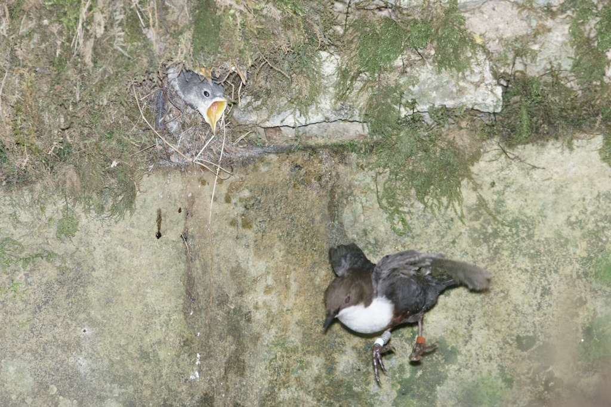

# Survival {#survival}

WORK IN PROGRESS.

## Introduction

In this fourth chapter, you will learn about the Cormack-Jolly-Seber model that allows estimating survival based on capture-recapture data. You will also see how to deal with covariates to try and explain temporal and/or individual variation in survival.  

## The Cormack-Jolly-Seber (CJS) model

In the previous chapter, we introduced a capture-recapture model with constant survival and detection probabilities which we formulated as a HMM and fitted to data in NIMBLE. Historically, however, it was a slightly more complicated model that was first proposed -- the so-called Cormack-Jolly-Seber (CJS) model -- in which survival and recapture probabilities are time-varying. This feature of the CJS model is useful to account for variation due to environmental conditions in survival or to sampling effort in detection. Schematically the CJS model can be represented this way:

```{r, engine = 'tikz', echo = FALSE}
\usetikzlibrary{arrows, fit, positioning, automata}
\begin{tikzpicture}[node distance = 2cm]
\tikzset{state/.style = {circle, draw, minimum size = 30pt, scale = 3, line width=1pt}}
\node [state,fill=lightgray!75] (6) [] {$1$};
\node [state,fill=lightgray!75] (5) [left = 20mm of 6] {$1$};
\node [state,fill=lightgray!75] (4) [left = 20mm of 5] {$1$};
\node [state,fill=lightgray!75] (3) [left = 20mm of 4] {$1$};
\node [state,fill=lightgray!75] (7) [right = 20mm of 6] {$2$};
\node [state,fill=lightgray!75] (8) [right = 20mm of 7] {$2$};
\node [state,fill=lightgray!75] (9) [right = 20mm of 8] {$\cdots$};
\node [state,fill=white] (16) [above = 20mm of 6] {$1$};
\node [state,fill=white] (15) [above = 20mm of 5] {$2$};
\node [state,fill=white] (14) [above = 20mm of 4] {$1$};
\node [state,fill=white] (17) [above = 20mm of 7] {$1$};
\node [state,fill=white] (18) [above = 20mm of 8] {$1$};
\draw[->,black, line width=0.25mm,-latex] (3) -- node[above=3mm, align=center] {\huge $\phi_1$} (4);
\draw[->,black, line width=0.25mm,-latex] (4) -- node[above=3mm, align=center] {\huge $\phi_2$} (5);
\draw[->,black, line width=0.25mm,-latex] (5) -- node[above=3mm, align=center] {\huge $\phi_3$} (6);
\draw[->,black, line width=0.25mm,-latex] (6) -- node[above=3mm, align=center] {\huge $1 - \phi_4$} (7);
\draw[->,black, line width=0.25mm,-latex] (7) -- node[above=3mm, align=center] {\huge $1$} (8);
\draw[->,black, line width=0.25mm,-latex] (8) -- node[above=3mm, align=center] {\huge $1$} (9);
\draw[->,black, line width=0.25mm,-latex] (4) -- node[left=3mm, align=center] {\huge $1 - p_2$} (14);
\draw[->,black, line width=0.25mm,-latex] (5) -- node[left=3mm, align=center] {\huge $p_3$} (15);
\draw[->,black, line width=0.25mm,-latex] (6) -- node[left=3mm, align=center] {\huge $1 - p_4$} (16);
\draw[->,black, line width=0.25mm,-latex] (7) -- node[left=3mm, align=center] {\huge $1$} (17);
\draw[->,black, line width=0.25mm,-latex] (8) -- node[left=3mm, align=center] {\huge $1$} (18);
\end{tikzpicture}
```

Note that the states (in gray) and the observations (in white) do not change. We still have $z = 1$ for alive, $z = 2$ for dead, $y = 1$ for non-detected, and $y = 2$ for detected. 

Parameters are now indexed by time. The survival probability is defined as the probability of staying alive (or "ah, ha, ha, ha, stayin' alive" like the Bee Gees would say) over the interval between $t$ and $t+1$, that is $\phi_t = \Pr(z_{t+1} = 1 | z_t = 1)$. The detection probability is defined as the probability of being observed at $t$ given you're alive at $t$, that is $p_t = \Pr(y_{t} = 1 | z_t = 1)$. It is important to bear in mind that survival operates over an interval while detection occurs at a specific time. **Fast forward to covariates section?**

The CJS model is named after three statisticians who published independent sole-author papers introducing more or less the same approach, a year apart ! In fact, Richard Cormack and George Jolly were working in the same corridor in Scotland back in the 1960's. They would meet every day at coffee and would play some game together, but never mention work and were not aware of each other’s work.

## Capture-recapture data 

Before we turn to fitting the CJS model to actual data, let's talk about capture-recapture for a minute. We said in the previous chapter (section 1.6.1) that individuals are individual marked. This can be accomplished in two ways, either with artificial marks like rings for birds or ear tags for mammals, or (non-invasive) natural marks like coat patterns or feces DNA sequencing (Figure \@ref(fig:marking)). 

```{r marking, fig.ncol = 2, echo = FALSE, fig.cap = "Animal marks", fig.show = "hold", fig.subcap = c("ring", "ear-tag", "coat patters", "ADN feces"), out.width="50%"}
knitr::include_graphics(c("images/gull.jpg", 
                   "images/bighorn.png", 
                   "images/lynx.png", 
                   "images/bearscat.png"))
```

Throughout this chapter, we will use data on the White-throated Dipper (*Cinclus cinclus*; dipper hereafter) kindly provided by Gilbert Marzolin (Figure \@ref(fig:pixdipper)). In total, 294 dippers with known sex and wing length were captured and recaptured between 1981 and 1987 during the March-June period. Birds were at least 1 year old when initially banded. 

```{r pixdipper, echo=FALSE, out.width="60%", fig.cap="White-throated Dipper (Cinclus cinclus)", fig.align='center'}

```

You may scroll down the data below: 

```{r echo = FALSE}
dipper <- read_csv(here::here("dat", "dipper.csv"))
dipper %>%
  kableExtra::kable() %>%
  kableExtra::scroll_box(width = "100%", height = "400px")
y <- dipper %>%
  select(year_1981:year_1987) %>%
  as.matrix()
```

The seven first columns are years in which Gilbert went on the field and captured the birds. A 0 stands for a non-detection, and a 1 for a detection. The eighth column informs on the sex of the bird, with F for female and M for male. The last column gives a measure wing length the first time a bird was captured. 

## Fitting the CJS model to the dipper data with NIMBLE

To write the NIMBLE code corresponding to the CJS model, we only need to make a few adjustments to the NIMBLE code for the model with constant parameters from the previous chapter. The main modification concerns the observation and transitions matrices which we need to be time-varying and therefore become arrays and inherit a third dimension besides that for rows and columns. Also we need priors for all time-varying survival and detection probabilities. **insist on first and several cohort vs single cohort in previous chapter** We get:

```{r eval=FALSE}
...
# parameters
  delta[1] <- 1          # Pr(alive t = 1) = 1
  delta[2] <- 0          # Pr(dead t = 1) = 0
  for (t in 1:(T-1)){
    phi[t] ~ dunif(0, 1) # prior survival
    gamma[1,1,t] <- phi[t]      # Pr(alive t -> alive t+1)
    gamma[1,2,t] <- 1 - phi[t]  # Pr(alive t -> dead t+1)
    gamma[2,1,t] <- 0        # Pr(dead t -> alive t+1)
    gamma[2,2,t] <- 1        # Pr(dead t -> dead t+1)
    p[t] ~ dunif(0, 1) # prior detection
    omega[1,1,t] <- 1 - p[t]    # Pr(alive t -> non-detected t)
    omega[1,2,t] <- p[t]        # Pr(alive t -> detected t)
    omega[2,1,t] <- 1        # Pr(dead t -> non-detected t)
    omega[2,2,t] <- 0        # Pr(dead t -> detected t)
  }
...
```

The likelihood does not change, except that the time-varying observation and transition matrices need to be used appropriately:
```{r eval=FALSE}
...
# likelihood
  for (i in 1:N){
    z[i,first[i]] ~ dcat(delta[1:2])
    for (j in (first[i]+1):T){
      z[i,j] ~ dcat(gamma[z[i,j-1], 1:2, j-1])
      y[i,j] ~ dcat(omega[z[i,j], 1:2, j-1])
    }
  }
...
```

Overall, the code looks like:
```{r}
hmm.phitpt <- nimbleCode({
  # parameters
  delta[1] <- 1          # Pr(alive t = 1) = 1
  delta[2] <- 0          # Pr(dead t = 1) = 0
  for (t in 1:(T-1)){
    phi[t] ~ dunif(0, 1) # prior survival
    gamma[1,1,t] <- phi[t]      # Pr(alive t -> alive t+1)
    gamma[1,2,t] <- 1 - phi[t]  # Pr(alive t -> dead t+1)
    gamma[2,1,t] <- 0        # Pr(dead t -> alive t+1)
    gamma[2,2,t] <- 1        # Pr(dead t -> dead t+1)
    p[t] ~ dunif(0, 1) # prior detection
    omega[1,1,t] <- 1 - p[t]    # Pr(alive t -> non-detected t)
    omega[1,2,t] <- p[t]        # Pr(alive t -> detected t)
    omega[2,1,t] <- 1        # Pr(dead t -> non-detected t)
    omega[2,2,t] <- 0        # Pr(dead t -> detected t)
  }
  # likelihood
  for (i in 1:N){
    z[i,first[i]] ~ dcat(delta[1:2])
    for (j in (first[i]+1):T){
      z[i,j] ~ dcat(gamma[z[i,j-1], 1:2, j-1])
      y[i,j] ~ dcat(omega[z[i,j], 1:2, j-1])
    }
  }
})
```

We read in the data:
```{r}
dipper <- read_csv(here::here("dat", "dipper.csv"), show_col_types = FALSE)
y <- dipper %>%
  select(year_1981:year_1987) %>%
  as.matrix()
```

Get the occasion of first capture for all individuals: **Say several cohorts, different from prevcious chapter example**
```{r}
first <- apply(y, 1, function(x) min(which(x !=0)))
```

Now we specify the constants:
```{r}
my.constants <- list(N = nrow(y), T = ncol(y), first = first)
my.constants
```
Now the data in a list. Note that we add 1 to the data to have 1 for non-detections and 2 for detections. You may use the coding you prefer of course, you will just need to adjust the $\Omega$ and $\Gamma$ matrices in the model above.
```{r}
my.data <- list(y = y + 1)
```

Now let's write a function for the initial values. For the latent states, we go for the easy way, and say that all individuals are alive through the study period. 
```{r}
zinits <- y + 1 # non-detection -> alive
zinits[zinits == 2] <- 1 # dead -> alive
initial.values <- function() list(phi = runif(my.constants$T-1,0,1),
                                  p = runif(my.constants$T-1,0,1),
                                  z = zinits)
```

We specify the parameters we'd like to monitor:
```{r}
parameters.to.save <- c("phi", "p")
parameters.to.save
```

We provide MCMC details:
```{r}
n.iter <- 5000
n.burnin <- 1000
n.chains <- 2
```

At last, we're ready to run NIMBLE:
```{r, message=FALSE, eval = FALSE}
mcmc.output <- nimbleMCMC(code = hmm.phitpt,
                          constants = my.constants,
                          data = my.data,
                          inits = initial.values,
                          monitors = parameters.to.save,
                          niter = n.iter,
                          nburnin = n.burnin,
                          nchains = n.chains)
```

We may have a look to the numerical summaries. **Comment on variation in survival, and constancy in detection. And write example of how to interpret these estimates.** Note the small effective sample size for the last survival and recapture probabilities, we will get back to that in a minute. 
```{r eval = FALSE}
MCMCsummary(mcmc.output, round = 2)
```
```{r echo = FALSE}
load(here::here("dat","dipper.RData"))
MCMCsummary(object = mcmc.phitpt, params = c("phi","p"), round = 2)
```

Let's produce a caterpillar plot of the estimates.
```{r}
MCMCplot(object = mcmc.phitpt, params = c("phi","p"))
```

Let's focus for a minute on the last survival probability. See how mixing is bad and the overlap with the prior is big. This parameter is redundant, and it can be shown that only the product of $\phi_6$ and $p_7$ can be estimated.
```{r}
priors <- runif(3000, 0, 1)
MCMCtrace(object = mcmc.phitpt,
          ISB = FALSE,
          exact = TRUE, 
          params = c("phi[6]"),
          pdf = FALSE, 
          priors = priors)
```

There are two potential issues, either intrinsic or extrinsic parameter redundacy. Intrinsic redundancy means that the model likelihood can be expressed by a smaller number of parameters; it is a feature of the model. Extrinsic redundancymeans that model structure is fine, but the lack of data makes a parameter non-estimable; this is a feature of the data. **Recommendation overlap, et refer to book by Diana Cole.**

## CJS model derivatives

Besides the model we fitted in the previous chapter with constant parameters and the CJS model with time-varying parameters, you might want to fit in-between models with time variation on either detection or survival. 

Let's start with the model with time-varying survival and constant detection. In NIMBLE, the code is:
```{r eval=FALSE}
hmm.phitp <- nimbleCode({
  for (t in 1:(T-1)){
    phi[t] ~ dunif(0, 1) # prior survival
    gamma[1,1,t] <- phi[t]      # Pr(alive t -> alive t+1)
    gamma[1,2,t] <- 1 - phi[t]  # Pr(alive t -> dead t+1)
    gamma[2,1,t] <- 0        # Pr(dead t -> alive t+1)
    gamma[2,2,t] <- 1        # Pr(dead t -> dead t+1)
  }
  p ~ dunif(0, 1) # prior detection
  delta[1] <- 1          # Pr(alive t = 1) = 1
  delta[2] <- 0          # Pr(dead t = 1) = 0
  omega[1,1] <- 1 - p    # Pr(alive t -> non-detected t)
  omega[1,2] <- p        # Pr(alive t -> detected t)
  omega[2,1] <- 1        # Pr(dead t -> non-detected t)
  omega[2,2] <- 0        # Pr(dead t -> detected t)
  # likelihood
  for (i in 1:N){
    z[i,first[i]] ~ dcat(delta[1:2])
    for (j in (first[i]+1):T){
      z[i,j] ~ dcat(gamma[z[i,j-1], 1:2, j-1])
      y[i,j] ~ dcat(omega[z[i,j], 1:2])
    }
  }
})
```

We obtain the following estimates: **comment**
```{r echo = FALSE}
load(here::here("dat","dipper.RData"))
MCMCsummary(object = mcmc.phitp, params = c("phi","p"), round = 2)
```

Now the model with time-varying detection and constant survival, for which the NIMBLE code is:
```{r eval=FALSE}
hmm.phipt <- nimbleCode({
  phi ~ dunif(0, 1) # prior survival
  gamma[1,1] <- phi      # Pr(alive t -> alive t+1)
  gamma[1,2] <- 1 - phi  # Pr(alive t -> dead t+1)
  gamma[2,1] <- 0        # Pr(dead t -> alive t+1)
  gamma[2,2] <- 1        # Pr(dead t -> dead t+1)
  delta[1] <- 1          # Pr(alive t = 1) = 1
  delta[2] <- 0          # Pr(dead t = 1) = 0
  for (t in 1:(T-1)){
    p[t] ~ dunif(0, 1) # prior detection
    omega[1,1,t] <- 1 - p[t]    # Pr(alive t -> non-detected t)
    omega[1,2,t] <- p[t]        # Pr(alive t -> detected t)
    omega[2,1,t] <- 1        # Pr(dead t -> non-detected t)
    omega[2,2,t] <- 0        # Pr(dead t -> detected t)
  }
  # likelihood
  for (i in 1:N){
    z[i,first[i]] ~ dcat(delta[1:2])
    for (j in (first[i]+1):T){
      z[i,j] ~ dcat(gamma[z[i,j-1], 1:2])
      y[i,j] ~ dcat(omega[z[i,j], 1:2, j-1])
    }
  }
})
```

Parameter estimates are: **comment**
```{r echo = FALSE}
load(here::here("dat","dipper.RData"))
MCMCsummary(object = mcmc.phipt, params = c("phi","p"), round = 2)
```

We're left with four models. Different ecological hypotheses. What to do from here? Model selection. **A raffiner**

## Model comparison with WAIC

Which of the four models above is best supported by the data? To answer this question, we need to bear in mind that we used all the observed data to fit these models, and how close to the truth these models will perform when predicting for future data -- or predictive accuracy -- should be assessed. A natural candidate measure for predictive accuracy is the likelihood which is often referred in the context of model comparison as the predictive density. However, we know neither the true process, nor the future data, and we can only estimate the predictive density with some bias. 

You may have heard about the Akaike Information Criterion (AIC) in the Frequentist framework, and the Deviance Information Criterion (DIC) in the Bayesian framework. We will consider here the Widely Applicable Information Criterion or Watanabe Information Criterion (WAIC). AIC, DIC and WAIC each aim to provide an approximation of predictive accuracy. 

While AIC is the predictive measure of choice in the Frequentist framework for ecologists, DIC has been around for some time for Bayesian applications due to its availability in population BUGS pieces of software. However, these methods only utilize a point estimate of the unknown parameters. Also, various difficulties have been noted with DIC which may give nonsensical results when the posterior distribution is not well summarized by its mean. For a more fully Bayesian approach we would like to use the entire posterior distribution to evaluate the predictive performance, which is exactly what WAIC does. 

Conveniently, NIMBLE calculates WAIC for you. E.g. for model from previous chapter. **explain**
```{r eval = FALSE}
parameters.to.save <- c("phi", "p", "z") 
mcmc.phitpt <- nimbleMCMC(code = hmm.phitpt,
                          constants = my.constants,
                          data = my.data,
                          inits = initial.values,
                          monitors = parameters.to.save,
                          niter = n.iter,
                          nburnin = n.burnin,
                          nchains = n.chains,
                          WAIC = TRUE) 
```

Dipper example - continued:
```{r echo = FALSE}
load(here::here("dat","dipper_waic.RData"))
data.frame(model = c("(phi,p)",
                     "(phit,p)",
                     "(phi,pt)",
                     "(phit,pt)"),
           WAIC = c(mcmc.phip$WAIC,
             mcmc.phitp$WAIC,
             mcmc.phipt$WAIC,
             mcmc.phitpt$WAIC))
```

Lower values of WAIC imply higher predictive accuracy. So we would favor model with constant parameters.

## Goodness-of-fit testing

In the previous section, we compared models between each other based on their predictive accuracy, in other words we assessed their *relative* fit. However, even though we are able to rank these models according to predictive accuracy, it could happen that all models actually have poor predictive performance, this has to do with *absolute* fit. 

How to assess the goodness of fit of the CJS model to capture-recapture data? In particular how to assess homogeneity of survival and recapture probabilities and the independence between individuals?

In the Bayesian framework, you would rely on posterior predictive checks to assess absolute fit. Briefly speaking, the idea is to compare the observed data to replicated data generated from the model. If the model is a good fit to the data, then the replicated data predicted from the model should look similar to the observed data. To simplify the comparison, some summary statistics are generally considered that should be built based on the ecological question of interest. 

For the CJS model, posterior predictive checks can be used. However, there are well established procedures for assessing absolute fit and departures from specific model assumptions that would be a shame to just ignore. 

These aspects are examined specifically in two independent component tests called, respectively, Test 3.SR and Test 2.CT. The component tests directed at transients and trap-dependence actually address features of the data that are consequences of, respectively, the presence of transients and trap-dependence, so that these features may also be caused by other, completely different phenomena. They do verify, respectively, that:

We focus on two such assumptions that have an ecological interpretation, transience and trap-dependence and corresponding testing procedure. The transience test assesses whether newly encountered individuals have the same chance to be later re-observed as recaptured (previously encountered) individuals. The trap-dependence test assesses whether missed individuals have the same chance to be recaptured at the next occasion as currently captured individuals. Although these components are called "test of transience" and "test of trap-dependence", when it comes to interpretation, you should keep in mind that transience (an excess of individuals never seen again) and trap-dependence (trapping has an effect on detection) are just two specific reasons why the tests might detect a lack of fit.

These tests are implemented in the package `R2ucare`, and we illustrate its use with the dipper data.
```{r}
library(R2ucare)
```

We get the capture-recapture data:
```{r}
# capture-recapture data
dipper <- read_csv(here::here("dat", "dipper.csv"))
dip.hist <- dipper %>%
  select(year_1981:year_1987) %>%
  as.matrix()
# number of birds with that particular capture-recapture history
dip.freq <- rep(1, nrow(dip.hist))
# sex of each bird
dip.group <- dipper$sex
```

For the sake of illustration, we consider females only:
```{r}
mask <- (dip.group == 'F')
dip.fem.hist <- dip.hist[mask,]
dip.fem.freq <- dip.freq[mask]
```

The overall test shows that we cannot reject the hypothesis that the CJS models fits the data well:
```{r}
overall_CJS(dip.fem.hist, dip.fem.freq)
```

We may perform a test specifically to assess a transient effect:
```{r}
test3sr(dip.fem.hist, dip.fem.freq)
```

Or trap-dependence:
```{r}
test2ct(dip.fem.hist, dip.fem.freq)
```

What to do if these tests are significant? If you detect a transient effect, then 2 age classes should be considered on survival probability to account for this issue (fast forward covariate section below). **explain without talking about age effect, and why it is on survival that the effect should be considered** If trap dependence is significant, you could use a time-varying individual covariate to account for this effect **explain the covariate** (fast forward section on covariate below), or consider more complex models **explain without talking about states** (Pradel and Sanz (2012) recommend multievent models - fast forward case study).

So far, we have addressed assumptions relative to the model. There are also assumption relative to the design. In particular, survival refers to the study area, and so we need to think carefully about what survival does actually mean in capture-recapture. More precisely, mortality and permanent emigration are confounded. Therefore we estimate apparent survival, not true survival. Apparent survival probability is the product of true survival and study area fidelity. Consequently, apparent survival is always lower than true survival unless study area fidelity is exactly 1. Last, no mark lost, identity of individuals recorded without error (no false positives), and captured individuals are a random sample.

## Why Bayes? Incorporate prior information

So far, we have assumed a non-informative prior on survival $\text{Beta}(1,1) = \text{Uniform}(0,1)$. With this prior, mean posterior survival is $\phi = 0.56$ with credible interval $[0.52,0.62]$. Graphically we may represent the posterior distribution of survival obtained with two chains with different colors, and our prior in gray dashed line:
```{r, echo = FALSE}
load(here::here("dat","dipper.RData"))
PR <- runif(1500, 0, 1)
MCMCtrace(mcmc.phip,
          params = c('phi'),
          ISB = FALSE,
          exact = TRUE,
          priors = PR,
          pdf = FALSE,
          Rhat = FALSE,
          n.eff = FALSE,
#          post_zm = TRUE,
          sz_txt = NULL,
          ind = TRUE,
          type = "density",
          lwd_den = 3,
          lwd_pr = 3,
          col_pr = "gray70",
          lty_pr = 2,
          main_den = "",
          xlab_den = "survival")
```

### Prior elicitation

The thing is that we know a lot about passerines and it is a shame not to be able to use this information and act as if we have to start from scratch and know nothing. We illustrate how to incorporate prior information by acknowledging that species with similar body masses have similar survival. By gathering information on several other European passerines than the dipper, let's assume we have built a regression of survival vs. body mass -- allometric relationship. Knowing dippers weigh on average 59.8g, we're now in the position to build a prior for dipper survival probability by predicting its value using the regression. We obtain a predicted survival of 0.57 and a standard deviation of 0.075. Using an informative prior $\text{Normal}(0.57, sd = 0.073)$ in NIMBLE, we get a mean posterior of $0.56$ with credible interval $[0.52, 0.61]$. There's barely no difference with the non-informative prior, quite a disappointment. 

Now let's assume that we had only the three first years of data, what would have happened? We fit the model with constant parameters with both the non-informative and informative priors to the dataset from which we delete the final 4 years of data. Now the benefit of using the prior information becomes clear as the credible interval when prior information is ignored has a width of 0.53, which is more than twice as much as when prior information is used (0.24), illustrating the increased precision provided by the prior. We may assess visually this gain in precision by comparing the survival posterior distributions with and without informative prior:

```{r, echo = FALSE}
load(here::here("dat","phip3y.RData"))
phinoprior <- c(mcmc.phip$chain1[,"phi"], mcmc.phip$chain2[,"phi"])
load(here::here("dat","phipriorp3y.RData"))
phiprior <- c(mcmc.phip$chain1[,"phi"], mcmc.phip$chain2[,"phi"])
df <- data.frame(posterior = c(phinoprior, phiprior),
                 type = c(rep("w/ vague prior", length(phinoprior)),
                          rep("w/ informative prior", length(phiprior))))
df %>%
  ggplot() +
  aes(x = posterior, fill = type) +
  geom_density(aes(y = ..density..),
               bins = 40,
               color = "white",
               alpha = 0.6) +
  labs(x = "survival", fill = "") +
  scale_fill_manual(values = wesanderson::wes_palette("Royal1")[2:1])
```

In brief, if the aim is to get an estimate of survival, Gilbert did not have to conduct further data collection after 3 years, and he could have reached the same precision as with 7 years of data by using prior information derived from body mass. In brief, the prior information was worth 4 years of field data. Of course, this is assuming that the ecological question remains the same whether you have 3 or 7 years of data, which is unlikely to be the case, as with long-term data, there is so much we can ask, more than "just" what annual survival probability is. 

### Moment matching

The prior $\text{Normal}(0.57, sd = 0.073)$ is not entirely satisfying because it is not constrained to be positive or less than one, which is the minimum for a probability (of survival) to be well defined. In our specific example, the prior distribution is centered on positive values far from 0, and the sandard deviation is small enough so that the chances to get values smaller than 0 or higher than 1 are null (to convince yourself, `hist(rnorm(1000, mean = 0.57, sd = 0.073))`). Can we do better? The answer is yes. 

Remember the Beta distribution? Recall that the Beta distribution is a continuous distribution with values between 0 and 1. It is therefore convenient to specify priors for survival and detection probabilities. Plus we know everything about the Beta distribution, in particular its moments. If $X \sim Beta(\alpha,\beta)$, then the first (mean) and second moments (variance) of $X$ are $\mu = \text{E}(X) = \frac{\alpha}{\alpha + \beta}$ and $\sigma^2 = \text{Var}(X) = \frac{\alpha\beta}{(\alpha + \beta)^2 (\alpha + \beta + 1)}$. 

In the capture-recapture example, we know a priori that the mean of the probability we're interested in is $\mu = 0.57$ and its variance is $\sigma^2 = 0.073^2$. Parameters $\mu$ and $\sigma^2$ are seen as the moments of a $Beta(\alpha,\beta)$ distribution. Now we look for values of $\alpha$ and $\beta$ that match the observed moments of the Beta distribution $\mu$ and $\sigma^2$. We need another set of equations:
$$\alpha = \bigg(\frac{1-\mu}{\sigma^2}- \frac{1}{\mu} \bigg)\mu^2$$
$$\beta = \alpha \bigg(\frac{1}{\mu}-1\bigg)$$
For our model, that means:
```{r echo = TRUE}
(alpha <- ( (1 - 0.57)/(0.073*0.073) - (1/0.57) )*0.57^2)
(beta <- alpha * ( (1/0.57) - 1))
```

Now we simply have to use $\text{Beta}(\alpha = 25.6,\beta = 19.3)$ as a prior instead of our $\text{Normal}(0.57, sd = 0.073)$. 

## Covariates

**Blabla sur le pourquoi des covariables.**

### Temporal covariates

#### Discrete

Also consider flood effect discrete cov. A major flood occurred during the 1983 breeding season. Because captures during the breding season occurred well before and after the flood, survival in the two years 1982-1983 and 1983-1984 were likely to be affected. Indeed survival of a species living along and feeding in the river in these two flood years was most likely lower than in nonflood years. 

```{r eval = FALSE}
hmm.phifloodp <- nimbleCode({
  delta[1] <- 1          # Pr(alive t = 1) = 1
  delta[2] <- 0          # Pr(dead t = 1) = 0
  for (t in 1:(T-1)){
    logit(phi[t]) <- beta[1] + beta[2] * flood[t]
    gamma[1,1,t] <- phi[t]      # Pr(alive t -> alive t+1)
    gamma[1,2,t] <- 1 - phi[t]  # Pr(alive t -> dead t+1)
    gamma[2,1,t] <- 0        # Pr(dead t -> alive t+1)
    gamma[2,2,t] <- 1        # Pr(dead t -> dead t+1)
  }
  p ~ dunif(0, 1) # prior detection
  omega[1,1] <- 1 - p    # Pr(alive t -> non-detected t)
  omega[1,2] <- p        # Pr(alive t -> detected t)
  omega[2,1] <- 1        # Pr(dead t -> non-detected t)
  omega[2,2] <- 0        # Pr(dead t -> detected t)
  beta[1] ~ dnorm(0, 1.5) # prior intercept
  beta[2] ~ dnorm(0, 1.5) # prior slope
  # likelihood
  for (i in 1:N){
    z[i,first[i]] ~ dcat(delta[1:2])
    for (j in (first[i]+1):T){
      z[i,j] ~ dcat(gamma[z[i,j-1], 1:2, j-1])
      y[i,j] ~ dcat(omega[z[i,j], 1:2])
    }
  }
})
```

Flood / nonflood year covariate:
```{r eval = FALSE}
flood <- c(0, 1, 1, 0, 0, 0) # 1981-1982, 1982-1983, 1983-1984, 1984-1985, ...
```

Constants in a list. 
```{r eval = FALSE}
my.constants <- list(N = nrow(y),
                     T = ncol(y),
                     first = first,
                     flood = flood)
```

Initial values. 
```{r eval = FALSE}
initial.values <- function() list(beta = rnorm(2,0,1),
                                  p = runif(1,0,1),
                                  z = zinits)
```

Parameters to be monitored. 
```{r eval = FALSE}
parameters.to.save <- c("beta", "p", "phi", "z")
```

Run nimble. 
```{r eval = FALSE}
mcmc.phifloodp <- nimbleMCMC(code = hmm.phifloodp, 
                          constants = my.constants,
                          data = my.data,              
                          inits = initial.values,
                          monitors = parameters.to.save,
                          niter = n.iter,
                          nburnin = n.burnin, 
                          nchains = n.chains,
                          WAIC = TRUE)
```

Regression intercept and slope. Caterpillar plot of the regression parameters. The posterior distribution of the slope is centered on negative values, suggesting the as water flow increases, survival decreases. 
```{r, echo = FALSE}
load(here::here("dat/phifloodp.RData"))
beta1 <- c(mcmc.phifloodp$samples$chain1[,'beta[1]'],mcmc.phifloodp$samples$chain2[,'beta[1]'])
beta2 <- c(mcmc.phifloodp$samples$chain1[,'beta[2]'],mcmc.phifloodp$samples$chain2[,'beta[2]'])
```

Which gives survival in nonflood years (inv logit of $\beta_1$) `r round(mean(plogis(beta1)),2)` (`r round(quantile(plogis(beta1), probs = c(2.5, 97.5)/100),2)`) and in flood year (in logit of $\beta_1+\beta_2$) `r round(mean(plogis(beta2+beta1)),2)` (`r round(quantile(plogis(beta1+beta2), probs = c(2.5, 97.5)/100),2)`).

WAIC is `mcmc.phifloodp$WAIC$WAIC`. Survival in flood years lower than in nonflood years. 

Let's use a covariate $\text{flood}$ that contains 1s and 2s, indicating whether we are in a flood or nonflood year for each year: 1 if nonflood year, and 2 if flood year. E.g. for year $t = 2$, `beta[flood[t]]` gives `beta[flood[2]]` which will be `beta[1]` or `beta[2]` depending on whether flood[2] is 1 or 2.

Flood / nonflood year covariate:
```{r eval = FALSE}
flood <- c(1, 2, 2, 1, 1, 1) # 1981-1982, 1982-1983, 1983-1984, 1984-1985, ...
```

```{r eval = FALSE}
hmm.phifloodp <- nimbleCode({
  delta[1] <- 1          # Pr(alive t = 1) = 1
  delta[2] <- 0          # Pr(dead t = 1) = 0
  for (t in 1:(T-1)){
    phi[t] <- beta[flood[t]]
    gamma[1,1,t] <- phi[t]      # Pr(alive t -> alive t+1)
    gamma[1,2,t] <- 1 - phi[t]  # Pr(alive t -> dead t+1)
    gamma[2,1,t] <- 0        # Pr(dead t -> alive t+1)
    gamma[2,2,t] <- 1        # Pr(dead t -> dead t+1)
  }
  p ~ dunif(0, 1) # prior detection
  omega[1,1] <- 1 - p    # Pr(alive t -> non-detected t)
  omega[1,2] <- p        # Pr(alive t -> detected t)
  omega[2,1] <- 1        # Pr(dead t -> non-detected t)
  omega[2,2] <- 0        # Pr(dead t -> detected t)
  beta[1] ~ dunif(0, 1) # prior intercept
  beta[2] ~ dunif(0, 1) # prior slope
  # likelihood
  for (i in 1:N){
    z[i,first[i]] ~ dcat(delta[1:2])
    for (j in (first[i]+1):T){
      z[i,j] ~ dcat(gamma[z[i,j-1], 1:2, j-1])
      y[i,j] ~ dcat(omega[z[i,j], 1:2])
    }
  }
})
```

Constants in a list. 
```{r eval = FALSE}
my.constants <- list(N = nrow(y),
                     T = ncol(y),
                     first = first,
                     flood = flood)
```

Initial values. 
```{r eval = FALSE}
initial.values <- function() list(beta = runif(2,0,1),
                                  p = runif(1,0,1),
                                  z = zinits)
```

Parameters to be monitored. 
```{r eval = FALSE}
parameters.to.save <- c("beta", "p", "phi", "z")
```

Run nimble. 
```{r eval = FALSE}
mcmc.phifloodp <- nimbleMCMC(code = hmm.phifloodp, 
                             constants = my.constants,
                             data = my.data,              
                             inits = initial.values,
                             monitors = parameters.to.save,
                             niter = n.iter,
                             nburnin = n.burnin, 
                             nchains = n.chains,
                             WAIC = TRUE)
```

Regression intercept and slope. Caterpillar plot of the regression parameters. The posterior distribution of the slope is centered on negative values, suggesting the as water flow increases, survival decreases. 
```{r, echo = FALSE}
load(here::here("dat/phifloodpni.RData"))
beta1 <- c(mcmc.phifloodp$samples$chain1[,'beta[1]'],mcmc.phifloodp$samples$chain2[,'beta[1]'])
beta2 <- c(mcmc.phifloodp$samples$chain1[,'beta[2]'],mcmc.phifloodp$samples$chain2[,'beta[2]'])
```

Which gives survival in flood years `r round(mean(beta1),2)` (`r round(quantile(beta1, probs = c(2.5, 97.5)/100),2)`) and in nonflood year `r round(mean(beta2),2)` (`r round(quantile(beta2, probs = c(2.5, 97.5)/100),2)`).

WAIC is `mcmc.phifloodp$WAIC$WAIC`. Survival in flood years lower than in nonflood years. 

#### Continuous

Include temporal covariates, say $x_t$, through $\text{logit}(\phi_t) = \beta_1 + \beta_2 x_t$. **explain logit link function** **a bit of caution with priors**. Let's investigate the effect of water flow on dipper survival ([Marzolin 2002](https://doi.org/10.2307/3802934)). Now we'd like to add a temporal covariate to try and explain annual variation in survival. We pick water flow in river. We specify the relationship on the logit scale. 
```{r eval = FALSE}
hmm.phiflowp <- nimbleCode({
  delta[1] <- 1          # Pr(alive t = 1) = 1
  delta[2] <- 0          # Pr(dead t = 1) = 0
  for (t in 1:(T-1)){
    logit(phi[t]) <- beta[1] + beta[2] * flow[t] 
    gamma[1,1,t] <- phi[t]      # Pr(alive t -> alive t+1)
    gamma[1,2,t] <- 1 - phi[t]  # Pr(alive t -> dead t+1)
    gamma[2,1,t] <- 0        # Pr(dead t -> alive t+1)
    gamma[2,2,t] <- 1        # Pr(dead t -> dead t+1)
  }
  p ~ dunif(0, 1) # prior detection
  omega[1,1] <- 1 - p    # Pr(alive t -> non-detected t)
  omega[1,2] <- p        # Pr(alive t -> detected t)
  omega[2,1] <- 1        # Pr(dead t -> non-detected t)
  omega[2,2] <- 0        # Pr(dead t -> detected t)
  beta[1] ~ dnorm(0, 1.5) # prior intercept
  beta[2] ~ dnorm(0, 1.5) # prior slope
  # likelihood
  for (i in 1:N){
    z[i,first[i]] ~ dcat(delta[1:2])
    for (j in (first[i]+1):T){
      z[i,j] ~ dcat(gamma[z[i,j-1], 1:2, j-1])
      y[i,j] ~ dcat(omega[z[i,j], 1:2])
    }
  }
})
```

We only take the values we need, and standardize the covariate. Insist on think of when covariate operates on time interval.
```{r eval = FALSE}
# water flow in L/s
water_flow <- c(443, 1114, 529, 434, 627, 466) # 1981, 1982, ..., 1987
water_flow_st <- (water_flow - mean(water_flow))/sd(water_flow)
```

Constants in a list. 
```{r eval = FALSE}
my.constants <- list(N = nrow(y),
                     T = ncol(y),
                     first = first,
                     flow = water_flow_st)
```

Initial values. 
```{r eval = FALSE}
initial.values <- function() list(beta = rnorm(2,0,1),
                                  p = runif(1,0,1),
                                  z = zinits)
```

Parameters to be monitored. 
```{r eval = FALSE}
parameters.to.save <- c("beta", "p", "phi")
```

Run nimble. 
```{r eval = FALSE}
mcmc.phiflowp <- nimbleMCMC(code = hmm.phiflowp, 
                          constants = my.constants,
                          data = my.data,              
                          inits = initial.values,
                          monitors = parameters.to.save,
                          niter = n.iter,
                          nburnin = n.burnin, 
                          nchains = n.chains)
```

Regression intercept and slope. Caterpillar plot of the regression parameters. The posterior distribution of the slope is centered on negative values, suggesting the as water flow increases, survival decreases. 
```{r, echo = FALSE}
load(here::here("dat/dipperflow.RData"))
MCMCplot(object = mcmc.phiflowp, params = "beta", ISB = TRUE)
```
Time-dependent (covariate constrained) survival probability estimates. Caterpillar plot of the survival estimates. Survival between 1982 and 1983 seems to have been affected highly by a huge water flow compared to the other years. Coherent with previous section with flood effect. 
```{r, echo = FALSE}
load(here::here("dat/dipperflow.RData"))
MCMCplot(object = mcmc.phiflowp, params = "phi", ISB = TRUE)
```

### Individual covariates

+ Discrete covariate like, e.g., sex

+ Continuous covariate like, e.g., mass or size

Sex and wing length in Dipper

```{r echo = FALSE}
dipper %>%
  kableExtra::kable() %>%
  kableExtra::scroll_box(width = "100%", height = "400px")
```

#### Discrete

Sex effect

+ Let's use a covariate $\text{sex}$ that takes value 0 if male, and 1 if female

+ And write $\text{logit}(\phi_i) = \beta_1 + \beta_2 \; \text{sex}_i$ for bird $i$

+ Then male survival is

$$\text{logit}(\phi_i) = \beta_1$$

+ And female survival is

$$\text{logit}(\phi_i) = \beta_1 + \beta_2$$

Nimble implementation with sex as a covariate

```{r eval = FALSE}
hmm.phisexp <- nimbleCode({
...
  for (i in 1:N){ #<<
    logit(phi[i]) <- beta[1] + beta[2] * sex[i]
    gamma[1,1,i] <- phi[i]      # Pr(alive t -> alive t+1)
    gamma[1,2,i] <- 1 - phi[i]  # Pr(alive t -> dead t+1)
    gamma[2,1,i] <- 0        # Pr(dead t -> alive t+1)
    gamma[2,2,i] <- 1        # Pr(dead t -> dead t+1)
  } #<<
  beta[1] ~ dnorm(mean = 0, sd = 1.5)
  beta[2] ~ dnorm(mean = 0, sd = 1.5)
  phi_male <- 1/(1+exp(-beta[1]))
  phi_female <- 1/(1+exp(-(beta[1]+beta[2])))
...
  # likelihood
  for (i in 1:N){
    z[i,first[i]] ~ dcat(delta[1:2])
    for (j in (first[i]+1):T){
      z[i,j] ~ dcat(gamma[z[i,j-1], 1:2, i])
      y[i,j] ~ dcat(omega[z[i,j], 1:2])
    }
  }
})
```

```{r echo = FALSE}
load(here::here("dat/phisexp.RData"))
MCMCsummary(object = mcmc.phisexp, round = 2)
```

NIMBLE implementation with nested indexing

+ Let's use a covariate $\text{sex}$ that contains 1s and 2s, indicating the sex of each individual: 1 if male, and 2 if female

```{r eval = FALSE}
...
for (i in 1:N){
  phi[i] <- beta[sex[i]]
  gamma[1,1,i] <- phi[i]      # Pr(alive t -> alive t+1)
  gamma[1,2,i] <- 1 - phi[i]  # Pr(alive t -> dead t+1)
  gamma[2,1,i] <- 0           # Pr(dead t -> alive t+1)
  gamma[2,2,i] <- 1           # Pr(dead t -> dead t+1)
}
beta[1] ~ dunif(0,1) # male survival #<<
beta[2] ~ dunif(0,1) # female survival #<<
...
```

+ E.g. for individual $i = 2$, `beta[sex[i]]` gives `beta[sex[2]]` which will be `beta[1]` or `beta[2]` depending on whether sex[2] is 1 or 2.

```{r echo = FALSE}
load(here::here("dat/phisexpni.RData"))
MCMCsummary(object = mcmc.phisexp.ni, round = 2)
```

#### Continuous 

```{r eval = FALSE}
...
  for (i in 1:N){ #<<
    logit(phi[i]) <- beta[1] + beta[2] * winglength[i] #<<
    gamma[1,1,i] <- phi[i]      # Pr(alive t -> alive t+1)
    gamma[1,2,i] <- 1 - phi[i]  # Pr(alive t -> dead t+1)
    gamma[2,1,i] <- 0        # Pr(dead t -> alive t+1)
    gamma[2,2,i] <- 1        # Pr(dead t -> dead t+1)
  }
  beta[1] ~ dnorm(mean = 0, sd = 1.5) # intercept #<<
  beta[2] ~ dnorm(mean = 0, sd = 1.5) # slope #<<
...
```

```{r}
dipper <- read_csv("dat/dipper.csv")
y <- dipper %>%
  select(year_1981:year_1987) %>%
  as.matrix()
```

Besides discrete individual covariates, you might want to have continuous individual covariates, e.g. wing length in the dipper case study. Note that we're considering an individual trait that takes the same value whatever the occasion. If we were to have time-varying individual covariate in the model, we would have to do something about missing values of the covariate when an individual is not recaptured. The easiest way to cope with time-varying individual covariate is to discretize and treat levels of the covariates as states. More in the next live demo. Back to wing length. We first standardize the covariate. 
```{r}
wing.length.st <- as.vector(scale(dipper$wing_length))
head(wing.length.st)
```

Now we write the model. Basically we replace sex by wing length in the first method we used in the previous section. Easy. 
```{r}
hmm.phiwlp <- nimbleCode({
    p ~ dunif(0, 1) # prior detection
    omega[1,1] <- 1 - p    # Pr(alive t -> non-detected t)
    omega[1,2] <- p        # Pr(alive t -> detected t)
    omega[2,1] <- 1        # Pr(dead t -> non-detected t)
    omega[2,2] <- 0        # Pr(dead t -> detected t)
  for (i in 1:N){
    logit(phi[i]) <- beta[1] + beta[2] * winglength[i]
    gamma[1,1,i] <- phi[i]      # Pr(alive t -> alive t+1)
    gamma[1,2,i] <- 1 - phi[i]  # Pr(alive t -> dead t+1)
    gamma[2,1,i] <- 0           # Pr(dead t -> alive t+1)
    gamma[2,2,i] <- 1           # Pr(dead t -> dead t+1)
  }
  beta[1] ~ dnorm(mean = 0, sd = 1.5)
  beta[2] ~ dnorm(mean = 0, sd = 1.5)
  delta[1] <- 1          # Pr(alive t = 1) = 1
  delta[2] <- 0          # Pr(dead t = 1) = 0
  # likelihood
  for (i in 1:N){
    z[i,first[i]] ~ dcat(delta[1:2])
    for (j in (first[i]+1):T){
      z[i,j] ~ dcat(gamma[z[i,j-1], 1:2, i])
      y[i,j] ~ dcat(omega[z[i,j], 1:2])
    }
  }
})
```

Constants in a list. 
```{r}
my.constants <- list(N = nrow(y), 
                     T = ncol(y), 
                     first = first,
                     winglength = wing.length.st)
```

Initial values.
```{r}
initial.values <- function() list(beta = rnorm(2,0,1),
                                  p = runif(1,0,1),
                                  z = zinits)
```

Run nimble.
```{r}
mcmc.phiwlp <- nimbleMCMC(code = hmm.phiwlp, 
                          constants = my.constants,
                          data = my.data,              
                          inits = initial.values,
                          monitors = parameters.to.save,
                          niter = n.iter,
                          nburnin = n.burnin, 
                          nchains = n.chains)
```

Numerical summaries. Wing length does not seem to explain much individual-to-individual variation in survival. See corresponding slope param. 
```{r}
load(here::here("dat/phiwlp.RData"))
MCMCsummary(mcmc.phiwlp, params = "beta", round = 2)
```

Let's plot the relationship. First, we gather the values generated from the posterior distribution of the regression parameters in the two chains. 
```{r}
beta1 <- c(mcmc.phiwlp$chain1[,'beta[1]'], mcmc.phiwlp$chain2[,'beta[1]'])
beta2 <- c(mcmc.phiwlp$chain1[,'beta[2]'], mcmc.phiwlp$chain2[,'beta[2]'])
```

Then we define a grid of values for wing length, and predict survival for each MCMC iteration. 
```{r}
predicted_survival <- matrix(NA, nrow = length(beta1), ncol = length(my.constants$winglength))
for (i in 1:length(beta1)){
  for (j in 1:length(my.constants$winglength)){
    predicted_survival[i,j] <- plogis(beta1[i] + beta2[i] * my.constants$winglength[j])
  }
}
```

Now we calculate posterior mean and the credible interval. Note the ordering.
```{r}
mean_survival <- apply(predicted_survival, 2, mean)
lci <- apply(predicted_survival, 2, quantile, prob = 2.5/100)
uci <- apply(predicted_survival, 2, quantile, prob = 97.5/100)
ord <- order(my.constants$winglength)
df <- data.frame(wing_length = my.constants$winglength[ord],
                 survival = mean_survival[ord],
                 lci = lci[ord],
                 uci = uci[ord])
```

Now time to visualize. 
```{r}
df %>%
  ggplot() + 
  aes(x = wing_length, y = survival) + 
  geom_line() + 
  geom_ribbon(aes(ymin = lci, ymax = uci), fill = "grey70", alpha = 0.5) + 
  ylim(0,1) + 
  labs(x = "wing length", y = "estimated survival")
```
Wing length

```{r, echo = FALSE, eval = FALSE}
load(here::here("dat/phiwingp.RData"))
beta1 <- c(mcmc.phiwlp$chain1[,'beta[1]'], mcmc.phiwlp$chain2[,'beta[1]'])
beta2 <- c(mcmc.phiwlp$chain1[,'beta[2]'], mcmc.phiwlp$chain2[,'beta[2]'])
wing.length.st <- as.vector(scale(dipper$wing_length))
predicted_survival <- matrix(NA,
                             nrow = length(beta1),
                             ncol = length(wing.length.st))
for (i in 1:length(beta1)){
  for (j in 1:length(wing.length.st)){
    predicted_survival[i,j] <- plogis(beta1[i] + beta2[i] * wing.length.st[j])
  }
}
mean_survival <- apply(predicted_survival, 2, mean)
lci <- apply(predicted_survival, 2, quantile, prob = 2.5/100)
uci <- apply(predicted_survival, 2, quantile, prob = 97.5/100)
ord <- order(wing.length.st)
df <- data.frame(wing_length = wing.length.st[ord],
                 survival = mean_survival[ord],
                 lci = lci[ord],
                 uci = uci[ord])
df %>%
  ggplot() +
  aes(x = wing_length, y = survival) +
  geom_line() +
  geom_ribbon(aes(ymin = lci, ymax = uci), fill = "grey70", alpha = 0.5) +
  ylim(0,1) +
  labs(x = "wing length", y = "estimated survival")
```

### Additive and interaction

You may test an effect of both sex and wing length. Write the model. We use nested indexing with the sex index that contains 1 if the bird is a male, and 2 otherwise. We have $\logit(\phi_i) = \beta_1 + \beta_3 * \text{winglength}_i$ for males, and $\logit(\phi_i) = \beta_2 + \beta_3 * \text{winglength}_i$ for females. 
```{r eval = FALSE}
hmm.phisexwlp <- nimbleCode({
  p ~ dunif(0, 1) # prior detection
  omega[1,1] <- 1 - p    # Pr(alive t -> non-detected t)
  omega[1,2] <- p        # Pr(alive t -> detected t)
  omega[2,1] <- 1        # Pr(dead t -> non-detected t)
  omega[2,2] <- 0        # Pr(dead t -> detected t)
  for (i in 1:N){
    logit(phi[i]) <- beta[sex[i]] + beta[3] * winglength[i]
    gamma[1,1,i] <- phi[i]      # Pr(alive t -> alive t+1)
    gamma[1,2,i] <- 1 - phi[i]  # Pr(alive t -> dead t+1)
    gamma[2,1,i] <- 0           # Pr(dead t -> alive t+1)
    gamma[2,2,i] <- 1           # Pr(dead t -> dead t+1)
  }
  beta[1] ~ dnorm(mean = 0, sd = 1.5) # intercept male
  beta[2] ~ dnorm(mean = 0, sd = 1.5) # intercept female
  beta[3] ~ dnorm(mean = 0, sd = 1.5) # slope wing length
  delta[1] <- 1          # Pr(alive t = 1) = 1
  delta[2] <- 0          # Pr(dead t = 1) = 0
  # likelihood
  for (i in 1:N){
    z[i,first[i]] ~ dcat(delta[1:2])
    for (j in (first[i]+1):T){
      z[i,j] ~ dcat(gamma[z[i,j-1], 1:2, i])
      y[i,j] ~ dcat(omega[z[i,j], 1:2])
    }
  }
})
```

Constants in a list. Note we standardise wing length. 
```{r eval = FALSE}
first <- apply(y, 1, function(x) min(which(x !=0)))
wing.length.st <- as.vector(scale(dipper$wing_length))
my.constants <- list(N = nrow(y), 
                     T = ncol(y), 
                     first = first,
                     winglength = wing.length.st,
                     sex = if_else(dipper$sex == "M", 1, 2))
my.data <- list(y = y + 1)
```

Data in a list. 
```{r eval = FALSE}
my.data <- list(y = y + 1)
```

Initial values. 
```{r eval = FALSE}
zinits <- y
zinits[zinits == 0] <- 1
initial.values <- function() list(beta = rnorm(3,0,5),
                                  p = runif(1,0,1),
                                  z = zinits)
```

Parameters to be monitored. 
```{r eval = FALSE}
parameters.to.save <- c("beta", "p")
```

MCMC details.
```{r eval = FALSE}
n.iter <- 5000
n.burnin <- 2500
n.chains <- 2
```

Run nimble.
```{r eval = FALSE}
mcmc.phisexwlp <- nimbleMCMC(code = hmm.phisexwlp, 
                             constants = my.constants,
                             data = my.data,              
                             inits = initial.values,
                             monitors = parameters.to.save,
                             niter = n.iter,
                             nburnin = n.burnin, 
                             nchains = n.chains)
```

Display results. 
```{r echo = FALSE}
load(here::here("dat/phisexwlp.RData"))
MCMCsummary(mcmc.phisexwlp, round = 2)
```

Let's visualise survival as a function of wing length for both sexes. 

First we put together the values from the two chains we generated in the posterior distributions of the regression parameters. 
```{r}
beta1 <- c(mcmc.phisexwlp$chain1[,'beta[1]'], mcmc.phisexwlp$chain2[,'beta[1]'])
beta2 <- c(mcmc.phisexwlp$chain1[,'beta[2]'], mcmc.phisexwlp$chain2[,'beta[2]'])
beta3 <- c(mcmc.phisexwlp$chain1[,'beta[3]'], mcmc.phisexwlp$chain2[,'beta[3]'])
```

We get survival estimates for each MCMC iteration. 
```{r}
predicted_survivalM <- matrix(NA, nrow = length(beta1), ncol = length(my.constants$winglength))
predicted_survivalF <- matrix(NA, nrow = length(beta1), ncol = length(my.constants$winglength))
for (i in 1:length(beta1)){
  for (j in 1:length(my.constants$winglength)){
    predicted_survivalM[i,j] <- plogis(beta1[i] + beta3[i] * my.constants$winglength[j]) # males
    predicted_survivalF[i,j] <- plogis(beta2[i] + beta3[i] * my.constants$winglength[j]) # females
  }
}
```

From here, we may calculate posterior mean and credible intervals. 
```{r}
mean_survivalM <- apply(predicted_survivalM, 2, mean)
lciM <- apply(predicted_survivalM, 2, quantile, prob = 2.5/100)
uciM <- apply(predicted_survivalM, 2, quantile, prob = 97.5/100)
mean_survivalF <- apply(predicted_survivalF, 2, mean)
lciF <- apply(predicted_survivalF, 2, quantile, prob = 2.5/100)
uciF <- apply(predicted_survivalF, 2, quantile, prob = 97.5/100)
ord <- order(my.constants$winglength)
df <- data.frame(wing_length = c(my.constants$winglength[ord], my.constants$winglength[ord]),
                 survival = c(mean_survivalM[ord], mean_survivalF[ord]),
                 lci = c(lciM[ord],lciF[ord]),
                 uci = c(uciM[ord],uciF[ord]),
                 sex = c(rep("male", length(mean_survivalM)), rep("female", length(mean_survivalF))))
```

Now on a plot. 
```{r}
df %>%
  ggplot() + 
  aes(x = wing_length, y = survival, color = sex) + 
  geom_line() + 
  geom_ribbon(aes(ymin = lci, ymax = uci, fill = sex), alpha = 0.5) + 
  ylim(0,1) + 
  labs(x = "wing length", y = "estimated survival", color = "", fill = "")
```

### Random effects

#### Temporal

Include temporal covariates, say $x_t$ with $\text{logit}(\phi_t) = \beta_1 + \beta_2 x_t$. If temporal variation not fully explained by covariates, add random effects $\text{logit}(\phi_t) = \beta_1 + \beta_2 x_t + \varepsilon_t, \; \varepsilon_t \sim N(0,\sigma^2)$. We may wish to allow for extra variation in the survival vs. water flow relationship. To do so, we consider a yearly random effect. The prior on the standard deviation of the random effect is uniform between 0 and 10. 
```{r eval = FALSE}
hmm.phiflowREpt <- nimbleCode({
  delta[1] <- 1          # Pr(alive t = 1) = 1
  delta[2] <- 0          # Pr(dead t = 1) = 0
  for (t in 1:(T-1)){
    logit(phi[t]) <- beta[1] + beta[2] * flow[t] + eps[t] # eps is random effect
    eps[t] ~ dnorm(0, sd = sdeps) 
    gamma[1,1,t] <- phi[t]      # Pr(alive t -> alive t+1)
    gamma[1,2,t] <- 1 - phi[t]  # Pr(alive t -> dead t+1)
    gamma[2,1,t] <- 0           # Pr(dead t -> alive t+1)
    gamma[2,2,t] <- 1           # Pr(dead t -> dead t+1)
    p[t] ~ dunif(0, 1)          # prior detection
    omega[1,1,t] <- 1 - p[t]    # Pr(alive t -> non-detected t)
    omega[1,2,t] <- p[t]        # Pr(alive t -> detected t)
    omega[2,1,t] <- 1           # Pr(dead t -> non-detected t)
    omega[2,2,t] <- 0           # Pr(dead t -> detected t)
  }
  beta[1] ~ dnorm(0, 1.5) # prior intercept
  beta[2] ~ dnorm(0, 1.5) # prior slope
  sdeps ~ dunif(0,10)
  # likelihood
  for (i in 1:N){
    z[i,first[i]] ~ dcat(delta[1:2])
    for (j in (first[i]+1):T){
      z[i,j] ~ dcat(gamma[z[i,j-1], 1:2, j-1])
      y[i,j] ~ dcat(omega[z[i,j], 1:2, j-1])
    }
  }
})
```

Initial values. 
```{r eval = FALSE}
initial.values <- function() list(beta = rnorm(2,0,1),
                                  p = runif(my.constants$T-1,0,1),
                                  sdeps = runif(1,0,3),
                                  z = zinits)
```

Parameters to be monitored. 
```{r eval = FALSE}
parameters.to.save <- c("beta", "p", "phi", "sdeps")
```

MCMC details. Note that we've increased the number of iterations and the length of the burn-in period.
```{r eval = FALSE}
n.iter <- 10000
n.burnin <- 5000
n.chains <- 2
```

Run nimble. 
```{r eval = FALSE}
mcmc.phiflowREpt <- nimbleMCMC(code = hmm.phiflowREpt, 
                             constants = my.constants,
                             data = my.data,              
                             inits = initial.values,
                             monitors = parameters.to.save,
                             niter = n.iter,
                             nburnin = n.burnin, 
                             nchains = n.chains)
```

Display outputs. Seems that the water flow effect is not so important anymore. 
```{r}
load(here::here("dat/phiflowREpt.RData"))
MCMCsummary(object = mcmc.phiflowREpt, round = 2)
```

Trace plots for the standard deviation of the random effect.
```{r}
MCMCtrace(object = mcmc.phiflowREpt, params = "sdeps", pdf = FALSE)
```

#### Individual

We add an individual random effect. 
```{r eval = FALSE}
hmm.phiwlrep <- nimbleCode({
    p ~ dunif(0, 1) # prior detection
    omega[1,1] <- 1 - p    # Pr(alive t -> non-detected t)
    omega[1,2] <- p        # Pr(alive t -> detected t)
    omega[2,1] <- 1        # Pr(dead t -> non-detected t)
    omega[2,2] <- 0        # Pr(dead t -> detected t)
  for (i in 1:N){
    logit(phi[i]) <- beta[1] + beta[2] * winglength[i] + eps[i]
    eps[i] ~ dnorm(mean = 0, sd = sdeps)
    gamma[1,1,i] <- phi[i]      # Pr(alive t -> alive t+1)
    gamma[1,2,i] <- 1 - phi[i]  # Pr(alive t -> dead t+1)
    gamma[2,1,i] <- 0           # Pr(dead t -> alive t+1)
    gamma[2,2,i] <- 1           # Pr(dead t -> dead t+1)
  }
  beta[1] ~ dnorm(mean = 0, sd = 1.5)
  beta[2] ~ dnorm(mean = 0, sd = 1.5)
  sdeps ~ dunif(0, 10)
  delta[1] <- 1          # Pr(alive t = 1) = 1
  delta[2] <- 0          # Pr(dead t = 1) = 0
  # likelihood
  for (i in 1:N){
    z[i,first[i]] ~ dcat(delta[1:2])
    for (j in (first[i]+1):T){
      z[i,j] ~ dcat(gamma[z[i,j-1], 1:2, i])
      y[i,j] ~ dcat(omega[z[i,j], 1:2])
    }
  }
})
```

Initial values.
```{r eval = FALSE}
initial.values <- function() list(beta = rnorm(2,0,1.5),
                                  sdeps = runif(1,0,3),
                                  p = runif(1,0,1),
                                  z = zinits)
```

Parameters to be monitored. 
```{r eval = FALSE}
parameters.to.save <- c("beta", "sdeps", "p")
```

MCMC details. Note that we increase the number of iterations and the length of the burn-in period.
```{r eval = FALSE}
n.iter <- 10000
n.burnin <- 5000
n.chains <- 2
```

Run nimble. 
```{r eval = FALSE}
mcmc.phiwlrep <- nimbleMCMC(code = hmm.phiwlrep, 
                            constants = my.constants,
                            data = my.data,              
                            inits = initial.values,
                            monitors = parameters.to.save,
                            niter = n.iter,
                            nburnin = n.burnin, 
                            nchains = n.chains)
```

Numerical summaries. 
```{r echo = FALSE}
load(here::here("dat/phiwlrep.RData"))
MCMCsummary(mcmc.phiwlrep, round = 2)
```

Effective sample size for SD very low. Let's try something else. We reparameterize by non-centering. 
```{r eval = FALSE}
hmm.phiwlrep <- nimbleCode({
    p ~ dunif(0, 1) # prior detection
    omega[1,1] <- 1 - p    # Pr(alive t -> non-detected t)
    omega[1,2] <- p        # Pr(alive t -> detected t)
    omega[2,1] <- 1        # Pr(dead t -> non-detected t)
    omega[2,2] <- 0        # Pr(dead t -> detected t)
  for (i in 1:N){
    logit(phi[i]) <- beta[1] + beta[2] * winglength[i] + sdeps * eps[i]
    eps[i] ~ dnorm(mean = 0, sd = 1)
    gamma[1,1,i] <- phi[i]      # Pr(alive t -> alive t+1)
    gamma[1,2,i] <- 1 - phi[i]  # Pr(alive t -> dead t+1)
    gamma[2,1,i] <- 0           # Pr(dead t -> alive t+1)
    gamma[2,2,i] <- 1           # Pr(dead t -> dead t+1)
  }
  beta[1] ~ dnorm(mean = 0, sd = 1.5)
  beta[2] ~ dnorm(mean = 0, sd = 1.5)
  sdeps ~ dunif(0, 10)
  delta[1] <- 1          # Pr(alive t = 1) = 1
  delta[2] <- 0          # Pr(dead t = 1) = 0
  # likelihood
  for (i in 1:N){
    z[i,first[i]] ~ dcat(delta[1:2])
    for (j in (first[i]+1):T){
      z[i,j] ~ dcat(gamma[z[i,j-1], 1:2, i])
      y[i,j] ~ dcat(omega[z[i,j], 1:2])
    }
  }
})
```

Initial values.
```{r eval = FALSE}
initial.values <- function() list(beta = rnorm(2,0,1.5),
                                  sdeps = runif(1,0,3),
                                  p = runif(1,0,1),
                                  z = zinits)
```

Parameters to be monitored. 
```{r eval = FALSE}
parameters.to.save <- c("beta", "sdeps", "p")
```

MCMC details. Note that we increase the number of iterations and the length of the burn-in period.
```{r eval = FALSE}
n.iter <- 10000
n.burnin <- 5000
n.chains <- 2
```

Run nimble. 
```{r eval = FALSE}
mcmc.phiwlrep <- nimbleMCMC(code = hmm.phiwlrep, 
                            constants = my.constants,
                            data = my.data,              
                            inits = initial.values,
                            monitors = parameters.to.save,
                            niter = n.iter,
                            nburnin = n.burnin, 
                            nchains = n.chains)
```

Numerical summaries. Much better. 
```{r echo = FALSE}
load(here::here("dat/phiwlrep.RData"))
MCMCsummary(mcmc.phiwlrep, round = 2)
```

Let's plot the posterior distribution of the standard deviation of the individual random effect. 
```{r}
sdeps <- c(mcmc.phiwlrep$chain1[,"sdeps"], mcmc.phiwlrep$chain2[,"sdeps"])
sdeps %>%
  as_tibble() %>%
  ggplot() + 
  aes(x = value) + 
  geom_histogram(color = "white", binwidth = .03, fill = "gray70") + 
  geom_density(aes(y = .03 * ..count..))
```

### What if covariates vary with individual and time?

#### Age

Think of age for example (see exercises in Worksheets); covariate or nested indexing works fine.

Age in capture-recapture has a particular meaning in capture-recapture analyses. It is the time elapsed since first encounter, which is a proxy of true age obviously, but not true age. Of course, if age is known at first encounter, then it is the true age. 

Another important remark is that age is an individual covariate, but in contrast with the wing length covariate we considered in the previous examples, age varies over time. The cool thing is that it has no missing value as age at $t+1$ is just age at $t$ to which we add 1. This suggests a way to code the age effect in nimble as follows. 

```{r eval = FALSE}
hmm.phiage.in <- nimbleCode({
  p ~ dunif(0, 1) # prior detection
  omega[1,1] <- 1 - p    # Pr(alive t -> non-detected t)
  omega[1,2] <- p        # Pr(alive t -> detected t)
  omega[2,1] <- 1        # Pr(dead t -> non-detected t)
  omega[2,2] <- 0        # Pr(dead t -> detected t)
  for (i in 1:N){
    for (t in first[i]:(T-1)){
    logit(phi[i,t]) <- beta[1] + beta[2] * equals(t, first[i]) # phi1 = beta1 + beta2 and phi1+ = beta1
    gamma[1,1,i,t] <- phi[i,t]      # Pr(alive t -> alive t+1)
    gamma[1,2,i,t] <- 1 - phi[i,t]  # Pr(alive t -> dead t+1)
    gamma[2,1,i,t] <- 0           # Pr(dead t -> alive t+1)
    gamma[2,2,i,t] <- 1           # Pr(dead t -> dead t+1)
    }
  }
  beta[1] ~ dnorm(mean = 0, sd = 1.5) # phi1+
  beta[2] ~ dnorm(mean = 0, sd = 1.5) # phi1 - phi1+
  phi1plus <- plogis(beta[1])         # phi1+
  phi1 <- plogis(beta[1] + beta[2])   # phi1
  delta[1] <- 1          # Pr(alive t = 1) = 1
  delta[2] <- 0          # Pr(dead t = 1) = 0
  # likelihood
  for (i in 1:N){
    z[i,first[i]] ~ dcat(delta[1:2])
    for (j in (first[i]+1):T){
      z[i,j] ~ dcat(gamma[z[i,j-1], 1:2, i, j-1])
      y[i,j] ~ dcat(omega[z[i,j], 1:2])
    }
  }
})
```

Constants in a list.
```{r eval = FALSE}
first <- apply(y, 1, function(x) min(which(x !=0)))
my.constants <- list(N = nrow(y), 
                     T = ncol(y), 
                     first = first)
```

Data in a list. 
```{r eval = FALSE}
my.data <- list(y = y + 1)
```

Initial values. 
```{r eval = FALSE}
zinits <- y
zinits[zinits == 0] <- 1
initial.values <- function() list(beta = rnorm(2,0,5),
                                  p = runif(1,0,1),
                                  z = zinits)
```

Parameters to be monitored. 
```{r eval = FALSE}
parameters.to.save <- c("phi1", "phi1plus", "p")
```

MCMC details.
```{r eval = FALSE}
n.iter <- 5000
n.burnin <- 2500
n.chains <- 2
```

Run nimble.
```{r eval = FALSE}
mcmc.phi.age.in <- nimbleMCMC(code = hmm.phiage.in, 
                             constants = my.constants,
                             data = my.data,              
                             inits = initial.values,
                             monitors = parameters.to.save,
                             niter = n.iter,
                             nburnin = n.burnin, 
                             nchains = n.chains)
```

Display results. 
```{r echo = FALSE}
load(here::here("dat/phiagein.RData"))
MCMCsummary(mcmc.phi.age.in, round = 2)
```

Another method to include an age effect is to create an individual by time covariate and use nested indexing (as in the previous example) to distinguish survival after first detection from survival afterwards. 
```{r eval = FALSE}
age <- matrix(NA, nrow = nrow(y), ncol = ncol(y) - 1)
for (i in 1:nrow(age)){
  for (j in 1:ncol(age)){
    if (j == first[i]) age[i,j] <- 1
    if (j > first[i]) age[i,j] <- 2
  }
}
```

The model. Careful, now survival is no longer defined on the logit scale as in the previous model, so we use uniform priors.  
```{r eval = FALSE}
hmm.phiage.out <- nimbleCode({
  p ~ dunif(0, 1) # prior detection
  omega[1,1] <- 1 - p    # Pr(alive t -> non-detected t)
  omega[1,2] <- p        # Pr(alive t -> detected t)
  omega[2,1] <- 1        # Pr(dead t -> non-detected t)
  omega[2,2] <- 0        # Pr(dead t -> detected t)
  for (i in 1:N){
    for (t in first[i]:(T-1)){
    phi[i,t] <- beta[age[i,t]] # beta1 = phi1, beta2 = phi1+
    gamma[1,1,i,t] <- phi[i,t]      # Pr(alive t -> alive t+1)
    gamma[1,2,i,t] <- 1 - phi[i,t]  # Pr(alive t -> dead t+1)
    gamma[2,1,i,t] <- 0           # Pr(dead t -> alive t+1)
    gamma[2,2,i,t] <- 1           # Pr(dead t -> dead t+1)
    }
  }
  beta[1] ~ dunif(0, 1) # phi1
  beta[2] ~ dunif(0, 1) # phi1+
  phi1 <- beta[1]
  phi1plus <- beta[2]
  delta[1] <- 1          # Pr(alive t = 1) = 1
  delta[2] <- 0          # Pr(dead t = 1) = 0
  # likelihood
  for (i in 1:N){
    z[i,first[i]] ~ dcat(delta[1:2])
    for (j in (first[i]+1):T){
      z[i,j] ~ dcat(gamma[z[i,j-1], 1:2, i, j-1])
      y[i,j] ~ dcat(omega[z[i,j], 1:2])
    }
  }
})
```

Constants in a list, inculding the age matrix covariate.
```{r eval = FALSE}
first <- apply(y, 1, function(x) min(which(x !=0)))
my.constants <- list(N = nrow(y), 
                     T = ncol(y), 
                     first = first,
                     age = age)
```

Data in a list. 
```{r eval = FALSE}
my.data <- list(y = y + 1)
```

Initial values. 
```{r eval = FALSE}
zinits <- y
zinits[zinits == 0] <- 1
initial.values <- function() list(beta = runif(2,0,1),
                                  p = runif(1,0,1),
                                  z = zinits)
```

Parameters to be monitored. 
```{r eval = FALSE}
parameters.to.save <- c("phi1", "phi1plus", "p")
```

MCMC details.
```{r eval = FALSE}
n.iter <- 5000
n.burnin <- 2500
n.chains <- 2
```

Run nimble.
```{r eval = FALSE}
mcmc.phi.age.out <- nimbleMCMC(code = hmm.phiage.out, 
                               constants = my.constants,
                               data = my.data,              
                               inits = initial.values,
                               monitors = parameters.to.save,
                               niter = n.iter,
                               nburnin = n.burnin, 
                               nchains = n.chains)
```

Display results. 
```{r}
load(here::here("dat/phiageout.RData"))
MCMCsummary(mcmc.phi.age.out, round = 2)
```

#### Trap-dependence

Add example for trap-dependence w/ time individual covariate. Move it to case study w/ multievent. 

#### Missing values

Now, think of body size across life. Problem is we cannot record size when animal is non-detected. Discretize in small, medium and large and treat as a state. More later. Assume a model for covariate and fill in missing values (imputation).

## Summary

+ Statistical models rely on assumptions, and the CJS model makes no exception. 

+ Blabla.

## Suggested reading

+ A bit of history about the CJS model and the people involved in its developements by [S.T. Buckland (2016)](https://research-repository.st-andrews.ac.uk/handle/10023/8869).

+ Mettre papier Vlad et Morten pour temps, et mon papier Oikos pour individu. 

+ CJS state-space formulation [Gimenez et al. (2007)](https://oliviergimenez.github.io/pubs/Gimenezetal2007EcologicalModelling.pdf) and [Royle (2008)](https://onlinelibrary.wiley.com/doi/10.1111/j.1541-0420.2007.00891.x). 

+ Also read Lebreton et al. 1992, long monography, but a gem, w/ introduction to AIC, model assumptions, etc.

+ About WAIC, more in this video <https://www.youtube.com/watch?v=vSjL2Zc-gEQ> by R. McElreath. Cite relevant papers in particular paper by Gelman et al. 2014 Understanding predictive information criteria for Bayesian models.

+ Work on missing values by [Bonner et al. (2006)](https://onlinelibrary.wiley.com/doi/abs/10.1111/j.1541-0420.2005.00399.x) and [Langrock and King (2013)](https://projecteuclid.org/journals/annals-of-applied-statistics/volume-7/issue-3/Maximum-likelihood-estimation-of-markrecapturerecovery-models-in-the-presence-of/10.1214/13-AOAS644.full) and [Worthington et al. (2015)](https://link.springer.com/article/10.1007/s13253-014-0184-z).

+ The example on how to incorporate prior information is in [McCarthy and Masters (2005)](https://besjournals.onlinelibrary.wiley.com/doi/abs/10.1111/j.1365-2664.2005.01101.x).

+ On posterior predictive check, see paper by Chambert https://doi.org/10.1002/ece3.993, or Conn https://doi.org/10.1002/ecm.1314.

+ Combine live recapture w/ dead recoveries by [Lebreton et al. (1999)](https://www.tandfonline.com/doi/pdf/10.1080/00063659909477230) and go spatial to account for emigration [Gilroy et al. (2012)](https://esajournals.onlinelibrary.wiley.com/doi/full/10.1890/12-0124.1) and [Schaub & Royle (2014)](https://besjournals.onlinelibrary.wiley.com/doi/full/10.1111/2041-210X.12134).

+ Non-identifiability in a Bayesian framework, see [Gimenez et al. (2009)](https://oliviergimenez.github.io/pubs/Gimenezetal2009-weakidentifiability.pdf) and [book by Cole (2020)](https://www.routledge.com/Parameter-Redundancy-and-Identifiability/Cole/p/book/9781498720878).